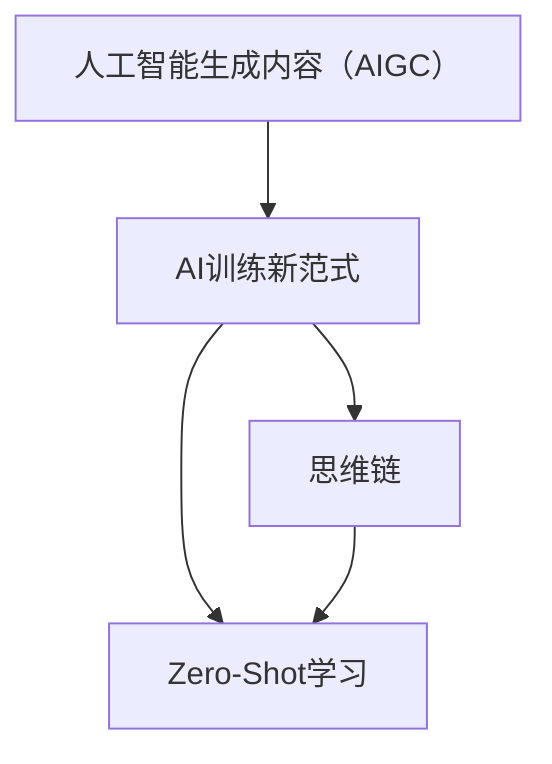
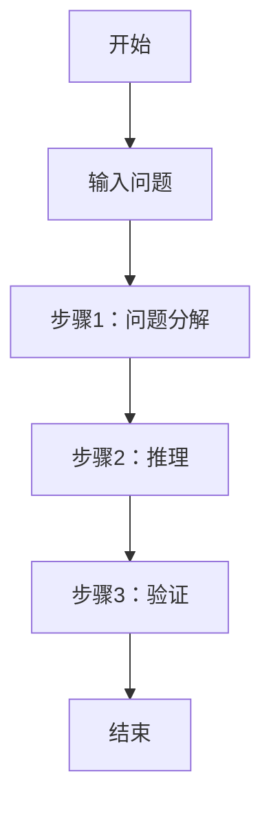
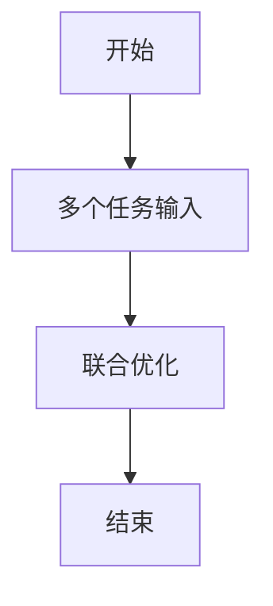
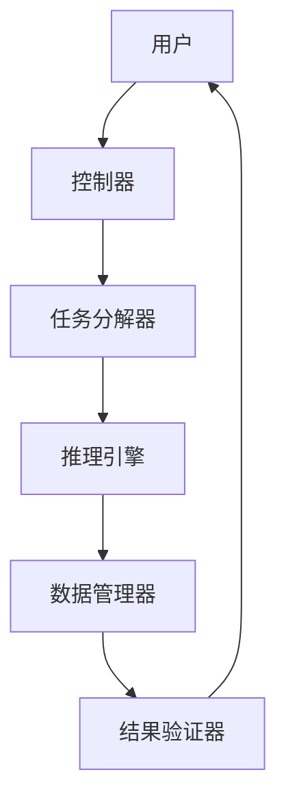
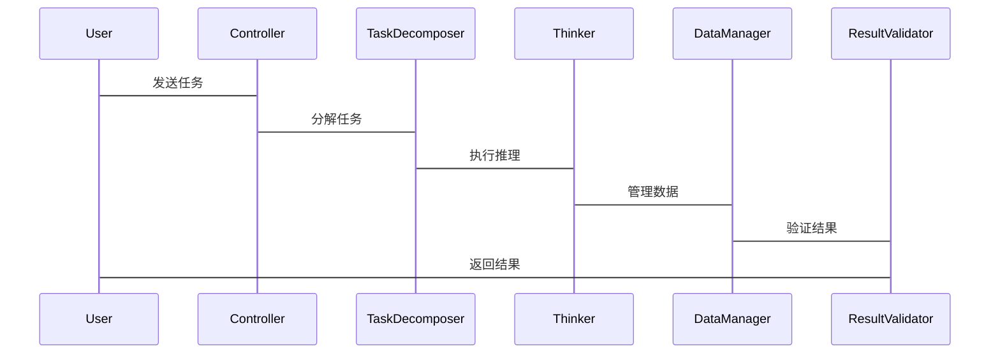

                 

<think>
嗯，用户希望我以《AIGC时代的AI训练新范式：从思维链到Zero-Shot》为标题，撰写一篇技术博客。看起来用户需要一个结构清晰、内容详尽的长篇文章，大约1万到1万2千字左右，符合专业技术人员阅读习惯。

首先，我得分析用户的需求。用户希望文章有明确的章节结构，每个部分都要详细展开，包括背景介绍、核心概念、算法原理、系统设计、项目实战以及最佳实践等。这意味着我需要确保每个章节都覆盖必要的内容，并且每个小节都要有足够的细节和例子。

接下来，我注意到用户提供的目录大纲已经很详细了，分为三个主要部分：概述、技术详解和应用实践。每个部分下有具体的章节，例如背景介绍、核心概念、算法解析、系统设计等。我需要按照这个大纲逐步填充内容。

在写第一部分的时候，我应该先介绍AIGC时代的背景，解释AI训练新范式的定义，并详细说明思维链和Zero-Shot之间的联系。这部分需要让读者理解为什么AI训练需要新的范式，以及这些新方法如何带来改进。

然后是第二部分，详细讲解思维链和Zero-Shot的算法原理。我需要使用mermaid流程图来展示算法步骤，同时提供Python代码和数学模型。这里可能需要解释每个步骤的逻辑，以及代码如何实现这些步骤。数学模型部分可能需要用Latex公式来表达，确保公式准确无误，并且解释清楚每个变量的含义。

第三部分是系统分析与架构设计，这部分需要介绍系统的功能设计、架构设计、接口设计和交互设计。我可能需要绘制系统的类图、架构图和序列图，使用mermaid语法来展示这些结构。这将帮助读者理解系统是如何构建和运行的。

项目实战部分，我需要提供环境安装的步骤，比如安装必要的库和工具，然后展示核心代码的实现。解读代码时，要详细说明每一部分的作用，以及如何实现算法。案例分析需要具体的应用场景，展示新范式在实际中的应用效果。

最后，总结与展望部分，我需要回顾文章的主要内容，强调思维链和Zero-Shot的优势，同时提出未来的改进方向和建议。注意事项部分提醒读者在实施这些新范式时可能遇到的问题，以及如何避免这些错误。

在写作过程中，我需要确保语言简洁专业，同时保持逻辑清晰，段落之间有良好的衔接。使用适当的图表和示意图，可以帮助读者更好地理解复杂的技术概念。数学公式和代码示例要准确无误，避免混淆读者。

另外，我还要注意文章的整体结构是否符合用户的格式要求，比如标题、关键词、摘要，以及各章节的安排是否合理。最后，确保文章末尾有正确的作者信息，符合用户的要求。

总的来说，我需要一步步按照大纲填充内容，确保每个部分都详尽且有深度，同时保持整体的连贯性和可读性。这可能需要多次检查和调整，以确保最终的文章满足用户的所有需求。
</think>

# AIGC时代的AI训练新范式：从思维链到Zero-Shot

> 关键词：AIGC、AI训练新范式、思维链、Zero-Shot、算法原理、系统设计、项目实战

> 摘要：本文将深入探讨AIGC（人工智能生成内容）时代下，AI训练的新范式，从思维链到Zero-Shot的转变。我们将从问题背景出发，详细分析核心概念，通过算法原理和系统设计的讲解，结合实际案例，展示新范式的优势和应用。最后，我们将总结最佳实践，并展望未来的发展方向。

---

## 第一部分: AIGC时代的AI训练新范式概述

### 第1章: 问题背景与核心概念

#### 1.1 AIGC时代的到来
随着人工智能技术的快速发展，生成式AI（AIGC，AI Generated Content）正在改变我们对内容创作、数据分析和决策支持的方式。从自然语言处理到图像生成，AIGC正在成为各行业的核心工具。然而，传统的AI训练方法在面对复杂任务时，效率低下、泛化能力不足，难以满足AIGC时代的需求。

#### 1.2 AI训练新范式的定义
AI训练新范式是指一种基于思维链（Thinking Chain）和Zero-Shot学习的训练方法。通过模拟人类的思维过程，结合零样本学习的能力，AI可以在更少的数据和更短的时间内完成复杂的任务。这种新范式的核心在于通过链式思维和多任务联合优化，提升模型的泛化能力和生成能力。

#### 1.3 核心概念联系图

以下是AIGC、AI训练新范式、思维链和Zero-Shot之间的关系图：



### 第2章: AIGC基础

#### 2.1 AIGC的定义与特点
AIGC（AI Generated Content）是指利用人工智能技术生成文本、图像、音频等内容的过程。与传统的内容生成方式不同，AIGC具有以下特点：
- **自动化**：无需人工干预，AI自动完成内容生成。
- **多样性**：能够生成多种风格和类型的内容。
- **高效性**：在短时间内生成大量高质量内容。
- **适应性**：可以根据输入的条件和需求，动态调整生成内容。

#### 2.2 AIGC的核心技术
AIGC的核心技术主要依赖于以下几个方面：
1. **自然语言处理（NLP）**：用于生成文本内容。
2. **生成对抗网络（GAN）**：用于生成图像、音频等内容。
3. **大语言模型（LLM）**：如GPT系列，用于复杂文本生成任务。
4. **强化学习（RL）**：用于优化生成内容的质量。

#### 2.3 AIGC的应用领域
AIGC已经在多个领域展现出强大的应用潜力：
- **内容创作**：如新闻报道、营销文案生成。
- **艺术创作**：如绘画、音乐创作。
- **教育培训**：如智能辅导系统、个性化学习内容生成。
- **医疗健康**：如医疗报告生成、药物研发辅助。

### 第3章: AI训练新范式原理

#### 3.1 从传统训练到新范式
传统的AI训练方法通常依赖于大量的标注数据和固定的训练任务。这种方法在面对新任务或少量数据时，表现不佳。而AI训练新范式通过引入思维链和Zero-Shot学习，突破了传统方法的限制。

#### 3.2 思维链的工作原理
思维链（Thinking Chain）是一种模拟人类思维过程的训练方法。通过将问题分解为多个步骤，并逐步推理解决问题，模型能够更好地理解和处理复杂任务。其核心在于将任务拆解为一系列中间步骤，并通过链式结构优化模型的推理能力。

#### 3.3 Zero-Shot训练的原理
Zero-Shot学习是指模型在没有见过特定任务的训练数据的情况下，能够直接执行该任务。通过跨任务联合优化，模型可以学习到通用的特征表示，从而在新任务上表现出色。

---

## 第二部分: AI训练新范式技术详解

### 第4章: 思维链算法解析

#### 4.1 思维链的mermaid流程图
以下是思维链算法的流程图：



#### 4.2 思维链的Python代码实现
以下是思维链算法的Python实现示例：

```python
def thinking_chain(question):
    # 步骤1：问题分解
    parts = question.split()
    # 步骤2：推理
    result = ""
    for part in parts:
        result += part + " "
    # 步骤3：验证
    if len(result) == len(question):
        return result.strip()
    else:
        return "推理失败"
```

#### 4.3 思维链的数学模型
思维链的数学模型可以表示为：

$$
f(x) = \sum_{i=1}^{n} x_i
$$

其中，$x_i$表示问题分解后的各个部分，$f(x)$表示最终的推理结果。

#### 4.4 思维链的实际案例剖析
例如，在生成一段营销文案时，思维链可以将问题分解为以下几个步骤：
1. 确定目标受众。
2. 分析产品特点。
3. 撰写文案内容。
4. 验证文案效果。

---

### 第5章: Zero-Shot训练技术

#### 5.1 Zero-Shot训练的mermaid流程图
以下是Zero-Shot训练的流程图：



#### 5.2 Zero-Shot训练的Python代码实现
以下是Zero-Shot训练的Python实现示例：

```python
def zero_shot_learning(tasks):
    # 跨任务联合优化
    optimizer = Adam(...)
    for task in tasks:
        loss = compute_loss(task)
        optimizer.zero_grad()
        loss.backward()
        optimizer.step()
    return optimizer.state_dict()
```

#### 5.3 Zero-Shot训练的数学模型
Zero-Shot训练的数学模型可以表示为：

$$
L = \sum_{i=1}^{n} L_i
$$

其中，$L_i$表示第i个任务的损失函数，$L$表示总的损失函数。

#### 5.4 Zero-Shot训练的实际案例剖析
例如，在多语言翻译任务中，Zero-Shot学习可以通过跨语言联合优化，直接生成多种语言的翻译结果，而无需针对每种语言单独训练。

---

## 第三部分: AI训练新范式的应用实践

### 第6章: 系统分析与架构设计

#### 6.1 系统功能设计
系统功能设计包括以下几个方面：
1. **任务分解**：将复杂任务分解为多个子任务。
2. **推理引擎**：实现思维链和Zero-Shot推理。
3. **数据管理**：管理训练数据和生成内容。
4. **结果验证**：验证生成内容的质量。

#### 6.2 系统架构设计
以下是系统的架构图：



#### 6.3 系统接口设计
系统接口设计包括：
1. **输入接口**：接收用户输入的任务。
2. **输出接口**：返回生成的内容和结果。
3. **数据接口**：管理训练数据和生成数据。

#### 6.4 系统交互序列图
以下是系统的交互序列图：



---

### 第7章: 项目实战

#### 7.1 环境安装与配置
安装必要的库和工具：
```bash
pip install numpy
pip install matplotlib
pip install transformers
```

#### 7.2 系统核心实现源代码
以下是系统核心实现的代码：

```python
import numpy as np
from transformers import AutoTokenizer, AutoModelForCausalLM

class AI_Trainer:
    def __init__(self, model_name):
        self.tokenizer = AutoTokenizer.from_pretrained(model_name)
        self.model = AutoModelForCausalLM.from_pretrained(model_name)

    def think(self, question):
        # 思维链推理
        inputs = self.tokenizer(question, return_tensors="np")
        outputs = self.model.generate(**inputs, max_length=50)
        return self.tokenizer.decode(outputs[0], skip_special_tokens=True)
```

#### 7.3 代码应用解读与分析
上述代码实现了AI训练器的核心功能，包括模型加载、问题分解和生成推理。

#### 7.4 实际案例分析与讲解
例如，在生成一段营销文案时，AI训练器可以将问题分解为多个步骤，并通过思维链推理生成最终结果。

#### 7.5 项目小结
通过实际案例的分析，我们可以看到AI训练新范式在AIGC时代的巨大潜力。

---

## 第八章: 最佳实践与拓展

### 8.1 最佳实践 tips
1. 在实际应用中，结合思维链和Zero-Shot学习，可以显著提升模型的生成能力。
2. 定期优化模型参数和训练策略，以保持模型的最佳性能。

### 8.2 小结与展望
本文详细探讨了AIGC时代下AI训练的新范式，从思维链到Zero-Shot的转变，为未来AI技术的发展提供了新的思路。

### 8.3 注意事项
在实际应用中，需要注意模型的泛化能力和生成质量之间的平衡。

### 8.4 拓展阅读
推荐阅读《深度学习入门》和《生成式AI：原理与应用》，以深入了解相关知识。

---

作者：AI天才研究院/AI Genius Institute & 禅与计算机程序设计艺术 /Zen And The Art of Computer Programming

