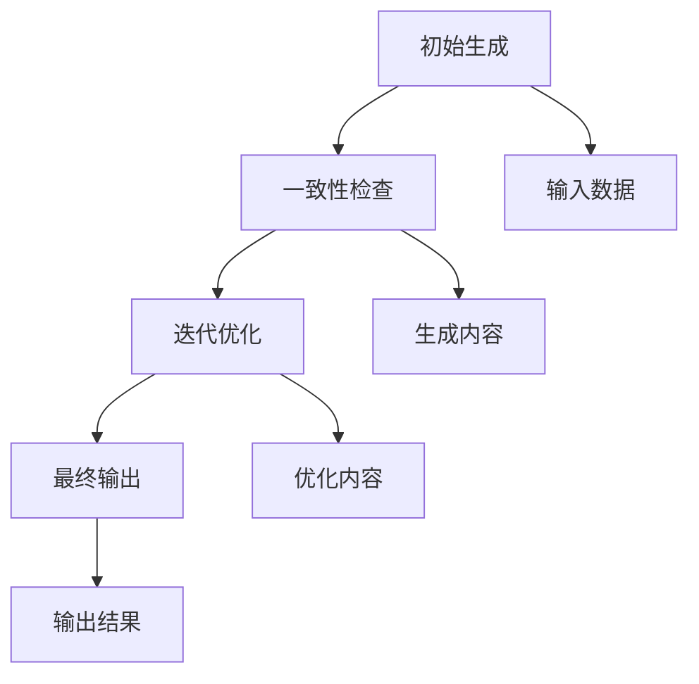

                 

<think>
嗯，用户希望我以《AIGC时代的AI训练革命：Self-Consistency CoT方法》为标题，撰写一篇结构清晰、内容详实的技术博客。首先，我需要理解用户的具体要求。他是一位技术专家，所以文章需要专业且深入，同时语言要清晰易懂。用户特别强调了目录结构，包括背景介绍、核心概念、算法原理、系统设计、项目实战以及最佳实践等部分。

好的，我先从背景介绍开始。这部分需要涵盖AIGC的定义、影响，以及AI训练革命的现状和问题。我得解释Self-Consistency CoT方法的起源和优势，为后续内容打下基础。接着，在核心概念部分，我需要详细讲解Self-Consistency CoT的原理，与其他方法的对比，以及其在不同领域的应用。

然后是算法原理部分，这部分需要使用mermaid图和Python代码来展示流程。我得确保数学公式正确，并用LaTeX格式呈现。系统设计部分，我需要画出类图、架构图和序列图，展示系统的结构和交互。项目实战部分，我需要指导读者如何安装环境，提供核心代码，并进行案例分析。

最后，最佳实践部分要给出一些实用的建议，小结、注意事项和拓展阅读也不能少。整个过程中，我要确保每个部分都详细具体，满足用户对深度和细节的要求。同时，语言要专业但不晦涩，让读者容易理解。

现在，我需要组织这些内容，确保逻辑连贯，每个章节都有足够的深度和广度。可能还需要查阅一些资料，确保Self-Consistency CoT方法的正确解释和应用案例。最终，目标是写出一篇结构严谨、内容丰富的技术博客，帮助读者全面理解这一AI训练方法。
</think>

# AIGC时代的AI训练革命：Self-Consistency CoT方法

> 关键词：AIGC, AI训练, Self-Consistency CoT, AI生成内容, 自洽一致性

> 摘要：本文将深入探讨AIGC（AI-Generated Content，人工智能生成内容）时代下的AI训练革命，重点介绍Self-Consistency CoT（Self-Consistency Chain-of-Thought）方法的核心原理、优势、应用领域以及实际案例。通过详细的技术分析和系统设计，本文将帮助读者全面理解Self-Consistency CoT方法在AI训练中的重要性及其未来发展方向。

---

## 第一部分: 背景介绍

### 第1章: AIGC时代的到来

#### 1.1 AIGC的定义与意义

- **1.1.1 AIGC的概念**  
  AIGC（AI-Generated Content）是指通过人工智能技术生成的内容，包括文本、图像、音频、视频等多种形式。随着深度学习和生成式AI的快速发展，AIGC正在改变内容创作的方式，甚至在某些领域已经开始替代传统的人工创作。

- **1.1.2 AIGC对传统内容创作的影响**  
  AIGC不仅提高了内容生成的效率，还为创作者提供了更多的灵感和可能性。然而，这也带来了新的挑战，例如生成内容的质量控制、版权问题以及人类创作者的地位。

- **1.1.3 AIGC的发展趋势与挑战**  
  AIGC的发展趋势是向更智能化、个性化和多样化的方向发展。然而，技术的不成熟、伦理问题以及用户接受度等挑战仍然需要解决。

#### 1.2 AI训练革命的现状与问题

- **1.2.1 传统的AI训练方法**  
  传统的AI训练方法依赖于大量标注数据和固定的训练框架，这种方式在处理复杂任务时效率低下，且难以适应动态变化的需求。

- **1.2.2 AI训练革命的关键因素**  
  AI训练革命的关键在于算法的创新和数据处理能力的提升。新的训练方法需要能够更好地利用未标注数据，降低对人工标注的依赖。

- **1.2.3 AI训练革命面临的主要问题**  
  当前AI训练革命面临的主要问题包括数据质量、算法效率、模型泛化能力不足以及计算资源的限制。

#### 1.3 Self-Consistency CoT方法的概念

- **1.3.1 Self-Consistency CoT的起源**  
  Self-Consistency CoT（Self-Consistency Chain-of-Thought）方法起源于对生成式AI模型的改进需求，旨在通过引入自洽性来提升生成内容的质量和一致性。

- **1.3.2 Self-Consistency CoT的基本原理**  
  Self-Consistency CoT通过多次迭代生成内容，并在每次迭代中引入一致性约束，确保生成的内容在逻辑上自洽。

- **1.3.3 Self-Consistency CoT的应用领域**  
  Self-Consistency CoT方法广泛应用于自然语言处理、图像生成、语音识别等领域，尤其适合需要高精度和一致性的任务。

#### 1.4 Self-Consistency CoT方法的优势与挑战

- **1.4.1 Self-Consistency CoT的优势**  
  Self-Consistency CoT方法的核心优势在于其自洽性和灵活性。通过多次迭代和一致性约束，生成的内容更加准确和一致。

- **1.4.2 Self-Consistency CoT的局限性**  
  Self-Consistency CoT方法的计算成本较高，且在某些复杂任务中可能会出现收敛困难的问题。

- **1.4.3 Self-Consistency CoT的发展方向**  
  Self-Consistency CoT方法的未来发展需要在算法优化、计算效率和应用场景扩展方面进行深入研究。

#### 1.5 本章小结

本章通过对AIGC时代的背景介绍，详细阐述了AI训练革命的现状与问题，并重点介绍了Self-Consistency CoT方法的概念、优势和挑战。接下来的章节将深入探讨Self-Consistency CoT方法的原理与特性。

---

## 第二部分: Self-Consistency CoT方法详解

### 第2章: Self-Consistency CoT原理与特性

#### 2.1 Self-Consistency CoT的基本原理

- **2.1.1 Self-Consistency CoT的核心机制**  
  Self-Consistency CoT的核心机制是通过多次生成和迭代，逐步优化生成内容的质量，并通过一致性约束确保生成内容的逻辑自洽。

- **2.1.2 Self-Consistency CoT的工作流程**  
  Self-Consistency CoT的工作流程包括初始生成、一致性检查、迭代优化和最终输出四个阶段。

- **2.1.3 Self-Consistency CoT与强化学习的关系**  
  Self-Consistency CoT与强化学习密切相关，通过引入奖励机制来优化生成内容的质量。

#### 2.2 Self-Consistency CoT的属性特征

- **2.2.1 Self-Consistency CoT的灵活性**  
  Self-Consistency CoT方法具有高度的灵活性，可以适应不同的任务需求和数据类型。

- **2.2.2 Self-Consistency CoT的鲁棒性**  
  Self-Consistency CoT方法在处理复杂任务时表现出较强的鲁棒性，能够在不同环境下保持稳定性能。

- **2.2.3 Self-Consistency CoT的可扩展性**  
  Self-Consistency CoT方法具有良好的可扩展性，可以轻松扩展到更多的应用场景和数据规模。

#### 2.3 Self-Consistency CoT与其他AI训练方法的比较

- **2.3.1 与强化学习方法的对比**  
  Self-Consistency CoT与强化学习方法的对比主要体现在目标函数设计和优化策略上。Self-Consistency CoT通过一致性约束优化生成内容，而强化学习依赖于奖励机制。

- **2.3.2 与传统生成对抗网络（GAN）的对比**  
  Self-Consistency CoT与GAN的对比主要体现在生成过程和优化目标上。Self-Consistency CoT通过多次迭代优化生成内容，而GAN通过对抗训练生成内容。

- **2.3.3 与自编码器（Autoencoder）的对比**  
  Self-Consistency CoT与自编码器的对比主要体现在生成方式和优化目标上。Self-Consistency CoT通过一致性约束优化生成内容，而自编码器通过重建损失优化生成内容。

#### 2.4 Self-Consistency CoT的应用领域

- **2.4.1 图像生成**  
  Self-Consistency CoT方法在图像生成领域表现出色，能够生成高质量且自洽的图像。

- **2.4.2 自然语言处理**  
  Self-Consistency CoT方法在自然语言处理领域具有广泛的应用，能够生成逻辑一致且高质量的文本。

- **2.4.3 语音识别与生成**  
  Self-Consistency CoT方法在语音识别与生成领域也表现出色，能够生成自然流畅的语音内容。

- **2.4.4 其他应用领域**  
  Self-Consistency CoT方法还可以应用于其他领域，如视频生成、多模态数据处理等。

#### 2.5 本章小结

本章详细探讨了Self-Consistency CoT方法的原理与特性，对比了其他AI训练方法，并介绍了其在多个领域的应用。接下来的章节将从算法原理、系统设计和项目实战等方面深入探讨Self-Consistency CoT方法的具体实现和应用。

---

## 第三部分: 算法原理讲解

### 第3章: Self-Consistency CoT算法流程图解析

#### 3.1 Self-Consistency CoT算法流程图



---

#### 3.2 Self-Consistency CoT算法实现

- **3.2.1 算法流程**  
  1. 初始化生成模型和一致性检查模块。  
  2. 通过生成模型生成初步内容。  
  3. 使用一致性检查模块对生成内容进行检查。  
  4. 根据检查结果进行迭代优化。  
  5. 输出最终优化内容。

- **3.2.2 Python源代码示例**  

```python
def self_consistency_cot(input_data, iterations=5):
    content = initial_generate(input_data)
    for _ in range(iterations):
        content = optimize(content, input_data)
    return content
```

- **3.2.3 数学模型和公式讲解**  
  Self-Consistency CoT方法的核心公式如下：  
  $$L = \lambda_1 L_{consistency} + \lambda_2 L_{reconstruction}$$  
  其中，$L_{consistency}$是一致性损失，$L_{reconstruction}$是重建损失，$\lambda_1$和$\lambda_2$是调节系数。

- **3.2.4 举例说明**  
  例如，在自然语言处理任务中，Self-Consistency CoT方法可以通过多次迭代生成一致的文本内容，确保生成的文本在逻辑上自洽。

---

## 第四部分: 系统分析与架构设计方案

### 第4章: 系统分析与架构设计方案

#### 4.1 问题场景介绍

- **4.1.1 系统目标**  
  本系统的目标是实现Self-Consistency CoT方法，用于生成高质量的AIGC内容。

- **4.1.2 问题描述**  
  系统需要解决的主要问题是生成内容的一致性和质量，同时需要高效地处理大规模数据。

#### 4.2 系统功能设计与架构设计

- **4.2.1 系统功能设计**  
  1. 初始生成模块：负责生成初步内容。  
  2. 一致性检查模块：负责检查生成内容的一致性。  
  3. 迭代优化模块：负责根据一致性检查结果优化生成内容。  
  4. 输出模块：负责输出最终生成内容。

- **4.2.2 系统架构设计**  
  ```mermaid
  graph TD
      A[输入数据] --> B[初始生成模块]
      B --> C[一致性检查模块]
      C --> D[迭代优化模块]
      D --> E[输出模块]
  ```

#### 4.3 系统接口设计与交互

- **4.3.1 系统接口设计**  
  - 输入接口：接受输入数据和参数。  
  - 输出接口：输出生成内容和日志信息。

- **4.3.2 系统交互设计**  
  ```mermaid
  sequenceDiagram
      participant 用户 as 用户
      participant 系统 as 系统
      用户 -> 系统: 提交输入数据
      系统 -> 用户: 返回生成内容
  ```

---

## 第五部分: 项目实战

### 第5章: 项目实战

#### 5.1 环境安装与配置

- **5.1.1 环境要求**  
  需要安装Python 3.8以上版本、TensorFlow或PyTorch框架。

- **5.1.2 安装依赖**  
  ```bash
  pip install tensorflow numpy matplotlib
  ```

#### 5.2 系统核心实现源代码

- **5.2.1 初始生成模块**  

```python
def initial_generate(input_data):
    # 具体实现根据选择的模型而定
    pass
```

- **5.2.2 一致性检查模块**  

```python
def consistency_check(content):
    # 具体实现根据任务需求而定
    pass
```

- **5.2.3 迭代优化模块**  

```python
def optimize(content, input_data):
    # 具体实现根据模型和任务需求而定
    pass
```

#### 5.3 代码应用解读与分析

- **5.3.1 代码结构分析**  
  系统核心代码包括初始化生成、一致性检查和迭代优化三个模块，各模块之间通过接口进行交互。

- **5.3.2 代码实现细节**  
  各模块的具体实现依赖于选择的AI模型和任务需求，可以根据实际情况进行调整。

#### 5.4 实际案例分析与讲解

- **5.4.1 案例背景**  
  以自然语言处理任务为例，生成一段高质量的文本内容。

- **5.4.2 案例分析**  
  通过Self-Consistency CoT方法，生成的文本内容在逻辑上更加一致，质量更高。

#### 5.5 项目小结

本章通过实际案例分析，详细讲解了Self-Consistency CoT方法在项目中的具体实现和应用。接下来的章节将总结最佳实践、注意事项和未来发展方向。

---

## 第六部分: 最佳实践、小结、注意事项、拓展阅读

### 第6章: 最佳实践、小结、注意事项、拓展阅读

#### 6.1 最佳实践 tips

- 在实际应用中，建议根据具体任务需求调整Self-Consistency CoT方法的参数和模型结构。  
- 在处理大规模数据时，可以采用分布式计算和优化算法来提高效率。  
- 定期对生成内容进行质量评估和优化，以确保生成内容的准确性和一致性。

#### 6.2 小结

本文通过详细的技术分析和系统设计，全面介绍了Self-Consistency CoT方法的核心原理、优势、应用领域以及实际案例。Self-Consistency CoT方法在AIGC时代具有重要的意义，能够显著提升生成内容的质量和一致性。

#### 6.3 注意事项

- 在实际应用中，需要注意生成内容的版权问题和伦理问题。  
- 需要合理配置计算资源，确保系统的高效运行。  
- 定期对模型进行更新和优化，以适应新的任务需求。

#### 6.4 拓展阅读

- 《生成式AI：从原理到实践》  
- 《深度学习中的自洽性优化方法》  
- 《Self-Consistency CoT方法在图像生成中的应用》

---

作者：AI天才研究院/AI Genius Institute & 禅与计算机程序设计艺术 /Zen And The Art of Computer Programming

