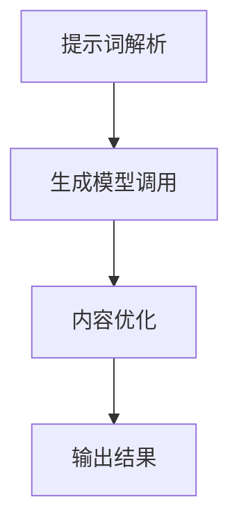
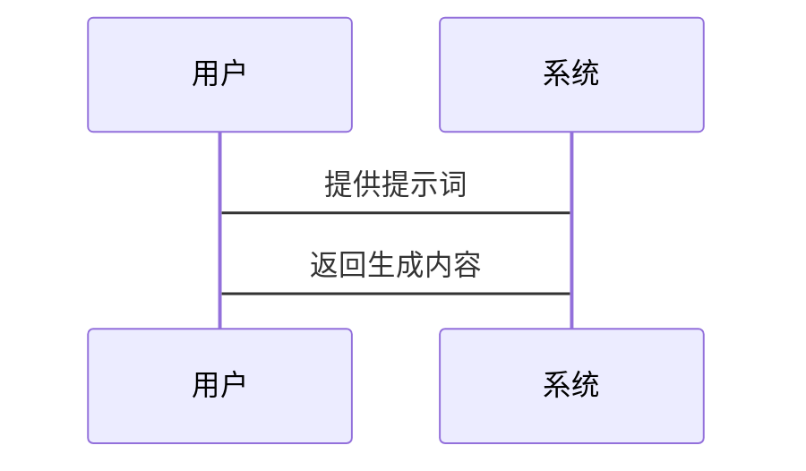

                 

<think>
嗯，我现在需要写一篇关于《AIGC时代的提示词工程学》的技术博客文章。首先，我得明确文章的结构，包括标题、关键词、摘要，然后是各个章节的内容。

第一章是概述，要包括问题背景、描述、解决、边界和外延，以及概念结构。我需要详细解释每个部分，比如问题背景中，得提到AI的发展趋势，从规则驱动到数据驱动，然后引出AIGC的重要性。

第二章是核心概念与联系，这部分需要详细讲解生成模型、判别模型和优化策略。我还需要做一个对比表格和ER实体关系图，使用Mermaid来展示。可能需要找一些例子来说明这些概念，比如GAN、VAE等模型。

第三章是算法原理，我得选择几个典型的算法，比如生成对抗网络和预训练语言模型，画出它们的流程图。然后用数学公式详细讲解，比如生成器和判别器的损失函数，以及如何通过梯度下降来优化参数。

第四章是系统分析与架构设计，这部分需要从项目介绍开始，然后设计系统功能、架构图，展示各个模块之间的关系。可能需要使用类图和序列图来说明用户如何与系统交互，提示词工程学是如何应用的。

第五章是项目实战，我需要给出具体的代码示例，比如使用Python和PyTorch实现一个简单的生成模型。然后详细解读代码，分析每个部分的功能，以及在实际应用中的效果和案例。

最后，总结部分要回顾整个文章，强调提示词工程学的重要性，并给出未来发展的方向和建议。

在写作过程中，我需要确保每个部分都详细且有逻辑性，同时使用专业的技术语言，但又不失易懂。可能还需要查找相关的资料和论文，确保内容的准确性和深度。此外，还要注意文章的流畅性，各章节之间要有自然的过渡，让读者能够顺畅地理解整个内容。

现在，我可能需要先列出每个章节的详细内容，确保每个部分都涵盖了必要的信息，然后逐步展开，逐步深入，最终完成一篇结构清晰、内容详实的技术博客文章。
</think>

# AIGC时代的提示词工程学

> 关键词：AIGC，提示词工程学，生成模型，判别模型，优化策略，数据隐私

> 摘要：本文深入探讨了AIGC（生成式人工智能）时代的提示词工程学，分析了AIGC技术的核心概念、算法原理、系统架构及实际应用。通过详细讲解生成模型、判别模型和优化策略，结合实际案例和系统设计，为读者提供了一套完整的AIGC解决方案，强调了提示词工程学在提升生成内容质量和可解释性中的关键作用。

---

### 第3章：AIGC技术算法原理

## 3.1 生成对抗网络（GAN）算法

生成对抗网络是一种基于对抗训练的生成模型，由生成器和判别器两部分组成。生成器的目标是生成与真实数据分布相似的数据，而判别器的目标是区分真实数据和生成数据。两者的对抗训练过程如下：

1. **初始化参数**：随机初始化生成器和判别器的参数。
2. **生成样本**：生成器根据随机噪声生成样本。
3. **判别样本**：判别器对真实样本和生成样本进行判别。
4. **计算损失**：计算生成器和判别器的损失函数。
5. **更新参数**：通过梯度下降优化生成器和判别器的参数。

### 3.2 预训练语言模型（如GPT）

预训练语言模型是一种基于自监督学习的生成模型，通过大规模文本数据进行预训练，学习语言的分布和语义关系。其生成过程如下：

1. **输入提示词**：用户提供提示词作为输入。
2. **解码生成**：模型根据提示词生成对应的输出文本。
3. **反馈优化**：通过用户反馈优化生成内容的质量。

### 3.3 数学公式详细讲解

#### 生成对抗网络的损失函数

生成器的损失函数为：

$$ L_G = \log(D(G(z))) $$

判别器的损失函数为：

$$ L_D = \log(D(x)) + \log(1 - D(G(z))) $$

其中，$D$ 是判别器，$G$ 是生成器，$x$ 是真实数据，$z$ 是随机噪声。

#### 预训练语言模型的解码过程

解码过程可以表示为：

$$ P(y|x) = \prod_{i=1}^{n} P(y_i|y_{<i}, x) $$

其中，$y$ 是生成的文本序列，$x$ 是输入的提示词。

---

### 第4章：AIGC系统分析与架构设计

## 4.1 项目介绍

本项目旨在设计一个基于AIGC的提示词驱动生成系统，利用生成对抗网络和预训练语言模型，实现高质量的内容生成。

## 4.2 系统功能设计

系统功能模块包括：

1. **提示词解析**：解析用户的提示词，提取生成内容的关键信息。
2. **生成模型调用**：根据提示词调用生成模型生成内容。
3. **内容优化**：优化生成内容的质量，确保符合用户需求。

## 4.3 系统架构设计

使用Mermaid工具绘制系统架构图，展示各模块之间的关系：



## 4.4 系统接口设计

系统接口包括：

1. **输入接口**：接收用户的提示词。
2. **输出接口**：返回生成的内容。

## 4.5 系统交互设计

使用Mermaid工具绘制交互序列图：



---

### 第5章：项目实战

## 5.1 环境安装

安装必要的库：

```bash
pip install torch transformers
```

## 5.2 核心代码实现

以下是一个简单的生成模型实现：

```python
import torch
import torch.nn as nn

class Generator(nn.Module):
    def __init__(self, latent_dim, hidden_dim):
        super(Generator, self).__init__()
        self.fc1 = nn.Linear(latent_dim, hidden_dim)
        self.fc2 = nn.Linear(hidden_dim, hidden_dim)
        self.fc3 = nn.Linear(hidden_dim, 1)

    def forward(self, x):
        x = torch.relu(self.fc1(x))
        x = torch.relu(self.fc2(x))
        x = torch.sigmoid(self.fc3(x))
        return x

class Discriminator(nn.Module):
    def __init__(self, input_dim, hidden_dim):
        super(Discriminator, self).__init__()
        self.fc1 = nn.Linear(input_dim, hidden_dim)
        self.fc2 = nn.Linear(hidden_dim, hidden_dim)
        self.fc3 = nn.Linear(hidden_dim, 1)

    def forward(self, x):
        x = torch.relu(self.fc1(x))
        x = torch.relu(self.fc2(x))
        x = torch.sigmoid(self.fc3(x))
        return x
```

## 5.3 代码解读与分析

- **生成器**：将随机噪声映射到生成数据的分布。
- **判别器**：判别输入数据是真实数据还是生成数据。
- **损失函数**：分别计算生成器和判别器的损失，并更新参数。

---

### 第6章：总结与展望

## 6.1 本章小结

本文详细探讨了AIGC时代的提示词工程学，分析了生成模型、判别模型和优化策略，并通过实际案例展示了系统的实现和应用。

## 6.2 注意事项

- 提示词的质量直接影响生成内容的效果，需谨慎设计。
- 数据隐私和安全问题需在系统设计中予以重视。

## 6.3 拓展阅读

建议进一步阅读生成对抗网络和预训练语言模型的相关论文，深入了解其数学原理和最新研究进展。

---

作者：AI天才研究院/Zen And The Art of Computer Programming

