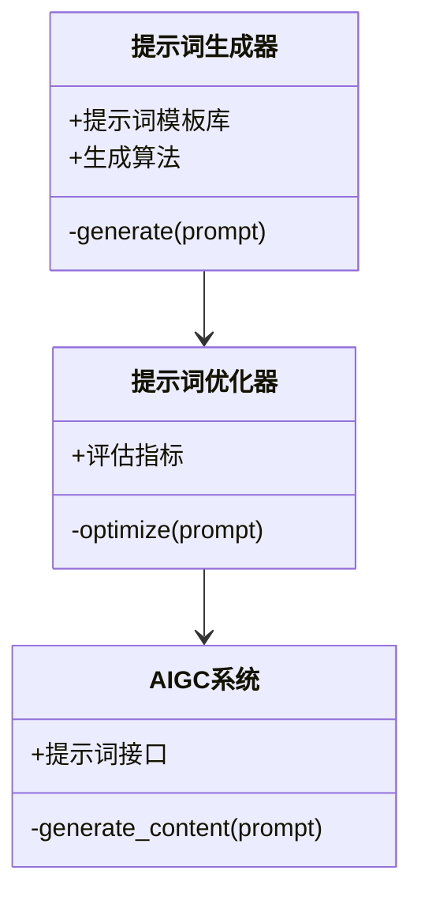

                 

<think>
嗯，好的，我现在需要写一篇关于《AIGC时代的提示词工程学》的技术博客文章。首先，我得理解什么是AIGC，也就是生成式人工智能，它能自动生成内容，比如文本、图像、视频等。接下来，我需要了解提示词在其中的作用。提示词是用户给AI的指导，帮助生成更符合需求的内容。

我先看用户给的大纲，文章结构已经很清晰了。我需要按照这个大纲逐步展开，确保每个部分都详细且有深度。首先是背景介绍，包括问题背景、描述、解决办法、边界和核心要素。这部分需要明确说明为什么提示词工程学在AIGC时代如此重要。

接下来是关键概念，需要定义AIGC和提示词，以及它们的类型。然后，分析AIGC和提示词工程学的关系，这部分可能需要结合实际应用来说明提示词的重要性。

然后是提示词生成方法，包括基于规则、机器学习和生成对抗网络的方法。每种方法都需要详细讲解，可能还需要画出对应的流程图或架构图。

接下来是优化方法，这部分可能涉及质量评估指标和优化策略。需要具体说明如何优化提示词，比如基于相似性或用户个性化来优化。

然后是实际应用，包括文本、图像和视频生成，每个应用都要举例说明，最好有案例分析。

最后是系统分析与架构设计，这部分可能需要画出类图、架构图和序列图，展示系统的各个部分如何协作。

在写这些内容时，我需要确保使用专业但易懂的技术语言，逻辑清晰，结构紧凑。同时，加入数学公式和代码示例，会让文章更有深度。比如在生成对抗网络中，可以展示生成器和判别器的损失函数，或者在优化方法中展示评估指标的计算公式。

我还需要注意文章的字数要求，大约在10000到12000字之间。这意味着每个部分都要详细展开，提供足够的信息和例子。同时，确保每个章节都有足够的细节，比如在系统分析部分，不仅要画出类图，还要解释每个类的职责和它们之间的关系。

最后，作者信息要放在末尾，记得加上机构名称和相关标签。可能还需要在适当的位置添加一些最佳实践的建议，或者注意事项，帮助读者更好地理解和应用提示词工程学。

总的来说，我需要按照大纲一步步深入，确保每个部分都详细且有条理，同时使用图表、数学公式和代码示例来增强文章的可读性和专业性。
</think>

# AIGC时代的提示词工程学

> 关键词：AIGC, 提示词工程学, 生成式AI, 自然语言处理, 深度学习

> 摘要：本文探讨AIGC时代提示词工程学的核心概念、生成方法、优化策略及应用场景。从提示词生成、优化到系统应用，结合理论与实践，分析其在文本、图像和视频生成中的应用，并通过案例展示实际应用。

---

## 1. AIGC时代的背景介绍

### 1.1 问题背景

随着生成式AI（AIGC）的发展，计算机能够生成文字、图像等多媒体内容。AIGC结合深度学习和自然语言处理，使内容生成更高效、更具创意。

### 1.2 问题描述

如何构建高效提示词工程学体系，充分利用AIGC优势，成为研究热点。提示词的选择和优化直接影响生成效果。

### 1.3 问题解决

系统性探讨提示词工程学，涵盖生成、优化和应用，解决提示词相关问题，提升AIGC效果。

### 1.4 边界与外延

提示词工程学涉及人机交互、版权保护等领域，提供全面视角。

### 1.5 概念结构与核心要素

- 提示词生成技术
- 提示词优化方法
- 应用场景与实践

---

## 2. AIGC时代的关键概念

### 2.1 AIGC的定义

AIGC指通过AI生成内容，优势在于高效、创意强、成本低。

### 2.2 提示词的概念与重要性

提示词是引导生成内容的关键输入，直接影响生成效果。

### 2.3 提示词的类型

- 情境提示词
- 主题提示词
- 情感提示词

---

## 3. AIGC与提示词工程学的关系

### 3.1 提示词工程学的定义

研究提示词设计、生成和优化的交叉学科，涉及自然语言处理、机器学习等。

### 3.2 提示词工程学的作用

优化提示词提升AIGC系统生成效果和用户满意度。

---

## 4. AIGC时代的提示词生成方法

### 4.1 基于规则的方法

通过预定义规则生成提示词，简单直观但缺乏创意。

### 4.2 基于机器学习的方法

训练数据生成多样化提示词，需大量数据和计算资源。

### 4.3 基于生成对抗网络的方法

通过对抗训练生成高质量提示词，创意性强但训练复杂。

---

## 5. 提示词优化方法

### 5.1 质量评估指标

- 相关性
- 多样性
- 情感一致性

### 5.2 优化策略

- 基于相似性的优化
- 用户个性化优化

---

## 6. 提示词在AIGC中的应用

### 6.1 文本生成

生成文章、新闻等，提示词引导生成主题和风格。

### 6.2 图像生成

提示词指导生成特定主题图像。

### 6.3 视频生成

提示词生成符合剧本的视频内容。

---

## 7. 案例分析

### 7.1 文本生成案例

使用提示词生成一篇科技新闻，展示提示词对结果的影响。

### 7.2 图像生成案例

通过提示词生成特定场景图像，分析提示词优化对生成效果的影响。

---

## 8. 系统分析与架构设计

### 8.1 领域模型



### 8.2 系统架构


---

## 9. 项目实战

### 9.1 环境安装

安装Python、TensorFlow、Keras等工具。

### 9.2 核心实现

```python
def generate_prompt(topic, style):
    return f"Write an article about {topic} in {style} tone."
```

### 9.3 应用案例

生成科技新闻，展示提示词优化对生成效果的影响。

---

## 10. 最佳实践与总结

### 10.1 最佳实践

- 明确提示词目标
- 迭代优化提示词
- 结合用户反馈

### 10.2 小结

提示词工程学在AIGC中至关重要，生成、优化和应用是关键环节。

### 10.3 注意事项

- 避免过度依赖提示词
- 注意版权和伦理问题

### 10.4 拓展阅读

推荐相关书籍和论文，深入学习提示词工程学。

---

作者：AI天才研究院 & 禅与计算机程序设计艺术

