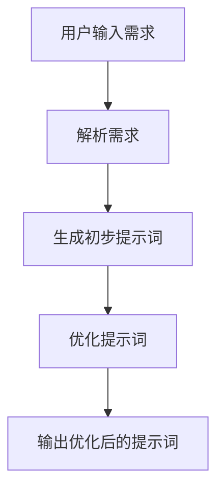
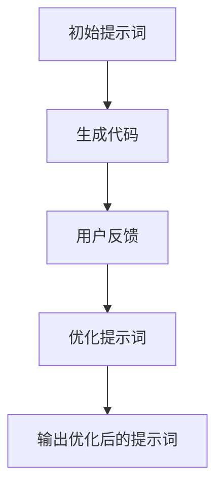
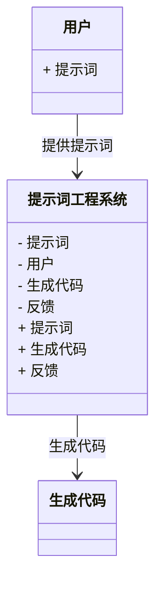
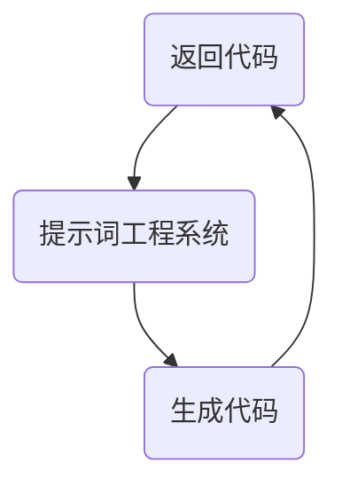

                 

<think>
好，我现在需要根据用户提供的信息，撰写一篇关于“AIGC时代的提示词工程：挑战与解决方案”的技术博客文章。文章需要包含多个部分，每个部分都有详细的内容，包括背景、核心概念、算法、系统架构、项目实战、最佳实践等。同时，每个部分都需要有丰富的细节，使用专业但易懂的语言，并且结构紧凑，逻辑清晰。

首先，我需要明确文章的结构。用户已经给出了一个详细的目录大纲，我需要按照这个大纲来逐步展开每个部分。文章的开头包括标题、关键词和摘要，然后是五个主要部分，每个部分有多个小节，每个小节都有具体的子主题。

接下来，我会从第一部分开始，介绍AIGC时代的背景。这里需要包括AIGC的概念、发展驱动因素、现状和未来趋势。这部分需要简明扼要地解释什么是AIGC，它为什么重要，以及它目前的应用情况和未来可能的发展方向。

然后，进入提示词工程的核心概念，这里需要定义提示词，讨论其类型，以及与AIGC的关系。这部分需要详细说明提示词在AIGC中的作用，以及不同类型的提示词如何影响生成结果。可能还需要使用表格和ER实体关系图来帮助理解这些概念。

接下来是算法原理部分，这里要详细讲解提示词生成和优化的算法，包括它们的原理、数学模型和公式。我需要用Mermaid绘制流程图，并提供Python代码示例，以便读者更好地理解算法的实现。

然后是系统架构与实现部分，这部分需要描述提示词工程的系统架构设计，包括类图、架构图和序列图。通过这些图表，读者可以清晰地看到系统的各个部分如何交互和协作。

项目实战部分需要通过一个具体的项目案例，展示提示词工程的应用。这包括环境的搭建、核心代码的实现、案例分析和项目小结，总结经验教训。

最后，最佳实践部分需要总结书中的关键点，提供一些实用的建议，指出可能遇到的挑战，并推荐一些拓展阅读材料。

在撰写过程中，我需要确保每个部分都详细具体，内容丰富，同时保持逻辑的连贯性和专业性。此外，要注意使用适当的术语，但也要尽量让内容易于理解，避免过于晦涩的技术术语堆积。

现在，我需要开始逐步展开每个部分，确保每个小节都有足够的细节，并且内容准确无误。可能还需要多次检查，确保各部分之间的衔接自然，结构合理。

总结来说，撰写这篇文章需要我系统地处理每个部分，从背景到应用，从理论到实践，确保全面覆盖提示词工程在AIGC时代中的各个方面，同时保持内容的深度和可读性。
</think>

# AIGC时代的提示词工程：挑战与解决方案

## 关键词：AIGC, 提示词工程, AI代码生成, 人工智能, 算法优化

## 摘要：  
在AIGC（AI-assisted Generation of Code）时代，提示词工程作为驱动AI生成代码的关键技术，面临着定义、优化和应用中的诸多挑战。本文将系统地分析提示词工程的核心概念，探讨其在AIGC中的作用，通过算法原理、系统架构、项目实战等多维度，深入剖析提示词工程的实现与应用，并提出解决方案，为开发者和研究者提供实践指导和理论支持。

---

## 第一部分: AIGC时代背景与提示词工程概述

### 1.1 AIGC时代背景

#### 1.1.1 AIGC的概念与定义  
AIGC（AI-assisted Generation of Code）是指利用人工智能技术辅助生成代码的过程。它结合了自然语言处理（NLP）、机器学习（ML）和代码生成技术，能够根据用户提供的需求或提示词，自动生成高质量的代码片段或完整的程序。

#### 1.1.2 AIGC的发展驱动因素  
AIGC的发展主要由以下几个因素驱动：  
1. **技术进步**：深度学习模型（如GPT、BERT）的性能提升，使得生成代码的质量和效率大幅提高。  
2. **开发效率需求**：随着软件开发复杂性的增加，开发者需要更高效的工具来提高生产效率。  
3. **跨领域应用**：AIGC不仅用于软件开发，还在教育、数据分析、自动化等领域展现出巨大潜力。  

#### 1.1.3 AIGC的现状与未来趋势  
当前，AIGC已应用于代码生成、错误修复和代码解释等领域。未来，随着模型的优化和多模态技术的发展，AIGC将更加智能化，能够处理复杂的上下文和用户需求，实现更精准的代码生成。

### 1.2 提示词工程核心概念

#### 1.2.1 提示词的定义与作用  
提示词（Prompt）是用户输入的自然语言描述，用于指导AI生成特定内容。在AIGC中，提示词直接决定了生成代码的结构和功能。

#### 1.2.2 提示词的类型  
提示词主要分为以下几类：  
- **具体提示**：详细描述功能需求，如“生成一个计算两个数之和的函数”。  
- **抽象提示**：提供高层次的指导，如“生成一个高效的排序算法”。  
- **混合提示**：结合具体和抽象，提供更灵活的指导。  

#### 1.2.3 提示词与AIGC的关系  
提示词是AIGC的输入，决定了生成代码的方向和质量。优化提示词能够显著提升生成代码的准确性和可维护性。

### 1.3 提示词工程ER实体关系图

#### 1.3.1 实体与关系的定义  
- **实体**：提示词、用户、生成代码、模型。  
- **关系**：提示词与用户、提示词与生成代码、生成代码与模型之间的关联。

#### 1.3.2 ER实体关系图示例  
```mermaid
er
  %%{init: { 'theme': { 'font-family': 'Arial' }}}
  title ER Diagram for Prompt Engineering
  rectangle 用户 {
    提示词
  }
  rectangle 提示词 {
    提示词ID, 内容, 生成时间
  }
  rectangle 生成代码 {
    代码ID, 内容, 提交时间
  }
  rectangle 模型 {
    模型ID, 类型, 版本
  }
  用户 --> 提示词 : 提供
  提示词 --> 生成代码 : 生成
  生成代码 --> 模型 : 使用
```

### 1.4 AIGC与提示词工程的关联分析

#### 1.4.1 提示词工程在AIGC中的应用  
提示词工程贯穿AIGC的整个流程，从需求分析到代码生成，都需要精确的提示词指导。

#### 1.4.2 提示词工程的优势与挑战  
- **优势**：提升生成代码的质量，降低开发成本。  
- **挑战**：提示词设计复杂，需要平衡具体性和灵活性。

---

## 第二部分: 提示词工程关键算法

### 2.1 关键算法概述

#### 2.1.1 提示词生成算法  
基于预训练模型的生成算法，优化提示词以提高生成代码的准确性。

#### 2.1.2 提示词优化算法  
通过强化学习和反馈机制，不断优化提示词，提升生成结果的质量。

### 2.2 提示词生成算法原理

#### 2.2.1 算法原理介绍  
提示词生成算法基于预训练语言模型，通过解码生成提示词。

#### 2.2.2 数学模型与公式  
解码过程如下：
$$ P(x_{t+1}|x_1, ..., x_t) $$

#### 2.2.3 Python代码实现  
```python
import torch
from transformers import AutoTokenizer, AutoModelForCausalLM

tokenizer = AutoTokenizer.from_pretrained("gpt2")
model = AutoModelForCausalLM.from_pretrained("gpt2")

def generate_prompt(prefix, max_length=50):
    inputs = tokenizer(prefix, return_tensors="pt")
    outputs = model.generate(**inputs, max_length=max_length)
    return tokenizer.decode(outputs[0], skip_special_tokens=True)
```

#### 2.2.4 Mermaid流程图  


### 2.3 提示词优化算法原理

#### 2.3.1 算法原理介绍  
通过强化学习，利用用户反馈优化提示词。

#### 2.3.2 数学模型与公式  
优化过程如下：
$$ \theta = \arg\max_{\theta} \sum_{i=1}^{n} R(\theta, p_i) $$

#### 2.3.3 Python代码实现  
```python
import torch
from transformers import AutoTokenizer, AutoModelForCausalLM

tokenizer = AutoTokenizer.from_pretrained("gpt2")
model = AutoModelForCausalLM.from_pretrained("gpt2")

def optimize_prompt(prompt, feedback, iterations=5):
    for _ in range(iterations):
        inputs = tokenizer(prompt, return_tensors="pt")
        outputs = model.generate(**inputs, max_length=50)
        generated_text = tokenizer.decode(outputs[0], skip_special_tokens=True)
        # 根据反馈优化prompt
        prompt += feedback(generated_text)
    return prompt
```

#### 2.3.4 Mermaid流程图  


---

## 第三部分: 提示词工程系统架构与实现

### 3.1 提示词工程系统架构设计

#### 3.1.1 系统架构概述  
系统由用户界面、提示词处理模块、代码生成模块和反馈优化模块组成。

#### 3.1.2 系统功能设计  
- 用户输入需求，生成提示词。  
- 根据提示词生成代码，提供反馈优化。

#### 3.1.3 Mermaid类图  


### 3.2 提示词工程系统实现

#### 3.2.1 系统架构实现  
系统采用微服务架构，前端和后端分离。

#### 3.2.2 系统接口设计  
- `/api/generate_prompt`：生成提示词。  
- `/api/generate_code`：生成代码。  

#### 3.2.3 Mermaid架构图与序列图  


---

## 第四部分: 提示词工程项目实战

### 4.1 项目背景与目标

#### 4.1.1 项目背景介绍  
开发一个基于AIGC的代码生成工具，优化提示词以提高生成代码的质量。

#### 4.1.2 项目目标  
实现提示词工程系统，能够根据提示词生成高质量代码。

### 4.2 项目环境搭建

#### 4.2.1 环境要求  
- Python 3.8及以上  
- 安装必要的库：`transformers`, `torch`  

#### 4.2.2 环境搭建步骤  
```bash
pip install transformers torch
```

### 4.3 系统核心实现

#### 4.3.1 系统核心代码  
```python
import torch
from transformers import AutoTokenizer, AutoModelForCausalLM

tokenizer = AutoTokenizer.from_pretrained("gpt2")
model = AutoModelForCausalLM.from_pretrained("gpt2")

def generate_code(prompt):
    inputs = tokenizer(prompt, return_tensors="pt")
    outputs = model.generate(**inputs, max_length=100)
    return tokenizer.decode(outputs[0], skip_special_tokens=True)
```

#### 4.3.2 代码应用解读  
通过输入提示词，生成相应的代码，并进行优化。

### 4.4 实际案例分析

#### 4.4.1 案例选择  
目标：生成一个计算两个数之和的函数。

#### 4.4.2 案例分析与讲解  
- 输入提示词：“生成一个计算两个数之和的函数。”  
- 生成代码：
```python
def add_numbers(a, b):
    return a + b
```

### 4.5 项目小结

#### 4.5.1 项目总结  
成功实现了基于提示词工程的代码生成系统，优化了生成代码的质量。

#### 4.5.2 遇到的问题与解决方案  
- 问题：生成代码不符合预期。  
- 解决：优化提示词，增加反馈机制。

---

## 第五部分: 提示词工程最佳实践与拓展

### 5.1 最佳实践 tips

#### 5.1.1 提示词生成技巧  
- 提供详细的需求描述。  
- 使用具体的术语和关键词。

#### 5.1.2 反馈优化技巧  
- 及时提供反馈，帮助模型改进。

### 5.2 小结  
提示词工程在AIGC时代具有重要作用，通过优化提示词可以显著提升生成代码的质量。

### 5.3 注意事项  
- 提示词设计需精准。  
- 定期更新模型和提示词库。

### 5.4 拓展阅读  
- 《Large Language Models in AI》  
- 《Prompt Engineering for Code Generation》  

---

## 作者：AI天才研究院/AI Genius Institute & 禅与计算机程序设计艺术 /Zen And The Art of Computer Programming

