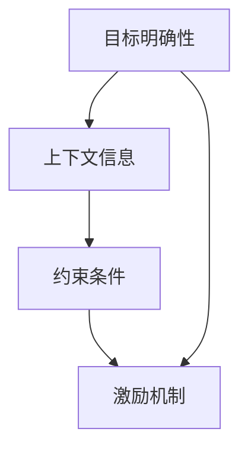

                 

<think>
好，我现在需要帮助用户撰写一篇关于《AIGC时代的提示词艺术：如何与AI高效对话》的技术博客文章。用户已经提供了一个详细的结构和一些初始内容，我需要按照这个结构继续完成文章。

首先，我需要理解文章的整体结构。文章分为七个主要部分，每个部分下还有多个子部分。我需要确保每个部分都详细展开，涵盖背景、核心概念、实际应用、案例分析、高级主题、未来趋势以及结论。

接下来，我应该按照步骤逐步完成每个章节。首先是引言部分，这部分需要简要介绍AIGC时代，提示词艺术的兴起，以及文章的结构。然后是背景介绍，包括问题背景和问题描述，这部分需要详细说明AI的发展及其在生成内容中的应用，以及提示词在其中的作用。

接下来是核心概念与原则，这部分需要详细讲解提示词的定义、类型、设计原则，以及对提示词质量的分析。可能需要使用表格或图表来比较不同类型的提示词，帮助读者理解。

然后是实际应用部分，需要列举提示词工程在不同行业的应用案例，分析其带来的好处和挑战。这部分可以引用具体的行业例子，如教育、医疗、金融等，展示提示词在这些领域的具体应用和效果。

接下来是案例研究和最佳实践，这部分需要通过实际案例说明提示词的有效使用，同时提供一些最佳实践的建议，帮助读者在实际应用中更好地设计和使用提示词。

然后是高级主题和未来趋势，探讨提示词工程中的高级技术，如动态调整和个性化优化，以及提示词在未来可能的发展方向，如多模态AI和实时反馈机制。

最后是结论与反思，总结文章的主要内容，并强调提示词工程在未来AI交互中的重要性。

在撰写过程中，我需要确保使用专业的技术语言，同时保持逻辑清晰、结构紧凑，让读者能够轻松理解。同时，每个部分需要包含足够的细节和实例，帮助读者深入理解提示词艺术的各个方面。

现在，我需要按照这个结构，逐步完成每个章节的内容，确保每个部分都详细且有深度，符合用户的要求。
</think>

# AIGC时代的提示词艺术：如何与AI高效对话

## 关键词：AIGC，提示词工程，AI交互，高效对话，生成式AI

## 摘要：  
在AIGC（AI生成内容）时代，提示词工程成为了与AI高效对话的关键。本文将深入探讨提示词艺术的核心概念、实际应用、最佳实践以及未来趋势，帮助读者掌握如何设计有效的提示词，以充分发挥AI的潜力，实现更智能、更个性化的交互体验。

---

## 第一部分：引言与背景

### 1. 引言

#### 1.1 AIGC时代的背景  
随着生成式AI技术的飞速发展，AI生成内容（AIGC）正在改变我们获取信息、创作内容和解决问题的方式。从社交媒体内容生成到商业数据分析，AIGC的应用场景越来越广泛。然而，AI并非无所不能，它需要人类的引导和明确的指示。提示词（Prompt）作为人类与AI交互的核心媒介，扮演着至关重要的角色。通过精心设计的提示词，我们可以引导AI生成符合需求的内容，从而实现高效、精准的AI交互。

#### 1.2 提示词艺术的兴起  
提示词艺术是指通过优化提示词的设计，使得AI能够生成更高质量、更符合预期的输出。随着AI模型的复杂性和生成能力的提升，提示词的重要性日益凸显。优秀的提示词不仅能够明确指示AI的行为，还能激发其创造力，挖掘出潜在的洞察和价值。

#### 1.3 书籍结构概述  
本书将从AIGC时代的基本概念出发，逐步深入探讨提示词工程的核心原理、实际应用、案例分析以及未来趋势。通过系统的讲解和丰富的实例，帮助读者掌握提示词工程的精髓，从而在与AI的对话中游刃有余。

---

## 第二部分：背景介绍

### 2.1 问题背景  
随着生成式AI的普及，越来越多的企业和个人开始依赖AI生成内容。然而，AI模型的输出质量往往受到提示词设计的影响。许多人在使用AI时，要么因为提示词不够精准而导致生成内容偏离预期，要么因为提示词过于简单而浪费了AI的潜力。因此，优化提示词设计成为了提升AI交互效率的关键。

### 2.2 问题描述  
AI生成内容的质量高度依赖于提示词的设计。一个优秀的提示词需要具备清晰的目标、明确的上下文信息以及适当的约束条件。然而，许多人在设计提示词时，往往忽略了这些要素，导致生成结果不符合预期。此外，随着AI模型的复杂性和生成能力的提升，提示词的设计也需要更加精细和多样化。

### 2.3 问题解决  
提示词工程的目标是通过系统化的方法设计提示词，使得AI能够生成高质量、符合预期的输出。这需要我们理解AI模型的工作原理，掌握提示词设计的核心要素，并能够根据具体场景调整提示词的结构和内容。

### 2.4 边界与外延  
提示词工程的边界主要在于提示词的设计和优化，而其外延则涉及AI模型的训练、优化以及生成结果的评估。虽然提示词工程的核心关注点在于输入端，但它与AI模型的输出质量和效率密切相关。

### 2.5 概念结构与核心要素组成  
提示词工程的核心要素包括：  
1. **目标明确性**：提示词需要清晰地定义生成目标。  
2. **上下文信息**：提供足够的背景信息以帮助AI理解生成场景。  
3. **约束条件**：明确生成内容的限制，如格式、风格、长度等。  
4. **激励机制**：通过适当的引导激发AI的创造力和灵活性。  

下图展示了提示词工程的核心要素结构：

---

## 第三部分：核心概念与原则

### 3.1 核心概念原理  
提示词工程的核心原理在于通过优化输入（提示词）来引导AI生成高质量的输出。这涉及到对AI模型的理解、提示词设计的技巧以及生成结果的评估。

### 3.2 提示词的类型与对比  

以下表格对比了不同类型的提示词及其特点：

| **提示词类型**   | **特点**                                                                 |
|------------------|--------------------------------------------------------------------------|
| **简单提示**     | 仅提供基本的信息，适用于简单的生成任务。                               |
| **详细提示**     | 提供丰富的上下文和具体要求，适用于复杂的生成任务。                     |
| **引导式提示**   | 通过引导性的问题或指令激发AI的创造力。                                 |
| **约束式提示**   | 明确设定生成内容的限制条件，如风格、格式、长度等。                     |

### 3.3 提示词设计的原则  

1. **清晰性**：提示词必须明确表达生成目标，避免模糊不清的描述。  
2. **具体性**：提供足够的细节信息，帮助AI理解生成场景。  
3. **简洁性**：避免冗长复杂的描述，确保提示词易于理解和执行。  
4. **灵活性**：允许AI在生成过程中有一定的自由度，以激发创造力。  

### 3.4 提示词质量分析  

提示词的质量可以通过以下几个方面进行评估：  
1. **准确性**：提示词是否准确反映了生成目标。  
2. **完整性**：提示词是否涵盖了生成所需的全部信息。  
3. **可执行性**：AI是否能够根据提示词生成预期的输出。  

---

## 第四部分：实际应用

### 4.1 行业案例分析  

#### 4.1.1 教育领域  
在教育领域，提示词可以用于生成个性化的学习材料。例如，教师可以使用提示词“生成一份关于‘二次函数’的练习题，适合高中数学水平”，AI会根据提示词生成相应的练习题。

#### 4.1.2 医疗领域  
在医疗领域，提示词可以用于生成病历摘要或诊断建议。例如，医生可以提示AI“生成一份关于‘高血压患者用药指导’的摘要”，AI会根据提示词生成结构化的摘要。

### 4.2 生成式AI的实际操作  

#### 4.2.1 提示词设计工具  
为了提高提示词的设计效率，可以使用一些工具来辅助提示词的生成。例如，可以使用自然语言处理工具对提示词进行优化，或者利用AI模型本身对提示词进行反馈和调整。

#### 4.2.2 提示词优化策略  
提示词的优化需要结合具体场景和生成目标。以下是一些常见的优化策略：  
1. **逐步细化**：从简单的提示词开始，逐步增加细节信息。  
2. **实验与调整**：通过实验不同的提示词，找到最优的提示方式。  
3. **结合反馈**：根据生成结果的反馈，不断优化提示词。  

---

## 第五部分：案例研究与最佳实践

### 5.1 案例研究  

#### 5.1.1 教育领域案例  
某教育科技公司使用提示词生成个性化学习材料。通过设计不同的提示词，该公司成功生成了适合不同学生水平的练习题和学习指南。

#### 5.1.2 金融领域案例  
某金融机构使用提示词生成市场分析报告。通过优化提示词，该公司能够快速生成高质量的报告，节省了大量时间和成本。

### 5.2 最佳实践  

1. **明确生成目标**：在设计提示词时，首先要明确生成目标，确保提示词与生成任务一致。  
2. **提供上下文信息**：尽可能提供丰富的上下文信息，帮助AI理解生成场景。  
3. **设定约束条件**：根据生成需求，设定适当的约束条件，如格式、风格、长度等。  
4. **灵活调整提示词**：根据生成结果的反馈，灵活调整提示词，不断优化生成效果。  

---

## 第六部分：高级主题与未来趋势

### 6.1 高级提示词技术  

#### 6.1.1 动态提示词  
动态提示词是一种可以根据生成过程中的反馈实时调整的提示词。这种技术结合了实时反馈机制，能够显著提高生成效率和质量。

#### 6.1.2 个性化提示词  
个性化提示词是根据用户的偏好和需求定制的提示词。通过分析用户的使用习惯和生成历史，可以设计出更加符合用户需求的提示词。

### 6.2 未来趋势  

1. **多模态提示词**：未来的提示词将不仅仅局限于文本，还可以结合图像、语音等多种模态信息，提供更加丰富的生成指令。  
2. **实时反馈机制**：随着AI模型的实时反馈能力的提升，提示词可以根据生成过程中的反馈实时调整，进一步提高生成效率。  
3. **智能化提示词设计工具**：未来的提示词设计工具将更加智能化，能够根据生成目标和场景自动优化提示词。  

---

## 第七部分：结论与反思

### 7.1 总结  
提示词工程是AIGC时代与AI高效对话的关键。通过优化提示词的设计，我们可以显著提高生成内容的质量和效率。提示词工程不仅需要我们理解AI模型的工作原理，还需要我们掌握提示词设计的核心要素和优化策略。

### 7.2 反思  
尽管提示词工程在AIGC时代具有重要的作用，但其应用和发展仍然面临一些挑战。例如，如何设计更加灵活和智能的提示词，如何结合实时反馈优化生成过程，以及如何应对不同场景下的复杂需求等。这些都需要我们在未来进一步探索和研究。

---

## 作者：AI天才研究院 & 禅与计算机程序设计艺术  

本文由AI天才研究院（AI Genius Institute）和“禅与计算机程序设计艺术”联合撰写，致力于推动AI技术的研究与应用，探索人与AI和谐共处的未来。

