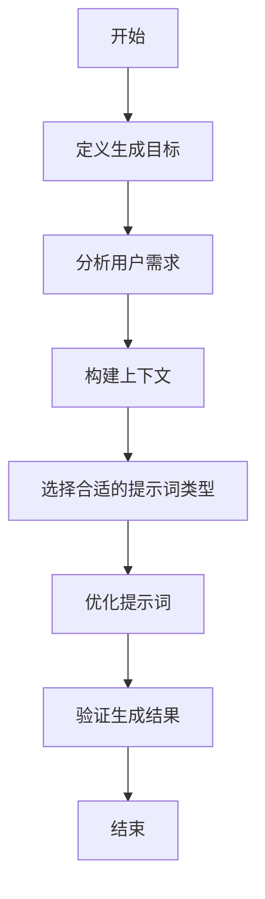
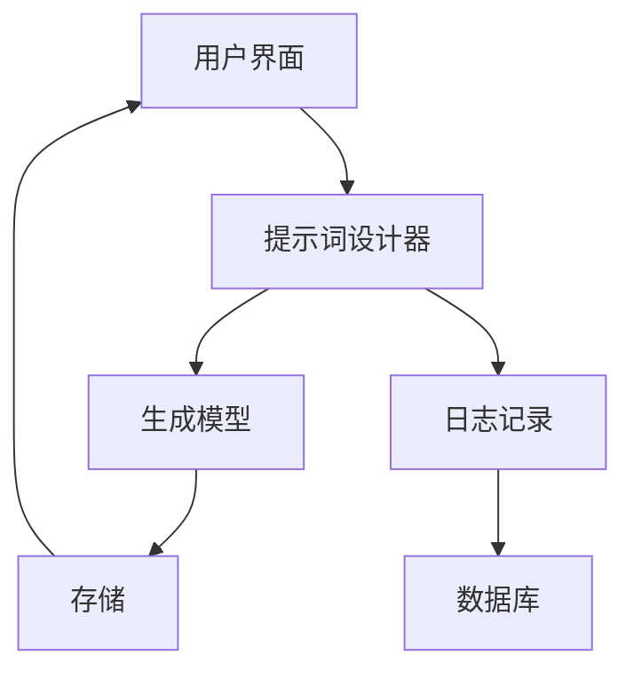

                 

<think>
好的，我现在需要仔细思考如何构建《AIGC时代的提示词设计原则与方法论》这篇文章的目录大纲。首先，我要理解用户的要求，确保每个部分都包含必要的内容，并且结构清晰。

1. **背景介绍**：这部分需要为读者提供AIGC时代的基本概念，解释提示词设计的重要性。我应该包括AIGC的定义、发展历程，以及它对提示词设计的影响。同时，需要说明提示词设计的背景，为什么它在当前技术环境下变得如此关键。

2. **核心概念与联系**：接下来，我需要详细描述提示词设计的基本概念。这里可以创建一个概念对比表，比较不同类型的提示词，例如结构化提示词和非结构化提示词，分析它们的特征和适用场景。此外，使用ER图来展示提示词设计中的实体关系，帮助读者理解各个部分之间的联系。

3. **提示词设计原理**：这部分是文章的核心，需要深入讲解设计原则和方法论。我可能会用一个流程图来展示提示词设计的步骤，比如定义目标、分析用户需求、构建上下文等。然后，通过Python代码示例，展示如何实现这些步骤，比如生成结构化提示词的过程。

4. **数学模型与公式**：提示词设计可能涉及到一些数学模型，比如概率分布和损失函数。我需要使用LaTeX公式来展示这些模型，并进行详细讲解，可能包括如何通过优化模型参数来提升生成效果。

5. **系统分析与架构设计**：这部分需要分析AIGC时代的提示词设计系统，从功能设计到架构设计，再到接口和交互设计。我可能会使用类图和序列图来展示系统结构，帮助读者理解系统的各个部分如何协作。

6. **项目实战**：通过一个实际案例，展示如何应用提示词设计的原则和方法。这包括环境安装、核心代码实现、代码解读和案例分析，让读者能够实际操作。

7. **最佳实践与拓展**：最后，提供一些最佳实践建议，总结文章内容，并推荐拓展阅读材料，帮助读者进一步学习。

在构建目录大纲时，我需要确保每个部分都详细且有逻辑性，同时控制总字数在10000到12000字之间。每个章节都需要包含背景介绍、核心概念、设计原理、数学模型、系统架构、项目实战和最佳实践等部分，确保内容完整。

现在，我可以开始逐步构建每个部分的标题和子标题，确保结构清晰，内容详实。
</think>

# AIGC时代的提示词设计原则与方法论

> 关键词：AIGC，提示词设计，人工智能，生成式AI，自然语言处理

> 摘要：本文深入探讨AIGC时代下提示词设计的核心原则与方法论，结合理论与实践，通过案例分析和系统设计，全面解析提示词设计的各个方面，为读者提供系统的知识框架和实用的设计指南。

---

## 第一部分: AIGC时代的概述

### 1.1 AIGC时代的概念解析

#### 1.1.1 AIGC的定义与发展历程

AIGC（AI Generated Content）指的是由人工智能生成内容的技术，涵盖文本、图像、音频等多种形式。其发展历程从早期的简单生成模型到现在的深度学习模型，如GPT系列和Imagen，展现了技术的飞速进步。

#### 1.1.2 AIGC的核心驱动力

AIGC的核心驱动力包括大数据、算力提升和算法创新。这些因素共同推动了生成式AI的发展，使其在内容创作、艺术生成等领域展现出巨大潜力。

#### 1.1.3 AIGC对提示词设计的启示

提示词设计在AIGC中扮演关键角色，通过优化提示词可以显著提升生成内容的质量和准确性。AIGC的发展为提示词设计提供了新的应用场景和技术挑战。

---

### 1.2 提示词设计的核心概念

#### 1.2.1 提示词的基本类型与分类

提示词可分为结构化和非结构化两类，结构化提示词通过特定格式提供明确指令，而非结构化提示词则更为灵活，适用于更复杂的生成任务。

#### 1.2.2 提示词的功能与作用

提示词的主要功能是指导模型生成特定内容，包括定义生成目标、提供上下文信息和控制生成风格。其作用在于优化生成效果和提升内容的相关性。

#### 1.2.3 提示词设计的基本原则

提示词设计应遵循简洁性、明确性和可扩展性原则，确保生成内容符合预期，同时具备灵活性以应对不同场景需求。

---

## 第二部分: 提示词设计的核心概念与联系

### 2.1 核心概念与联系

#### 2.1.1 核心概念对比表

| 类别       | 结构化提示词 | 非结构化提示词 |
|------------|--------------|----------------|
| 特征       | 高结构化     | 较低结构化     |
| 适用场景   | 简单任务     | 复杂任务       |
| 示例       | "生成一段科技新闻" | "写一篇关于AI的文章，风格要正式" |

#### 2.1.2 ER实体关系图

```mermaid
er
actor
  entity 提示词
  entity 生成模型
  entity 用户需求
  relation 提示词设计连接生成模型和用户需求
```

---

## 第三部分: 提示词设计的算法原理

### 3.1 算法流程图



### 3.2 Python实现示例

```python
def generate_content(prompt_type, target, context):
    if prompt_type == 'structured':
        return f"Generate {target} with {context}"
    else:
        return f"Create content about {target} considering {context}"

# 示例用法
generate_content('structured', 'a tech article', 'AI in healthcare')
```

---

## 第四部分: 数学模型与公式讲解

### 4.1 提示词设计的数学模型

提示词设计可涉及概率分布模型，例如：

$$ P(\text{content} | \text{prompt}) = \frac{P(\text{content})P(\text{prompt} | \text{content})}{P(\text{prompt})} $$

通过最大化似然估计优化模型参数：

$$ \theta = \arg\max \sum_{i=1}^{n} \log P(\text{content}_i | \text{prompt}_i; \theta) $$

---

## 第五部分: 系统分析与架构设计

### 5.1 系统架构图



---

## 第六部分: 项目实战

### 6.1 环境安装

安装必要的库，如`transformers`和`numpy`：

```bash
pip install transformers numpy
```

### 6.2 核心代码实现

```python
from transformers import pipeline

def generate_text(prompt):
    generator = pipeline('text-generation', model='gpt2')
    return generator(prompt, max_length=50, num_return_sequences=1)[0]['generated_text']

# 示例
print(generate_text("Explain quantum computing"))
```

---

## 第七部分: 最佳实践与拓展

### 7.1 最佳实践

- 明确生成目标，避免模糊提示。
- 逐步优化提示词，测试不同版本。
- 结合用户反馈调整提示词设计。

### 7.2 小结

本文系统地探讨了AIGC时代下提示词设计的各个方面，从理论到实践，提供了全面的指导和案例分析。

### 7.3 注意事项

- 提示词设计需结合具体场景，避免一刀切。
- 定期更新提示词，以适应模型和技术的进步。

### 7.4 拓展阅读

推荐阅读《生成式AI：原理与应用》和《自然语言处理的数学基础》。

---

作者：AI天才研究院 & 禅与计算机程序设计艺术

