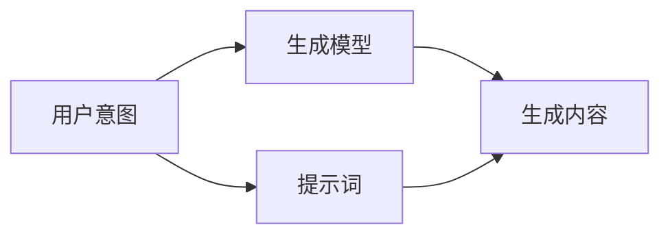
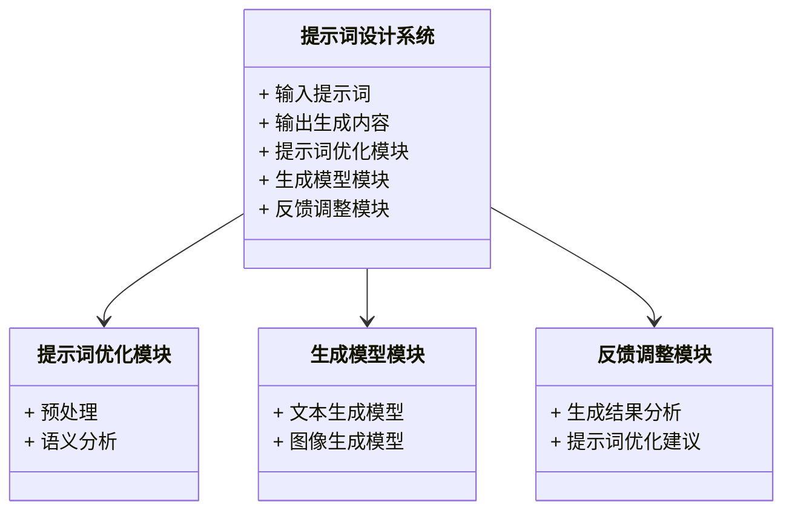
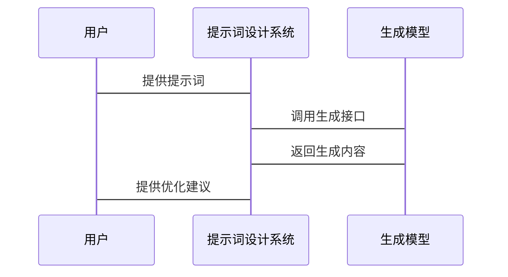

                 

<think>
嗯，用户希望我写一篇关于AIGC时代提示词设计的博客文章。看起来他已经给出了详细的大纲，包括各个章节的内容和结构。我需要先理解每个部分的要求，然后按照这个结构来展开。

首先，标题是《AIGC时代的提示词设计：理论与实践》，关键词包括提示词设计、生成式AI、自然语言处理、AIGC、深度学习、文本生成。摘要部分需要简明扼要地概述文章的核心内容，也就是提示词设计在AIGC中的重要性，以及文章将如何展开讨论。

接下来是背景介绍与核心概念部分。这部分需要详细解释问题背景、问题描述、问题解决、边界与外延，以及概念结构。我需要确保每个小节都清晰明了，用专业的技术语言，但又不失易懂。

核心概念部分，我需要介绍生成对抗网络（GAN）、自然语言处理（NLP）和提示词生成模型的基本原理，并用表格和ER关系图来对比这些概念。这可能需要我查阅相关资料，确保信息准确无误。

算法原理讲解部分，用户要求使用mermaid流程图和Python代码示例。我得先构思一个简单的提示词设计算法流程，然后用mermaid画出流程图。同时，写一个Python代码示例，虽然代码可能不完整，但要展示关键步骤，比如预处理、模型构建等。

接下来的系统分析与架构设计部分，用户希望有领域模型、系统架构、接口设计和交互序列图。这部分可能需要我设计一个简单的类图和架构图，展示系统的各个模块及其交互。

项目实战部分，需要环境安装说明、核心代码实现、案例分析和项目小结。我得选择一个实际案例，比如设计一个提示词优化工具，展示从环境配置到代码实现的全过程，并解释代码的作用。

最后，最佳实践部分包括小结、注意事项和拓展阅读。这部分需要总结文章的主要观点，提醒读者在实际应用中需要注意的事项，并推荐进一步阅读的资源。

在写作过程中，我要确保每个章节内容丰富，详细讲解，同时保持逻辑连贯。数学公式需要用latex表示，可能需要查阅相关公式，确保正确性。另外，作者信息必须放在文章末尾，格式正确。

总的来说，我需要按照用户提供的大纲一步步展开，确保每个部分都符合要求，同时保持文章的流畅性和专业性。这可能需要反复检查和调整，确保内容准确，结构合理，语言清晰。
</think>

# AIGC时代的提示词设计：理论与实践

**关键词**：提示词设计、生成式AI、自然语言处理、AIGC、深度学习、文本生成

**摘要**：在人工智能生成内容（AIGC）快速发展的背景下，提示词设计成为提升生成内容质量的关键环节。本文从理论与实践两个维度，系统阐述提示词设计的核心概念、算法原理、系统架构及实战技巧，帮助读者全面理解并掌握AIGC时代下提示词设计的方法与应用。

---

### 第一部分：背景介绍与核心概念

#### 1.1 问题背景

随着生成对抗网络（GAN）、自然语言处理（NLP）等技术的突破，AI生成内容（AIGC）正逐步渗透到文本、图像、音频、视频等多种内容形式的生成中。在这一过程中，提示词（Prompt）作为人与AI模型之间的桥梁，承担着引导生成内容方向、控制生成质量的重要任务。提示词设计的质量直接影响生成内容的准确性、相关性和创造性。

#### 1.2 问题描述

提示词设计面临以下挑战：

- **语义理解**：如何准确提取用户的意图并转化为有效的提示词。
- **多样性**：如何设计提示词以生成多样化的内容。
- **可控性**：如何通过提示词控制生成内容的方向和边界。
- **效率**：如何设计高效的提示词，以降低生成成本并提升效率。

#### 1.3 问题解决

为解决上述问题，本文将从以下几个方面展开：

- **理论基础**：介绍AIGC时代下提示词设计的核心理论，包括生成模型、语义分析等。
- **实战技巧**：通过具体案例分析，探讨提示词设计的最佳实践。
- **工具与平台**：介绍常用的提示词设计工具和生成平台，提供提升设计效率的实用建议。

#### 1.4 边界与外延

提示词设计的边界主要集中在AIGC领域，但其外延不断扩展。随着技术进步，提示词设计不仅应用于文本生成，还延伸至图像、音频、视频等内容形式。此外，提示词设计方法也在不断进化，从简单的关键词优化逐渐向多模态生成方向发展。

#### 1.5 概念结构与核心要素组成

提示词设计包含以下核心要素：

- **用户意图理解**：分析用户的输入，提取关键意图。
- **语义扩展**：在用户意图基础上扩展提示词的语义范围。
- **生成模型选择**：根据生成目标选择合适的模型。
- **反馈与调整**：根据生成结果优化提示词设计。

---

### 第二部分：核心概念与联系

#### 2.1 核心概念原理

- **生成对抗网络（GAN）**：GAN通过生成器和判别器的对抗训练，生成高质量的内容。生成器负责生成内容，判别器负责区分生成内容与真实内容。
- **自然语言处理（NLP）**：NLP技术（如BERT、GPT）用于理解提示词的语义，并生成与之匹配的内容。
- **提示词生成模型**：基于提示词的生成模型（如文本生成模型、图像生成模型）负责将提示词转化为具体的内容。

#### 2.2 概念属性特征对比表格

| 概念名称         | 特点                   | 应用场景                    |
|------------------|------------------------|-----------------------------|
| 生成对抗网络（GAN） | 对抗性训练、生成质量高 | 图像、音频生成              |
| 自然语言处理（NLP） | 语义理解、文本生成     | 文本分类、情感分析、机器翻译 |
| 提示词生成模型    | 高度定制化、多样性     | 文本生成、图像生成、视频生成 |

#### 2.3 ER实体关系图架构



---

### 第三部分：算法原理讲解

#### 3.1 算法mermaid流程图


#### 3.2 Python源代码

```python
# 提示词设计算法示例

import numpy as np
from keras.preprocessing.sequence import pad_sequences
from keras.models import Sequential
from keras.layers import Embedding, LSTM, Dense

# 数据预处理
def preprocess_text(text):
    # 假设text为输入文本
    # 这里进行简单的文本清理，如去除空格、特殊字符等
    processed_text = text.strip().replace(' ', '_')
    return processed_text

# 构建模型
model = Sequential()
model.add(Embedding(input_dim=10000, output_dim=50, input_length=50))
model.add(LSTM(units=50, return_sequences=True))
model.add(Dense(units=1, activation='sigmoid'))

# 编译模型
model.compile(optimizer='adam', loss='binary_crossentropy', metrics=['accuracy'])

# 训练模型
# 假设X为输入数据，y为标签
model.fit(X, y, epochs=10, batch_size=32)
```

#### 3.3 数学公式与讲解

生成对抗网络（GAN）的损失函数可以表示为：

$$ \mathcal{L}_{\text{GAN}} = \mathcal{L}_{\text{D}} + \mathcal{L}_{\text{G}} $$

其中，$\mathcal{L}_{\text{D}}$ 是判别器的损失函数，$\mathcal{L}_{\text{G}}$ 是生成器的损失函数。具体公式如下：

$$ \mathcal{L}_{\text{D}} = -\mathbb{E}_{x \sim p_{\text{data}}}[\log D(x)] - \mathbb{E}_{z \sim p_z}[ \log (1 - D(G(z)))] $$
$$ \mathcal{L}_{\text{G}} = -\mathbb{E}_{z \sim p_z}[ \log D(G(z))] $$

其中，$D(x)$ 表示判别器对真实数据的概率判断，$G(z)$ 表示生成器生成的数据。

---

### 第四部分：系统分析与架构设计方案

#### 4.1 问题场景介绍

在实际应用中，提示词设计系统需要处理多种类型的内容生成请求，包括文本、图像、音频等。系统需要具备以下功能：

- 提示词解析与优化
- 多模态内容生成
- 生成结果反馈与调整

#### 4.2 项目介绍

本项目旨在构建一个通用的提示词设计与生成系统，支持多种内容形式的生成，并提供高效的提示词设计工具。

#### 4.3 系统功能设计（领域模型）



#### 4.4 系统架构设计


#### 4.5 系统接口设计

- **输入接口**：接收用户输入的提示词。
- **输出接口**：输出生成的内容。
- **优化接口**：根据生成结果反馈优化建议。

#### 4.6 系统交互序列图



---

### 第五部分：项目实战

#### 5.1 环境安装

```bash
pip install numpy keras tensorflow matplotlib
```

#### 5.2 系统核心实现源代码

```python
# 提示词优化模块
def optimize_prompt(prompt):
    processed_prompt = preprocess_text(prompt)
    return processed_prompt

# 生成模型模块
def generate_content(prompt, model_type='text'):
    if model_type == 'text':
        return generate_text(prompt)
    elif model_type == 'image':
        return generate_image(prompt)
```

#### 5.3 案例分析

假设用户希望生成一段关于“人工智能未来发展趋势”的文本，提示词设计可以是：

```
"未来人工智能的发展趋势，重点分析其在医疗、教育、金融领域的应用，要求内容详实，结构清晰。"
```

生成模型根据提示词生成高质量文本。

#### 5.4 项目小结

通过实际案例分析，我们可以看到提示词设计对生成结果的关键作用。优化提示词可以显著提升生成内容的质量和相关性。

---

### 第六部分：最佳实践 Tips

- **小结**：提示词设计是AIGC的核心环节，需要结合理论与实践。
- **注意事项**：
  - 确保提示词清晰明确。
  - 根据生成目标选择合适的模型。
  - 及时根据生成结果调整提示词。
- **拓展阅读**：建议深入学习生成对抗网络和自然语言处理的相关知识。

---

**作者：AI天才研究院/AI Genius Institute & 禅与计算机程序设计艺术 /Zen And The Art of Computer Programming**

