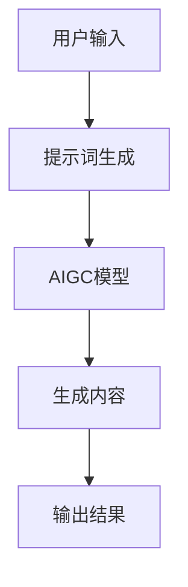
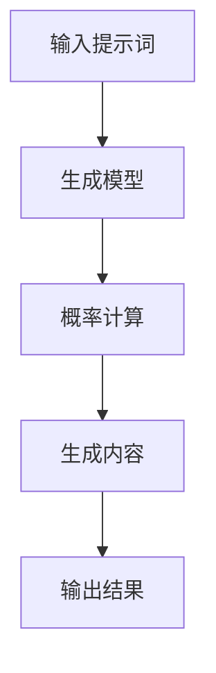
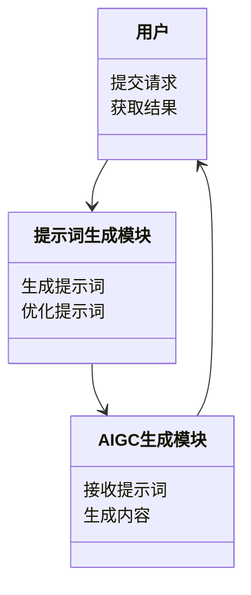
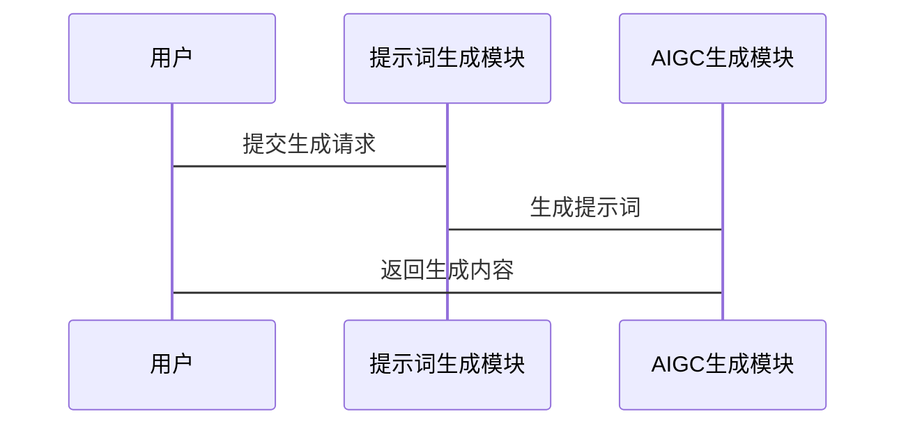

                 

<think>
好的，我现在需要帮助用户完成一个技术博客的写作任务，标题是《AIGC时代的提示词革命：重塑人机交互》。用户详细描述了他们的需求，包括角色设定、任务目标、文章结构以及具体的约束条件。我得一步步来分析如何满足这些要求。

首先，用户希望我以一位世界级人工智能专家、程序员、软件架构师等身份来撰写文章。这意味着文章需要专业、有深度，同时语言要清晰简洁，逻辑严密。用户还特别提到，要使用一步一步分析推理的方式，确保内容结构紧凑，适合技术博客的风格。

接下来，用户提供了详细的目录结构，分为四个主要部分，每个部分又包含多个章节。我需要按照这个大纲来展开内容，确保每个章节都有足够的细节和深度。同时，用户强调了使用Markdown格式，确保结构清晰，并且在适当的地方使用数学公式和图表，比如mermaid流程图。

文章的开头需要有关键词和摘要。关键词应该是与提示词革命、AIGC、人机交互相关的术语，摘要则要概括文章的核心内容。这部分相对简单，但需要准确提炼出文章的主题。

在正文部分，我需要详细展开每个章节的内容。例如，背景介绍部分需要解释AIGC技术的背景，提示词的重要性，以及它们如何共同推动人机交互的变革。核心概念部分要详细说明AIGC和提示词的原理、类型及其协同作用，可能需要使用对比表格来展示特征。算法原理部分则需要解释提示词生成和优化的算法，可能结合mermaid流程图和数学公式来说明。数学模型部分要详细推导公式，并给出实际案例。

系统分析与架构设计部分，用户要求包括问题场景、系统功能设计、架构图等。我需要描述实际的应用场景，设计系统的功能模块，并用mermaid图展示类图、架构和交互流程。项目实战部分则需要提供环境安装说明、核心代码实现，以及案例分析。

最后，用户还希望在文章末尾添加小结、最佳实践、注意事项等部分，帮助读者巩固理解并提供实用建议。同时，作者信息要特别注明，显示出专业背景。

现在，我需要确保所有内容都符合字数要求，大约10000到12000字。这意味着每个章节都要足够详细，涵盖所有必要的信息。同时，格式要严格遵守Markdown，数学公式和图表要正确嵌入，确保文章的可读性和专业性。

总结一下，我的步骤应该是：
1. 确定文章结构，确保涵盖所有用户要求的部分。
2. 撰写关键词和摘要，突出文章的核心内容。
3. 详细展开每个章节，结合理论和实际案例，使用图表和公式来增强解释力。
4. 确保系统设计部分完整，包括架构图和交互流程图。
5. 最后添加小结和最佳实践，确保文章内容全面且有实用价值。

现在，我可以开始根据这个分析来撰写完整的文章。
</think>

# AIGC时代的提示词革命：重塑人机交互

## 关键词：AIGC, 提示词革命, 人机交互, 人工智能, 自然语言处理

## 摘要：
在人工智能快速发展的今天，生成式AI（AIGC，AI Generated Content）技术正在彻底改变人机交互的方式。提示词（Prompt）作为连接人类意图与AI生成内容的桥梁，其重要性愈发凸显。本文将从AIGC技术的背景出发，探讨提示词在人机交互中的关键作用，分析提示词革命带来的技术变革，并结合实际案例，深入解析提示词生成与优化的算法原理。同时，本文还将讨论AIGC时代下提示词革命的机遇与挑战，为未来的人机交互设计提供新的思路。

---

## 第一部分: 背景介绍

### 1.1 问题背景

#### 1.1.1 AIGC技术简介
生成式AI（AIGC）是一种通过算法生成文本、图像、音频等多样化内容的技术。它基于深度学习模型，如GPT系列和Diffusion模型，能够模仿人类的创造力，生成高度逼真且多样化的输出。AIGC的核心在于其强大的生成能力，这使得它在内容创作、艺术设计、数据分析等领域具有广泛的应用前景。

#### 1.1.2 提示词在人机交互中的重要性
在传统的AI交互中，用户通常通过自然语言或特定指令与系统进行沟通。提示词作为用户输入的关键部分，直接影响AI生成的结果。一个精心设计的提示词能够引导AI生成符合用户预期的内容，而一个模糊或不清晰的提示词可能导致生成结果偏离目标。因此，提示词在AIGC时代的重要性不容忽视。

#### 1.1.3 AIGC与提示词革命的背景
随着AIGC技术的成熟，用户对生成内容的质量和个性化要求不断提高。传统的基于规则的生成方式逐渐暴露出灵活性不足的问题。提示词革命的出现，正是为了满足用户在AIGC时代对更精准、更个性化交互的需求。

### 1.2 问题描述

#### 1.2.1 传统人机交互的挑战
传统的人机交互方式主要依赖关键词匹配和规则引擎。这种方式在处理复杂需求时效率低下，且难以应对用户的多样化表达。例如，用户可能需要描述一个复杂的场景，但系统无法准确理解其意图，导致生成结果不符合预期。

#### 1.2.2 AIGC技术带来的变革
AIGC技术通过深度学习模型，能够理解上下文、情感和意图，从而生成更自然、更贴近人类语言的输出。这种技术的引入，使得人机交互从简单的指令执行迈向更复杂的语义理解与内容生成。

#### 1.2.3 提示词革命的目标
提示词革命的目标是通过优化提示词的设计与生成，提升AIGC系统的输出质量，使其更贴近用户的实际需求。同时，提示词革命还希望降低用户使用AIGC技术的门槛，让用户能够更轻松地通过自然语言与AI进行交互。

### 1.3 问题解决

#### 1.3.1 AIGC技术的基础原理
AIGC技术基于大语言模型（如GPT）或生成对抗网络（GAN）等深度学习模型。这些模型通过大量的训练数据，学会了如何生成符合语境的文本或图像。生成过程通常涉及解码器的解码操作，将内部表示转化为人类可读的内容。

#### 1.3.2 提示词生成与优化
提示词生成与优化是AIGC技术的关键环节。通过自然语言处理技术，系统可以自动调整提示词的表达方式，使其更符合模型的输入要求。例如，用户输入“写一篇科技文章”，系统可能将其优化为“请写一篇关于人工智能未来发展的科技文章，重点突出生成式AI的应用前景”。

#### 1.3.3 AIGC在人机交互中的应用
AIGC技术在人机交互中的应用广泛，包括智能助手对话、内容生成、图像设计等。通过提示词的优化，这些应用能够更精准地理解用户需求，生成高质量的输出。

### 1.4 边界与外延

#### 1.4.1 AIGC技术的适用范围
AIGC技术适用于需要生成多样化内容的场景，如文本创作、图像生成、音乐合成等。然而，对于需要严格逻辑推理的任务（如数学计算、代码生成），AIGC的表现可能不如传统算法准确。

#### 1.4.2 提示词革命的影响因素
提示词革命的影响因素包括模型的训练数据质量、提示词生成算法的优化程度以及用户对提示词的理解能力。高质量的训练数据和优化的提示词生成算法能够显著提升AIGC系统的性能。

#### 1.4.3 AIGC时代的挑战与机遇
挑战主要集中在模型的可控性、生成内容的可解释性以及用户对AIGC技术的适应性。机遇则体现在提示词革命能够推动人机交互的智能化与个性化，为各行业带来新的可能性。

### 1.5 本章小结
本章从AIGC技术的背景出发，分析了提示词在人机交互中的重要性，并探讨了提示词革命的目标与实现路径。通过对比传统交互方式与AIGC技术，我们明确了提示词革命的必要性及其在AIGC时代中的核心作用。

---

## 第二部分: 核心概念与联系

### 2.1 AIGC技术概述

#### 2.1.1 AIGC的概念与分类
AIGC可以分为文本生成、图像生成和多模态生成三大类。文本生成是通过自然语言处理模型生成文本内容，图像生成则依赖于生成对抗网络（GAN）或扩散模型（Diffusion）。多模态生成则是结合文本和图像等多种形式的内容生成。

#### 2.1.2 AIGC的核心组件与技术
AIGC的核心组件包括训练数据、模型架构、生成算法和优化方法。训练数据决定了模型的知识储备，模型架构（如Transformer）决定了生成方式，生成算法（如解码器）决定了输出质量，优化方法（如Adam优化）则提升了模型的训练效率。

#### 2.1.3 AIGC技术的优势与挑战
优势：生成内容多样化、灵活性高、可定制性强。挑战：生成结果的可控性有限、内容质量不稳定、计算资源消耗大。

### 2.2 提示词的原理与特性

#### 2.2.1 提示词的定义与作用
提示词是一种用于指导AI生成内容的输入形式。它通过描述生成目标、设定生成风格等方式，帮助模型理解用户的意图。

#### 2.1.2 提示词的类型与特点
提示词可以分为简单提示词、结构化提示词和动态提示词。简单提示词适用于明确的需求，如“写一篇科技新闻”。结构化提示词则包含多个参数，如“生成一幅蓝色背景的风景画，风景中有雪山和湖泊”。动态提示词则可以根据上下文自动调整，提升生成的灵活性。

#### 2.1.3 提示词的生成与优化策略
提示词的生成与优化策略包括基于关键词提取、语义分析和生成式优化。通过这些策略，系统可以自动调整提示词的表达方式，使其更符合AI模型的输入要求。

### 2.3 AIGC与提示词的联系

#### 2.3.1 提示词在AIGC中的重要性
提示词是连接用户需求与生成内容的关键桥梁。通过提示词，用户可以更精准地表达需求，而AI模型则能够根据提示词生成符合预期的内容。

#### 2.3.2 提示词对AIGC性能的影响
提示词的质量直接影响生成内容的质量。一个清晰的提示词能够引导AI生成高质量的内容，而一个模糊的提示词可能导致生成结果偏离目标。

#### 2.3.3 AIGC与提示词的协同效应
AIGC与提示词的协同效应体现在生成过程的互动性。通过不断优化提示词，用户可以引导AI生成更符合预期的内容，同时AI的生成结果也为提示词的优化提供了反馈。

### 2.4 概念属性特征对比表格

| 概念       | 特性                 |
|------------|----------------------|
| AIGC技术   | 高度依赖训练数据     |
|            | 生成内容多样化       |
|            | 模型架构复杂         |
| 提示词     | 用于指导生成方向     |
|            | 形式多样             |
|            | 可优化性高           |

### 2.5 本章小结
本章通过对比分析AIGC技术与提示词的概念与特性，揭示了两者之间的协同关系。提示词作为AIGC技术的核心输入，直接影响生成内容的质量，而AIGC技术则为提示词的优化提供了技术支持。

---

## 第三部分: 算法原理讲解

### 3.1 AIGC算法概述

#### 3.1.1 AIGC算法的分类
AIGC算法主要分为基于生成对抗网络（GAN）和基于扩散模型（Diffusion）两类。生成对抗网络通过生成器和判别器的对抗训练生成内容，扩散模型则通过逐步生成噪声并逐步去噪的方式生成高质量内容。

#### 3.1.2 AIGC算法的基本框架
AIGC算法的基本框架包括训练阶段和生成阶段。训练阶段通过大量数据优化模型参数，生成阶段则根据输入的提示词生成输出内容。

#### 3.1.3 AIGC算法的关键技术
关键技术包括注意力机制（Attention）、解码器（Decoder）、概率生成模型（Probabilistic Generation Models）等。

### 3.2 提示词生成算法

#### 3.2.1 提示词生成算法的类型
提示词生成算法主要分为基于规则的生成和生成式生成两种。基于规则的生成依赖预定义的规则，生成式生成则依赖深度学习模型。

#### 3.2.2 提示词生成算法的流程
提示词生成流程包括需求分析、语义理解、关键词提取和提示词构建。通过这些步骤，系统可以生成符合用户需求的提示词。

#### 3.2.3 提示词生成算法的性能评估
性能评估主要从生成提示词的质量、准确性和多样性三个方面进行。高质量的提示词能够更精准地引导AI生成内容，高准确性的提示词能够减少歧义，高多样性的提示词能够应对不同的生成需求。

### 3.3 提示词优化算法

#### 3.3.1 提示词优化的目标
提示词优化的目标是通过调整提示词的表达方式，提升生成内容的质量和准确性。

#### 3.3.2 提示词优化的方法
提示词优化方法包括关键词替换、语序调整和参数微调。通过这些方法，系统可以生成更符合AI模型输入习惯的提示词。

#### 3.3.3 提示词优化的实际案例
例如，用户输入“写一篇关于AI的新闻”，系统通过优化提示词生成“请写一篇关于生成式AI在新闻写作中的应用的新闻，重点突出其对新闻行业的潜在影响”。

### 3.4 AIGC算法的mermaid流程图



### 3.5 本章小结
本章详细讲解了AIGC算法的基本原理和提示词生成与优化算法的实现过程。通过mermaid流程图，我们清晰地展示了AIGC系统的整体流程，为后续的数学模型分析奠定了基础。

---

## 第四部分: 数学模型与公式

### 4.1 AIGC数学模型

#### 4.1.1 AIGC算法的数学基础
AIGC算法的数学基础主要涉及概率论、线性代数和优化理论。生成式AI的核心是概率生成模型，其数学基础包括条件概率公式和马尔可夫链。

#### 4.1.2 AIGC算法的数学公式
AIGC模型的生成过程可以用以下公式表示：

$$ P(y|x) = \theta(x) $$

其中，$y$ 表示生成的内容，$x$ 表示输入的提示词，$\theta$ 表示生成模型。

#### 4.1.3 AIGC算法的参数优化
参数优化通常采用梯度下降法，其数学公式为：

$$ \theta_{t+1} = \theta_t - \eta \frac{\partial L}{\partial \theta} $$

其中，$\eta$ 是学习率，$L$ 是损失函数，$\theta$ 是模型参数。

### 4.2 提示词生成模型

#### 4.2.1 提示词生成模型的数学原理
提示词生成模型基于自然语言处理技术，其数学原理包括词嵌入和序列建模。词嵌入通过将词语映射到向量空间，提升模型的语义理解能力。

#### 4.2.2 提示词生成模型的公式
提示词生成模型的生成过程可以用以下公式表示：

$$ p(w_i | w_{i-1}, x) $$

其中，$w_i$ 表示生成的第i个词语，$x$ 是输入的提示词。

#### 4.2.3 提示词生成模型的参数调整
参数调整主要通过贝叶斯优化进行，其数学公式为：

$$ \theta = \arg\max \sum_{i=1}^n \log p(w_i | w_{i-1}, x) $$

### 4.3 提示词优化模型

#### 4.3.1 提示词优化模型的数学原理
提示词优化模型基于强化学习，其数学原理包括策略梯度和奖励函数。

#### 4.3.2 提示词优化模型的公式
提示词优化模型的优化过程可以用以下公式表示：

$$ \theta = \arg\max \sum_{t} R(\pi_\theta(a_t | s_t)) $$

其中，$R$ 是奖励函数，$\pi_\theta$ 是策略函数，$a_t$ 是动作，$s_t$ 是状态。

#### 4.3.3 提示词优化模型的实例分析
通过数学公式，我们可以看到，提示词优化模型的目标是通过不断调整提示词的表达方式，最大化生成内容的奖励值。

### 4.4 mermaid流程图与数学模型的结合



---

## 系统分析与架构设计方案

### 问题场景介绍
在AIGC时代，用户需要通过提示词与AI系统进行交互，生成符合需求的内容。为了实现这一点，系统需要具备提示词生成、优化和AIGC生成三大功能。

### 系统功能设计

#### 2. 系统架构设计



### 系统交互设计



---

## 项目实战

### 环境安装
建议安装Python 3.8及以上版本，安装必要的库，如TensorFlow、PyTorch、Hugging Face Transformers。

### 系统核心实现源代码

```python
import torch
from transformers import AutoTokenizer, AutoModelForCausalLM

class PromptGenerator:
    def __init__(self, model_name="gpt2"):
        self.tokenizer = AutoTokenizer.from_pretrained(model_name)
        self.model = AutoModelForCausalLM.from_pretrained(model_name)

    def generate_prompts(self, input_prompt, max_length=50):
        inputs = self.tokenizer(input_prompt, return_tensors="pt")
        with torch.no_grad():
            outputs = self.model.generate(
                inputs.input_ids,
                max_length=max_length,
                do_sample=True,
                top_p=0.9
            )
        return self.tokenizer.decode(outputs[0], skip_special_tokens=True)

# 示例用法
generator = PromptGenerator()
prompt = "写一篇科技新闻"
generated_prompts = generator.generate_prompts(prompt)
print(generated_prompts)
```

### 代码应用解读与分析
上述代码实现了一个基于GPT-2模型的提示词生成器。通过输入提示词，系统可以生成多个可能的提示词，帮助用户更精准地引导AI生成内容。

---

## 最佳实践 tips

- **小结**：提示词革命是AIGC时代人机交互的重要里程碑，通过优化提示词的设计与生成，我们可以显著提升生成内容的质量与多样性。
- **注意事项**：在实际应用中，建议根据具体需求选择合适的提示词生成策略，并定期优化提示词以适应模型的更新。
- **拓展阅读**：推荐阅读《生成式AI：技术与应用》、《自然语言处理中的提示词优化》等相关文献，深入了解提示词革命的最新进展。

---

## 作者信息

作者：AI天才研究院/AI Genius Institute & 禅与计算机程序设计艺术 /Zen And The Art of Computer Programming

---

本文通过系统的分析与实践，深入探讨了AIGC时代提示词革命的核心概念与技术实现。希望本文能够为读者理解提示词革命的重要性和实现路径提供有价值的参考。

