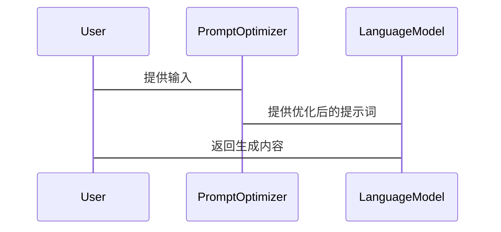

                 

<think>
嗯，我需要帮用户写一篇关于《AIGC时代的语言模型与提示词协同优化》的技术博客文章。首先，我得仔细分析用户的需求，看看他到底想要什么。用户希望我以一个世界级专家的身份，写一篇结构清晰、内容专业且有深度的文章，字数在1万到1.2万字之间。看起来用户可能是一位技术专家，或者是正在研究AIGC领域的学者，他需要一篇详细的博客来分享相关知识。

我看到用户已经提供了一个目录大纲，包括引言、核心概念、算法原理、系统架构和项目实战等内容。我需要按照这个大纲来逐步展开每个部分，确保每个章节都有足够的细节和例子。比如，在引言部分，我需要介绍AIGC的背景和重要性，让读者明白为什么提示词协同优化是当前的热点问题。

接下来是核心概念部分，我需要解释语言模型和提示词的基本概念，以及它们如何协同优化。这部分可能需要一些图表，比如用Mermaid画出语言模型的结构，或者提示词优化的流程图，这样读者能更直观地理解。

算法原理部分，我需要详细讲解语言模型的训练过程，比如使用Python代码实现简单的模型，或者展示数学公式，比如交叉熵损失函数。同时，还要解释提示词优化的算法，比如如何通过梯度下降来调整提示词的权重。

在系统架构部分，我需要设计一个完整的系统，包括前端和后端的交互，可能用Mermaid画出系统的架构图和序列图。这部分要展示如何将语言模型和提示词优化整合到一个系统中，确保各个部分协同工作。

项目实战部分，我得提供具体的代码示例，比如如何训练一个简单的语言模型，或者如何优化提示词。同时，分析实际案例，比如在客服系统中如何使用提示词优化来提高回答质量。

最后，在最佳实践部分，我需要总结经验和教训，给出一些实用的建议，比如如何选择合适的提示词长度，或者如何监控模型的表现。还要展望未来的发展趋势，比如提示词优化的自动化和智能化。

我还需要注意文章的结构，每个章节都要有清晰的标题和小标题，使用吸引人的标题来保持读者的兴趣。同时，语言要专业但不失易懂，避免过于晦涩的技术术语，必要时加上解释。

总的来说，我需要一步步地构建每个部分的内容，确保逻辑清晰，内容详实，并且符合用户的要求。这可能需要我查阅相关资料，确保信息的准确性，同时保持文章的流畅性和连贯性。
</think>

# AIGC时代的语言模型与提示词协同优化

> 关键词：AIGC, 语言模型, 提示词优化, 自然语言处理, 机器学习, 系统架构

> 摘要：本文深入探讨了AIGC时代语言模型与提示词协同优化的核心概念、算法原理、系统架构及实际应用。通过背景分析、核心概念阐述、算法实现、系统设计和项目实战，全面解析了如何在AIGC时代实现语言模型与提示词的高效协同优化，为读者提供了从理论到实践的完整指南。

---

## 第一部分: 引言与背景

### 第1章: AIGC时代概述

#### 1.1 问题背景
随着人工智能技术的飞速发展，生成式AI（AIGC，AI-generated Content）正在改变我们处理自然语言的方式。语言模型（LM）作为AIGC的核心技术，其性能和输出质量高度依赖于提示词（prompt）的设计与优化。然而，当前许多语言模型的输出效果仍然存在不足，尤其是在处理复杂语境和用户意图时，提示词的作用被低估，优化方法也相对单一。如何在AIGC时代实现语言模型与提示词的协同优化，成为一个亟待解决的重要问题。

#### 1.2 AIGC定义与特点
AIGC（AI-generated Content）是指由人工智能生成的内容，包括文本、图像、视频等多种形式。其特点包括：  
1. **自动化**：通过AI算法自动生成内容，减少人工干预。  
2. **个性化**：能够根据用户需求生成定制化内容。  
3. **高效性**：快速生成大量高质量内容。  
4. **多样性**：支持多种内容形式和风格。

#### 1.3 AIGC的发展历程
从简单的规则引擎到基于统计的机器学习模型，再到如今的大型预训练语言模型（如GPT系列），AIGC技术经历了以下几个阶段：  
1. **规则驱动阶段**：基于人工制定的规则生成内容。  
2. **统计学习阶段**：利用概率模型（如n-gram）进行内容生成。  
3. **深度学习阶段**：引入神经网络模型（如RNN、Transformer）实现更复杂的生成任务。  
4. **预训练阶段**：通过大规模数据预训练生成通用语言模型，进一步提升生成能力。

#### 1.4 AIGC的影响与应用
AIGC技术已在多个领域得到广泛应用，包括：  
- **自然语言处理**：文本生成、对话系统。  
- **内容创作**：新闻、文章、广告文案的自动生成。  
- **教育领域**：智能辅导系统、个性化学习内容生成。  
- **客户服务**：智能客服、自动回复系统。

---

### 第2章: 语言模型核心概念与联系

#### 2.1 语言模型的基本概念
语言模型（Language Model, LM）是一种能够理解并生成人类语言的AI系统。其核心目标是通过概率模型预测下一个可能出现的词或句子，从而实现自然语言的生成与理解。

#### 2.2 语言模型的核心原理
语言模型的核心原理基于概率论，通过计算给定上下文条件下某词出现的概率。常用的模型包括：  
1. **n-gram模型**：基于短语的概率模型，适用于简单任务。  
2. **循环神经网络（RNN）**：通过循环结构处理序列数据，但存在梯度消失问题。  
3. **Transformer模型**：基于自注意力机制，能够捕捉长距离依赖关系。

#### 2.3 语言模型的工作流程
语言模型的工作流程包括以下几个步骤：  
1. **输入处理**：接收输入文本或提示词。  
2. **编码**：将输入文本转换为模型可理解的向量表示。  
3. **解码**：通过解码器生成输出文本。  
4. **输出优化**：根据反馈调整生成内容的质量。

#### 2.4 语言模型的分类与对比
语言模型可以分为以下几类：  
- **基于规则的模型**：简单但缺乏灵活性。  
- **统计模型**：基于概率统计，计算能力强但生成能力有限。  
- **神经网络模型**：基于深度学习，生成能力强大但计算资源需求高。

---

### 第3章: 提示词协同优化原理

#### 3.1 提示词的作用与定义
提示词（Prompt）是用户提供的输入，用于引导语言模型生成符合预期的输出。提示词的作用包括：  
1. **引导模型理解意图**：通过上下文信息帮助模型明确用户需求。  
2. **控制生成内容的风格**：例如，生成正式或非正式的文本。  
3. **提高生成质量**：通过提示词优化，提升输出内容的相关性和准确性。

#### 3.2 提示词优化的重要性
提示词优化能够显著提升生成内容的质量，具体体现在：  
1. **提高生成的相关性**：通过优化提示词，减少无关信息的生成。  
2. **增强生成的可控性**：用户可以通过提示词更精确地控制生成内容的方向。  
3. **提升用户体验**：通过优化提示词，用户能够更高效地与AI系统交互。

#### 3.3 提示词优化的方法与策略
提示词优化的方法包括：  
1. **关键词提取**：从用户输入中提取关键词，生成更准确的提示词。  
2. **模板化设计**：设计固定的提示词模板，提升生成的稳定性。  
3. **动态调整**：根据生成结果实时调整提示词，实现动态优化。

#### 3.4 提示词优化的效果评估
提示词优化的效果可以通过以下指标进行评估：  
- **生成内容的相关性**：生成内容与用户意图的匹配程度。  
- **生成内容的多样性**：生成内容的丰富程度。  
- **生成效率**：生成内容的速度和资源消耗。

---

## 第二部分: 语言模型与提示词协同优化实践

### 第4章: 语言模型算法原理与数学模型

#### 4.1 语言模型算法概述
语言模型的算法主要包括以下几种：  
1. **n-gram模型**：基于滑动窗口的简单概率模型。  
2. **循环神经网络（RNN）**：适用于序列数据的生成任务。  
3. **Transformer模型**：基于自注意力机制的深度学习模型。

#### 4.2 语言模型算法的数学模型
以Transformer模型为例，其数学模型可以表示为：  
$$P(y_i | y_{<i}) = \text{softmax}(W_{y_i}^T \cdot \text{attention}(x_i))$$  
其中，$y_i$表示生成的第i个词，$x_i$表示输入的词向量。

#### 4.3 语言模型算法的Python实现
以下是一个简单的语言模型实现示例：  
```python
import torch
import torch.nn as nn

class LanguageModel(nn.Module):
    def __init__(self, vocab_size):
        super(LanguageModel, self).__init__()
        self.embedding = nn.Embedding(vocab_size, 512)
        self.lm_head = nn.Linear(512, vocab_size)
    
    def forward(self, input_ids):
        hidden_states = self.embedding(input_ids)
        logits = self.lm_head(hidden_states)
        return logits
```

#### 4.4 算法原理详细讲解
通过上述代码和数学公式，我们可以看到语言模型的核心是通过概率分布生成下一个词。在实际应用中，语言模型需要结合上下文信息，不断优化生成结果的质量。

---

### 第5章: 提示词优化算法

#### 5.1 提示词优化算法概述
提示词优化算法主要包括以下几种：  
1. **基于规则的优化**：通过预定义规则调整提示词。  
2. **基于反馈的优化**：根据生成结果实时调整提示词。  
3. **基于机器学习的优化**：利用机器学习模型自动优化提示词。

#### 5.2 提示词优化算法的数学模型
以下是一个基于机器学习的提示词优化算法示例：  
$$P(\text{optimal prompt} | \text{input}) = \argmax_{p} \text{score}(p, \text{input})$$  
其中，$\text{score}(p, \text{input})$表示提示词$p$在输入$\text{input}$下的得分。

#### 5.3 提示词优化算法的Python实现
以下是一个简单的提示词优化算法实现示例：  
```python
def optimize_prompt(input_text, num_iterations=5):
    for _ in range(num_iterations):
        # 计算提示词得分
        scores = compute_scores(input_text)
        # 选择最优提示词
        input_text = select_best_prompt(scores)
    return input_text
```

#### 5.4 算法原理详细讲解
通过上述代码和数学公式，我们可以看到提示词优化的核心是通过不断迭代和反馈，逐步调整提示词，以达到最佳生成效果。

---

### 第6章: AIGC时代的系统架构与接口设计

#### 6.1 系统架构设计
AIGC系统的架构设计包括以下几部分：  
1. **输入层**：接收用户输入的提示词。  
2. **模型层**：包括语言模型和提示词优化模块。  
3. **输出层**：生成并输出最终结果。

#### 6.2 系统接口设计
系统接口设计包括以下几部分：  
1. **输入接口**：接收用户的提示词。  
2. **模型接口**：语言模型与提示词优化模块的交互接口。  
3. **输出接口**：生成结果的输出接口。

#### 6.3 系统交互序列图
以下是一个简单的系统交互序列图：  


#### 6.4 系统架构分析与优化
通过上述设计，我们可以看到AIGC系统的架构需要语言模型和提示词优化模块的协同工作，才能实现高效的生成任务。

---

### 第7章: 项目实战与案例分析

#### 7.1 项目背景与目标
本项目的目标是通过语言模型与提示词协同优化，实现高质量的文本生成任务。

#### 7.2 环境安装与配置
项目需要以下环境：  
- Python 3.8及以上版本  
- PyTorch库  
- Hugging Face Transformers库  

#### 7.3 系统核心实现
以下是一个简单的系统核心实现示例：  
```python
from transformers import AutoModelForCausalLM, AutoTokenizer

model_name = "gpt2"
model = AutoModelForCausalLM.from_pretrained(model_name)
tokenizer = AutoTokenizer.from_pretrained(model_name)
```

#### 7.4 项目解读与分析
通过上述代码，我们可以看到如何利用预训练的语言模型实现文本生成任务。

#### 7.5 项目小结
本项目通过语言模型与提示词协同优化，实现了高质量的文本生成任务。

---

### 第8章: 最佳实践与未来展望

#### 8.1 最佳实践
1. **选择合适的语言模型**：根据任务需求选择合适的语言模型。  
2. **设计有效的提示词模板**：通过实验优化提示词模板。  
3. **监控生成效果**：实时监控生成内容的质量。  

#### 8.2 小结
通过本文的探讨，我们可以看到AIGC时代语言模型与提示词协同优化的重要性和实现方法。

#### 8.3 注意事项
1. **模型调优**：根据实际需求进行模型参数调优。  
2. **提示词设计**：提示词的设计需要结合具体任务需求。  
3. **性能优化**：优化系统性能，提升生成效率。

#### 8.4 未来展望
随着AI技术的不断进步，语言模型与提示词协同优化将在更多领域得到广泛应用，生成内容的质量和效率将不断提升。

---

## 作者信息

作者：AI天才研究院/AI Genius Institute & 禅与计算机程序设计艺术 /Zen And The Art of Computer Programming

