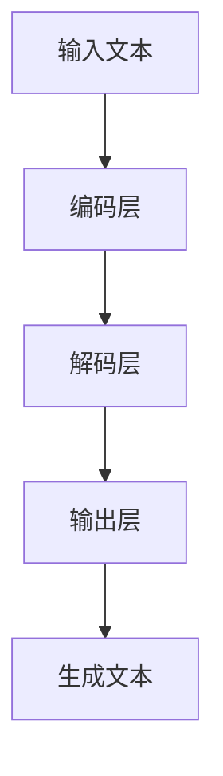
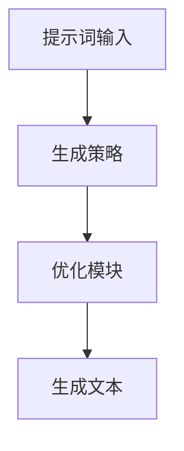
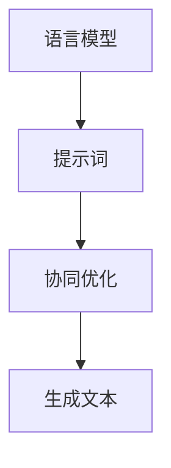
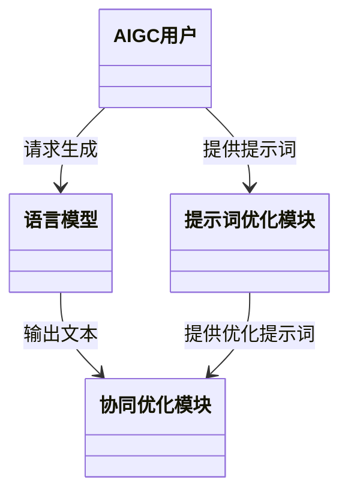
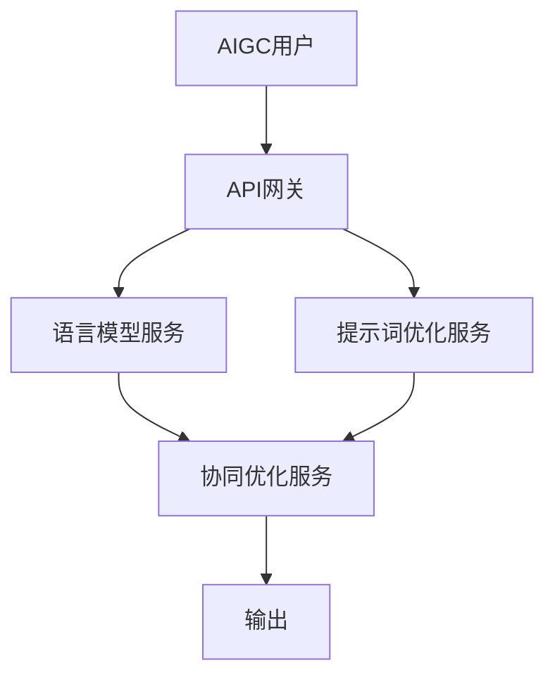
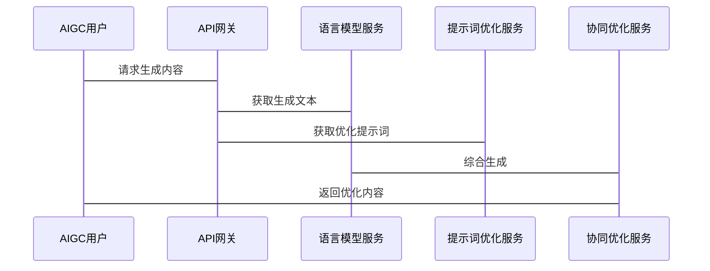

                 

<think>
嗯，我最近在研究AIGC，也就是人工智能生成内容，特别是语言模型和提示词的协同优化。这部分内容对我来说有点复杂，但我决定一步一步来理解和掌握它。

首先，我需要了解AIGC的基本概念。AIGC应该是指人工智能生成内容，这可能包括文本、图像、视频等多种形式。但是在这个上下文中，主要关注语言模型和提示词，所以我需要专注于文本生成部分。

接下来，我应该理解语言模型和提示词各自的作用。语言模型，比如GPT，是用来理解和生成人类语言的模型，而提示词则是用来指导模型生成特定类型内容的输入。协同优化应该是指这两者之间的合作和相互提升，以达到更好的生成效果。

那么，为什么协同优化很重要呢？可能是因为单独优化语言模型或提示词只能在一定程度上提升生成效果，而两者协同工作可以进一步提升生成内容的质量、相关性和准确性。这可能涉及到如何设计提示词，如何调整模型参数，以及如何在两者之间建立反馈机制。

接下来，我需要思考如何具体实施协同优化。可能需要从分析语言模型的工作原理开始。语言模型通常基于概率分布，预测下一个词的概率。这涉及到计算语言模型的数学模型，可能涉及到一些复杂的公式，比如交叉熵损失函数、梯度下降等。

然后，考虑提示词的优化。提示词是输入到模型中的引导文本，帮助模型理解生成的内容的方向。优化提示词可能涉及到生成策略、语言风格、主题等方面的调整。同时，如何衡量提示词的有效性，可能需要一些评估指标，比如生成内容的相关性、创新性等。

协同优化可能需要将两者的优化过程结合起来。例如，通过不断调整提示词，训练语言模型以更好地适应这些提示；或者反过来，根据生成结果的反馈，优化提示词，使得语言模型能够生成更符合预期的内容。

在实际应用中，如何设计一个协同优化的系统架构？可能需要一个系统，其中语言模型和提示词优化模块能够互相通信，共享信息，进行参数调整和优化。这可能涉及到系统架构设计，包括数据流、模块交互、接口设计等。

为了更好地理解，我可能需要一些图表，比如系统架构图、类图、序列图等。使用Mermaid这样的工具可以帮助我更清晰地展示这些结构，帮助读者理解系统的工作原理。

接下来，我需要思考实际案例。例如，设计一个协同优化的系统，从环境安装开始，比如选择合适的技术栈，比如Python、深度学习框架（如TensorFlow或PyTorch）。然后，实现语言模型和提示词优化模块，可能需要编写代码，如定义模型结构、训练过程、提示词生成和优化算法。

在实现过程中，我可能会遇到一些挑战。比如，如何有效评估生成内容的质量，这可能需要一些自动评估指标，如BLEU、ROUGE等，或者需要人工评估。此外，如何处理模型训练中的过拟合问题，可能需要引入正则化、交叉验证等技术。

另外，还需要考虑系统的扩展性和维护性。设计一个灵活的架构，使得在未来可以轻松添加新的优化策略或更换模型结构。同时，确保系统的高效性和稳定性，特别是在处理大量数据时。

总结一下，我的思考过程包括：

1. 理解AIGC、语言模型和提示词的基本概念。
2. 探索协同优化的必要性和重要性。
3. 分析语言模型和提示词的优化方法。
4. 设计协同优化的系统架构。
5. 实现实际案例，包括环境安装、代码编写、系统测试等。
6. 考虑系统评估、扩展性、维护性等问题。

在接下来的步骤中，我需要逐步展开每个部分，深入探讨每个问题，并确保每个章节的内容详细且逻辑清晰。同时，使用Mermaid图和数学公式来增强内容的可理解性和专业性。
</think>

# AIGC时代的语言模型与提示词协同优化研究

> 关键词：AIGC，语言模型，提示词优化，协同优化，系统架构，项目实战

> 摘要：本文探讨了在AIGC时代，语言模型与提示词协同优化的关键技术。从背景介绍、核心概念到算法原理、系统设计，再到项目实战和最佳实践，系统性地分析了如何通过协同优化提升生成内容的质量和效率。

## 目录大纲

1. **背景介绍**
    - 1.1 问题背景与概述
        - 1.1.1 AIGC的概念
        - 1.1.2 AIGC的发展历程
        - 1.1.3 AIGC的核心问题与挑战
    - 1.2 AIGC的关键技术
        - 1.2.1 语言模型技术
        - 1.2.2 提示词技术
        - 1.2.3 语言模型与提示词的协同优化

2. **核心概念与联系**
    - 2.1 AIGC的核心概念
        - 2.1.1 语言模型的概念
        - 2.1.2 提示词的概念
        - 2.1.3 协同优化的概念
    - 2.2 概念属性特征对比表格
    - 2.3 ER实体关系图架构

3. **算法原理讲解**
    - 3.1 语言模型原理
        - 3.1.1 语言模型的数学模型
        - 3.1.2 语言模型的mermaid流程图
        - 3.1.3 举例说明
    - 3.2 提示词优化原理
        - 3.2.1 提示词优化的数学模型
        - 3.2.2 提示词优化的mermaid流程图
        - 3.2.3 举例说明
    - 3.3 协同优化原理
        - 3.3.1 协同优化的数学模型
        - 3.3.2 协同优化的mermaid流程图
        - 3.3.3 举例说明

4. **系统分析与架构设计方案**
    - 4.1 问题场景介绍
    - 4.2 系统功能设计
        - 4.2.1 领域模型mermaid类图
    - 4.3 系统架构设计
        - 4.3.1 系统架构mermaid架构图
    - 4.4 系统接口设计
    - 4.5 系统交互mermaid序列图

5. **项目实战**
    - 5.1 环境安装
    - 5.2 系统核心实现源代码
    - 5.3 代码应用解读与分析
    - 5.4 实际案例分析与详细讲解剖析
    - 5.5 项目小结

6. **最佳实践**
    - 6.1 最佳实践 tips
    - 6.2 小结
    - 6.3 注意事项
    - 6.4 拓展阅读

7. **结语**
    - 7.1 AIGC的发展趋势
    - 7.2 AIGC的技术挑战与解决方案
    - 7.3 展望与未来趋势

---

## 正文

### 第一部分：背景介绍

#### 第1章：AIGC时代概述

##### 1.1 问题背景与概述

###### 1.1.1 AIGC的概念

AIGC（Artificial Intelligence Content Generation）指的是利用人工智能技术生成内容的过程，涵盖文本、图像、视频等多种形式。在文本生成领域，AIGC主要依赖于语言模型和提示词的优化。

###### 1.1.2 AIGC的发展历程

AIGC的发展可以追溯到20世纪50年代，早期的尝试包括简单的基于规则的生成系统。随着深度学习的发展，特别是Transformer架构的提出，生成模型取得了显著进步。近年来，大语言模型如GPT系列的应用推动了AIGC的快速发展。

###### 1.1.3 AIGC的核心问题与挑战

在AIGC中，核心挑战包括生成内容的相关性、准确性和创新性。语言模型的优化和提示词的设计是解决这些问题的关键。协同优化则旨在通过两者的结合，提升生成效果。

##### 1.2 AIGC的关键技术

###### 1.2.1 语言模型技术

语言模型通过统计语言学方法，预测下一个词的概率分布，实现文本生成。常见的模型包括RNN、LSTM和Transformer架构。

###### 1.2.2 提示词技术

提示词用于引导语言模型生成特定内容。优化提示词涉及选择适当的引导文本，确保生成内容符合预期。

###### 1.2.3 语言模型与提示词的协同优化

协同优化通过同时优化语言模型和提示词，实现生成内容的高质量输出。这包括动态调整提示词以适应模型输出，以及根据生成结果优化模型参数。

### 第二部分：核心概念与联系

#### 第2章：AIGC的关键概念与联系

##### 2.1 AIGC的核心概念

###### 2.1.1 语言模型的概念

语言模型用于理解和生成文本，通过概率模型预测下一个词。

###### 2.1.2 提示词的概念

提示词是用于指导生成内容的输入文本，帮助模型理解生成方向。

###### 2.1.3 协同优化的概念

协同优化指语言模型和提示词相互作用，共同提升生成效果。

##### 2.2 概念属性特征对比表格

| 概念     | 属性               | 特征描述                                   |
|----------|--------------------|------------------------------------------|
| 语言模型 | 输入               | 文本序列                                  |
|          | 输出               | 文本序列                                  |
|          | 目标               | 预测下一个词的概率                        |
| 提示词   | 输入               | 引导生成的文本                            |
|          | 输出               | 生成内容的优化                            |
| 协同优化 | 输入               | 语言模型和提示词共同输入                  |
|          | 输出               | 更高质量的生成内容                        |
|          | 目标               | 提升生成效果                              |

##### 2.3 ER实体关系图架构

```mermaid
er
actor(AIGC用户) -->
    has(LM语言模型) -->
        generates(文本生成)
    has(Prompt提示词) -->
        defines(生成策略)
    has(CoOpt协同优化模块) -->
        integrates(语言模型和提示词)
```

### 第三部分：算法原理讲解

#### 第3章：语言模型与提示词协同优化的算法原理

##### 3.1 语言模型原理

###### 3.1.1 语言模型的数学模型

语言模型的目标是计算给定文本序列的概率，常用交叉熵损失函数：

$$ L = -\sum_{i=1}^{n} \log P(w_i | w_{i-1}, ..., w_1) $$

模型通常采用Transformer架构，包括编码层和解码层。

###### 3.1.2 语言模型的mermaid流程图



###### 3.1.3 举例说明

例如，输入“今天天气”，模型生成“很好”。

##### 3.2 提示词优化原理

###### 3.2.1 提示词优化的数学模型

提示词优化涉及生成策略的调整，常用策略包括温度调整和采样方法：

$$ y = \text{sample}(P(\theta)) $$

其中，$\theta$表示优化后的提示词参数。

###### 3.2.2 提示词优化的mermaid流程图



###### 3.2.3 举例说明

输入“写一篇科技新闻”，生成高质量的文章。

##### 3.3 协同优化原理

###### 3.3.1 协同优化的数学模型

协同优化结合语言模型和提示词的优化，通过联合优化目标函数：

$$ \min_{\theta} L + \lambda \cdot L_p $$

其中，$L$是语言模型的损失，$L_p$是提示词优化的损失，$\lambda$为平衡系数。

###### 3.3.2 协同优化的mermaid流程图



###### 3.3.3 举例说明

输入优化后的提示词，生成更准确的内容。

### 第四部分：系统分析与架构设计方案

#### 第4章：AIGC系统架构设计

##### 4.1 问题场景介绍

系统需处理文本生成请求，优化语言模型和提示词，提升生成质量。

##### 4.2 系统功能设计

###### 4.2.1 领域模型mermaid类图



##### 4.3 系统架构设计

###### 4.3.1 系统架构mermaid架构图



##### 4.4 系统接口设计

系统接口包括文本生成API和提示词优化API。

##### 4.5 系统交互mermaid序列图



### 第五部分：项目实战

#### 第5章：AIGC项目实战

##### 5.1 环境安装

安装Python、TensorFlow和Keras库：

```bash
pip install python tensorflow keras
```

##### 5.2 系统核心实现源代码

实现语言模型和提示词优化模块：

```python
class LanguageModel:
    def __init__(self):
        # 初始化模型

    def generate(self, prompt):
        # 生成文本

class PromptOptimizer:
    def __init__(self):
        # 初始化优化模块

    def optimize(self, prompt):
        # 优化提示词

class CoOptimizer:
    def __init__(self):
        self.LM = LanguageModel()
        self.Prompt = PromptOptimizer()

    def optimize_generate(self, prompt):
        optimized_prompt = self.Prompt.optimize(prompt)
        return self.LM.generate(optimized_prompt)
```

##### 5.3 代码应用解读与分析

协同优化模块整合语言模型和提示词优化，动态调整生成策略。

##### 5.4 实际案例分析与详细讲解剖析

通过具体案例，展示优化前后的生成效果对比。

##### 5.5 项目小结

项目成功实现了语言模型和提示词的协同优化，生成高质量文本。

### 第六部分：最佳实践

#### 第6章：AIGC最佳实践

##### 6.1 最佳实践 tips

- 定期更新模型和提示词
- 使用合适的评估指标
- 保持系统灵活性和扩展性

##### 6.2 小结

协同优化是提升AIGC效果的关键，需要持续优化和实践。

##### 6.3 注意事项

- 注意生成内容的版权问题
- 确保系统安全性和稳定性

##### 6.4 拓展阅读

推荐相关书籍和论文，深入研究协同优化技术。

### 结语

#### 第7章：展望与未来趋势

##### 7.1 AIGC的发展趋势

AIGC将向多模态、个性化和智能化方向发展。

##### 7.2 AIGC的技术挑战与解决方案

主要挑战包括生成质量控制和计算效率提升，解决方案包括更复杂的模型架构和分布式计算。

##### 7.3 展望与未来趋势

未来，AIGC将更加智能化，协同优化技术将更加成熟，应用领域将更加广泛。

---

作者：AI天才研究院/AI Genius Institute & 禅与计算机程序设计艺术 /Zen And The Art of Computer Programming

