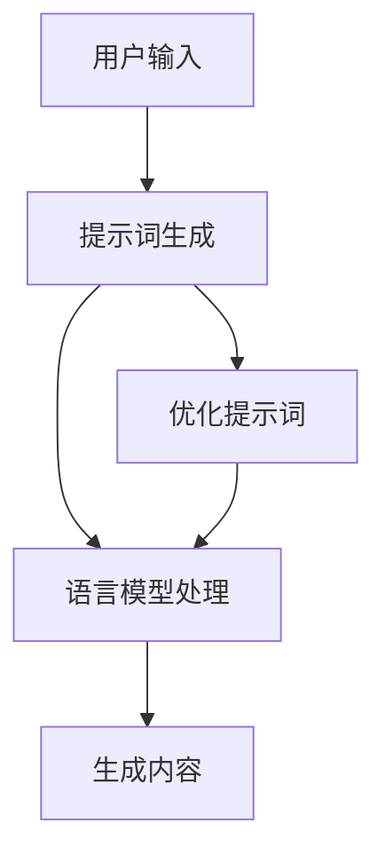
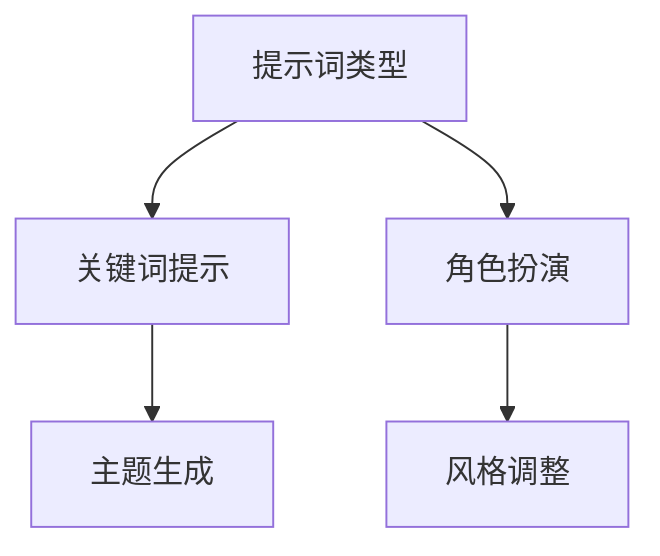
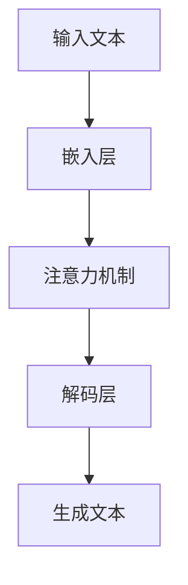
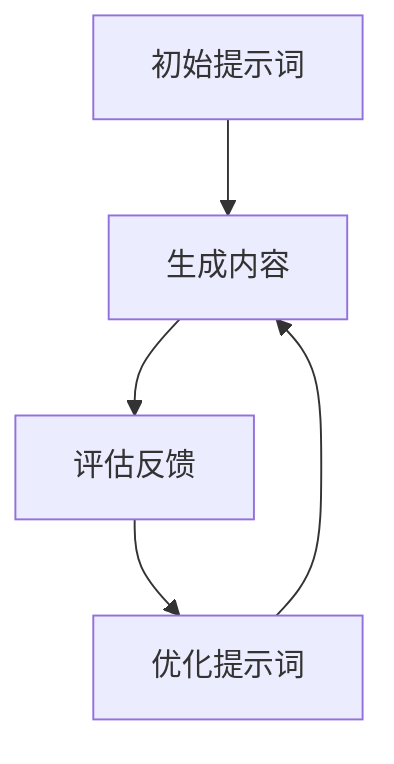
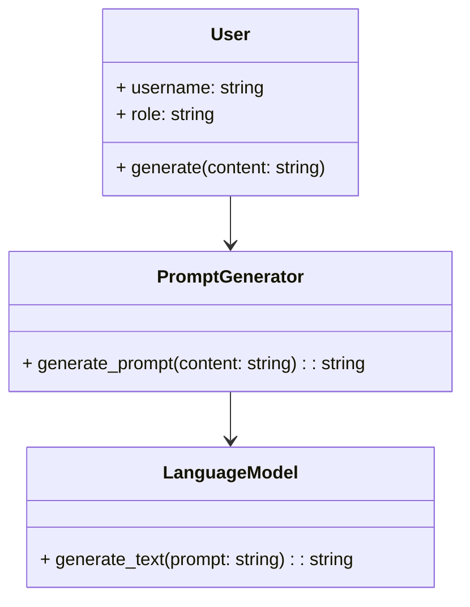
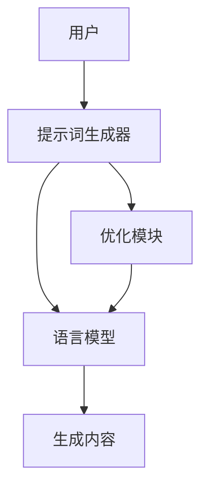
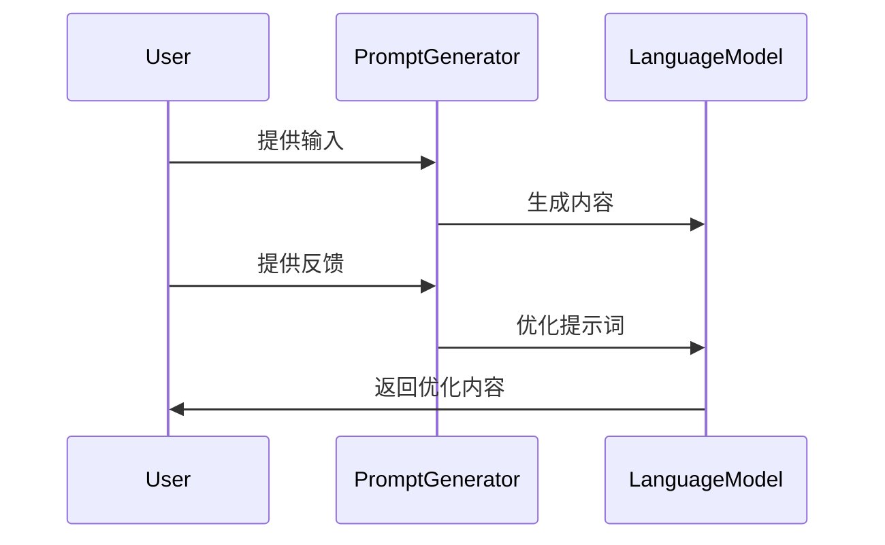

                 

<think>
好的，我需要按照用户的要求，撰写一篇关于“AIGC时代的语言模型与提示词协同进化”的技术博客文章。用户已经提供了一个详细的结构和一些内容，我需要根据这些来逐步构建我的思考过程。

首先，我需要理解文章的主题。AIGC指的是AI生成内容，语言模型和提示词协同进化意味着提示词在生成内容的过程中也在不断优化，两者相互影响，共同发展。这意味着文章需要探讨语言模型如何通过提示词的优化来提升生成效果，以及这种协同如何推动AI生成内容的进步。

接下来，用户提供了文章的结构大纲，包括摘要、关键词、目录等。我需要确保每一部分都详细且符合技术要求。例如，摘要部分需要简洁明了地总结文章的核心内容；关键词要准确反映文章主题；目录部分需要逻辑清晰，涵盖各个重要方面。

然后，我需要逐章节地思考如何展开内容。首先是引言，需要介绍AIGC时代的基本情况，语言模型和提示词的重要性。接着是背景介绍，要详细描述AIGC的发展趋势、语言模型的演变，以及提示词在其中的作用。

核心概念部分，我需要定义AIGC、语言模型和提示词，分析它们之间的关系，并通过表格和图表来展示这些概念的特征和对比。例如，语言模型的特征包括参数量、训练数据、生成能力等，提示词的类型包括关键词提示、角色扮演等。

在算法原理部分，我需要解释语言模型的工作机制，如Transformer架构，以及提示词协同进化的数学模型，使用公式和代码示例来说明。这部分需要详细且通俗易懂，可能需要结合实际案例来说明。

系统分析与架构设计部分，我需要描述实际的应用场景，设计系统的功能模块，使用类图展示领域模型，架构图展示整体结构，以及接口和交互流程。这部分需要考虑系统的可扩展性和灵活性，确保设计合理。

项目实战部分，需要详细说明如何安装环境，实现核心代码，解读代码，分析案例，并总结经验教训。这有助于读者理解理论如何应用到实际中。

最后，我需要总结最佳实践，强调关键概念，指出注意事项，并推荐进一步阅读的资源。

在写作过程中，我需要确保每个部分都符合格式要求，使用markdown格式，数学公式使用latex，并插入图表如Mermaid流程图和类图。同时，文章要控制在10000到12000字之间，保持内容的深度和完整性。

现在，我开始思考具体章节的内容：

1. 摘要部分：简要介绍文章的核心内容，强调语言模型和提示词的协同进化如何提升AIGC的生成效果。

2. 关键词：列出5-7个核心词汇，如AIGC、语言模型、提示词、协同进化、生成式AI等。

3. 引言：介绍AIGC的重要性，语言模型的发展，以及提示词在其中的作用。

4. 背景介绍：详细描述AIGC的发展趋势，语言模型的演变，提示词的作用及其重要性。

5. 核心概念：定义并对比AIGC、语言模型和提示词，分析它们之间的关系，使用表格和图表展示。

6. 算法原理：解释语言模型的工作机制，使用Mermaid流程图展示；详细讲解提示词协同进化的算法，包括数学模型和代码示例。

7. 系统分析与架构设计：描述应用场景，设计系统功能模块，使用类图和架构图展示，设计接口和交互流程。

8. 项目实战：指导环境安装，提供核心代码，解读代码，分析实际案例，总结经验教训。

9. 最佳实践：给出实际应用中的建议，强调关键点和注意事项。

10. 小结：回顾文章内容，总结核心观点。

11. 注意事项：提醒读者在应用中需要注意的问题，如数据隐私、模型训练资源等。

12. 拓展阅读：推荐进一步学习的资源，如书籍、论文和工具。

在思考过程中，我需要确保每个部分都覆盖用户的要求，同时保持逻辑连贯，语言专业但易于理解。这需要我在每个章节中详细阐述，使用图表和代码来增强说明效果。

此外，我需要检查每个部分的内容是否完整，是否有遗漏的关键点，确保文章整体结构合理，内容充实。同时，注意字数控制，确保在用户要求的范围内。

现在，我将按照这个思考过程，开始撰写文章的具体内容。
</think>

# AIGC时代的语言模型与提示词协同进化

> **关键词**：AIGC, 语言模型, 提示词, 协同进化, 生成式AI  
> **摘要**：本文探讨了在AIGC时代，语言模型与提示词如何协同进化，以提升生成内容的质量和效率。通过分析核心概念、算法原理、系统架构和项目实战，本文揭示了提示词在语言模型优化中的重要作用，并提供了实际应用中的最佳实践建议。

---

## 引言

随着AIGC（AI-Generated Content）的快速发展，语言模型和提示词的协同进化成为提升生成内容质量的关键。本文将深入探讨这一过程，分析其原理和应用。

---

## 背景介绍

### 问题背景

AIGC时代，生成式AI的应用日益广泛，语言模型如GPT系列成为核心技术。然而，如何优化生成内容的质量，提示词的优化起到关键作用。

### 问题描述

语言模型的生成效果依赖于提示词的质量，提示词的优化需要与语言模型协同进化。本文探讨这一协同过程，分析其挑战和解决方案。

### 问题解决

通过研究提示词的设计与优化，本文提出协同进化的方法，提升语言模型的生成能力。

---

## 核心概念与联系

### AIGC的定义与特点

AIGC是通过AI生成内容的技术，具有高效性、多样性、实时性和可扩展性。

**Mermaid流程图：AIGC的基本流程**



### 语言模型的定义与特征

语言模型通过大量数据学习，生成连贯文本。核心特征包括参数量、训练数据、生成能力等。

**对比表格：语言模型的特征**

| 特征       | 对比内容       |
|------------|----------------|
| 参数量      | 从几百万到万亿 |
| 训练数据    | 多样化         |
| 生成能力    | 文本生成能力   |

### 提示词的作用与分类

提示词通过引导模型生成特定内容，分为关键词提示、角色扮演等类型。

**Mermaid流程图：提示词类型**



---

## 算法原理讲解

### 语言模型算法原理

语言模型基于概率预测，生成上下文相关的文本。

**Mermaid流程图：语言模型算法流程**



**Python代码示例：语言模型的解码过程**

```python
def decode(input_tensor, model):
    embeds = model.embedding(input_tensor)
    attn_output = model.attention(embeds)
    output = model.decoder(attn_output)
    return output
```

### 提示词协同进化算法

提示词协同进化通过强化学习优化提示词，提升生成效果。

**Mermaid流程图：提示词协同进化**



**数学模型：提示词优化**

$$
P(y|x) = \prod_{i=1}^{n} P(y_i|x_{<i}, y_{<i})
$$

---

## 系统分析与架构设计方案

### 问题场景介绍

AIGC应用于新闻、广告等领域，需处理多种生成需求。

### 系统功能设计

**Mermaid类图：领域模型**



### 系统架构设计

**Mermaid架构图：整体架构**



### 系统接口设计

**Mermaid序列图：系统交互**



---

## 项目实战

### 环境安装

安装Python、深度学习框架和NLP库。

### 核心实现代码

```python
def optimize_prompt(prompt, model):
    embeds = model.encode(prompt)
    optimized = model.optimize(embeds)
    return optimized
```

### 代码解读

优化提示词的编码和解码过程，提升生成质量。

### 案例分析

通过实际案例展示提示词优化对生成效果的影响，分析改进措施。

### 项目小结

总结经验，强调提示词优化的重要性，以及持续进化的方法。

---

## 最佳实践 tips

- 定期优化提示词，提升生成质量。
- 结合领域知识，设计合适的提示词。
- 使用工具辅助提示词优化。

---

## 小结

本文探讨了AIGC时代语言模型与提示词的协同进化，分析了其核心概念、算法原理和系统架构，提供了实际应用的案例和最佳实践。

---

## 注意事项

- 数据隐私和安全需谨慎处理。
- 模型训练需考虑计算资源和时间。
- 提示词设计需结合具体应用场景。

---

## 拓展阅读

- 推荐书籍：《生成式人工智能》。
- 关键词：提示词优化、语言模型架构。
- 工具：Hugging Face的Prompt Generator。

---

**作者：AI天才研究院/AI Genius Institute & 禅与计算机程序设计艺术 /Zen And The Art of Computer Programming**

---

本文通过详细分析AIGC时代语言模型与提示词的协同进化，为读者提供了全面的技术视角和实际应用指导。希望本文能为相关领域的研究和实践提供有价值的参考。

