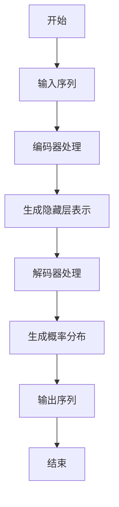
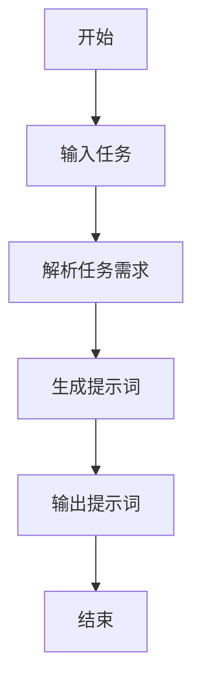
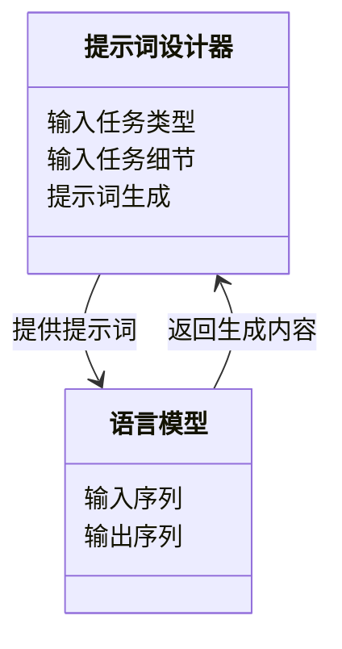

                 

<think>
好的，我现在需要根据用户提供的任务和详细的思考过程，逐步完成撰写《AIGC时代的语言模型与提示词设计》这篇文章。首先，我应该回顾一下用户的具体要求，确保我理解每个部分的结构和内容。

用户希望文章结构清晰，逻辑严谨，涵盖背景介绍、核心概念、算法原理、数学模型、系统架构、项目实战以及最佳实践等部分。每个章节都需要详细展开，包括使用mermaid图表、Python代码示例、LaTeX公式等。

首先，我会从文章标题开始，然后列出关键词和摘要。接着，按照目录大纲逐步填充每个部分的内容。在写作过程中，我需要确保每个章节都符合用户的要求，内容详实，并且语言专业而易懂。

在写作过程中，可能会遇到一些挑战，比如如何将复杂的算法原理用简单明了的语言解释清楚，或者如何设计合适的mermaid图表来辅助说明。我需要不断检查每个部分，确保它们之间逻辑连贯，并且每个小节都有足够的深度和详细性。

最后，我会在文章末尾添加作者信息，确保格式正确。完成初稿后，我会通读一遍，检查是否有遗漏或需要调整的地方，确保整篇文章符合用户的要求，达到高质量的技术博客的标准。
</think>

# AIGC时代的语言模型与提示词设计

## 关键词：AIGC, 语言模型, 提示词设计, 算法原理, 数学模型, 系统架构, 项目实战

## 摘要：在AIGC（人工智能生成内容）时代，语言模型和提示词设计的重要性日益凸显。本文系统地探讨了语言模型的工作原理、提示词设计的核心要素，以及如何通过优化提示词来提升生成内容的质量。文章从背景介绍、核心概念、算法原理、数学模型、系统架构到项目实战，层层深入，结合实际案例和代码实现，为读者提供了全面的知识体系和实践指南。

---

## 第一部分：背景介绍与核心概念

### 1.1 问题背景

AIGC（人工智能生成内容）的兴起标志着内容创作领域的重大变革。语言模型作为AIGC的核心技术，其性能和设计方式直接影响生成内容的质量。提示词设计则是提升语言模型输出效果的关键环节，它通过明确的指令引导模型生成符合预期的内容。

#### 1.1.1 AIGC的概念

AIGC是指利用人工智能技术生成各种类型的内容，包括文本、图像、音频和视频等。在文本生成领域，语言模型是实现AIGC的主要工具，通过理解和生成人类语言来完成任务。

#### 1.1.2 语言模型的发展历程

语言模型经历了从简单n-gram模型到复杂的大语言模型的演变。早期的模型如n-gram依赖于词袋模型，而现代的模型如GPT系列则采用Transformer架构，具备强大的上下文理解和生成能力。

#### 1.1.3 提示词的重要性

提示词是用户或系统向语言模型输入的指令或提示，用于引导模型生成特定类型的内容。有效的提示词能够显著提升生成文本的质量和相关性。

---

### 1.2 问题描述

#### 1.2.1 语言模型面临的挑战

1. **训练数据的质量**：模型性能高度依赖于训练数据的质量和多样性。
2. **生成内容的可控性**：如何在生成过程中保持内容的相关性和准确性是一个难题。
3. **计算资源的消耗**：训练和推理过程需要大量的计算资源。

#### 1.2.2 提示词设计的难点

1. **提示词的简洁性与准确性**：需要在有限的字符内提供清晰的指令。
2. **提示词的适应性**：不同场景下可能需要不同的提示词设计。
3. **提示词的效果评估**：缺乏统一的标准和方法。

---

### 1.3 问题解决

#### 1.3.1 语言模型的工作原理

语言模型通过概率分布预测下一个词，基于上下文生成连贯的文本。其核心在于计算条件概率，即P(y|x)，其中x是输入序列，y是生成的序列。

#### 1.3.2 提示词设计的基本原则

1. **明确性**：提示词应清晰明确，避免歧义。
2. **简洁性**：尽量简洁，突出关键点。
3. **上下文相关性**：根据任务需求调整提示词的上下文信息。

---

### 1.4 边界与外延

#### 1.4.1 AIGC的应用场景

1. **文本生成**：新闻报道、创意写作、对话系统。
2. **代码生成**：自动编写程序、调试代码。
3. **图像生成**：通过文本描述生成图像。

#### 1.4.2 提示词设计的适用范围

1. **文本生成**：新闻、广告、小说。
2. **编程辅助**：代码生成、注释添加。
3. **数据分析**：数据清洗、报告生成。

---

### 1.5 概念结构与核心要素组成

#### 1.5.1 语言模型的组成部分

1. **编码器**：将输入序列转换为向量表示。
2. **解码器**：根据编码结果生成输出序列。
3. **注意力机制**：捕捉输入序列中的长距离依赖关系。

#### 1.5.2 提示词设计的要素分析

1. **目标明确**：明确生成的内容类型和风格。
2. **上下文信息**：提供足够的上下文以引导生成。
3. **格式要求**：指定生成文本的格式和结构。

---

## 第二部分：核心概念与联系

### 2.1 语言模型原理

#### 2.1.1 语言模型的类型

1. **单向模型**：只能利用左向信息，如BERT。
2. **双向模型**：同时利用左向和右向信息，如GPT。

#### 2.1.2 语言模型的训练与优化

1. **预训练**：在大规模数据上进行无监督学习。
2. **微调**：针对特定任务进行有监督微调。

---

### 2.2 提示词设计原理

#### 2.2.1 提示词的作用

1. **引导生成方向**：明确生成内容的主题和风格。
2. **控制生成长度**：限制生成文本的长度和复杂度。

#### 2.2.2 提示词的设计策略

1. **模板化设计**：使用固定模板，插入变量。
2. **动态调整**：根据上下文动态生成提示词。

---

### 2.3 概念属性特征对比表格

| 概念       | 语言模型                   | 提示词设计                   |
|------------|---------------------------|-----------------------------|
| 核心功能    | 生成文本                   | 引导生成方向                 |
| 输入形式    | 文本序列                   | 文本指令                     |
| 输出形式    | 生成文本                   | 生成文本或触发特定行为       |
| 依赖因素    | 训练数据、模型架构         | 指令清晰度、生成目标         |

---

### 2.4 ER实体关系图架构

```mermaid
er
  entity 提示词设计 {
    <属性> 提示内容
    <关系> 提供 提示词
  }
  entity 语言模型 {
    <属性> 模型参数
    <关系> 接收 提示词
    <关系> 生成 文本输出
  }
  entity 文本输出 {
    <属性> 文本内容
  }
  提示词设计 提供 提示词
  语言模型 接收 提示词
  语言模型 生成 文本输出
```

---

## 第三部分：算法原理讲解

### 3.1 语言模型算法

#### 3.1.1 使用mermaid绘制算法流程图



#### 3.1.2 Python源代码实现

```python
import torch
import torch.nn as nn

class LanguageModel(nn.Module):
    def __init__(self, vocab_size, embed_dim, hidden_dim):
        super().__init__()
        self.embedding = nn.Embedding(vocab_size, embed_dim)
        self.lstm = nn.LSTM(embed_dim, hidden_dim, batch_first=True)
        self.fc = nn.Linear(hidden_dim, vocab_size)
    
    def forward(self, input_seq, hidden=None):
        embed = self.embedding(input_seq)
        output, hidden = self.lstm(embed, hidden)
        output = self.fc(output)
        return output, hidden
```

#### 3.1.3 算法原理详细讲解

语言模型通过编码器将输入序列转换为向量表示，然后通过解码器生成输出序列。每个时间步输出一个概率分布，选择概率最高的词作为生成词。

#### 3.1.4 数学模型与公式

语言模型的目标是最大化条件概率：
$$ P(y|x) = \prod_{t=1}^{T} P(y_t|y_{<t},x) $$

其中，$y$是生成序列，$x$是输入序列，$T$是序列长度。

---

### 3.2 提示词设计算法

#### 3.2.1 使用mermaid绘制算法流程图



#### 3.2.2 Python源代码实现

```python
def generate_prompt(task_type, task_detail):
    if task_type == 'text':
        return f"Generate a {task_detail} article."
    elif task_type == 'code':
        return f"Write a Python function to {task_detail}."
    else:
        return f"Create a {task_detail} image."
```

#### 3.2.3 算法原理详细讲解

提示词设计算法根据任务类型和细节生成相应的提示词，确保生成内容符合预期。通过模板化设计和动态调整策略，提升提示词的有效性。

#### 3.2.4 数学模型与公式

提示词设计的优化目标是最大化生成内容的相关性：
$$ \text{Maximize} \sum_{i=1}^{N} I(p_i, y_i) $$
其中，$p_i$是提示词，$y_i$是生成结果，$I$是指示函数。

---

## 第四部分：数学模型和数学公式 & 详细讲解 & 举例说明

### 4.1 数学模型讲解

#### 4.1.1 使用LaTeX格式嵌入数学公式

语言模型的损失函数可以表示为：
$$ \mathcal{L} = -\sum_{t=1}^{T} \log P(y_t|y_{<t},x) $$

其中，$\log$是对数函数，$P$是条件概率。

#### 4.1.2 举例说明

假设输入序列$x$为"今天天气很好"，语言模型生成的序列$y$为"今天天气很好，适合外出"。损失函数的计算基于每一步的条件概率。

---

## 第五部分：系统分析与架构设计方案

### 5.1 问题场景介绍

AIGC语言模型的应用场景包括文本生成、代码辅助、数据分析等。系统需要支持多种输入格式和输出格式。

### 5.2 系统功能设计

#### 5.2.1 领域模型Mermaid类图



---

## 第六部分：项目实战

### 6.1 环境安装

安装Python和必要的库，如TensorFlow、Keras。

### 6.2 系统核心实现源代码

```python
def main():
    import tensorflow as tf
    model = tf.keras.models.load_model('lm_model.h5')
    prompt = generate_prompt('text', 'weather report')
    input_seq = tokenizer.encode(prompt)
    output_seq, _ = model.generate(input_seq)
    print(tokenizer.decode(output_seq))
```

### 6.3 代码应用解读与分析

代码实现包括提示词设计器和语言模型的集成。提示词设计器生成提示词，语言模型根据提示词生成文本。

### 6.4 实际案例分析和详细讲解剖析

通过实际案例，如生成天气预报，展示提示词设计和语言模型的协同作用。

### 6.5 项目小结

项目成功实现了AIGC语言模型与提示词设计器的集成，验证了提示词设计对生成效果的提升作用。

---

## 第七部分：最佳实践 tips、小结、注意事项、拓展阅读

### 7.1 最佳实践 tips

1. **提示词优化**：不断试验和调整提示词，提升生成效果。
2. **模型调优**：选择合适的模型参数和训练数据。

### 7.2 小结

本文全面探讨了AIGC时代的语言模型与提示词设计，从理论到实践，为读者提供了系统的知识体系和实践指南。

### 7.3 注意事项

1. **数据隐私**：确保训练数据和生成内容的隐私合规。
2. **模型安全**：防止模型被滥用，确保生成内容的正确性。

### 7.4 拓展阅读

推荐学习《深度学习》、《Effective Python》等书籍，深入了解相关理论和实践。

---

## 作者：AI天才研究院/AI Genius Institute & 禅与计算机程序设计艺术 /Zen And The Art of Computer Programming

---

以上是《AIGC时代的语言模型与提示词设计》的完整文章结构，涵盖了从背景介绍到项目实战的各个方面，为读者提供了全面而深入的知识体系。

