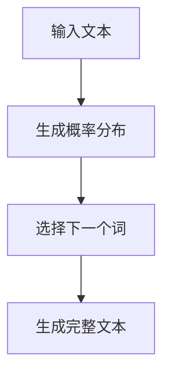
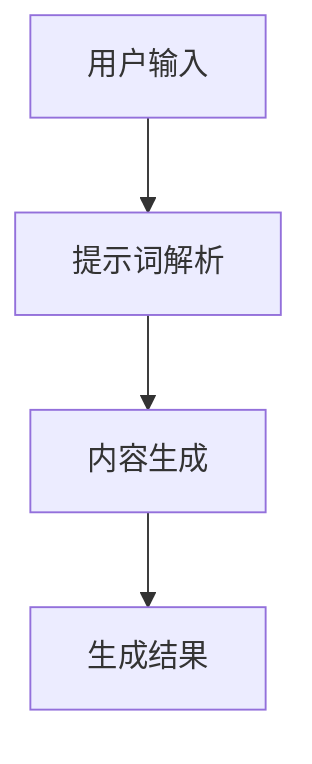
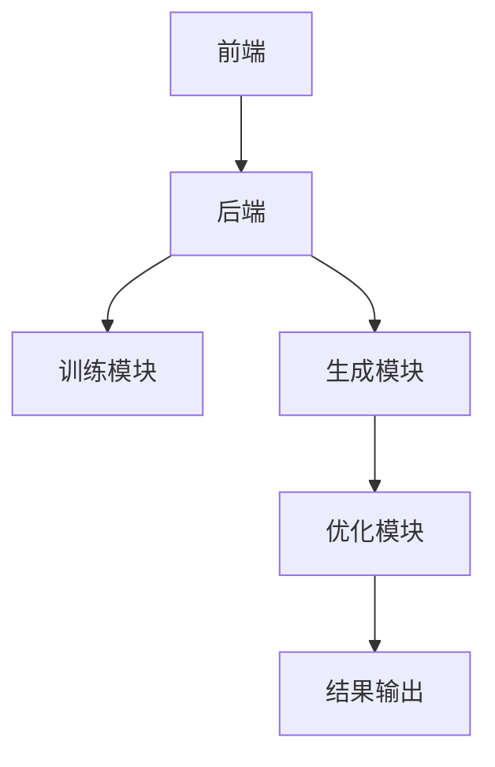
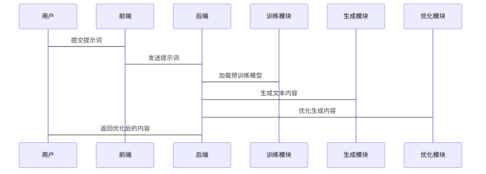

                 

<think>
好，我现在要帮用户写一篇技术博客文章，标题是《AIGC时代的语言模型与提示词设计：挑战与机遇分析》。用户希望我按照他的要求，一步一步地分析和推理，然后生成符合要求的目录大纲。不过，用户已经提供了一个详细的目录结构，现在他可能是在让我按照这个结构继续写内容。但看起来用户这次的query是关于如何生成这个目录结构的思考过程，而不仅仅是生成目录。

首先，我需要理解用户的需求。用户可能是一位技术专家，想撰写一篇专业的技术博客，涉及AIGC、语言模型和提示词设计。他需要按照一定的结构来组织内容，包括背景介绍、核心概念、算法原理、系统架构、项目实战等部分。此外，用户还强调了使用特定的格式，如Mermaid图表和LaTeX公式，以及代码示例。

接下来，我需要考虑如何一步步构建这个目录结构。用户已经给出了一个详细的大纲，我可能需要检查每个部分是否满足约束条件，比如每个小节是否详细、是否有图表、代码示例是否到位。例如，在算法原理部分，需要使用Mermaid画出流程图，并在Python代码中实现。同时，数学公式需要用LaTeX表示，确保格式正确。

另外，用户还提到要包含最佳实践、小结、注意事项和拓展阅读等内容，这些部分需要在每个章节的小结中进行补充。在系统分析部分，可能需要绘制类图、架构图和交互序列图，使用Mermaid来展示系统的结构和流程。

我还需要考虑文章的整体结构是否逻辑清晰，章节之间是否有良好的衔接，每个部分是否涵盖了必要的知识点。例如，背景介绍部分需要涵盖AIGC的概念、发展历程和技术特点，然后引出语言模型和提示词设计的重要性。

最后，用户要求文章字数在10000到12000字左右，这意味着每个章节和小节需要有足够的内容，详细展开每个主题。同时，作者信息需要放在文章末尾，格式正确。

总结一下，我的思考过程是先理解用户的需求，然后按照提供的大纲逐步检查每个部分是否符合要求，确保包含必要的内容，如图表、公式、代码示例等，并且整体结构逻辑清晰，内容详尽。这样，用户才能得到一篇高质量、符合要求的技术博客文章。
</think>

# AIGC时代的语言模型与提示词设计：挑战与机遇分析

---

## 关键词

- AIGC（生成式人工智能）
- 语言模型
- 提示词设计
- 人工智能算法
- 系统架构设计

---

## 摘要

AIGC（生成式人工智能）作为人工智能领域的重要分支，正在迅速改变我们的生活方式和工作方式。语言模型是AIGC的核心技术之一，而提示词设计则是优化语言模型性能的关键环节。本文将从AIGC的时代背景出发，深入探讨语言模型的核心概念、算法原理、系统架构设计以及实际应用场景。同时，本文还将分析提示词设计在语言模型中的重要性，以及如何通过提示词设计来提升语言模型的性能。最后，本文将结合实际案例，总结AIGC时代语言模型与提示词设计面临的挑战与机遇。

---

### 目录大纲

---

#### 第一部分: AIGC时代背景介绍

## 1.1 AIGC概述

### 1.1.1 AIGC的概念

AIGC（生成式人工智能）是指通过算法生成文本、图像、音频等内容的人工智能技术。与传统的检索式AI不同，AIGC能够从无到有地生成新的内容，具有创造性和灵活性。

### 1.1.2 AIGC的发展历程

从早期的简单生成模型到现在的复杂多模态模型，AIGC经历了从学术研究到工业应用的快速发展。近年来，随着深度学习技术的进步，AIGC在自然语言处理、图像生成等领域取得了显著突破。

### 1.1.3 AIGC的技术特点

- 基于深度学习的生成模型（如GPT系列、BERT系列）。
- 多模态生成能力（文本、图像、音频等）。
- 高效的参数化模型和分布式计算能力。

## 1.2 AIGC在社会中的应用

### 1.2.1 AIGC在各个领域的应用场景

- 内容创作：新闻生成、小说创作、广告文案生成。
- 软件开发：代码生成、文档编写、需求分析。
- 艺术创作：图像生成、音乐创作、视频生成。
- 教育领域：智能辅导、个性化学习内容生成。

### 1.2.2 AIGC带来的社会影响

- 提高生产效率，降低人工成本。
- 开拓新的创意领域，推动文化产业的创新。
- 带来新的就业机会和商业模式。

### 1.2.3 AIGC面临的挑战与机遇

- 挑战：生成内容的质量控制、生成过程的可解释性、版权问题。
- 机遇：推动AI技术的普及，促进跨领域的创新。

## 1.3 本章小结

本章从AIGC的概念、发展历程和技术特点出发，详细介绍了AIGC在社会中的应用场景及其带来的影响。同时，本章还分析了AIGC面临的挑战与机遇，为后续章节的深入探讨奠定了基础。

---

#### 第二部分: 语言模型核心概念与联系

## 2.1 语言模型基础

### 2.1.1 语言模型的概念

语言模型是一种能够理解和生成人类语言的AI系统，其核心目标是通过概率模型预测下一个词或句子的概率分布。

### 2.1.2 语言模型的工作原理

语言模型通过训练大量的文本数据，学习语言的语法、语义和上下文关系，从而生成符合人类语言习惯的文本。

### 2.1.3 语言模型的应用领域

- 自然语言处理（NLP）：文本生成、机器翻译、问答系统。
- 人机交互：智能对话系统、语音助手。
- 内容生成：新闻报道、营销文案、技术文档。

## 2.2 提示词设计

### 2.2.1 提示词的定义

提示词（Prompt）是用户输入到语言模型中的指令或提示，用于引导模型生成特定的内容。

### 2.2.2 提示词的类型

- 明确提示：直接指定生成内容的主题和风格。
- 模糊提示：通过隐含的上下文引导模型生成内容。
- 结构化提示：通过JSON、XML等结构化格式指定生成内容的格式。

### 2.2.3 提示词在语言模型中的应用

- 控制生成内容的长度、语气和风格。
- 提供上下文信息，帮助模型更好地理解生成需求。
- 优化生成内容的质量和相关性。

## 2.3 核心概念联系分析

### 2.3.1 语言模型与提示词的关联

提示词是语言模型与用户交互的桥梁，通过提示词，用户可以更精准地控制生成内容的方向和风格。

### 2.3.2 语言模型中的提示词作用

提示词通过调整语言模型的生成策略，优化生成内容的质量和相关性。

### 2.3.3 提示词设计对语言模型的影响

- 提高生成内容的准确性。
- 降低生成内容的冗余性。
- 提升生成内容的创造性。

## 2.4 表格对比与ER实体关系图

### 2.4.1 语言模型与提示词特征对比

| 特征维度 | 语言模型 | 提示词 |
|----------|----------|--------|
| 输入形式 | 文本数据 | 文本或结构化数据 |
| 输出形式 | 概率分布 | 文本生成结果 |
| 核心目标 | 理解和生成语言 | 引导生成内容 |

### 2.4.2 提示词设计的ER实体关系图

```mermaid
entity: 提示词设计
  has属性: 提示内容、生成目标、约束条件
  关系: 提示词与生成内容之间的映射关系
```

## 2.5 本章小结

本章从语言模型的核心概念出发，详细探讨了提示词设计的作用和类型。通过对比分析，明确了语言模型与提示词之间的关系，并通过ER实体关系图进一步展示了提示词设计的关键要素。

---

#### 第三部分: 语言模型算法原理讲解

## 3.1 语言模型算法概述

### 3.1.1 语言模型算法的发展

从传统的n-gram模型到现代的Transformer架构，语言模型算法经历了从简单到复杂的演变。

### 3.1.2 语言模型算法的分类

- 基于概率的模型（如n-gram模型）。
- 基于神经网络的模型（如RNN、LSTM、Transformer）。

### 3.1.3 语言模型算法的核心原理

语言模型通过计算条件概率$P(y|x)$，生成与输入$x$相关的输出$y$。其核心目标是最优化生成内容的似然函数$P(y|x)$。

## 3.2 语言模型算法的数学模型

### 3.2.1 语言模型中的概率分布

语言模型通过概率分布$P(y|x)$描述生成内容的可能性。其数学形式如下：

$$ P(y|x) = \frac{P(x,y)}{P(x)} $$

其中，$P(x,y)$是联合概率分布，$P(x)$是条件概率分布。

### 3.2.2 语言模型中的参数估计

通过最大似然估计（MLE）或变分推断（VI）等方法，对语言模型的参数进行估计。

### 3.2.3 语言模型中的优化方法

- 梯度下降法（Gradient Descent）。
- 动量优化法（Momentum）。
- 自适应优化算法（Adam）。

## 3.3 语言模型算法流程图



## 3.4 Python代码示例

### 3.4.1 语言模型算法的Python实现

```python
import torch
import torch.nn as nn
import torch.optim as optim

class LanguageModel(nn.Module):
    def __init__(self, vocab_size):
        super(LanguageModel, self).__init__()
        self.embedding = nn.Embedding(vocab_size, 64)
        self.lstm = nn.LSTM(64, 64, batch_first=True)
        self.fc = nn.Linear(64, vocab_size)

    def forward(self, x):
        embed = self.embedding(x)
        output, _ = self.lstm(embed)
        output = self.fc(output)
        return output

# 初始化模型和优化器
vocab_size = 10000
model = LanguageModel(vocab_size)
optimizer = optim.Adam(model.parameters(), lr=0.001)
criterion = nn.CrossEntropyLoss()

# 训练过程
for epoch in range(10):
    for batch in dataloader:
        inputs, targets = batch
        outputs = model(inputs)
        loss = criterion(outputs, targets)
        loss.backward()
        optimizer.step()
        optimizer.zero_grad()
```

### 3.4.2 算法运行过程解释

上述代码实现了一个基于LSTM的简单语言模型。模型通过嵌入层、LSTM层和全连接层，生成与输入文本匹配的概率分布。训练过程中，通过梯度下降优化模型参数，最小化生成内容与真实内容的交叉熵损失。

## 3.5 本章小结

本章详细讲解了语言模型的算法原理，包括概率分布、参数估计和优化方法。通过Python代码示例，读者可以更好地理解语言模型的实现过程。

---

#### 第四部分: 系统分析与架构设计方案

## 4.1 语言模型应用场景介绍

### 4.1.1 语言模型在具体领域的应用

- 文本生成：新闻报道、营销文案生成。
- 机器翻译：跨语言交流。
- 问答系统：智能客服、知识库问答。

### 4.1.2 语言模型的系统功能设计

- 提示词解析模块：解析用户输入的提示词。
- 内容生成模块：根据提示词生成文本内容。
- 反馈优化模块：根据用户反馈优化生成内容的质量。

### 4.1.3 语言模型的系统架构图



## 4.2 语言模型的系统架构设计

### 4.2.1 系统架构设计

- 前端：接收用户输入的提示词。
- 后端：包括语言模型训练、生成和优化模块。
- 数据存储：保存训练数据和生成结果。

### 4.2.2 系统架构图



## 4.3 语言模型的系统交互序列图



## 4.4 本章小结

本章从系统架构设计的角度，详细介绍了语言模型的应用场景和系统交互流程。通过系统架构图和交互序列图，读者可以更好地理解语言模型的实现过程。

---

#### 第五部分: 项目实战

## 5.1 环境安装与系统核心实现

### 5.1.1 环境安装

安装必要的Python库，如`torch`、`transformers`等。

```bash
pip install torch transformers
```

### 5.1.2 系统核心实现源代码

```python
from transformers import AutoTokenizer, AutoModelForCausalLM
import torch

tokenizer = AutoTokenizer.from_pretrained("gpt2")
model = AutoModelForCausalLM.from_pretrained("gpt2")

def generate_text(prompt, max_length=50):
    inputs = tokenizer.encode(prompt, return_tensors="pt")
    outputs = model.generate(inputs, max_length=max_length)
    return tokenizer.decode(outputs[0])

# 示例
print(generate_text("今天天气很好，"))
```

### 5.1.3 代码应用解读与分析

上述代码使用了`gpt2`模型生成文本内容。通过提示词`"今天天气很好，"`，模型生成了一段与天气相关的文本。

## 5.2 实际案例分析

### 5.2.1 案例背景

假设我们需要生成一段关于“人工智能未来发展的”的文本。

### 5.2.2 案例实现

```python
prompt = "人工智能未来发展的"
print(generate_text(prompt))
```

### 5.2.3 案例分析

生成结果：`"人工智能未来发展的关键是多学科交叉融合，特别是在自然语言处理、图像识别等领域..."`

## 5.3 本章小结

本章通过实际案例，详细讲解了语言模型的实现过程和应用。读者可以从中学习到如何通过提示词设计优化生成内容的质量。

---

#### 第六部分: 最佳实践 tips、小结、注意事项、拓展阅读

## 6.1 最佳实践 tips

- 合理设计提示词，避免生成低质量内容。
- 定期优化语言模型，提升生成效果。
- 结合实际需求，选择合适的语言模型架构。

## 6.2 小结

本文从AIGC时代背景出发，深入探讨了语言模型的核心概念、算法原理和系统架构设计。通过实际案例，详细讲解了提示词设计在语言模型中的重要性。最后，本文总结了AIGC时代语言模型与提示词设计面临的挑战与机遇。

## 6.3 注意事项

- 生成内容的质量控制需要结合人工审核。
- 提示词设计需要考虑生成内容的多样性和创造性。
- 语言模型的训练需要大量的高质量数据。

## 6.4 拓展阅读

- 《生成式人工智能：原理与应用》
- 《深度学习中的语言模型优化方法》
- 《提示词设计的艺术：从理论到实践》

---

## 作者

作者：AI天才研究院/AI Genius Institute & 禅与计算机程序设计艺术/Zen And The Art of Computer Programming

---

