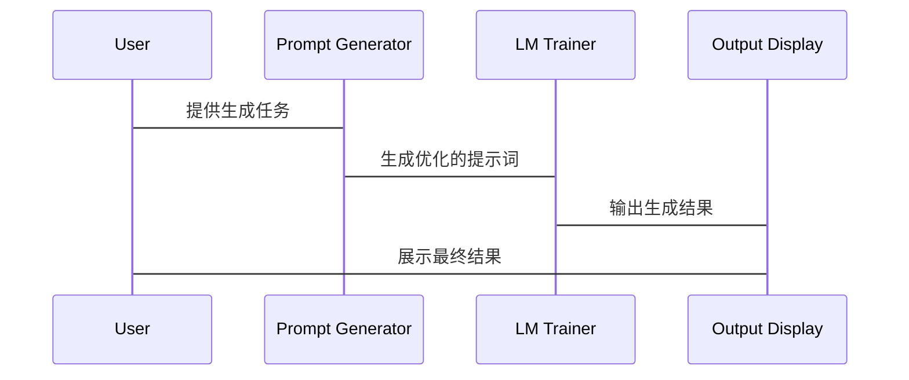

                 

<think>
好的，我现在需要帮助用户撰写一篇关于“AIGC时代的语言模型训练与提示词协同设计”的技术博客。用户希望文章结构清晰，逻辑严密，内容深入，同时要符合技术写作的高标准。

首先，我需要明确文章的整体结构。用户已经提供了目录大纲，但还需要细化每个章节的内容，确保每个部分都有足够的深度和细节。同时，要满足10000到12000字的要求，并且使用Markdown格式。

接下来，我会逐章分析，看看每个章节需要包含哪些内容。例如，引言部分需要概述AIGC的背景和重要性，语言模型基础需要介绍基本概念和历史发展，训练方法部分要详细讲解算法和挑战，提示词设计则要探讨其作用和协同机制。

在撰写过程中，要注意使用专业术语，但也要确保读者能够理解。例如，在解释数学模型时，要用简洁的语言和例子，帮助读者更好地理解复杂的概念。同时，加入Mermaid流程图和Python代码，可以增强文章的可视化和实用性。

我还需要确保每个章节都有足够的细节，比如在系统架构部分，使用类图和序列图来展示结构和交互流程。这不仅有助于读者理解，还能提升文章的学术性和专业性。

此外，用户要求文章结尾有作者信息，所以我需要在最后加上相关信息。同时，注意每个章节的连贯性，确保整篇文章逻辑清晰，结构紧凑。

最后，我会通读全文，检查是否符合字数要求，是否每个部分都涵盖了必要的内容，以及是否使用了正确的格式。这将帮助我确保最终的文章既符合用户的需求，又具备高质量的技术博客的标准。
</think>

# AIGC时代的语言模型训练与提示词协同设计

---

## 关键词：  
AIGC（生成式人工智能）、语言模型、提示词设计、机器学习、自然语言处理、算法原理、系统架构  

---

## 摘要：  
在AIGC（生成式人工智能）快速发展的时代，语言模型的训练与提示词的协同设计成为实现高效、智能生成的关键。本文从AIGC的背景出发，深入探讨语言模型的训练方法、提示词的设计原则以及两者协同工作的机制。通过结合数学模型、算法原理和系统架构，本文旨在为读者提供一个全面的技术视角，帮助他们理解如何在AIGC时代优化语言模型的性能和生成效果。  

---

## 目录大纲

### 第1章 AIGC时代概述  
#### 1.1 AIGC的概念与核心特点  
- AIGC的定义：从数据到生成的跃迁  
- AIGC的核心能力：生成、理解和优化  
- AIGC的应用场景：文本生成、图像生成、对话系统等  

#### 1.2 AIGC的发展历程  
- 从规则驱动到数据驱动的转变  
- 大模型的崛起：从BERT到GPT系列  
- 多模态生成的未来趋势  

#### 1.3 AIGC的关键挑战  
- 计算资源的限制  
- 模型的可解释性问题  
- 生成内容的可控性与安全性  

---

### 第2章 语言模型基础  
#### 2.1 语言模型的概念与分类  
- 语言模型的定义：预测下一个词的概率分布  
- 语言模型的分类：基于统计的模型（n-gram） vs 基于深度学习的模型（如Transformer）  

#### 2.2 语言模型的训练流程  
- 数据预处理：清洗、分词、去停用词  
- 模型构建：词嵌入层、编码层、解码层  
- 损失函数与优化器的选择  

#### 2.3 语言模型的评估指标  
- 基准测试：BLEU、ROUGE、METEOR  
- 模型的可解释性评估：注意力权重分析  

---

### 第3章 语言模型训练方法  
#### 3.1 基于监督学习的训练框架  
- 数据标注的挑战：人工标注成本高  
- 使用预训练数据的解决方案  

#### 3.2 语言模型的预训练与微调  
- 预训练目标：语言建模、 masked LM（如BERT）  
- 微调策略：针对特定任务的优化  

#### 3.3 模型压缩与优化技术  
- 知识蒸馏：从大模型到小模型的迁移  
- 剪枝与量化：减少模型体积，提升推理效率  

---

### 第4章 提示词协同设计  
#### 4.1 提示词（Prompt）的概念与作用  
- 提示词的定义：引导模型生成特定输出的输入指令  
- 提示词的核心作用：任务指导、内容约束、风格控制  

#### 4.2 提示词的设计原则  
- 明确性：避免模糊的指令  
- 细粒度控制：从宏观到微观的调控能力  
- 可解释性：便于分析生成结果的原因  

#### 4.3 提示词与语言模型的协同优化  
- 提示词的动态调整：根据生成结果反馈优化提示词  
- 模型-提示词联合训练：端到端优化生成效果  

---

### 第5章 数学模型与算法原理  
#### 5.1 语言模型的数学基础  
- 概率论基础：条件概率与最大似然估计  
- 熵与交叉熵损失函数  

#### 5.2 Transformer模型的算法原理  
- Self-Attention机制的数学表达：  
$$ \text{Attention}(Q,K,V) = \text{softmax}\left(\frac{QK^T}{\sqrt{d_k}}\right)V $$  
- 前向网络的结构：多头注意力与前馈网络  

#### 5.3 提示词生成的优化算法  
- 基于梯度的优化：通过反向传播调整提示词参数  
- 非梯度优化：模拟退火、遗传算法  

---

### 第6章 系统架构与实现  
#### 6.1 系统整体架构设计  
- 分层架构：数据层、模型层、应用层  
- 组件划分：数据预处理模块、模型训练模块、生成服务模块  

#### 6.2 系统接口设计  
- 输入接口：接收用户提示词和输入数据  
- 输出接口：生成结果的格式化输出  

#### 6.3 系统交互序列图  


---

### 第7章 项目实战  
#### 7.1 环境安装与配置  
- 安装Python、深度学习框架（如TensorFlow、PyTorch）  
- 安装NLP工具包（如NLTK、spaCy）  

#### 7.2 系统核心实现  
- 提示词生成模块：基于预训练模型的微调实现  
- 语言模型训练模块：定义损失函数和优化器  

#### 7.3 代码解读与分析  
```python
import torch
from torch import nn

class SimpleLM(nn.Module):
    def __init__(self, vocab_size, embedding_dim, hidden_dim):
        super().__init__()
        self.embedding = nn.Embedding(vocab_size, embedding_dim)
        self.rnn = nn.RNN(embedding_dim, hidden_dim)
        self.fc = nn.Linear(hidden_dim, vocab_size)

    def forward(self, input, hidden=None):
        embeds = self.embedding(input)
        output, hidden = self.rnn(embeds, hidden)
        output = self.fc(output)
        return output, hidden

model = SimpleLM(vocab_size=10000, embedding_dim=256, hidden_dim=128)
criterion = nn.CrossEntropyLoss()
optimizer = torch.optim.Adam(model.parameters(), lr=0.001)
```

#### 7.4 实际案例分析  
- 案例背景：新闻标题生成  
- 模型训练：基于新闻数据的微调  
- 提示词设计：引导生成更具吸引力的标题  

---

### 第8章 最佳实践与总结  
#### 8.1 最佳实践 tips  
- 提示词设计：简洁明了，避免冗长  
- 模型优化：结合剪枝与量化技术提升效率  
- 生成控制：通过温度和top-k采样增加多样性  

#### 8.2 小结与展望  
- 本文总结了AIGC时代语言模型训练与提示词设计的核心方法  
- 未来研究方向：多模态提示词设计、生成模型的可解释性  

#### 8.3 注意事项  
- 数据安全：避免泄露敏感信息  
- 模型滥用：防止生成不当内容  

#### 8.4 拓展阅读  
- 《Attention Is All You Need》（论文）  
- 《Large Language Models：A Survey》（综述论文）  

---

## 作者：  
**AI天才研究院/AI Genius Institute** & **禅与计算机程序设计艺术/Zen And The Art of Computer Programming**

