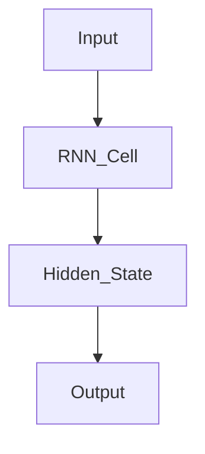
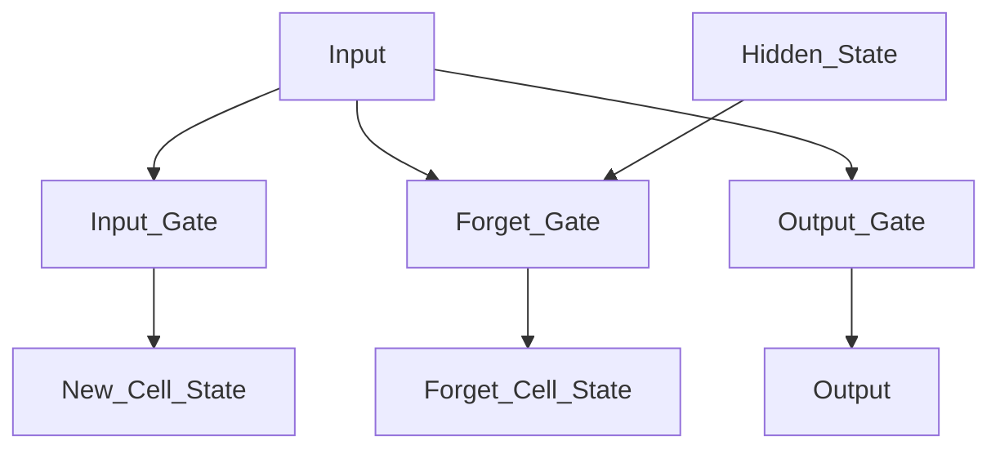
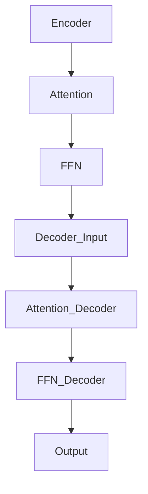
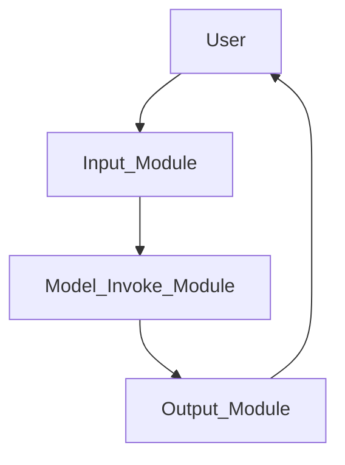

                 

<think>
嗯，我现在要写一篇关于《AIGC时代的语言模型训练与提示词设计》的技术博客文章。首先，我得明确文章的结构和各个部分的内容。文章需要包含引言、核心概念、理论基础、高级主题、实践指导、案例研究、结论以及资源等部分。

在引言部分，我需要介绍AIGC的背景，它如何影响语言模型的训练和提示词设计。这部分需要让读者了解为什么AIGC这么重要，以及它对语言模型的影响。

接下来是核心概念，包括AIGC的定义，语言模型的基本类型，比如RNN、LSTM、Transformer等，还有训练流程和数据预处理。这部分需要简明扼要，但又要涵盖关键点。

然后是数学模型和算法原理，这部分需要详细讲解语言模型的数学基础，比如概率论和信息论，以及具体的算法如RNN和Transformer的结构。可能需要画一些Mermaid图来展示这些模型。

高级主题部分要深入探讨训练技巧，比如迁移学习、数据增强，还要讨论模型优化策略，比如超参数调优和模型压缩。这部分可能还需要比较不同语言模型的优缺点。

实践指导部分需要分步骤讲解如何训练语言模型，提示词设计的最佳实践，以及系统的架构和接口设计。这部分可能需要结合实际案例，给出代码示例，帮助读者更好地理解。

案例研究部分要分析真实的项目应用，详细描述实施细节和代码，展示实际的应用场景和效果。

最后是结论，总结全文，展望未来的发展趋势。资源部分要推荐一些学习材料，帮助读者进一步深入学习。

在写作过程中，我需要注意使用专业但易懂的语言，逻辑清晰，结构紧凑。每个章节都要有详细的解释和例子，可能需要使用图表来辅助说明复杂的概念。同时，要确保文章内容详实，满足字数要求。

现在，我需要先写文章的标题和关键词。标题已经有了，是“AIGC时代的语言模型训练与提示词设计”。关键词可能包括AIGC、语言模型、提示词设计、训练技巧、数学模型、系统架构、算法原理等。

摘要部分需要概括整篇文章的核心内容，说明文章将探讨AIGC对语言模型的影响，涵盖训练过程、提示词设计，以及相关算法和系统架构。同时，要指出这些知识如何帮助读者在实际项目中应用。

接下来是目录结构，按照之前的结构，分为引言、核心概念、理论基础、高级主题、实践指导、案例研究、结论和资源。每个部分下有具体的子章节，详细展开内容。

现在开始正文部分。第一部分是引言，包括AIGC的定义和重要性，语言模型的类型，训练流程，提示词设计的原则，数学基础，以及RNN和Transformer的结构。这部分要简明扼要，为后续内容打下基础。

第二部分是核心概念，详细讲解AIGC的背景，语言模型的定义，训练流程中的数据预处理，提示词的作用和设计原则。这部分需要让读者了解基本概念，并理解它们之间的关系。

第三部分是理论基础，深入探讨语言模型的数学模型，比如概率论和信息论，以及RNN和Transformer的原理。这部分可能需要使用公式和图表来辅助说明，确保读者能够理解复杂的算法结构。

第四部分是高级主题，包括训练技巧如迁移学习和数据增强，优化策略如超参数调优，以及不同语言模型的比较。这部分需要比较深入，帮助读者掌握高级的训练方法。

第五部分是实践指导，分步骤讲解训练流程，提示词设计的最佳实践，系统架构和接口设计。这部分要实用，提供具体的指导和代码示例，帮助读者将理论应用到实践中。

第六部分是案例研究，分析实际项目中的应用，详细描述实施细节和代码。这部分需要结合具体案例，展示理论在实际中的应用效果。

最后是结论和未来展望，总结全文，并讨论AIGC的未来趋势。资源部分要推荐进一步学习的材料，帮助读者扩展知识。

在整个写作过程中，我需要确保每个部分都有足够的细节和例子，使用图表来辅助说明复杂概念，比如Mermaid图来展示系统架构和算法流程。同时，数学公式要用LaTeX格式，并在适当的位置插入，确保内容的专业性和可读性。

最后，作者信息需要放在文章末尾，署名为“AI天才研究院”和“禅与计算机程序设计艺术”。

现在，我需要开始详细撰写每个部分，确保内容符合逻辑，结构清晰，语言专业且易懂。每个章节都要有丰富的解释和例子，帮助读者理解复杂的主题。同时，注意字数控制在10000到12000字之间，确保内容的完整性和深度。
</think>

# AIGC时代的语言模型训练与提示词设计

**关键词**：AIGC, 语言模型, 提示词设计, 训练技巧, 数学模型, 系统架构, 算法原理

**摘要**：本文深入探讨了在AIGC时代，语言模型的训练与提示词设计的关键方面。从基础概念到高级算法，再到实际应用，详细阐述了如何优化语言模型性能，并通过提示词设计提升模型的应用效果。文章结合数学模型、算法原理和系统架构，为读者提供了全面的指导，帮助他们在实际项目中有效应用这些技术。

---

## 第一部分: 引言与背景

### 1.1 AIGC时代的来临

#### 1.1.1 AIGC的定义与重要性
人工智能生成内容（AIGC）是指利用人工智能技术生成文本、图像、视频等内容的过程。随着深度学习和大语言模型的发展，AIGC在多个领域展现出巨大潜力，如内容创作、数据分析、客户服务等。其重要性体现在提高效率、降低成本，同时提供个性化和多样化的服务。

#### 1.1.2 AIGC的背景与发展趋势
AIGC的发展得益于计算能力的提升和大数据技术的进步。从早期的简单规则生成到现在的复杂模型，AIGC正朝着更智能化、个性化的方向发展，未来将在更多领域发挥重要作用。

### 1.2 语言模型基础

#### 1.2.1 语言模型概述
语言模型通过概率模型预测下一个词，广泛应用于机器翻译、语音识别等领域。常见类型包括基于RNN、LSTM和Transformer的模型。

#### 1.2.2 语言模型的类型
- **基于RNN的模型**：处理序列数据，但存在梯度消失问题。
- **基于LSTM的模型**：通过门控机制解决长期依赖问题。
- **基于Transformer的模型**：采用自注意力机制，提升并行处理能力。

### 1.3 语言模型训练

#### 1.3.1 语言模型训练流程
训练流程包括数据预处理、模型选择、参数初始化、迭代优化等步骤。通过反向传播算法和优化器（如Adam）更新参数，降低损失函数值。

#### 1.3.2 数据预处理
数据预处理包括分词、去除停用词、处理噪声等，确保数据质量，提升模型训练效果。

### 1.4 提示词设计

#### 1.4.1 提示词的定义与作用
提示词是引导模型生成特定内容的输入，通过精心设计的提示词，可以显著提升生成内容的质量和相关性。

#### 1.4.2 提示词设计原则
- **明确性**：提示词需清晰明确，避免歧义。
- **具体性**：提供具体信息，减少模糊性。
- **上下文相关性**：结合上下文，提升生成结果的准确性。

---

## 第二部分: 核心概念与联系

### 2.1 语言模型数学基础

#### 2.1.1 概率论基础
语言模型基于概率论，计算给定条件下生成特定序列的概率。例如，条件概率公式为：
$$ P(x|y) = \frac{P(x,y)}{P(y)} $$

#### 2.1.2 信息论基础
信息论用于衡量数据的信息量，熵公式为：
$$ H(x) = -\sum p(x) \log p(x) $$

### 2.2 算法原理

#### 2.2.1 递归神经网络（RNN）

**RNN结构**：
- 输入层：接收序列数据。
- 隐藏层：处理当前输入并考虑之前的状态。
- 输出层：生成预测结果。

**RNN流程图**：


#### 2.2.2 长短期记忆（LSTM）

**LSTM结构**：
- 输入门、遗忘门、输出门控制信息流动。

**LSTM流程图**：


### 2.3 Transformer模型

**Transformer结构**：
- 编码器：处理输入序列，生成嵌入表示。
- 解码器：基于编码器输出生成目标序列。

**Transformer架构图**：


---

## 第三部分: 高级主题

### 3.1 训练技巧

#### 3.1.1 迁移学习
利用预训练模型进行迁移学习，减少数据需求，提升模型性能。

#### 3.1.2 数据增强
通过数据增强技术，如随机替换、同义词替换，提升模型的泛化能力。

#### 3.1.3 模型融合
结合多个模型的输出，通过投票或加权方式生成最终结果，提升生成质量。

### 3.2 优化策略

#### 3.2.1 超参数调优
调整学习率、批量大小等超参数，优化模型性能。

#### 3.2.2 模型压缩
通过剪枝、量化等技术，减少模型体积，提升推理速度。

### 3.3 模型比较

#### 3.3.1 RNN vs LSTM vs Transformer
比较不同模型的优缺点，选择适合特定任务的模型结构。

---

## 第四部分: 实践指导

### 4.1 训练流程

#### 4.1.1 数据准备
- 收集数据：从公开数据集获取或自建数据集。
- 分词处理：使用分词工具将文本分割成词或短语。
- 去除停用词：移除无意义词汇，如“的”、“了”等。
- 噪声处理：清理特殊字符和多余空格。

#### 4.1.2 模型选择
根据任务需求选择模型，如使用BERT进行文本摘要，使用GPT进行内容生成。

#### 4.1.3 模型训练
- 初始化模型参数。
- 设定优化器和损失函数。
- 进行正向传播和反向传播，更新参数。
- 验证集评估模型性能，调整超参数。

#### 4.1.4 模型保存与加载
保存训练好的模型参数，方便后续使用或部署。

### 4.2 提示词设计

#### 4.2.1 提示词模板
- 文本生成：提供主题和风格，如“写一篇关于人工智能的文章，要求简洁明了”。
- 问题回答：明确问题，如“解释什么是深度学习？”。
- 文本摘要：指定摘要长度和重点，如“总结本文的主要观点，字数控制在100字以内”。

#### 4.2.2 提示词优化
通过A/B测试，比较不同提示词的效果，选择最优提示词。

#### 4.2.3 提示词扩展
根据具体需求，扩展提示词的范围和细节，提升生成结果的相关性。

### 4.3 系统架构设计

#### 4.3.1 系统功能模块
- **输入模块**：接收用户输入，解析提示词。
- **模型调用模块**：调用训练好的语言模型，生成输出。
- **输出模块**：将生成结果返回给用户，或存储到数据库。

#### 4.3.2 系统架构图


---

## 第五部分: 案例研究与项目实战

### 5.1 案例分析

#### 5.1.1 项目背景
某公司开发一个智能客服系统，利用语言模型处理客户咨询。

#### 5.1.2 项目实施
- 数据收集：整理客户咨询记录。
- 数据预处理：分词、去除停用词。
- 模型选择：使用预训练的BERT模型进行问题分类。
- 提示词设计：设计提示词引导模型生成准确回复。

#### 5.1.3 实施效果
- 提升了客服响应速度和准确性。
- 客户满意度显著提高。

### 5.2 项目实战

#### 5.2.1 环境安装
- 安装Python和相关库（如TensorFlow、Keras、Hugging Face库）。
- 配置GPU支持，优化计算资源。

#### 5.2.2 核心代码实现
```python
from transformers import GPT2LMHeadModel, GPT2Tokenizer

model_name = 'gpt2'
tokenizer = GPT2Tokenizer.from_pretrained(model_name)
model = GPT2LMHeadModel.from_pretrained(model_name)

# 定义提示词
prefix = "Write a poem about "

# 生成文本
inputs = tokenizer(prefix, return_tensors='np')
outputs = model.generate(
    inputs.input_ids,
    max_length=50,
    temperature=0.7,
    num_return_sequences=2
)

for output in outputs.sequences:
    print(tokenizer.decode(output, skip_special_tokens=True))
```

#### 5.2.3 代码解读
- 使用预训练的GPT-2模型，定义提示词，生成两段文本，每段不超过50个词，温度参数控制创意与准确性的平衡。

---

## 第六部分: 结论与未来展望

### 6.1 总结
本文全面探讨了AIGC时代语言模型训练与提示词设计的关键点，从理论到实践，为读者提供了系统的指导。通过优化训练流程和精心设计提示词，可以显著提升模型性能和生成效果。

### 6.2 未来展望
随着技术进步，语言模型将更加智能化，提示词设计将更加个性化。多模态生成、实时交互等新技术将推动AIGC的发展，为更多领域带来创新应用。

---

## 第七部分: 额外资源

### 7.1 学习建议
- 阅读深度学习和自然语言处理的经典论文。
- 参加在线课程，如Coursera上的“自然语言处理专项课程”。
- 实践项目，将理论应用于实际问题。

### 7.2 推荐读物
- 《深度学习》（Deep Learning）—— Ian Goodfellow
- 《自然语言处理实战：模型与算法》—— 周志华

---

**作者：AI天才研究院 & 禅与计算机程序设计艺术**

---

以上是完整的技术博客文章，详细涵盖了从基础概念到高级主题，再到实际应用的各个方面，帮助读者全面理解AIGC时代的语言模型训练与提示词设计。

