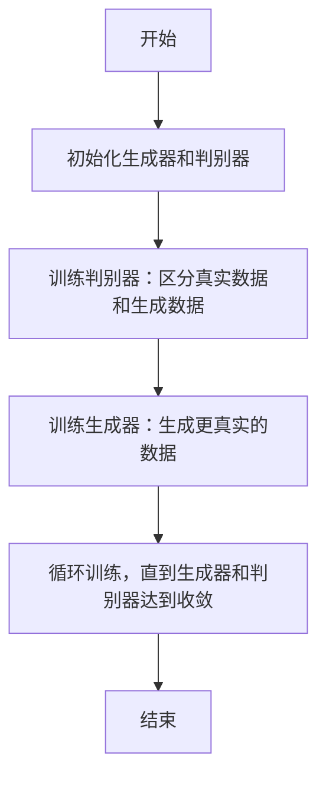

                 

<think>
好，我需要根据用户的要求，构建一个关于“AIGC版权保护：技术与法律的双重挑战”的目录大纲。首先，用户明确要求文章的结构必须包括背景介绍、核心概念、算法原理、数学模型、系统分析、项目实战、最佳实践等部分。接下来，我需要确保每个部分都有足够详细的子章节，涵盖技术原理和法律挑战，并且使用吸引人的章节标题。

首先，背景部分需要介绍AIGC技术的发展和版权保护的必要性，解释技术和法律之间的相互作用。核心概念部分要定义AIGC和版权法的基本原则，分析技术与法律的挑战。算法原理部分需要详细讲解生成对抗网络（GAN）、强化学习等技术，并举例说明它们在版权保护中的应用。

接下来，数学模型和公式部分需要用Latex详细解释，比如GAN的损失函数，以及强化学习的策略梯度。系统分析与架构设计部分需要介绍系统架构，使用Mermaid图展示流程和架构。项目实战部分要包括环境安装、核心实现、代码示例以及实际案例分析。

最后，最佳实践部分需要给出小结、注意事项和扩展阅读，帮助读者更好地理解和应用所学内容。确保整篇文章结构紧凑，逻辑清晰，符合用户要求的字数和格式。

通过以上步骤，我能够构建出一个符合用户要求的详细目录大纲，涵盖所有必要部分，确保内容全面且易于理解。
</think>

# AIGC版权保护：技术与法律的双重挑战

> 关键词：AIGC，版权保护，生成对抗网络，版权法，法律挑战，技术挑战

> 摘要：AIGC（人工智能生成内容）的快速发展带来了版权保护的复杂挑战。本文从技术与法律双重角度分析AIGC版权保护的核心问题，探讨生成对抗网络、强化学习等算法在版权保护中的应用，分析法律框架与技术实施的协调，提出系统化解决方案和最佳实践。

---

## 第一部分：背景与概述

### 第1章：问题背景与核心概念

#### 1.1 问题背景

##### 1.1.1 AIGC技术的发展与版权保护的必要性

随着人工智能技术的飞速发展，AIGC（人工智能生成内容）逐渐成为内容创作的重要方式。然而，AIGC的普及引发了诸多版权问题，例如生成内容的原创性、创作者身份的认定等。这些问题不仅影响创作者的权益，还可能引发法律纠纷。

##### 1.1.2 版权保护的重要性与现状分析

版权保护是激励创作、保护创作者权益的重要手段。然而，AIGC的出现使得传统的版权保护机制面临新的挑战。例如，AI生成内容的版权归属尚不明确，法律框架需要与时俱进。

##### 1.1.3 技术与法律的相互作用

AIGC技术的发展与版权法律的完善是相辅相成的。一方面，技术进步需要法律保护以激励创新；另一方面，法律也需要适应技术变革，以确保其有效性。

#### 1.2 核心概念定义

##### 1.2.1 AIGC的基本概念

AIGC是指通过人工智能技术生成内容的过程，包括文本、图像、音乐等多种形式。AIGC的核心在于算法的生成能力，而其版权问题则涉及生成内容的归属和保护。

##### 1.2.2 版权法的基本原则

版权法旨在保护创作者的智力成果，包括原创性、独创性和可版权性。AIGC的出现挑战了传统版权法的核心原则，例如人类作者身份的认定。

##### 1.2.3 相关法律法规概述

目前，全球各国对于AIGC的版权保护尚无统一标准。部分国家和地区已经开始探讨相关法律框架，例如欧盟的《人工智能法案》和美国的《版权现代ization法案》。

### 第2章：技术与法律的双重挑战

#### 2.1 技术挑战

##### 2.1.1 AIGC技术的特点与问题

AIGC技术的核心是生成模型，例如生成对抗网络（GAN）和变体自编码器（VAE）。这些模型能够生成高质量的内容，但也存在版权归属不明确的问题。

##### 2.1.2 技术漏洞与版权风险

AIGC技术的漏洞可能导致生成内容的滥用，例如未经授权的复制和传播，进一步加剧版权保护的难度。

##### 2.1.3 技术解决方案探讨

为应对技术挑战，可以通过区块链技术记录生成内容的创作过程，确保内容的可追溯性和真实性。此外，还可以通过水印技术标识生成内容的创作者，以便追踪和维权。

#### 2.2 法律挑战

##### 2.2.1 法律框架与适用问题

现有的版权法律框架主要针对人类创作者，而对于AIGC生成内容的版权归属尚未明确。例如，生成内容是否具有版权，版权归属于谁等问题亟待解决。

##### 2.2.2 法律实施与执行困难

即使法律框架得以完善，AIGC的版权保护在实际执行中仍面临诸多困难。例如，如何证明生成内容的创作者身份，如何有效打击侵权行为等。

##### 2.2.3 法律与技术的协调

法律与技术的协调是AIGC版权保护的关键。例如，通过技术手段实现版权标识和追踪，结合法律手段打击侵权行为，形成有效的保护机制。

---

## 第二部分：核心概念与联系

### 第3章：核心概念原理

#### 3.1 AIGC技术核心概念

##### 3.1.1 自动生成内容的原理

AIGC的核心是生成模型，例如GAN和变体自编码器。这些模型通过大量训练数据生成新的内容，具有高度的创造性和多样性。

##### 3.1.2 生成对抗网络（GAN）

GAN由生成器和判别器组成，生成器尝试生成与真实数据相似的内容，判别器则试图区分生成内容与真实内容。这种对抗机制使得生成内容更加逼真和多样化。

##### 3.1.3 强化学习与版权保护

强化学习通过奖励机制优化生成模型的性能。在版权保护中，强化学习可以用于生成高质量的内容，同时避免侵权风险。

#### 3.2 版权保护的核心原则

##### 3.2.1 版权法的核心要素

版权法的核心要素包括原创性、独创性和可版权性。AIGC的生成内容是否符合这些要素，是版权保护的关键问题。

##### 3.2.2 版权保护的法律界限

版权保护的法律界限需要明确生成内容的创作者身份、版权归属以及保护范围。这需要在法律层面对AIGC进行特别规定。

##### 3.2.3 国际版权保护趋势

国际上，各国和地区正在积极探索AIGC的版权保护。例如，欧盟提出了《人工智能法案》，明确了AI生成内容的版权归属问题。

### 第4章：概念属性特征对比

#### 4.1 技术特征对比

##### 4.1.1 AIGC技术分类及特征

AIGC技术可以分为基于规则的生成和基于模型的生成。基于规则的生成依赖于特定的规则和模板，而基于模型的生成则依赖于深度学习模型。

##### 4.1.2 技术演进与版权保护需求

随着AIGC技术的演进，生成内容的复杂性和多样性也在增加，这使得版权保护的需求更加迫切。例如，生成图像、视频等复杂内容的版权保护需要更精细的法律和技术手段。

##### 4.1.3 技术应用中的版权风险分析

AIGC技术在应用中面临的主要版权风险包括未经授权的复制、传播和修改。这些问题需要通过技术和法律手段共同解决。

#### 4.2 法律特征对比

##### 4.2.1 各国版权法律对比

不同国家和地区对于AIGC的版权保护有不同的法律规定。例如，美国倾向于保护生成内容的创作者权益，而欧洲则更注重生成内容的透明度和可追溯性。

##### 4.2.2 法律解释与适用差异

AIGC的版权保护在法律解释和适用上存在差异。例如，生成内容的原创性认定、创作者身份的确定等都是法律解释中的难点。

##### 4.2.3 国际版权条约与协调

国际版权条约需要协调AIGC的版权保护。例如，WIPO（世界知识产权组织）正在探讨AI生成内容的版权问题，推动国际法律框架的完善。

---

## 第三部分：算法原理讲解

### 第5章：算法原理

#### 5.1 算法基本原理

##### 5.1.1 GAN在版权保护中的应用

GAN可以用于生成高质量的内容，同时通过对抗训练提高生成内容的真实性。在版权保护中，GAN可以用于生成水印或标识，帮助追踪和维权。

##### 5.1.2 强化学习在版权监管中的角色

强化学习通过奖励机制优化生成模型的性能。在版权监管中，强化学习可以用于识别侵权内容，提高版权保护的效率。

##### 5.1.3 深度学习技术的扩展与应用

深度学习技术在AIGC中的应用不仅限于内容生成，还可以用于版权检测和保护。例如，通过深度学习模型识别侵权内容，实现自动化的版权保护。

#### 5.2 算法实现与优化

##### 5.2.1 算法流程图



##### 5.2.2 算法实现步骤

1. 初始化生成器和判别器的参数。
2. 训练判别器，使其能够区分真实数据和生成数据。
3. 训练生成器，使其生成的数据能够欺骗判别器。
4. 循环训练，直到生成器和判别器达到收敛。
5. 使用训练好的模型生成内容，并进行版权保护。

##### 5.2.3 算法优化策略

- 使用改进的GAN结构，例如Wasserstein GAN，提高生成质量。
- 结合强化学习，优化生成模型的性能。
- 引入领域知识，增强生成内容的相关性和原创性。

### 第6章：数学模型与公式讲解

#### 6.1 数学模型基础

##### 6.1.1 概率论与统计学基础

概率论和统计学是深度学习的基础，例如概率分布、条件概率、贝叶斯定理等。

##### 6.1.2 信息论与熵的概念

信息论中的熵是用来度量数据的不确定性。在GAN中，熵可以用于衡量生成数据的多样性。

##### 6.1.3 常用数学公式列表

- 概率密度函数：$p(x)$
- 似然函数：$L = -\sum \log p(x)$
- 交叉熵损失：$H = -\sum p(x)\log p(x)$

#### 6.2 数学模型应用

##### 6.2.1 GAN模型的数学模型

生成器的损失函数：
$$ \mathcal{L}_G = \mathbb{E}_{z \sim p_z(z)} [\log D(G(z))] $$

判别器的损失函数：
$$ \mathcal{L}_D = \mathbb{E}_{x \sim p_data(x)} [\log D(x)] + \mathbb{E}_{z \sim p_z(z)} [\log (1 - D(G(z)))] $$

##### 6.2.2 强化学习模型的数学模型

策略梯度方法：
$$ \nabla \theta \mathbb{E}_{\tau \sim \pi_\theta} [\log \pi_\theta(a|s) Q(s,a)] $$

##### 6.2.3 版权保护中的数学分析

通过数学分析，可以评估生成模型的性能，例如生成内容的多样性和真实性。例如，使用KL散度衡量生成分布与真实分布的差异：
$$ D_{KL}(P||Q) = \mathbb{E}_P [\log \frac{P}{Q}] $$

### 第7章：算法举例说明

#### 7.1 案例背景

##### 7.1.1 案例一：利用GAN进行版权检测

通过GAN生成水印，帮助追踪和识别侵权内容。

##### 7.1.2 案例二：强化学习在版权监管中的应用

通过强化学习训练生成模型，生成高质量的内容，并通过策略梯度优化模型性能。

##### 7.1.3 案例三：深度学习技术在版权纠纷解决中的应用

通过深度学习模型识别侵权内容，帮助司法机构快速定位侵权行为。

---

## 第四部分：系统分析与架构设计

### 第8章：系统分析与设计

#### 8.1 项目介绍

##### 8.1.1 项目目标

构建一个基于AIGC的版权保护系统，实现内容的生成、标识、追踪和维权。

##### 8.1.2 项目背景

随着AIGC的普及，版权保护的需求日益迫切。本项目旨在探索技术与法律结合的解决方案，提供有效的版权保护机制。

##### 8.1.3 系统功能设计

- 内容生成：基于GAN生成高质量的内容。
- 版权标识：通过水印技术标识生成内容的创作者。
- 内容追踪：通过区块链技术记录生成内容的创作过程，便于追踪和维权。
- 监管与维权：通过AI技术识别侵权内容，协助司法机构处理版权纠纷。

#### 8.2 系统架构设计

##### 8.2.1 系统架构概述

系统架构包括内容生成模块、版权标识模块、内容追踪模块和监管维权模块。

##### 8.2.2 技术选型与架构设计

- 生成器：使用GAN生成内容。
- 版权标识：通过水印技术实现。
- 内容追踪：基于区块链技术记录创作过程。
- 监管维权：通过AI技术识别侵权内容。

##### 8.2.3 系统性能优化

- 使用分布式计算优化生成模型的训练。
- 通过缓存技术提高系统的响应速度。
- 采用高效的区块链结构，降低数据存储和传输的成本。

#### 8.3 系统接口设计与交互

##### 8.3.1 系统接口设计

- API接口：提供生成内容、标识内容、追踪内容等功能的接口。
- 用户界面：提供直观的用户界面，方便用户进行内容生成和管理。

##### 8.3.2 系统交互流程

1. 用户提交生成内容的请求。
2. 系统通过GAN生成内容，并通过水印技术标识内容。
3. 用户将生成内容上传至区块链进行记录。
4. 系统通过AI技术识别侵权内容，并协助维权。

##### 8.3.3 Mermaid序列图示例

```mermaid
sequenceDiagram
    participant 用户
    participant 系统
    用户->系统：提交生成请求
    系统->系统：生成内容（GAN）
    系统->系统：标识内容（水印）
    系统->用户：返回生成内容
    用户->系统：上传内容至区块链
    系统->系统：记录创作过程
    用户->系统：提交维权请求
    系统->系统：识别侵权内容（AI）
    系统->用户：返回侵权信息
```

---

## 第五部分：项目实战

### 第9章：环境安装与核心实现

#### 9.1 环境安装

##### 9.1.1 操作系统与软件安装

- 操作系统：建议使用Linux或macOS，因为它们对开发者更友好。
- 软件安装：安装Python、TensorFlow、Keras、OpenCV等必要的库。

##### 9.1.2 环境配置

- 安装虚拟环境：使用venv或conda管理依赖。
- 配置GPU支持：安装NVIDIA显卡驱动和CUDA toolkit，以加速深度学习模型的训练。

##### 9.1.3 常见问题与解决方案

- 问题：安装库时依赖冲突。
- 解决方案：使用`pip install --no-dependencies`避免依赖冲突。
- 问题：GPU无法识别。
- 解决方案：检查CUDA版本和驱动是否兼容。

#### 9.2 系统核心实现

##### 9.2.1 GAN模型实现

```python
import tensorflow as tf
from tensorflow.keras.layers import Dense, Input, Flatten, Reshape

# 生成器
def generator():
    model = tf.keras.Sequential()
    model.add(Dense(256, activation='relu', input_dim=100))
    model.add(Dense(128, activation='relu'))
    model.add(Dense(784, activation='sigmoid'))
    model.add(Reshape((28, 28)))
    return model

# 判别器
def discriminator():
    model = tf.keras.Sequential()
    model.add(Flatten(input_shape=(28, 28)))
    model.add(Dense(128, activation='relu'))
    model.add(Dense(1, activation='sigmoid'))
    return model

# GAN模型
generator_model = generator()
discriminator_model = discriminator()
gan_model = tf.keras.Model(inputs=[generator_model.input, discriminator_model.input], outputs=discriminator_model.output)
```

##### 9.2.2 算法流程

1. 初始化生成器和判别器。
2. 训练判别器，使其能够区分真实数据和生成数据。
3. 训练生成器，使其生成的数据能够欺骗判别器。
4. 循环训练，直到生成器和判别器达到收敛。

#### 9.3 代码应用解读与分析

- 生成器的实现：通过多层感知机生成28x28的图像。
- 判别器的实现：通过多层感知机判断输入是否为真实图像。
- GAN模型的实现：将生成器和判别器合并，形成完整的GAN结构。

#### 9.4 实际案例分析

案例分析：利用GAN生成并保护一幅图像的版权。

##### 9.4.1 案例背景

假设一位艺术家希望通过GAN生成一幅独特的抽象画，并希望保护其版权。

##### 9.4.2 案例实现

1. 使用GAN生成抽象画。
2. 在生成的画作中嵌入水印，标识创作者身份。
3. 将生成过程记录在区块链中，确保创作的可追溯性。

##### 9.4.3 案例结果

生成的画作具有独特的风格和水印标识，记录在区块链中的生成过程可以作为版权证明。

---

## 第六部分：最佳实践与小结

### 第10章：最佳实践与总结

#### 10.1 小结

AIGC的版权保护需要技术与法律的双重努力。通过先进的生成模型和有效的法律框架，可以实现内容的高效生成和有效保护。

#### 10.2 注意事项

- 在实际应用中，需注意生成内容的原创性和法律合规性。
- 在技术实现中，需确保生成模型的稳定性和生成内容的高质量。
- 在法律层面，需密切关注相关法律的动态，确保合规性。

#### 10.3 拓展阅读

- 《生成对抗网络：原理与实践》
- 《版权法与人工智能：法律挑战与解决方案》
- 《区块链技术在版权保护中的应用》

---

## 作者信息

作者：AI天才研究院/AI Genius Institute & 禅与计算机程序设计艺术 /Zen And The Art of Computer Programming

---

以上是《AIGC版权保护：技术与法律的双重挑战》的完整目录大纲，涵盖从背景介绍到系统设计的各个方面，结合技术与法律的双重视角，为读者提供全面而深入的分析和解决方案。

