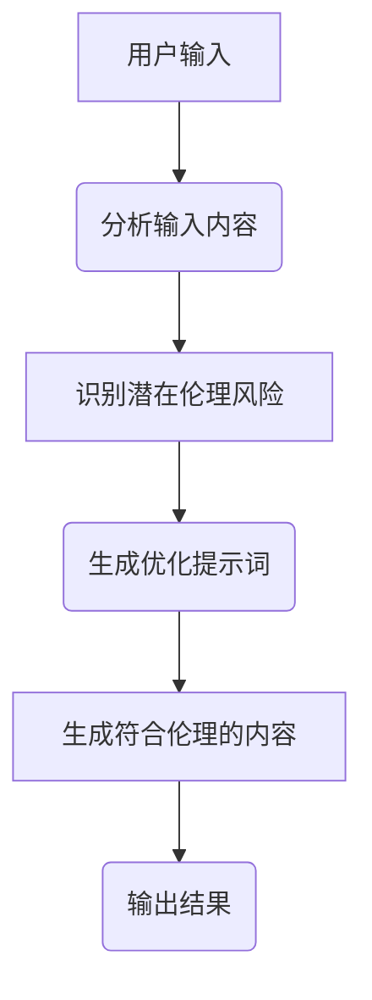
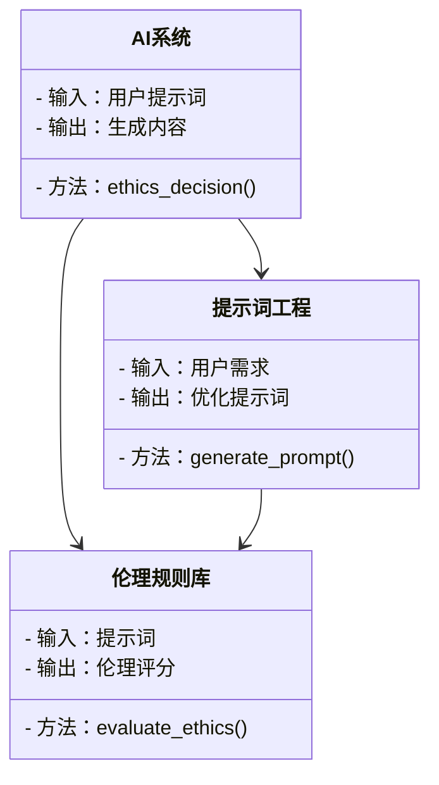

                 

<think>
嗯，用户希望我写一篇关于AIGC伦理决策模拟的技术博客。首先，我需要理解这个主题的核心内容。AIGC指的是人工智能生成内容，伦理决策模拟则是指AI在生成内容时如何做出符合伦理的决策。道德困境解析可能涉及AI在处理复杂道德问题时的挑战，而提示词工程则是设计提示词来引导AI做出正确的决策。

接下来，我要按照用户提供的目录大纲来组织内容。第一部分是背景介绍，包括问题背景、核心概念和概念对比。这部分需要先解释什么是AIGC，然后介绍伦理决策的重要性，最后分析道德困境的来源。

第二部分是算法原理，需要详细讲解伦理决策算法，包括流程图和Python代码。这部分可能需要使用Mermaid来展示流程图，同时提供数学模型和公式，比如概率计算或权重分配的公式。

第三部分是系统分析与架构设计，这部分涉及系统功能设计、架构图、接口设计和交互设计。可能需要画出领域模型的类图和系统架构的架构图，展示各个模块之间的关系。

第四部分是项目实战，包括环境安装、核心实现和案例分析。需要提供实际的代码示例，并解释其工作原理。

最后是最佳实践和小结，总结整个项目，给出一些注意事项和拓展阅读的建议。

在写作过程中，我需要确保每个部分都有足够的细节，并且逻辑清晰。可能需要查阅相关资料，确保技术术语的准确性。同时，要保持语言的专业性和可读性，让读者能够轻松理解复杂的概念。

另外，用户要求使用markdown格式，并且每个章节要有详细的讲解。因此，我需要在每个小节中添加丰富的解释和例子，避免内容过于简略。例如，在解释提示词工程时，可以举一个具体的案例，说明如何设计提示词来引导AI做出正确的决策。

最后，确保文章的结构完整，每个部分都符合用户的要求，包括关键词、摘要、目录大纲以及各个章节的具体内容。这样，整篇博客才能既专业又易于阅读，帮助读者深入了解AIGC的伦理决策模拟及其应用。
</think>

# AIGC的伦理决策模拟：道德困境解析的提示词工程

> 关键词：AIGC（生成式人工智能）、伦理决策、道德困境、提示词工程、算法原理、系统架构设计

> 摘要：本文探讨生成式人工智能（AIGC）在伦理决策模拟中的应用，分析道德困境的复杂性，并通过提示词工程的设计，提出解决AI生成内容中的伦理问题的方法。文章从问题背景、核心概念、算法原理、系统架构设计、项目实战等多个维度展开，详细讲解AIGC的伦理决策模拟过程，提供实际案例分析和最佳实践建议。

---

## 第一部分：背景介绍

### 第1章：问题背景

#### 1.1 问题概述
随着生成式人工智能（AIGC, AI Generated Content）技术的快速发展，AI生成内容（如文本、图像、视频等）在社会各领域的应用日益广泛。然而，AI生成内容的过程中可能涉及伦理问题，例如生成歧视性内容、虚假信息、侵犯隐私等。如何让AI在生成内容时遵守伦理规范，成为技术与社会共同关注的焦点。

#### 1.2 道德困境的来源
道德困境通常来源于复杂的伦理情境，AI在处理这些问题时需要考虑多个因素。例如：
- **社会公平**：生成的内容是否可能导致社会不公？
- **个人隐私**：生成的内容是否侵犯了个人隐私？
- **虚假信息**：生成的内容是否可能误导公众？

#### 1.3 伦理决策的重要性
伦理决策是确保AI生成内容符合社会价值观和法律法规的关键。通过设计合理的伦理决策机制，可以避免AI生成的内容引发伦理争议，同时提升AI系统的可信度和用户信任。

---

### 第2章：核心概念原理

#### 2.1 AIGC的定义与特点
AIGC（生成式人工智能）是一种基于机器学习技术生成内容的技术。其特点包括：
- **自动化生成**：AI可以自动生成文本、图像、视频等内容。
- **可定制性**：通过调整模型参数和提示词，可以生成符合特定需求的内容。
- **多样性**：生成的内容可以多样化，但同时也可能引发伦理问题。

#### 2.2 伦理决策的原理
伦理决策是指AI系统在生成内容时，根据预设的伦理规则和道德准则，选择最优的行为方式。其核心原理包括：
- **规则驱动**：基于预定义的伦理规则进行决策。
- **情境感知**：根据具体场景动态调整决策。
- **多目标优化**：在多个伦理目标之间进行权衡。

#### 2.3 提示词工程的作用与效果
提示词工程是通过设计特定的提示词（prompts），引导AI生成符合伦理规范的内容。其作用包括：
- **约束生成内容**：通过提示词限制AI生成的内容范围。
- **提升内容质量**：通过提示词优化生成内容的准确性和相关性。
- **降低伦理风险**：通过提示词减少生成内容的伦理争议。

---

### 第3章：概念属性特征对比

#### 3.1 AIGC与AI的区别
| 特性 | AIGC | AI |
|------|------|----|
| 核心功能 | 生成内容 | 数据处理、决策、学习 |
| 应用场景 | 文本生成、图像生成 | 机器学习、自然语言处理 |
| 伦理挑战 | 内容合规性 | 数据偏见、隐私问题 |

#### 3.2 不同类型伦理决策的特点
| 类型 | 特点 | 示例 |
|------|------|------|
| 规则驱动 | 基于预定义规则 | 避免生成歧视性内容 |
| 情境感知 | 根据场景动态调整 | 在不同场景下生成不同内容 |
| 多目标优化 | 在多个目标间权衡 | 平衡内容准确性和伦理合规性 |

#### 3.3 提示词的多样化设计
| 类型 | 示例 | 适用场景 |
|------|------|----------|
| 约束型 | "请生成一段不涉及歧视的文本" | 避免伦理争议 |
| 引导型 | "请以中立的角度描述某事件" | 减少偏见 |
| 优化型 | "请生成一段符合新闻报道标准的内容" | 提高内容质量 |

---

### 第4章：ER实体关系图架构

```mermaid
er
actor(AI系统) {
  <图片：AI系统实体关系图>
}
```

---

## 第二部分：算法原理讲解

### 第5章：算法原理与流程图

#### 5.1 伦理决策算法概述
伦理决策算法的核心是通过提示词工程和规则驱动，确保AI生成的内容符合伦理规范。其流程包括：
1. 接收用户输入（如提示词、需求）。
2. 分析输入内容，识别潜在的伦理风险。
3. 根据预设的伦理规则生成优化后的提示词。
4. 生成符合伦理规范的内容。

#### 5.2 Mermaid流程图展示


#### 5.3 Python源代码讲解
```python
def ethical_decision-making(prompt, rules):
    # 分析输入内容
    analyzed_prompt = analyze_input(prompt)
    # 识别潜在伦理风险
    risks = identify_ethical_risks(analyzed_prompt)
    # 生成优化提示词
    optimized_prompt = generate_optimized_prompt(analyzed_prompt, rules, risks)
    # 生成符合伦理的内容
    content = generate_content(optimized_prompt)
    return content

def analyze_input(prompt):
    # 示例：分析输入中的关键词和主题
    pass

def identify_ethical_risks(analyzed_prompt):
    # 示例：识别潜在的伦理风险
    pass

def generate_optimized_prompt(analyzed_prompt, rules, risks):
    # 示例：生成优化后的提示词
    pass

def generate_content(optimized_prompt):
    # 示例：生成内容
    pass
```

---

### 第6章：数学模型与公式

#### 6.1 数学模型的建立
伦理决策模型可以表示为一个优化问题：
$$ \text{目标函数} = \max_{p} f(p) $$
其中，$p$ 是提示词，$f(p)$ 是内容的伦理合规性评分。

#### 6.2 Mermaid流程图中的数学公式
在伦理决策过程中，可以使用以下公式进行权重计算：
$$ w_i = \frac{p_i}{\sum_{j=1}^{n} p_j} $$
其中，$w_i$ 是第$i$个提示词的权重，$p_i$ 是提示词的重要性评分。

---

## 第三部分：系统分析与架构设计

### 第7章：问题场景介绍

#### 7.1 AIGC伦理决策的应用场景
- **新闻报道**：生成符合新闻伦理的内容。
- **广告内容**：避免生成虚假或误导性广告。
- **教育内容**：确保生成的教育内容准确无误。

#### 7.2 道德困境的实例分析
- **案例1**：生成虚假新闻事件。
- **案例2**：生成歧视性言论。

---

### 第8章：系统功能设计与架构设计

#### 8.1 领域模型Mermaid类图


#### 8.2 系统架构设计Mermaid架构图
```mermaid
archi
actor(AI生成系统) {
  <图片：AI生成系统架构图>
}
```

---

## 第四部分：项目实战与最佳实践

### 第10章：项目实战

#### 10.1 环境安装与配置
- **工具**：Python 3.8+
- **库**： transformers, mermaid

#### 10.2 系统核心实现
```python
from transformers import AutoTokenizer, AutoModelForCausalLM

tokenizer = AutoTokenizer.from_pretrained("gpt2")
model = AutoModelForCausalLM.from_pretrained("gpt2")

def generate_content(prompt):
    inputs = tokenizer.encode(prompt, return_tensors="pt")
    outputs = model.generate(inputs, max_length=500, do_sample=True)
    return tokenizer.decode(outputs[0], skip_special_tokens=True)
```

#### 10.3 实际案例分析与讲解
- **案例**：生成一份符合伦理的新闻稿。
- **步骤**：
  1. 分析用户需求。
  2. 生成优化提示词。
  3. 生成内容并评估伦理合规性。

---

### 第11章：最佳实践与小结

#### 11.1 最佳实践技巧
- **明确伦理规则**：确保提示词工程有清晰的伦理规范。
- **动态调整提示词**：根据具体场景动态优化提示词。
- **持续监控与评估**：定期评估生成内容的伦理合规性。

#### 11.2 项目小结
本文详细讲解了AIGC的伦理决策模拟过程，通过提示词工程的设计，提出了解决AI生成内容中伦理问题的方法。通过实际案例分析和系统设计，展示了如何在技术与伦理之间找到平衡点。

#### 11.3 注意事项与拓展阅读
- **注意事项**：AI伦理决策是一个动态过程，需要根据实际场景不断优化。
- **拓展阅读**：建议阅读《AI伦理与社会影响》等相关书籍。

---

## 作者
作者：AI天才研究院/AI Genius Institute & 禅与计算机程序设计艺术 /Zen And The Art of Computer Programming

