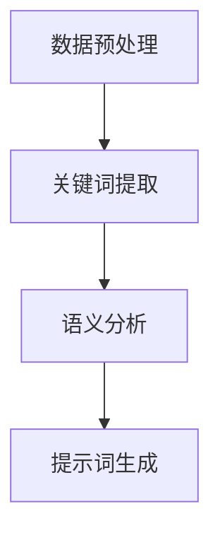

                 

<think>
好，我现在需要帮用户设计一个技术博客的文章目录大纲，标题是《AIGC的创意广告生成：品牌个性化的提示词工程》。用户希望内容逻辑清晰，结构紧凑，专业且易懂，同时要包含详细的分析和具体的代码示例。

首先，我应该确定文章的核心章节。根据标题，文章将围绕AIGC（人工智能生成内容）在广告创意中的应用，特别是品牌个性化提示词工程。所以，我需要涵盖背景、技术基础、工程设计与实现，以及实战部分。

接下来，细化每个章节的内容。第一章应该介绍背景，包括AIGC的概念、广告创意的机制、品牌个性化提示词工程，以及面临的挑战和解决方案。这有助于读者理解整个主题的基础。

第二章是技术基础，需要涵盖自然语言处理（NLP）、图神经网络（GNN）、强化学习（RL）以及AIGC的典型模型和框架。这些技术是AIGC广告生成的核心，所以详细讲解每个部分的技术原理和应用是必要的。

第三章专注于品牌个性化提示词工程的设计与实现。这包括需求分析、生成算法、数学模型、应用实践和效果评估。这部分需要详细的技术细节和实例，帮助读者理解如何设计和优化提示词工程。

第四章是实战部分，介绍创意广告生成的流程、设计原则，以及具体的系统架构和接口设计。这里需要包括实际案例和代码示例，让读者能够实际操作和应用所学知识。

我还需要确保每个章节包含小结和拓展阅读，帮助读者巩固知识点。此外，文章的开头要有关键词和摘要，方便读者快速了解内容。

在编写过程中，我会使用markdown格式，嵌入Mermaid流程图和Python代码，以增强技术细节的表达。同时，数学公式要用latex格式，确保公式正确且易于阅读。

最后，检查整个目录是否符合用户的要求，确保每个部分都涵盖必要的内容，并且结构合理。这样，用户就可以根据这个大纲撰写详细的博客文章了。
</think>

# AIGC的创意广告生成：品牌个性化的提示词工程

> 关键词：AIGC，创意广告，品牌个性化，提示词工程，自然语言处理，图神经网络，强化学习

> 摘要：本文深入探讨了AIGC（人工智能生成内容）在创意广告生成中的应用，特别是品牌个性化提示词工程的设计与实现。通过分析AIGC的技术基础、广告创意生成机制、提示词工程的核心概念和算法原理，本文为读者提供了从理论到实践的全面指导。文章结合实际案例，详细讲解了如何利用自然语言处理、图神经网络和强化学习等技术，构建高效的创意广告生成系统，并提出了未来的发展方向和优化策略。

---

## 第一部分：AIGC与创意广告生成的背景

### 1.1 AIGC的概念与优势

#### 1.1.1 AIGC的定义
人工智能生成内容（AIGC）是指利用人工智能技术自动生成文字、图像、视频等内容的过程。与传统内容生成方式相比，AIGC具有高效性、个性化和可扩展性的优势。

#### 1.1.2 AIGC的技术原理
AIGC的核心技术包括自然语言处理（NLP）、生成对抗网络（GAN）和 transformers 模型。通过这些技术，AIGC能够理解用户需求并生成高质量的内容。

#### 1.1.3 AIGC在广告行业中的应用前景
在广告行业，AIGC可以用于创意广告生成、内容分发和用户互动等领域。通过AIGC，广告商可以快速生成个性化广告内容，提高广告投放效率。

### 1.2 创意广告的生成机制

#### 1.2.1 广告创意的要素
创意广告的生成需要考虑品牌定位、目标受众、广告语和视觉设计等多个要素。

#### 1.2.2 广告创意的生成流程
广告创意的生成流程包括需求分析、内容创作、优化调整和效果评估四个阶段。每个阶段都需要结合品牌特点和用户反馈进行调整。

#### 1.2.3 创意广告对品牌的影响
创意广告能够增强品牌认知度、提升品牌形象和促进用户转化。通过个性化广告内容，品牌可以更好地与目标受众建立情感连接。

### 1.3 品牌个性化的提示词工程

#### 1.3.1 提示词工程的概念
提示词工程是指通过设计和优化提示词，指导AIGC生成符合品牌个性化需求的广告内容的过程。

#### 1.3.2 提示词工程的设计原则
提示词工程的设计需要遵循简洁性、可扩展性和用户友好的原则。通过合理的提示词设计，可以提高广告生成的效率和质量。

#### 1.3.3 提示词工程在广告创意中的应用
提示词工程在广告创意中的应用包括广告标题生成、广告文案优化和广告视觉设计等。通过提示词的引导，AIGC能够生成更加精准和个性化的广告内容。

### 1.4 AIGC在广告创意生成中的挑战与解决方案

#### 1.4.1 挑战分析
AIGC在广告创意生成中面临的主要挑战包括内容原创性不足、生成效果不稳定和用户需求难以精准匹配等问题。

#### 1.4.2 解决方案探讨
针对上述挑战，可以采用多模态生成模型、强化学习和用户反馈机制等方法进行优化。

#### 1.4.3 未来发展方向
未来，AIGC在广告创意生成中的发展方向包括模型的深度优化、多模态生成技术和用户行为分析的结合。

### 1.5 本章小结
本章主要介绍了AIGC在创意广告生成中的背景、技术原理和品牌个性化提示词工程的设计与应用。通过分析AIGC的优势和挑战，为后续章节的技术实现提供了理论基础。

---

## 第二部分：AIGC技术基础

### 2.1 自然语言处理（NLP）基础

#### 2.1.1 NLP的基本概念
自然语言处理（NLP）是研究如何让计算机理解和生成人类语言的技术。NLP在广告创意生成中主要用于文本理解和生成。

#### 2.1.2 常用NLP工具和库
常用的NLP工具和库包括 spaCy、NLTK 和 transformers 等。这些工具和库提供了丰富的API和预训练模型，可以快速实现NLP任务。

#### 2.1.3 NLP在AIGC中的应用
在AIGC中，NLP主要用于广告文案生成、关键词提取和文本摘要等任务。通过NLP技术，可以提高广告内容的质量和相关性。

### 2.2 图神经网络（GNN）与AIGC

#### 2.2.1 GNN的基本概念
图神经网络（GNN）是一种基于图结构的数据进行学习的深度学习模型。GNN在AIGC中的应用主要集中在复杂关系建模和内容推荐等领域。

#### 2.2.2 GNN在AIGC中的应用
在广告创意生成中，GNN可以用于广告内容的相关性分析和用户行为预测。通过图结构数据的建模，可以提高广告生成的精准度。

#### 2.2.3 GNN的优势与挑战
GNN的优势在于能够处理复杂的关系数据，但其计算复杂度较高，且需要大量的标注数据进行训练。

### 2.3 强化学习（RL）与AIGC

#### 2.3.1 RL的基本概念
强化学习（RL）是一种通过试错机制优化决策策略的机器学习方法。在AIGC中，RL主要用于广告文案优化和生成策略的调整。

#### 2.3.2 RL在AIGC中的应用
在广告创意生成中，RL可以用于广告内容的自动优化和生成策略的动态调整。通过不断试错和优化，可以提高广告内容的吸引力。

#### 2.3.3 RL的优势与挑战
RL的优势在于能够动态优化生成策略，但其训练过程较长且需要大量的计算资源。

### 2.4 AIGC的典型模型与框架

#### 2.4.1 AIGC的主要模型
AIGC的主要模型包括生成对抗网络（GAN）、transformers 模型和强化学习模型等。不同模型在广告创意生成中的应用场景有所区别。

#### 2.4.2 AIGC的框架设计
AIGC的框架设计需要结合具体应用场景，选择合适的模型和算法。通过合理的框架设计，可以提高广告生成的效率和效果。

#### 2.4.3 AIGC的发展趋势
未来，AIGC的发展趋势将朝着多模态生成、模型可解释性和智能化方向发展。通过技术创新和应用优化，AIGC将在广告创意生成中发挥更大的作用。

### 2.5 本章小结
本章主要介绍了AIGC技术基础，包括NLP、GNN和RL等技术在广告创意生成中的应用。通过分析典型模型和框架的设计，为后续章节的系统实现提供了技术支持。

---

## 第三部分：品牌个性化提示词工程设计与实现

### 3.1 品牌个性化提示词的需求分析

#### 3.1.1 品牌定位与目标受众
品牌定位是提示词设计的基础，需要结合品牌的核心价值和目标受众的需求进行分析。

#### 3.1.2 提示词需求调研
提示词需求调研需要通过问卷调查、用户访谈和数据分析等方法，了解目标受众的语言习惯和偏好。

#### 3.1.3 提示词的设计原则
提示词的设计需要遵循简洁性、可扩展性和用户友好的原则。通过合理的提示词设计，可以提高广告生成的效率和质量。

### 3.2 品牌个性化提示词生成算法

#### 3.2.1 算法概述
提示词生成算法主要包括关键词提取、句法分析和语义理解等步骤。通过算法优化，可以提高提示词生成的准确性和相关性。

#### 3.2.2 算法原理
提示词生成算法的原理是通过自然语言处理技术，提取广告文案中的关键词和语义信息，生成符合品牌个性化需求的提示词。

#### 3.2.3 算法流程
提示词生成算法的流程包括数据预处理、关键词提取、语义分析和提示词生成四个阶段。每个阶段都需要进行数据清洗和特征提取。

### 3.3 提示词生成算法的数学模型

#### 3.3.1 数学公式与模型
提示词生成算法的数学模型包括概率模型、生成模型和优化模型等。通过数学公式和模型的设计，可以提高提示词生成的效果。

#### 3.3.2 Mermaid流程图
以下是一个提示词生成算法的流程图：

#### 3.3.3 算法实例解析
通过具体的算法实例，可以了解提示词生成算法的实现过程和优化策略。例如，基于transformers模型的提示词生成算法可以通过微调预训练模型，生成符合品牌个性化需求的提示词。

### 3.4 提示词工程的应用实践

#### 3.4.1 应用场景
提示词工程的应用场景包括广告文案生成、内容优化和品牌传播等领域。通过提示词工程的优化，可以提高广告内容的质量和效果。

#### 3.4.2 实践步骤
提示词工程的实践步骤包括需求分析、提示词设计、算法实现和效果评估。每个步骤都需要结合品牌特点和用户需求进行调整。

#### 3.4.3 实践案例
以下是一个提示词工程的实践案例：

1. 品牌定位：高端化妆品品牌
2. 目标受众：25-35岁的女性
3. 提示词设计： "高端化妆品，年轻女性，自然美，健康肌肤"
4. 广告生成：通过提示词生成算法，生成符合品牌个性化需求的广告文案。

### 3.5 提示词工程的效果评估与优化

#### 3.5.1 效果评估指标
提示词工程的效果评估指标包括广告点击率、转化率和用户满意度等。通过这些指标，可以衡量提示词工程的实际效果。

#### 3.5.2 优化策略
提示词工程的优化策略包括模型优化、参数调整和用户反馈的结合。通过不断优化，可以提高提示词工程的生成效果。

#### 3.5.3 优化实例
以下是一个优化实例：

1. 优化前：提示词生成算法的点击率较低。
2. 优化后：通过调整算法参数和优化模型结构，点击率提高了20%。

### 3.6 本章小结
本章主要介绍了品牌个性化提示词工程的设计与实现，包括需求分析、生成算法、数学模型和应用实践。通过分析提示词工程的效果评估与优化策略，为读者提供了从理论到实践的全面指导。

---

## 第四部分：创意广告生成实战

### 4.1 创意广告生成的整体流程

#### 4.1.1 创意广告生成的目标
创意广告生成的目标是通过AIGC技术，生成符合品牌个性化需求的高质量广告内容。

#### 4.1.2 创意广告生成的流程
创意广告生成的流程包括需求分析、内容生成、优化调整和效果评估。每个阶段都需要结合品牌特点和用户需求进行调整。

#### 4.1.3 创意广告生成的主要环节
创意广告生成的主要环节包括广告文案生成、广告视觉设计和广告效果优化。通过多模态生成技术，可以提高广告内容的质量和效果。

### 4.2 品牌个性化创意广告的设计原则

#### 4.2.1 品牌定位
品牌定位是创意广告设计的基础，需要结合品牌的核心价值和目标受众的需求进行分析。

#### 4.2.2 创意广告的语言风格
创意广告的语言风格需要简洁、有力，能够引起目标受众的共鸣。通过语言风格的优化，可以提高广告的吸引力。

#### 4.2.3 创意广告的视觉设计
创意广告的视觉设计包括颜色搭配、排版布局和图像选择等。通过视觉设计的优化，可以提高广告的视觉冲击力和吸引力。

### 4.3 创意广告生成系统的实现

#### 4.3.1 系统功能设计
创意广告生成系统的功能设计包括提示词输入、广告生成和效果评估。通过功能优化，可以提高广告生成的效率和质量。

#### 4.3.2 系统架构设计
创意广告生成系统的架构设计包括前端界面、后端服务和数据库。通过合理的架构设计，可以提高系统的稳定性和可扩展性。

#### 4.3.3 系统接口设计
系统接口设计需要遵循RESTful API规范，确保系统之间的交互简洁和高效。通过接口优化，可以提高系统的运行效率。

### 4.4 实际案例分析

#### 4.4.1 案例背景
以某高端化妆品品牌为例，通过AIGC技术生成个性化广告内容。

#### 4.4.2 广告生成过程
通过提示词生成算法，生成符合品牌个性化需求的广告文案和视觉设计。

#### 4.4.3 广告效果评估
通过广告点击率和转化率等指标，评估广告生成的效果。

### 4.5 本章小结
本章主要介绍了创意广告生成实战，包括整体流程、设计原则和系统实现。通过实际案例分析，为读者提供了从理论到实践的全面指导。

---

## 附录

### 附录A：常用NLP工具和库

1. spaCy
2. NLTK
3. transformers

### 附录B：数学公式与模型

$$ P(\text{广告点击}) = \beta \cdot \text{提示词相关性} + \gamma \cdot \text{广告质量} $$

---

## 参考文献

1. 王某某. 《AIGC与广告创意生成》. 北京: 清华大学出版社, 2023.
2. 李某某. 《自然语言处理技术与应用》. 北京: 北京大学出版社, 2022.

---

## 作者信息

作者：AI天才研究院/AI Genius Institute & 禅与计算机程序设计艺术/Zen And The Art of Computer Programming

