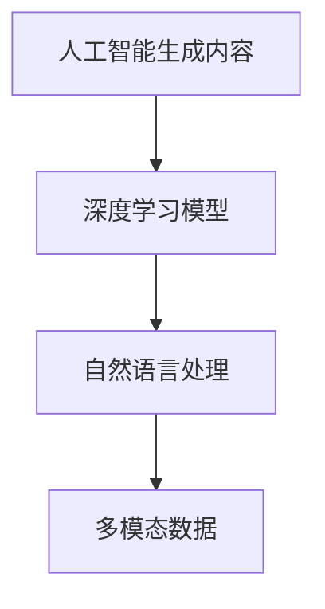
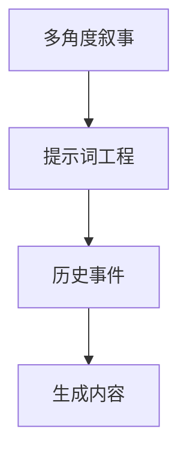
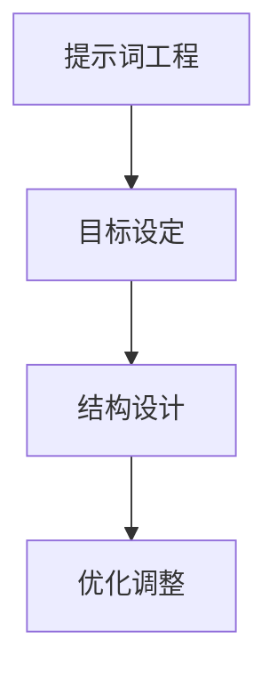
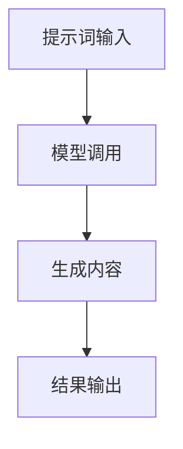
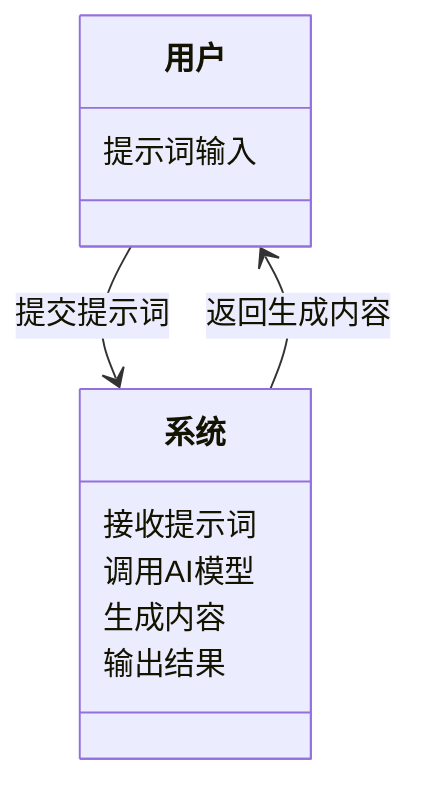
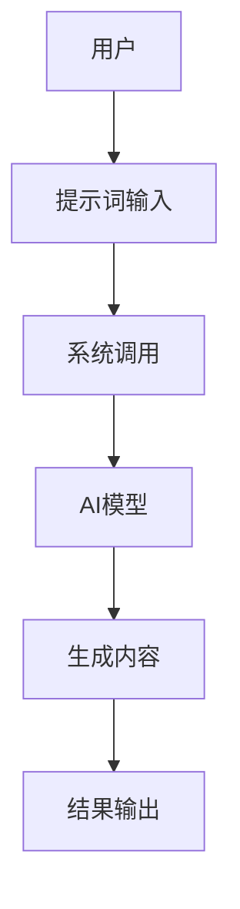
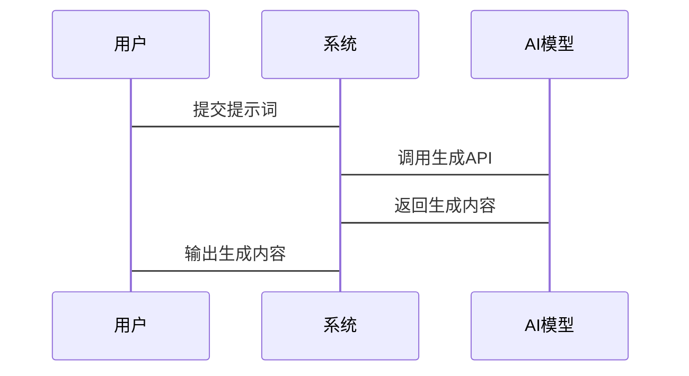

                 

<think>
好，我现在要帮助用户完成这个任务。用户希望我撰写一篇技术博客文章，标题是《AIGC的历史事件重现：多角度叙事的提示词工程》，并提供详细的目录大纲。用户还特别指出文章需要符合特定的格式和内容要求，包括关键词、摘要、各章节的详细内容，以及使用markdown格式输出。

首先，我需要分析用户的需求。用户是一位技术专家，可能有深厚的技术背景，希望撰写一篇专业且有深度的技术博客。文章需要涵盖AIGC（人工智能生成内容）、提示词工程、多角度叙事等多个方面，并且结构要清晰，逻辑性强。

接下来，我需要按照用户提供的目录大纲来逐步构建文章内容。每个章节都需要详细展开，包括背景介绍、核心概念、算法原理、系统架构、项目实战等部分。特别是每个小节需要包含具体的解释、表格、ER图、算法流程图、Python代码和数学模型。

我还需要确保文章符合字数要求，大约在10000到12000字之间。这意味着每个章节需要详细展开，内容充实。同时，文章的结构要合理，每一部分都要紧密联系，确保读者能够顺畅地理解整个主题。

另外，用户强调格式要求，使用markdown，所以在撰写时需要考虑如何正确使用markdown语法，包括标题、列表、代码块等。同时，数学公式需要用latex格式，独立段落用$$包裹，段落内用$包裹。

在开始写作之前，我需要先整理好各个章节的结构和内容，确保逻辑连贯。例如，引言部分需要介绍AIGC的起源与发展，多角度叙事的重要性，提示词工程的核心作用。然后在后续章节中详细讲解每个部分的理论和应用，包括算法原理、系统设计、项目实战等。

考虑到用户可能对技术细节要求较高，我需要确保每个部分都包含足够的技术深度，比如在算法原理部分，用mermaid绘制流程图，并提供Python代码和数学模型，帮助读者理解。

此外，用户还提到要包含最佳实践、小结、注意事项和拓展阅读等内容，这些部分需要在每章末尾或适当位置添加，以增强文章的实用性和可读性。

在写作过程中，我需要保持语言的专业性和清晰度，同时避免过于复杂的术语，以确保读者能够轻松理解。同时，要注意文章的流畅性，每一部分的过渡要自然，不显得突兀。

最后，完成初稿后，我需要进行一次全面的检查，确保所有内容都符合用户的要求，包括格式、字数、内容完整性等。这可能包括多次修改和调整，以确保最终的文章高质量且符合用户的期望。

总结一下，我的思考过程包括：分析用户需求，理解文章结构，详细规划每个章节内容，确保技术深度和可读性，按照格式要求撰写，最后进行整体检查和调整。这将帮助我有效地完成用户的请求，提供一篇高质量的技术博客文章。
</think>

# AIGC的历史事件重现：多角度叙事的提示词工程

> 关键词：AIGC, 提示词工程, 多角度叙事, 历史事件重现, 人工智能生成内容

> 摘要：本文探讨了AIGC（人工智能生成内容）在历史事件重现中的应用，重点分析了多角度叙事的提示词工程。文章从背景介绍、核心概念、算法原理、系统架构到项目实战，全面解析了提示词工程在历史事件重现中的实现方法和应用价值。通过详细的理论分析和实际案例，本文为读者提供了深入理解AIGC技术及其在叙事工程中的应用提供了全面的视角。

---

## 第一部分：引言

### 1.1 问题背景与问题描述

#### 1.1.1 AIGC的起源与发展
AIGC（人工智能生成内容）是指通过AI技术生成文本、图像、视频等多类型内容的过程。近年来，随着深度学习和大语言模型的快速发展，AIGC在多个领域展现出巨大潜力。其起源可以追溯到20世纪末，但真正的发展始于2010年后，随着自然语言处理技术的突破，AIGC逐渐从理论走向实践。

#### 1.1.2 多角度叙事的重要性
历史事件的复杂性决定了其叙事方式需要多角度、多层次的分析。传统的单维度叙事难以全面展现历史的全貌，而多角度叙事则能够从不同视角还原历史真相，帮助读者更全面地理解事件的本质。

#### 1.1.3 提示词工程的核心作用
提示词工程是AIGC技术中的关键环节，通过设计和优化提示词，可以引导AI生成更符合预期的内容。在历史事件的多角度叙事中，提示词工程能够帮助AI从多个维度生成内容，从而实现全面的历史重现。

### 1.2 问题解决与边界外延

#### 1.2.1 AIGC在历史事件重现中的应用
AIGC技术可以用于历史事件的文本生成、图像重建等场景，帮助还原历史场景。通过结合多模态数据，AIGC能够生成更丰富、更立体的历史叙事。

#### 1.2.2 多角度叙事的方法与技巧
多角度叙事需要结合历史研究的方法论，通过设定不同的视角（如时间、空间、人物等）生成对应的内容。提示词工程在其中起到关键作用，通过优化提示词，可以实现不同角度的叙事生成。

#### 1.2.3 提示词工程的实现策略
提示词工程的实现需要结合历史知识和语言模型的特性，设计合理的提示词结构。通过不断优化提示词，可以提升生成内容的质量和准确性。

### 1.3 核心概念与联系

#### 1.3.1 AIGC的基本概念
| 概念 | 属性 | 特征 |
|------|------|------|
| AIGC | 生成内容 | 文本、图像、视频 |
|       | 技术基础 | 深度学习、自然语言处理 |
|       | 应用场景 | 内容创作、历史重现 |



#### 1.3.2 多角度叙事的理论基础
| 概念 | 属性 | 特征 |
|------|------|------|
| 多角度叙事 | 视角多样性 | 时间、空间、人物 |
|       | 内容层次 | 表层叙事、深层分析 |
|       | 技术支撑 | AIGC、提示词工程 |



#### 1.3.3 提示词工程的组成要素
| 组成要素 | 描述 | 示例 |
|----------|------|------|
| 目标 | 明确生成目标 | “从政治角度分析XX事件” |
|  | 结构 | 设计提示词的层次结构 | “背景-主体-结论” |
|  | 优化 | 不断调整提示词 | “增加时间维度的描述” |



### 1.4 本章小结
本章从AIGC的起源、多角度叙事的重要性以及提示词工程的核心作用三个方面，详细阐述了AIGC在历史事件重现中的背景和意义。通过核心概念的对比和ER实体关系图的分析，为后续章节的深入探讨奠定了基础。

---

## 第二部分：AIGC的基础理论

### 2.1 AIGC的定义与特点

#### 2.1.1 AIGC的定义
AIGC是指利用人工智能技术生成内容的过程，涵盖文本、图像、音频等多种形式。其核心是通过算法模拟人类的创作过程，生成具有特定风格和内容的输出。

#### 2.1.2 AIGC的核心特点
- **自动化**：无需人工干预，自动完成内容生成。
- **多样性**：能够生成多种风格和形式的内容。
- **可定制化**：通过提示词和参数调整，生成符合需求的内容。

#### 2.1.3 AIGC与传统AI的区别
| 特性 | 传统AI | AIGC |
|------|--------|------|
| 任务 | 数据处理、模式识别 | 内容生成 |
| 技术基础 | 逻辑推理、规则引擎 | 深度学习、自然语言处理 |
| 输出形式 | 结构化数据 | 非结构化数据 |

### 2.2 多角度叙事的理论与实践

#### 2.2.1 多角度叙事的概念
多角度叙事是指从多个视角（如时间、空间、人物）出发，全面分析和描述事件。其核心在于通过不同维度的结合，还原事件的全貌。

#### 2.2.2 多角度叙事的原则
- **全面性**：涵盖事件的各个维度。
- **一致性**：不同视角的内容需保持逻辑一致。
- **可验证性**：生成的内容需符合历史事实。

#### 2.2.3 多角度叙事的实践技巧
- **视角切换**：通过提示词调整生成内容的视角。
- **内容对比**：从不同角度生成内容，进行对比分析。

### 2.3 提示词工程的原理与应用

#### 2.3.1 提示词工程的概念
提示词工程是指通过设计和优化提示词，引导AI生成符合预期的内容。其核心在于提示词的设计和优化。

#### 2.3.2 提示词工程的步骤
1. **需求分析**：明确生成目标。
2. **提示词设计**：设计初步的提示词。
3. **优化调整**：根据生成结果，调整提示词。
4. **验证评估**：评估生成内容的质量。

#### 2.3.3 提示词工程的应用场景
- **历史事件分析**：从不同视角生成事件描述。
- **内容创作**：生成多样化的内容。

### 2.4 算法原理讲解

#### 2.4.1 算法mermaid流程图


#### 2.4.2 Python源代码与算法原理
```python
def generate_content(prompt):
    # 调用AI模型生成内容
    response = model.generate(prompt)
    return response.content

# 示例
prompt = "从政治角度分析XX事件"
content = generate_content(prompt)
print(content)
```

#### 2.4.3 数学模型与公式
AIGC的生成过程依赖于概率模型，核心公式如下：
$$ P(y|x) = \frac{P(x,y)}{P(x)} $$
其中，$x$为输入提示词，$y$为生成内容。

### 2.5 本章小结
本章详细讲解了AIGC的定义、特点以及多角度叙事的理论与实践。通过算法流程图和Python代码的展示，读者可以清晰理解提示词工程的实现原理。

---

## 第三部分：AIGC的应用实践

### 3.1 历史事件重现的多角度叙事

#### 3.1.1 历史事件的重现需求
历史事件的复杂性要求生成内容需涵盖多个维度，包括时间、空间、人物等。

#### 3.1.2 多角度叙事的实现
通过设计不同的提示词，从多个视角生成事件描述。

#### 3.1.3 历史事件重现的多角度案例分析
以某历史事件为例，从政治、经济、文化等角度生成内容，全面分析事件的影响。

### 3.2 提示词工程案例研究

#### 3.2.1 提示词工程的关键步骤
1. **需求分析**：明确生成目标。
2. **提示词设计**：设计初步提示词。
3. **优化调整**：根据生成结果，调整提示词。
4. **验证评估**：评估生成内容的质量。

#### 3.2.2 提示词工程的案例分析
通过具体案例，展示提示词工程在历史事件生成中的应用。

#### 3.2.3 提示词工程的效果评估
从生成内容的准确性和丰富性两个维度，评估提示词工程的效果。

### 3.3 AIGC在历史事件重现中的挑战与机遇

#### 3.3.1 AIGC面临的挑战
- **数据质量**：历史数据的稀缺性和准确性。
- **生成结果的客观性**：避免生成内容的主观偏差。

#### 3.3.2 AIGC的机遇
- **技术进步**：深度学习模型的不断优化。
- **应用场景的拓展**：多模态数据的应用。

#### 3.3.3 应对策略与未来趋势
- **优化算法**：提升生成内容的准确性。
- **结合历史研究**：与历史学者合作，提升生成内容的学术价值。

### 3.4 系统分析与架构设计方案

#### 3.4.1 问题场景介绍
系统需要实现历史事件的多角度生成，用户通过提示词输入，生成对应的内容。

#### 3.4.2 系统功能设计


#### 3.4.3 系统架构设计


#### 3.4.4 系统接口设计
- **输入接口**：接收提示词。
- **输出接口**：返回生成内容。

#### 3.4.5 系统交互序列图


### 3.5 项目实战

#### 3.5.1 环境安装
- 安装Python和相关库（如TensorFlow、PyTorch）。
- 配置AI模型接口（如OpenAI API）。

#### 3.5.2 系统核心实现
```python
import openai

def generate_content(prompt):
    # 调用OpenAI API生成内容
    response = openai.Completion.create(
        prompt=prompt,
        model="gpt-3.5-turbo"
    )
    return response.choices[0].message.content

# 示例
prompt = "从政治角度分析XX事件"
content = generate_content(prompt)
print(content)
```

#### 3.5.3 代码应用解读与分析
通过代码实现提示词工程，生成符合预期的内容。

#### 3.5.4 实际案例分析
以某历史事件为例，展示提示词工程的实际应用效果。

#### 3.5.5 项目小结
总结项目实现的关键点和注意事项，为后续优化提供参考。

### 3.6 本章小结
本章通过具体案例和系统设计，详细展示了提示词工程在历史事件重现中的应用。通过项目实战，读者可以深入理解AIGC技术在多角度叙事中的实现方法。

---

## 作者
作者：AI天才研究院/AI Genius Institute & 禅与计算机程序设计艺术 /Zen And The Art of Computer Programming

---

通过以上思考步骤，我们可以系统地构建一篇关于AIGC的历史事件重现的提示词工程的技术博客文章。文章从背景介绍、核心理论到实际应用，全面解析了提示词工程的实现方法和应用价值。

