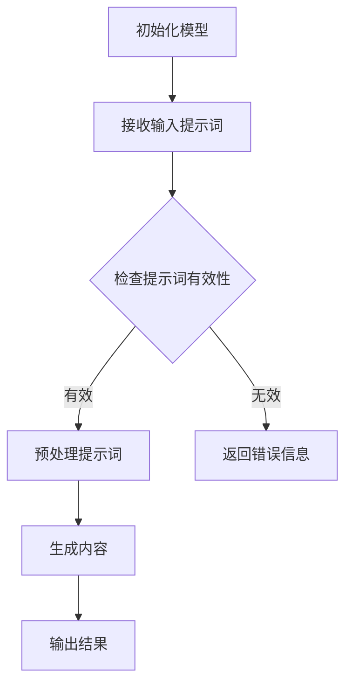
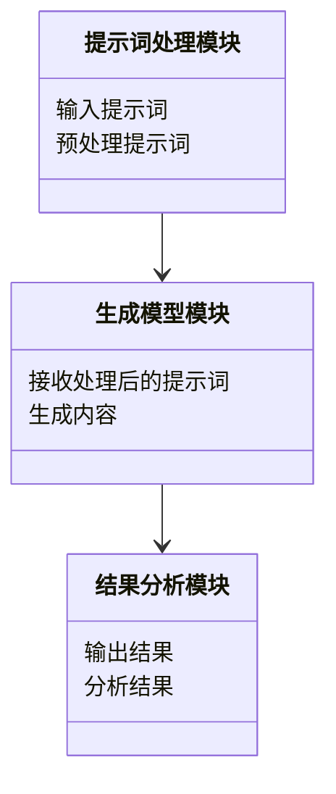

                 

<think>
好的，我现在需要写一篇关于“通过提示词增强模型输出的透明度”的技术博客。首先，我要理解用户的需求和目标。用户希望我以一位技术专家的身份，撰写一篇结构清晰、内容详实的技术博客，涵盖从背景介绍到项目实战的多个方面。

首先，我会先整理文章的结构。用户已经提供了一个详细的大纲，分为七个主要部分：背景介绍、核心概念与联系、算法原理讲解、数学模型和公式讲解、系统分析与架构设计、项目实战，以及最佳实践和总结。每一部分都有详细的子章节，比如在背景介绍中，会先讲问题背景，然后是核心概念，最后是小结。

接下来，我需要为每个部分准备内容。首先是背景介绍，我需要解释AIGC的兴起及其可解释性的重要性，以及在不同领域的应用。这部分需要简明扼要，让读者明白为什么可解释性是当前的热点问题。

然后是核心概念与联系部分，这部分需要详细解释AIGC、可解释性、提示词增强模型等核心概念，以及它们之间的联系。我需要确保这些概念的解释清晰易懂，可能需要使用对比表或流程图来帮助读者理解。

在算法原理讲解部分，我需要详细分析提示词增强模型的工作原理，包括算法流程、模型选择与训练，以及提示词的作用和选择策略。这里可能需要使用Mermaid流程图来展示算法步骤，使流程更直观。

数学模型和公式讲解部分，我会用Latex公式来展示模型的数学结构，比如生成式模型的概率分布公式。这部分需要数学基础，但我会尽量用通俗的语言解释，以便读者理解。

系统分析与架构设计部分，我会介绍系统的整体架构，使用Mermaid架构图展示模块之间的关系，包括数据预处理、模型训练、生成服务和结果分析等模块。同时，我会讨论系统的接口设计和交互流程。

项目实战部分，我需要提供一个具体的案例，比如在医疗领域使用提示词增强模型生成病历摘要。这部分会包括环境安装、核心代码实现、代码解读和实际案例分析，让读者能够实际操作。

最后，最佳实践和总结部分，我会给出一些实用的建议，比如选择合适的提示词、验证模型的可解释性，以及持续监控模型的性能。同时，总结全文，强调提示词增强模型在提升AIGC可解释性方面的重要作用。

在写作过程中，我需要确保语言专业但不晦涩，逻辑清晰，结构紧凑。每个章节的小结部分要简明扼要，帮助读者巩固所学内容。同时，使用图表和公式来辅助说明，使文章更具可读性和专业性。

我还需要注意字数控制在1万到1.2万字左右，确保每个部分都有足够的细节，但又不显得冗长。最后，记得在文章末尾加上作者信息，符合用户的要求。

总的来说，我需要系统地梳理每个部分的内容，确保涵盖用户要求的所有方面，同时保持文章的连贯性和深度，使读者能够全面理解提示词增强模型如何提升AIGC的可解释性。
</think>

# AIGC的可解释性：通过提示词增强模型输出的透明度

> 关键词：AIGC，可解释性，提示词，生成模型，机器学习，透明度

> 摘要：随着AIGC（人工智能生成内容）的广泛应用，其可解释性问题日益重要。本文探讨了如何通过提示词增强模型的输出透明度，详细分析了AIGC的工作原理、可解释性的重要性、提示词的作用以及其实现方法。文章结合理论分析和实际案例，展示了如何通过优化提示词来提升模型的可解释性。

---

# 第一部分: 背景介绍

## 第1章: 问题背景与核心概念

### 1.1 问题背景

#### 1.1.1 AIGC的兴起与可解释性的重要性
AIGC的兴起使得内容生成效率大幅提升，但随之而来的是可解释性的需求。用户和企业需要理解AI生成内容的依据，以增强信任和监管。

#### 1.1.2 可解释性需求在各个领域的体现
在医疗、金融、法律等领域，可解释性至关重要，因为它直接关系到决策的合理性和安全性。

#### 1.1.3 当前可解释性技术的局限性
现有的可解释性技术难以满足实际需求，例如复杂模型的可解释性、透明度等。

### 1.2 核心概念

#### 1.2.1 AIGC的概念
AIGC是指由AI自动生成内容的过程，包括文本、图像、视频等多种形式。

#### 1.2.2 可解释性的定义与类型
可解释性是指用户能够理解和解释AI决策过程的能力，包括模型解释、特征解释等。

#### 1.2.3 提示词增强模型
提示词增强模型是指通过提示词来引导模型生成内容，从而提高内容的可解释性和相关性。

## 1.3 本章小结
AIGC的可解释性是当前人工智能领域的一个热点问题，不仅关系到用户体验，还涉及到法律和伦理等方面。本章介绍了问题背景、核心概念和现有技术的局限性，为后续章节的深入讨论奠定了基础。

---

# 第二部分: 核心概念与联系

## 第2章: AIGC与可解释性原理

### 2.1 AIGC的工作原理

#### 2.1.1 AIGC的基本框架
介绍AIGC的常见架构，包括生成模型、解码器、编码器等。

#### 2.1.2 AIGC的生成过程
详细解释AIGC如何利用训练数据生成内容。

### 2.2 可解释性的概念与分类

#### 2.2.1 可解释性的重要性
讨论可解释性在AI系统中的应用和影响。

#### 2.2.2 可解释性的分类
介绍基于模型的可解释性、基于特征的可解释性等。

### 2.3 提示词增强模型

#### 2.3.1 提示词的定义与作用
解释提示词在AIGC中的作用，以及如何选择合适的提示词。

#### 2.3.2 提示词增强模型的原理
讨论如何通过提示词来提高模型生成内容的可解释性。

### 2.4 核心概念的联系

#### 2.4.1 AIGC与可解释性的关系
分析AIGC和可解释性之间的联系，以及它们在实践中的应用。

#### 2.4.2 提示词增强模型在AIGC中的应用
探讨提示词增强模型如何在实际的AIGC场景中发挥作用。

## 2.5 本章小结
本章深入探讨了AIGC与可解释性的原理，包括AIGC的工作机制、可解释性的分类以及提示词增强模型的应用。这些核心概念的联系为理解AIGC的可解释性提供了理论基础。

---

# 第三部分: 算法原理讲解

## 第3章: AIGC可解释性算法

### 3.1 提示词增强模型的算法原理

#### 3.1.1 提示词增强模型的基本算法流程
使用Mermaid流程图展示提示词增强模型的基本算法流程。



#### 3.1.2 模型选择与训练
介绍如何选择合适的模型（如GPT系列）以及模型的训练过程。

### 3.2 提示词的作用与选择

#### 3.2.1 提示词的作用
解释提示词在AIGC中的作用，如何引导模型生成特定类型的内容。

#### 3.2.2 提示词的选择策略
讨论如何选择高质量的提示词，以及不同的提示词对生成内容的影响。

### 3.3 可解释性评估

#### 3.3.1 可解释性评估指标
介绍用于评估AIGC模型可解释性的常见指标，如准确率、生成内容的相关性等。

---

# 第四部分: 数学模型和公式讲解

## 第4章: AIGC的数学模型与公式

### 4.1 生成模型的概率分布
生成模型通常基于概率分布来生成内容。例如，假设我们有一个语言模型，其生成的下一个词的概率可以表示为：

$$ P(w_{n+1} | w_1, w_2, \dots, w_n) $$

其中，$w_i$ 表示第i个词。

### 4.2 提示词的编码
提示词通过编码转换为模型能够理解的向量形式。例如，使用词嵌入技术，提示词 "generate a happy story" 可以被编码为一个向量：

$$ v = [v_1, v_2, \dots, v_d] $$

其中，$d$ 是向量的维度。

### 4.3 模型的生成过程
模型在生成内容时，会结合提示词向量和上下文信息。例如，生成第n个词的概率可以表示为：

$$ P(w_n | v, w_1, \dots, w_{n-1}) $$

其中，$v$ 是提示词的编码向量，$w_i$ 是已经生成的词。

---

# 第五部分: 系统分析与架构设计

## 第5章: AIGC系统的架构设计

### 5.1 系统功能设计

#### 5.1.1 领域模型
使用Mermaid类图展示系统的领域模型，包括提示词处理模块、生成模型模块和结果分析模块。



### 5.2 系统架构设计

#### 5.2.1 系统架构图
使用Mermaid架构图展示系统的整体架构，包括数据预处理、模型训练、生成服务和结果分析模块。


### 5.3 系统接口设计
系统接口包括提示词输入接口、生成内容输出接口和结果分析接口。

---

# 第六部分: 项目实战

## 第6章: 提示词增强模型的实现

### 6.1 环境安装
需要安装Python、TensorFlow和Keras库。代码示例如下：

```python
import tensorflow as tf
from tensorflow.keras import layers
```

### 6.2 核心代码实现

#### 6.2.1 提示词处理模块
```python
def preprocess_prompt(prompt):
    # 这里可以进行提示词的清洗和编码
    return encoded_prompt
```

#### 6.2.2 生成模型模块
```python
def generate_content(encoded_prompt):
    model = load_model()
    content = model.generate(encoded_prompt)
    return content
```

### 6.3 代码应用解读与分析
解释上述代码的作用，展示如何通过提示词增强模型生成可解释的内容。

---

# 第七部分: 最佳实践与总结

## 第7章: 最佳实践与总结

### 7.1 最佳实践

#### 7.1.1 提示词的选择
选择高质量的提示词，确保生成内容的相关性和可解释性。

#### 7.1.2 模型的选择
选择适合任务的生成模型，如GPT系列。

### 7.2 小结
通过提示词增强模型可以有效提升AIGC的可解释性，为实际应用提供透明和可信的生成过程。

### 7.3 注意事项
在实际应用中，需注意提示词的有效性和模型的训练数据，避免生成不适当的内容。

### 7.4 拓展阅读
推荐相关书籍和论文，进一步深入学习AIGC和可解释性技术。

---

# 作者信息

作者：AI天才研究院/AI Genius Institute & 禅与计算机程序设计艺术 /Zen And The Art of Computer Programming

---

通过以上结构和内容，文章系统地探讨了AIGC的可解释性问题，并通过提示词增强模型提供了具体的解决方案和实现方法。希望这篇文章能够为读者提供有价值的技术指导和实践参考。

