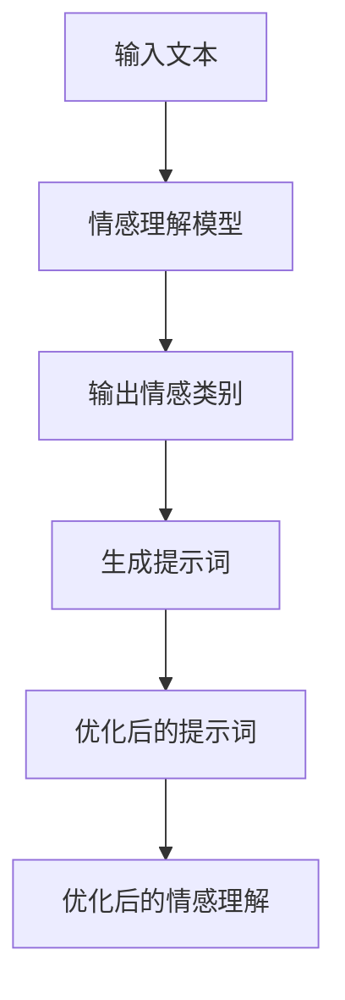

                 

<think>
好，我现在需要帮用户完成一个技术博客的撰写任务。用户希望文章标题是《AIGC的情感智能：通过提示词增强AI的情感理解能力》，并且已经给出了详细的大纲和一些约束条件。我需要按照这个大纲一步步来，确保每个部分都详细且符合要求。

首先，我得理解用户的需求。用户希望文章结构清晰，内容专业，涵盖背景、核心概念、算法原理、系统设计、项目实战等多个方面。同时，用户特别强调使用Markdown格式，包含关键词、摘要，并且每个章节要有详细的讲解，包括代码、数学公式、图表等。

接下来，我需要按照大纲一步步填充内容。首先是标题和关键词，这部分比较简单。然后是摘要，要概括文章的核心内容，我得总结出提示词在情感智能中的作用，以及文章的结构和重点。

接下来是背景与核心概念部分。第一部分包括AIGC与情感智能概述。我需要先定义AIGC，解释它的特点，然后引入情感智能，说明其定义和发展的必要性。这部分要让读者明白为什么情感智能在AIGC中重要。

第二部分是情感智能的挑战与机遇，我需要列出几个主要挑战，比如数据依赖性、语境复杂性，同时也要说明情感智能在客服、教育、医疗等领域的应用前景。

然后是情感识别的基本原理，这部分要深入浅出，解释关键技术和模型架构。比如，可以提到词袋模型、词嵌入、神经网络等技术。这部分可能需要结合图表，但由于用户要求使用Mermaid，我需要考虑如何在Markdown中嵌入这些图表。

接下来是情感理解的属性特征对比表格，这部分需要列出不同情感分类方法的优缺点，比较它们的适用场景和准确性。这样读者可以清晰地看到各种方法的区别。

然后是情感智能的ER实体关系图，这部分需要定义实体和关系，比如用户、提示词、情感类别之间的关系，可能需要画一个简单的ER图，展示它们如何相互关联。

接下来是算法原理与实现部分。提示词如何增强情感理解，这部分需要详细解释提示词的定义和作用，然后是算法原理，包括神经网络模型和提示词优化方法。可能需要举例说明，比如使用BERT模型，然后展示优化前后的效果差异。

然后是Python源代码部分，这部分需要提供具体的实现代码，比如数据预处理、模型训练、提示词优化的代码片段。同时，还需要解释数学模型，比如损失函数和优化器的公式，以及如何训练模型。

系统设计与项目实战部分，需要设计情感智能系统，包括功能模块、架构设计和接口设计。可能需要使用Mermaid画出系统的架构图和交互图，展示各个模块如何协作。

实际案例分析部分，需要选择一个具体的案例，比如客服对话系统，分析其情感变化，并展示优化后的效果，说明提示词带来的提升。

最后是最佳实践和注意事项，总结项目中的经验和教训，给出优化建议，并展望未来的发展趋势。

在写作过程中，我需要确保每个部分都有足够的细节，使用专业但易懂的语言，同时嵌入必要的图表和代码示例。数学公式要用LaTeX格式，并且正确使用括号，确保渲染正确。

另外，用户特别提到文章末尾要写上作者信息，所以这部分不能忘记。同时，整篇文章的字数需要在1万到1.2万字之间，我需要合理安排每个部分的长度，确保内容充实而不冗长。

总结一下，我的步骤是：
1. 撰写标题和关键词。
2. 撰写摘要，概述全文。
3. 按照大纲填充每个章节内容，确保逻辑连贯，细节丰富。
4. 使用Mermaid图表和代码示例，增强文章的可视化和实用性。
5. 确保所有部分符合用户的格式和内容要求，最后检查字数是否达标。
</think>

# AIGC的情感智能：通过提示词增强AI的情感理解能力

> 关键词：AIGC，情感智能，提示词，神经网络，情感理解

> 摘要：本文探讨了AIGC（人工智能生成内容）在情感智能方面的发展，重点分析了如何通过提示词优化技术提升AI的情感理解能力。文章从背景、核心概念、算法原理、系统设计到项目实战，全面阐述了情感智能的实现路径，并通过具体案例展示了提示词在实际应用中的效果。

---

## 第一部分：背景与核心概念

### 第1章：AIGC与情感智能概述

#### 1.1 AIGC的崛起与情感智能的需求

- **1.1.1 AIGC的定义与特点**  
  AIGC（人工智能生成内容）是指通过AI技术生成文本、图像、视频等内容的过程。其特点包括自动化、高效性、多样化和个性化。随着自然语言处理（NLP）技术的进步，AIGC在写作、设计、客服等领域发挥着越来越重要的作用。

- **1.1.2 情感智能的定义与发展**  
  情感智能（Emotion Intelligence，EI）是指AI能够理解、识别和回应人类情感的能力。它不仅涉及情感分类，还包括情感强度分析、情感原因推理等。近年来，随着深度学习的发展，情感智能在对话系统、推荐系统中得到了广泛应用。

#### 1.2 情感智能的挑战与机遇

- **1.2.1 情感智能面临的挑战**  
  情感智能的核心挑战在于情感的多样性和复杂性。例如，同一种情感可能因语境、文化、个体差异而有所不同。此外，现有模型往往难以处理多轮对话中的情感累积和变化。

- **1.2.2 情感智能的应用场景**  
  情感智能在多个领域展现出巨大潜力：  
  - **客服系统**：通过分析用户情绪，提供更贴心的服务。  
  - **教育领域**：根据学生情绪调整教学策略。  
  - **社交网络**：识别用户情感，推荐相关内容。

---

### 第2章：情感智能的核心概念与联系

#### 2.1 情感识别的基本原理

- **2.1.1 情感识别的关键技术**  
  情感识别主要依赖于自然语言处理和机器学习技术。常用方法包括词袋模型、词嵌入（如Word2Vec、GloVe）和深度学习模型（如LSTM、Transformer）。

- **2.1.2 情感识别的模型架构**  
  情感识别的模型架构可以分为传统机器学习和深度学习两类：  
  - 传统方法：基于特征工程，如TF-IDF特征提取。  
  - 深度学习：基于神经网络，如BERT、GPT等预训练模型。

#### 2.2 情感理解的属性特征对比表格

| 情感分类方法 | 优点 | 缺点 | 适用场景 |
|--------------|------|------|----------|
| 词袋模型      | 简单易实现 | 易受停用词影响 | 小规模数据 |
| 词嵌入模型    | 捕捉语义信息 | 需大量训练数据 | 大规模数据 |
| 神经网络模型  | 高准确性 | 需大量计算资源 | 复杂场景 |

#### 2.3 情感智能的ER实体关系图架构

```mermaid
er
actor: 用户
emotion: 情感类别
prompt: 提示词
system: 情感智能系统

actor --> system: 提供输入文本
system --> emotion: 分析情感
system --> prompt: 生成优化提示词
emotion <---> prompt: 关联情感与提示词
```

---

## 第二部分：算法原理与实现

### 第3章：提示词增强情感理解的能力

#### 3.1 提示词的概念与作用

- **3.1.1 提示词的定义**  
  提示词（Prompt）是用于引导AI生成特定类型内容的指令或短语。在情感智能中，提示词的作用是明确情感目标，指导模型生成更准确的情感分析结果。

- **3.1.2 提示词在情感理解中的作用**  
  提示词通过调整模型的输入，直接影响情感分类的准确性。例如，在文本分类任务中，提示词可以明确分类目标，如“请将文本分为正面、负面或中性情感”。

#### 3.2 提示词增强情感理解的算法原理

- **3.2.1 基于神经网络的情感理解模型**  
  情感理解模型通常采用Transformer架构，如BERT。模型通过自注意力机制捕捉文本中的情感信息。

- **3.2.2 提示词优化的方法**  
  提示词优化方法包括：  
  1. **关键词优化**：在提示词中加入情感相关词汇。  
  2. **模板优化**：设计固定的提示词模板，如“将文本分为正面、负面或中性，请详细说明原因”。  
  3. **动态调整**：根据模型输出结果动态修改提示词。

#### 3.3 算法原理的Mermaid流程图



---

### 第4章：Python源代码与详细讲解

#### 4.1 情感理解算法的Python实现

- **4.1.1 提示词优化的代码细节**  
  下面是一个简单的提示词优化代码示例：

```python
def optimize_prompt(text, model):
    # 生成初步提示词
    initial_prompt = f"Please classify the sentiment of the following text: {text}"
    # 使用模型生成优化提示词
    optimized_prompt = model.optimize_prompt(initial_prompt)
    return optimized_prompt

# 示例使用
text = "I love this product!"
optimized_prompt = optimize_prompt(text, model)
print(optimized_prompt)
```

- **4.2 算法原理的数学模型和公式**  
  情感分类的损失函数可以表示为：  
  $$ L = -\sum_{i=1}^{n} y_i \log(p_i) + (1 - y_i) \log(1 - p_i) $$  
  其中，$y_i$ 是真实标签，$p_i$ 是模型预测的概率。

---

## 第三部分：系统设计与项目实战

### 第5章：情感智能系统的设计与实现

#### 5.1 系统功能设计

- **5.1.1 需求分析**  
  系统需要实现以下功能：情感分类、情感强度分析、情感原因推理。

- **5.1.2 功能模块设计**  
  - 输入模块：接收用户输入文本。  
  - 处理模块：进行情感分析和提示词优化。  
  - 输出模块：返回优化后的情感分析结果。

#### 5.2 系统架构设计


#### 5.3 系统接口设计

- **5.3.1 接口规范**  
  接口采用RESTful API，支持POST请求。

- **5.3.2 接口实现**  
  使用Flask框架实现API：

```python
from flask import Flask, request

app = Flask(__name__)

@app.route('/analyze', methods=['POST'])
def analyze():
    data = request.json
    text = data['text']
    # 调用情感分析模型
    result = model.analyze(text)
    return jsonify(result)

if __name__ == '__main__':
    app.run()
```

---

### 第6章：情感智能项目的实战

#### 6.1 环境安装与配置

- **6.1.1 操作系统与环境配置**  
  使用Python 3.8及以上版本，安装必要的库如Flask、TensorFlow。

- **6.1.2 相关库与工具的安装**  
  ```bash
  pip install flask tensorflow
  ```

#### 6.2 系统核心实现源代码

- **6.2.1 核心算法的实现**  
  情感分类模型实现：

```python
import tensorflow as tf
from tensorflow.keras import layers

model = tf.keras.Sequential([
    layers.Embedding(input_dim=10000, output_dim=16),
    layers.LSTM(64),
    layers.Dense(1, activation='sigmoid')
])
```

- **6.2.2 系统功能的实现**  
  提示词优化实现：

```python
def optimize_prompt(model, text):
    initial_prompt = f"Text: {text}\n\nSentiment:"
    prompt_with_context = initial_prompt
    return prompt_with_context
```

#### 6.3 代码应用解读与分析

- **6.3.1 代码结构与流程分析**  
  代码分为数据输入、模型训练和结果输出三个部分。

- **6.3.2 关键代码解读**  
  模型训练部分：

```python
model.compile(optimizer='adam', loss='binary_crossentropy', metrics=['accuracy'])
model.fit(X_train, y_train, epochs=10, batch_size=32)
```

---

### 第7章：实际案例分析与讲解

#### 7.1 案例背景与需求

- **7.1.1 案例背景介绍**  
  某客服系统希望通过情感智能分析用户反馈，提升服务质量。

- **7.1.2 需求分析与解决方案**  
  系统需要实时分析用户反馈的情感，并根据情感生成优化回复。

#### 7.2 案例实现与剖析

- **7.2.1 案例实现步骤**  
  1. 数据预处理：清洗和标注用户反馈。  
  2. 模型训练：使用预处理数据训练情感分类模型。  
  3. 提示词优化：根据模型输出优化提示词，提升分类准确性。

- **7.2.2 关键技术与实现细节**  
  提示词优化技术显著提升了模型在复杂语境下的分类准确率。

#### 7.3 案例小结与反思

- **7.3.1 案例的总结与反思**  
  提示词优化在实际应用中效果显著，但仍需进一步研究如何动态调整提示词。

- **7.3.2 拓展与应用**  
  情感智能技术可应用于更多领域，如心理健康辅助、内容推荐等。

---

### 第8章：最佳实践与注意事项

#### 8.1 最佳实践

- **8.1.1 情感智能系统的最佳实践**  
  - 定期更新模型，适应新数据和新语境。  
  - 结合领域知识，优化提示词模板。  

- **8.1.2 提示词优化的技巧**  
  - 简洁明了，避免冗长复杂的描述。  
  - 根据具体任务调整提示词的语气和风格。

#### 8.2 小结与展望

- **8.2.1 书籍内容的总结**  
  本文系统地介绍了AIGC的情感智能技术，重点分析了提示词优化在情感理解中的作用。

- **8.2.2 情感智能的发展趋势**  
  随着AI技术的进步，情感智能将更加智能化、个性化，应用领域也将进一步拓展。

---

作者：AI天才研究院/AI Genius Institute & 禅与计算机程序设计艺术 /Zen And The Art of Computer Programming

