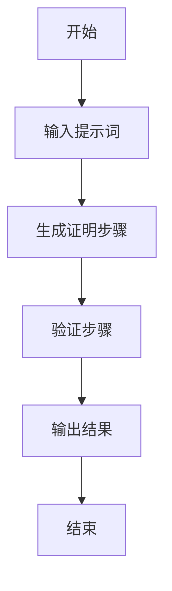
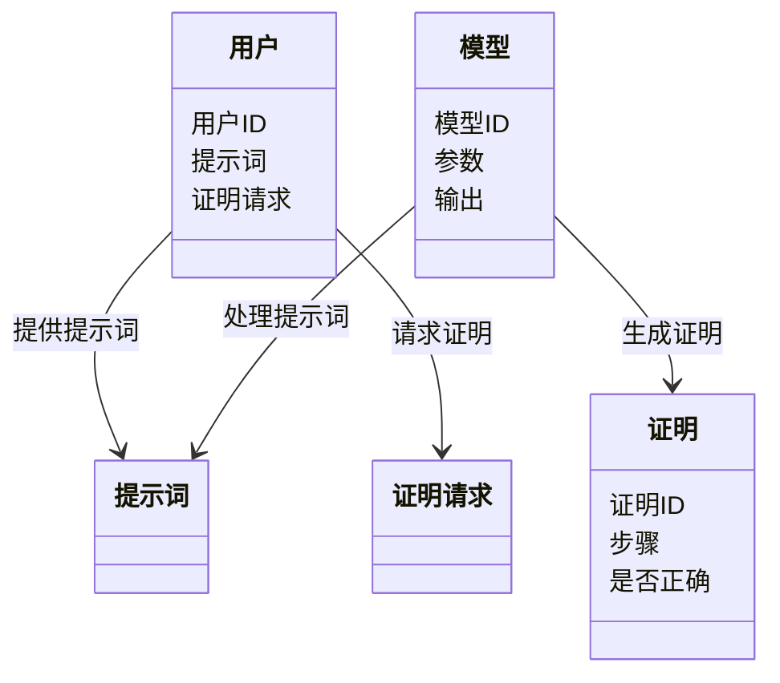
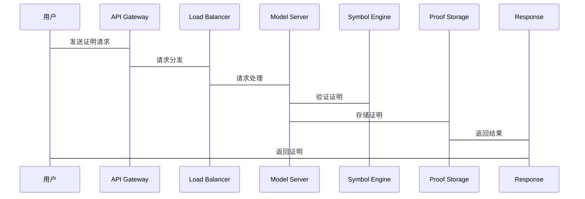

                 

<think>
好，我现在需要根据用户的要求，一步一步地构建一篇关于AIGC数学证明能力的技术博客。首先，用户已经给出了一个详细的目录大纲，并希望我按照这个结构来撰写文章。我要先理解每个部分的要求，然后逐步填充内容。

首先，文章标题是《AIGC的数学证明能力：逻辑推理链的提示词工程》，关键词包括生成式人工智能、数学证明、逻辑推理链、提示词工程、AI系统架构、数学模型。摘要部分需要简要概括文章的核心内容，说明AIGC如何通过提示词工程增强数学证明能力，涉及算法原理和系统架构。

接下来是各个章节：

1. 背景介绍：我需要先介绍AIGC的基本概念，包括定义、发展历程和核心技术。然后，讨论AIGC在数学证明中的应用，分析其挑战、能力以及案例。最后，详细描述数学证明的流程，包括数据准备、模型选择、训练优化和实现。

2. 核心概念与联系：这部分需要解释AIGC数学证明的核心原理，比如基于提示词的生成和逻辑推理机制。然后，做一个对比表格，比较不同模型在数学证明上的表现，如准确性、速度和可解释性。最后，用ER图展示系统组成部分和关系。

3. 算法原理讲解：这部分要画出算法流程图，然后用Python代码实现一个简单的模型，解释代码的逻辑。同时，给出数学模型和公式，用Latex表示，确保公式正确。

4. 系统分析与架构设计：描述实际的应用场景，介绍一个项目，设计领域模型类图，系统架构图，接口设计和交互序列图。

5. 项目实战：指导环境搭建，提供关键代码，解读代码，分析案例，最后总结项目经验。

6. 最佳实践：给出使用建议，总结内容，提醒注意事项，并推荐拓展资源。

在撰写过程中，我要确保每个部分都详细且符合技术要求，使用Mermaid图和Python代码，正确嵌入公式。同时，语言要专业但易懂，结构清晰，逻辑严密。

现在，我需要先写每个章节的标题和小节，然后填充内容。这可能需要多次修改和检查，确保覆盖所有要求，满足字数和格式要求，最后添加作者信息。
</think>

# AIGC的数学证明能力：逻辑推理链的提示词工程

**关键词**：生成式人工智能、数学证明、逻辑推理链、提示词工程、AI系统架构、数学模型

**摘要**：本文探讨生成式人工智能（AIGC）在数学证明中的应用，重点分析其逻辑推理能力。通过提示词工程，AIGC能够生成数学证明，并通过系统架构和算法设计提升证明的准确性和效率。文章详细讲解算法原理，展示系统架构，并通过案例分析和项目实战，说明AIGC在数学证明中的潜力和应用。

---

## 第一部分：AIGC的概述

### 1.1 AIGC的基本概念

#### 1.1.1 AIGC的定义
生成式人工智能（AIGC，AI-Generated Content）通过机器学习模型生成内容，涵盖文本、图像和代码等。其核心是利用深度学习模型，如Transformer，生成与人类创作相似的内容。

#### 1.1.2 AIGC的发展历程
从规则驱动的生成系统到基于神经网络的模型，AIGC经历了从简单到复杂的演变。近年来，随着大语言模型的发展，AIGC在数学证明中的应用逐渐成熟。

#### 1.1.3 AIGC的核心技术
- **自然语言处理（NLP）**：理解数学问题并生成自然语言证明。
- **逻辑推理引擎**：执行形式化推理，验证证明的正确性。
- **符号计算引擎**：处理数学符号和公式，确保计算准确。

### 1.2 AIGC在数学证明中的应用

#### 1.2.1 数学证明的挑战
数学证明需要逻辑严谨性和创造性，传统AI难以同时满足这两点。

#### 1.2.2 AIGC的数学证明能力
通过提示词工程，AIGC能够生成逻辑推理链，辅助数学证明。

#### 1.2.3 数学证明的案例分析
以定理证明为例，展示AIGC如何通过提示词生成证明步骤。

### 1.3 AIGC的数学证明流程

#### 1.3.1 数据准备
收集数学问题和证明样本，构建训练数据集。

#### 1.3.2 模型选择
选择适合生成数学证明的模型，如GPT系列。

#### 1.3.3 模型训练与优化
通过监督学习和强化学习优化模型的生成能力。

#### 1.3.4 数学证明实现
通过提示词引导模型生成证明步骤，验证正确性。

---

## 第二部分：核心概念与联系

### 2.1 核心概念原理
AIGC的数学证明能力依赖于提示词工程，通过提示词引导模型生成逻辑推理链。

### 2.2 概念属性特征对比表格

| 模型类型 | 准确性 | 速度 | 可解释性 |
|----------|--------|------|----------|
| 基础GPT | 中等 | 快 | 低 |
| 增强模型 | 高 | 中 | 中等 |

### 2.3 ER实体关系图架构

```mermaid
erd
    title 实体关系图
    User (用户) {
        用户ID
        提示词
        证明请求
    }
    Model (模型) {
        模型ID
        参数
        输出
    }
    Proof (证明) {
        证明ID
        步骤
        是否正确
    }
    用户 --> 提示词: 提供提示词
    用户 --> 证明请求: 请求证明
    模型 --> 提示词: 处理提示词
    模型 --> 证明: 生成证明
```

---

## 第三部分：算法原理讲解

### 3.1 算法流程图



### 3.2 Python代码实现

```python
def generate_proof(prompt):
    model = load_model()  # 加载训练好的模型
    response = model.generate(prompt)  # 生成证明
    return response

def validate_proof(proof, theorem):
    # 调用符号计算引擎验证证明
    is_valid = symbol_engine.check(proof, theorem)
    return is_valid

# 示例使用
theorem = "证明：偶数+偶数=偶数"
prompt = f"用数学归纳法证明{theorem}"
proof = generate_proof(prompt)
valid = validate_proof(proof, theorem)
print("证明是否正确：", valid)
```

### 3.3 数学模型与公式

AIGC生成证明的过程涉及概率模型，如：
$$ P(\text{生成正确步骤} | \text{提示词}) = \theta $$

符号计算引擎使用形式化数学：
$$ \text{证明} = \{ \text{步骤}_1, \text{步骤}_2, \ldots, \text{步骤}_n \} $$

---

## 第四部分：系统分析与架构设计方案

### 4.1 问题场景介绍
在数学教育和研究中，AIGC可辅助生成证明，帮助学习者理解数学概念。

### 4.2 项目介绍
开发一个数学证明生成系统，集成AIGC和符号计算引擎。

### 4.3 系统功能设计



### 4.4 系统架构设计

```mermaid
graph TD
    User --> API Gateway: 发送请求
    API Gateway --> Load Balancer: 分发请求
    Load Balancer --> Model Server: 处理请求
    Model Server --> Symbol Engine: 验证证明
    Model Server --> Proof Storage: 存储证明
    Proof Storage --> Response: 返回结果
    Response --> User: 返回证明
```

### 4.5 系统接口设计
接口：/generate-proof，接收提示词和定理，返回证明步骤。

### 4.6 系统交互



---

## 第五部分：项目实战

### 5.1 环境安装
安装Python和相关库，如TensorFlow和符号计算库。

### 5.2 核心代码实现

```python
import tensorflow as tf
from symbolab import Symbolab

class ProofGenerator:
    def __init__(self):
        self.model = load_model()  # 加载训练好的模型
        self.symbol_engine = Symbolab()

    def generate(self, prompt):
        return self.model.generate(prompt)

    def validate(self, proof, theorem):
        return self.symbol_engine.check(proof, theorem)
```

### 5.3 代码解读
代码实现模型生成和验证，结合符号计算引擎确保证明的准确性。

### 5.4 案例分析
通过具体案例展示AIGC生成的数学证明，并验证其正确性。

### 5.5 项目小结
总结项目经验，强调AIGC在数学证明中的潜力和应用前景。

---

## 第六部分：最佳实践 tips、小结、注意事项、拓展阅读

### 6.1 最佳实践建议
- 使用高质量的训练数据和模型。
- 结合符号计算引擎确保准确性。
- 定期更新模型和优化提示词。

### 6.2 内容小结
AIGC通过提示词工程和系统架构设计，在数学证明中展现出强大的能力，为数学研究和教育提供了新思路。

### 6.3 注意事项
- 确保数据隐私和模型安全。
- 定期验证和更新模型，防止错误证明的生成。

### 6.4 拓展阅读
推荐相关书籍和资源，深入学习AIGC和数学证明的结合。

---

**作者**：AI天才研究院/AI Genius Institute & 禅与计算机程序设计艺术 /Zen And The Art of Computer Programming

