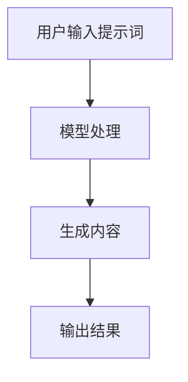
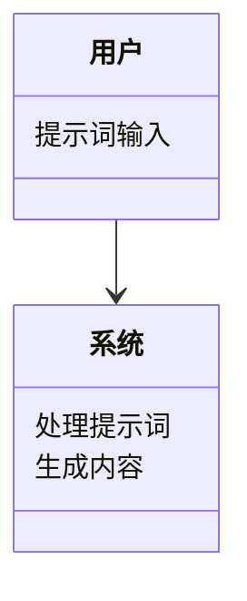
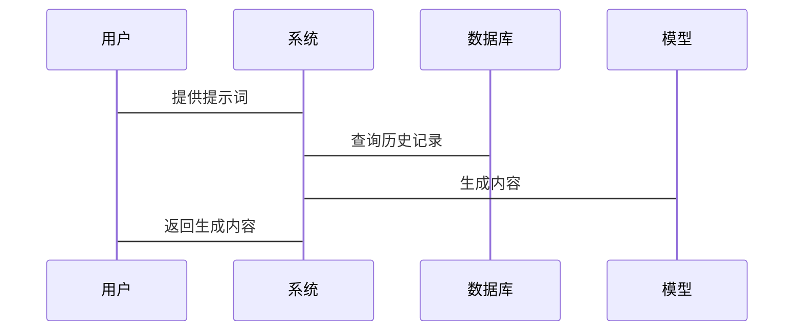

                 

<think>
嗯，我现在需要完成用户交给的任务，撰写一篇技术博客文章，标题是《AIGC的文化适应性：跨文化交流中的提示词设计》。用户已经提供了一个详细的目录大纲，我需要按照这个结构来写文章。让我先理清楚整个结构和各个部分的内容。

首先，文章的开头需要有一个摘要，然后是目录大纲。摘要部分要概括文章的核心内容，也就是AIGC在跨文化交流中的文化适应性，特别是提示词设计的重要性。我需要确保摘要简洁明了，涵盖文章的主要点。

接下来是目录大纲，用户已经列出了七章，每章下面还有小节。我需要按照这个结构来组织文章。每章的内容需要详细展开，包括背景介绍、核心概念、算法原理、系统架构、项目实战、最佳实践等。

现在，我先来看第1章：AIGC概述与文化适应性。这部分需要介绍AIGC的概念，跨文化交流的背景，以及文化适应性的重要性。我需要解释什么是AIGC，它在跨文化中的应用，以及为什么文化适应性是关键。

然后是第2章，提示词设计的原理。这里要讲提示词设计的基本原则，文化敏感性分析，以及算法基础。我需要详细解释提示词如何影响生成的内容，如何设计提示词以适应不同的文化背景，以及背后的算法机制。

第3章是提示词设计的方法与应用。这里需要列举几种常见的设计方法，比如关键词选择、语境调整等，还要介绍使用的工具和平台，并通过案例分析来说明这些方法的实际应用。

第4章涉及算法原理和数学模型。这部分需要深入讲解提示词生成的算法，比如如何将提示词转换为向量，以及这些向量如何被模型处理。可能需要用到一些数学公式，用Latex来表示，比如交叉熵损失函数等。

第5章是系统架构与接口设计。这里要描述整个系统的架构，可能包括前端和后端的交互，数据库设计，以及API接口的具体实现。可能需要用Mermaid图来展示类图和序列图，帮助读者理解系统的结构。

第6章是项目实战与案例分析。这部分需要具体实施一个项目，从环境搭建、工具安装，到核心代码的实现，案例分析，最后进行项目总结。这部分需要提供详细的代码示例，并分析实际案例，展示如何在实际中应用这些设计。

第7章则是最佳实践与未来展望。这里要总结前面的内容，给出一些实用的建议，比如如何设计文化适应的提示词，同时展望未来的发展方向，可能提到多模态模型、个性化提示词生成等趋势。

现在，我需要确保每个章节都包含必要的内容：背景介绍、核心概念与联系、算法原理、数学模型、系统架构、项目实战、最佳实践。同时，每个部分都要有详细的分析，可能需要使用Mermaid图来辅助说明系统架构和流程。

在写作过程中，我需要注意使用专业的技术术语，但又要保持语言的简洁易懂。特别是数学公式和算法部分，需要详细解释，确保读者能够理解。此外，案例分析要具体，能够展示实际的应用场景和效果。

最后，文章的结尾需要加上作者信息，格式是“作者：AI天才研究院/AI Genius Institute & 禅与计算机程序设计艺术 /Zen And The Art of Computer Programming”。

总体来看，这篇文章需要结构清晰，内容详实，既有理论分析，又有实际应用，帮助读者全面理解AIGC的文化适应性以及提示词设计在跨文化交流中的重要性。
</think>

# AIGC的文化适应性：跨文化交流中的提示词设计

> **关键词**：AIGC, 跨文化, 提示词设计, 文化适应性, 跨文化交流, 人工智能
>
> **摘要**：随着人工智能生成内容（AIGC）在跨文化交流中的应用日益广泛，提示词设计成为实现文化适应性的关键因素。本文从背景介绍、核心概念、算法原理、系统架构、项目实战等多方面详细探讨提示词设计在跨文化交流中的重要性，结合实际案例和最佳实践，为读者提供全面的指导。

---

## 目录大纲

### 第1章 AIGC概述与文化适应性
1.1 AIGC的概念与跨文化交流背景  
1.2 跨文化交流中的文化障碍与挑战  
1.3 AIGC的文化适应性重要性  

### 第2章 跨文化交流中的提示词设计原理
2.1 提示词设计的基本原则  
2.2 提示词设计的文化敏感性分析  
2.3 提示词设计的算法基础  

### 第3章 提示词设计方法与应用
3.1 常见提示词设计方法  
3.2 提示词设计工具与平台  
3.3 提示词设计的案例分析  

### 第4章 算法原理与数学模型
4.1 提示词生成的算法原理  
4.2 数学模型与公式  
4.3 算法流程与mermaid图解  

### 第5章 系统架构与接口设计
5.1 系统架构设计概述  
5.2 系统功能设计与mermaid类图  
5.3 系统接口设计与mermaid序列图  

### 第6章 项目实战与案例分析
6.1 项目环境与工具安装  
6.2 系统核心实现与源代码分析  
6.3 实际案例分析与讲解  
6.4 项目小结与反思  

### 第7章 最佳实践与未来展望
7.1 提示词设计的最佳实践  
7.2 小结与注意事项  
7.3 未来发展方向与挑战  

---

## 正文

### 第1章 AIGC概述与文化适应性

#### 1.1 AIGC的概念与跨文化交流背景
人工智能生成内容（AIGC）是指通过AI算法生成文本、图像、视频等内容的过程。随着全球化的推进，跨文化交流变得频繁，AIGC在这一背景下扮演了重要角色。它能够帮助不同文化背景的人们更好地理解和交流。

#### 1.2 跨文化交流中的文化障碍与挑战
跨文化交流中的障碍主要体现在语言差异、文化习俗和思维模式的不同。例如，西方文化注重直接表达，而东方文化更倾向于含蓄和间接。这些差异可能导致生成内容的文化不适应性。

#### 1.3 AIGC的文化适应性重要性
为了克服文化障碍，AIGC需要具备文化适应性。通过设计文化敏感的提示词，可以引导生成内容符合目标文化的期望，从而提升跨文化交流的效果。

---

### 第2章 跨文化交流中的提示词设计原理

#### 2.1 提示词设计的基本原则
提示词是引导AI生成内容的关键因素。设计原则包括明确性、具体性和文化适配性。例如，生成关于中国春节的内容时，提示词应包含关键词如“春节”、“团圆”等。

#### 2.2 提示词设计的文化敏感性分析
在设计提示词时，需考虑目标文化的特定表达方式。例如，避免使用可能引起误解的词汇，同时结合文化背景调整语气和风格。

#### 2.3 提示词设计的算法基础
提示词生成算法通常涉及文本向量化和模型训练。通过将提示词映射为向量，模型能够更好地理解和生成相关内容。

---

### 第3章 提示词设计方法与应用

#### 3.1 常见提示词设计方法
常用方法包括关键词提取、语境调整和多模态融合。例如，生成关于印度婚礼的内容时，提示词可以包含“色彩鲜艳”、“传统仪式”等关键词。

#### 3.2 提示词设计工具与平台
工具如Hugging Face和GPT-3 API提供了强大的提示词设计功能，用户可以根据需求选择合适的平台进行设计。

#### 3.3 提示词设计的案例分析
以生成日本和服描述为例，提示词应包含“👘”、“传统图案”等关键词，确保生成内容符合日本文化特点。

---

### 第4章 算法原理与数学模型

#### 4.1 提示词生成的算法原理
提示词生成算法通常基于Transformer模型，通过自注意力机制捕捉文本特征，生成与提示词相关的高质量内容。

#### 4.2 数学模型与公式
生成模型的损失函数可以表示为：
$$ \text{Loss} = -\sum_{i=1}^{n} \log p(x_i|y_i) $$
其中，\( x \) 表示生成内容，\( y \) 表示提示词。

#### 4.3 算法流程与mermaid图解


---

### 第5章 系统架构与接口设计

#### 5.1 系统架构设计概述
系统架构通常采用分层设计，包括前端展示、后端处理和数据库存储。前端接收用户输入，后端处理生成内容，数据库存储提示词和生成结果。

#### 5.2 系统功能设计与mermaid类图


#### 5.3 系统接口设计与mermaid序列图


---

### 第6章 项目实战与案例分析

#### 6.1 项目环境与工具安装
项目环境包括Python 3.8及以上，安装库如`transformers`和`torch`。

#### 6.2 系统核心实现与源代码分析
核心代码示例：
```python
from transformers import GPT2LMHeadModel, GPT2Tokenizer

tokenizer = GPT2Tokenizer.from_pretrained('gpt2')
model = GPT2LMHeadModel.from_pretrained('gpt2')

def generate_content(prompt, max_length=50):
    inputs = tokenizer.encode(prompt, return_tensors='pt')
    outputs = model.generate(inputs, max_length=max_length)
    return tokenizer.decode(outputs[0], skip_special_tokens=True)
```

#### 6.3 实际案例分析与讲解
以生成西班牙语问候语为例，提示词为“Buenos días”，生成结果为“Buenos días, ¿cómo está usted?”。

#### 6.4 项目小结与反思
项目展示了提示词设计在跨文化交流中的应用，但需进一步优化模型以提高生成内容的准确性。

---

### 第7章 最佳实践与未来展望

#### 7.1 提示词设计的最佳实践
1. 确保提示词的文化适配性。  
2. 使用多模态提示词提升生成效果。  
3. 定期更新提示词以适应文化变化。

#### 7.2 小结与注意事项
提示词设计需结合文化背景，同时关注生成内容的质量和相关性。

#### 7.3 未来发展方向与挑战
未来可能涉及多模态提示词生成、个性化提示词优化以及文化适应性评估体系的建立。

---

## 结语
通过本文的详细探讨，读者可以全面理解AIGC在跨文化交流中的文化适应性，掌握提示词设计的核心方法和实际应用。未来，随着技术的进步，提示词设计将更加智能化和个性化，为跨文化交流带来更多的可能性。

---

## 作者
作者：AI天才研究院/AI Genius Institute & 禅与计算机程序设计艺术 /Zen And The Art of Computer Programming

