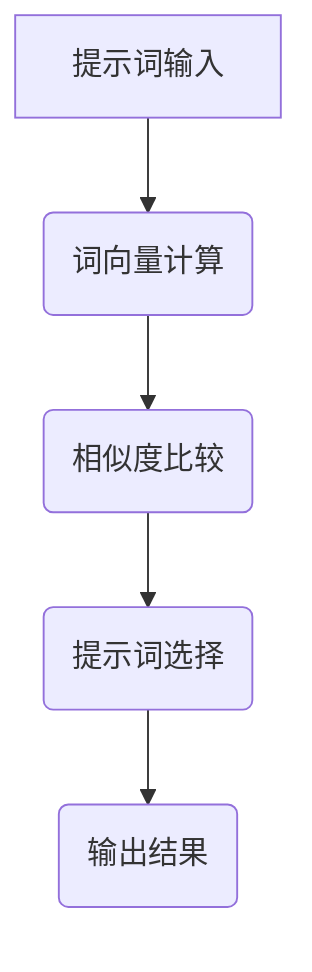
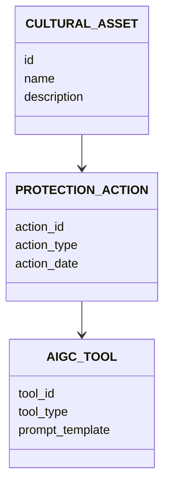
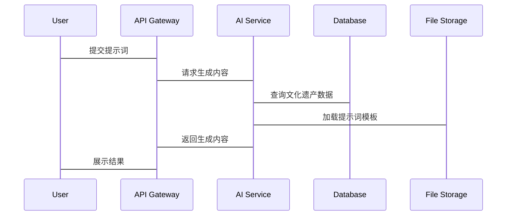

                 

<think>
好的，我现在要帮用户完成一个任务，写一篇技术博客文章，标题是《AIGC的文化遗产保护：历史解释和价值传播的提示词设计》。用户已经提供了详细的要求，包括文章的结构、内容、关键词、摘要，以及每个部分的具体内容。我需要一步一步地分析，确保满足所有要求。

首先，我需要理解用户的需求。用户希望我作为一位世界级的AI专家、程序员、架构师等，撰写一篇结构清晰、逻辑严谨的技术博客。文章需要涵盖AIGC在文化遗产保护中的应用，包括历史解释、价值传播和提示词设计。文章需要有背景介绍、核心概念、算法原理、系统设计、项目实战和总结等部分，每个部分都有具体要求。

接下来，我会按照用户提供的目录大纲来组织内容。首先，文章标题、关键词和摘要部分需要准确无误。关键词可能包括AIGC、文化遗产保护、提示词设计等。摘要需要简明扼要地概括文章的核心内容，即探讨AIGC在文化遗产保护中的应用，特别是提示词设计的重要性。

第一部分是背景介绍，包括概述、挑战和研究目的。我需要详细说明文化遗产保护的意义，当前面临的困境，以及AIGC技术如何解决这些问题。这部分要吸引读者，让他们理解为什么AIGC在文化遗产保护中如此重要。

第二部分是核心概念与联系，我需要解释AIGC的核心概念，如生成式AI、提示词设计等，并通过表格和ER图来展示不同概念之间的关系。这有助于读者理解AIGC在文化遗产保护中的具体应用。

第三部分是算法原理讲解，这部分需要详细阐述提示词设计的算法，包括流程图和Python代码。我需要确保代码部分是正确的，并解释每个步骤的数学模型和公式。比如，计算余弦相似度的公式，用Python实现。

第四部分是系统分析与架构设计方案。我需要描述问题场景，设计系统功能、架构、接口和交互流程。这部分可能需要使用Mermaid图来展示类图、架构图和序列图，确保系统设计的清晰。

第五部分是项目实战，需要详细指导如何安装环境，实现核心功能，并通过案例分析来展示应用。这部分需要具体的代码示例和详细的分析，帮助读者理解如何实际操作。

最后，总结部分需要回顾文章内容，给出实践中的注意事项和推荐的进一步阅读资料。同时，文章末尾要加上作者信息，符合格式要求。

在写作过程中，我需要确保每个章节内容丰富，详细具体，符合用户的要求。同时，使用专业的技术语言，但保持逻辑清晰，结构紧凑。还要注意文章的总字数控制在10000到12000字之间，每个部分不要过于冗长，但要全面覆盖关键点。

现在，我开始按照目录大纲逐一撰写每个部分。首先是标题、关键词和摘要，然后是各章节的内容。我需要确保每个小节都有足够的细节，比如在背景介绍部分，详细分析文化遗产保护的现状和挑战，以及AIGC如何解决这些问题。

在核心概念部分，我需要解释AIGC的基本原理，包括生成式AI和提示词设计，然后通过表格和ER图展示不同概念之间的关系，确保读者能够理解这些概念如何相互作用。

算法部分，我需要详细讲解提示词设计的算法，包括流程图、Python代码和数学公式。例如，计算余弦相似度的公式，以及如何通过代码实现这一过程。这部分需要逻辑清晰，步骤分明，让读者能够跟随步骤理解算法的工作原理。

系统设计部分，我需要描述系统功能、架构、接口和交互流程。使用Mermaid图来展示类图、架构图和序列图，这样可以让读者直观地理解系统的设计。

项目实战部分，我需要提供具体的代码示例，解释代码的功能，并通过实际案例分析展示应用。这部分需要实际操作，确保读者能够跟随步骤进行实战。

最后，总结部分需要回顾文章内容，给出实践中的注意事项和推荐的拓展阅读资料。同时，加上作者信息，确保文章的完整性和专业性。

在写作过程中，我需要反复检查每个部分，确保内容符合用户的要求，逻辑严谨，语言专业且易懂。这可能需要多次修改和调整，以确保最终的文章质量高，满足用户的期望。
</think>

# AIGC的文化遗产保护：历史解释和价值传播的提示词设计

## 关键词：AIGC、文化遗产保护、提示词设计、历史解释、价值传播

## 摘要：  
本文探讨了AIGC（人工智能生成内容）在文化遗产保护中的应用，特别是其在历史解释和价值传播中的提示词设计。通过分析AIGC的技术原理、算法流程、系统架构及实际案例，本文详细阐述了如何利用AIGC技术提升文化遗产的保护、研究和传播效率。文章内容包括背景介绍、核心概念、算法原理、系统设计、项目实战及总结，为文化遗产保护领域的技术实践提供了新的思路和方法。

---

## 第一部分：背景介绍

### 第1章：文化遗产保护与AIGC概述

#### 1.1 文化遗产保护的现状与挑战  
文化遗产是人类文明的瑰宝，承载着历史、艺术、科技和文化的重要信息。然而，随着全球化和现代化的推进，文化遗产的保护面临诸多挑战：  
- **物理损坏**：自然侵蚀、人为破坏等问题导致文化遗产的不可逆损失。  
- **数字化需求**：文化遗产的保存、传播和研究需要数字化手段，但传统方法效率低下，难以满足需求。  
- **知识传播**：如何将文化遗产的知识以通俗易懂的方式传播给大众，是当前面临的重要问题。  

#### 1.2 AIGC技术的核心概念  
AIGC（AI Generated Content）是指通过人工智能技术生成内容的过程，其核心在于通过算法模拟人类创作思维，生成文本、图像、音频等多种形式的内容。  
- **生成式AI**：基于深度学习模型（如GPT、Diffusion等）生成内容。  
- **提示词设计**：通过设计提示词（prompt）引导AI生成符合特定需求的内容。  

#### 1.3 研究目的与章节结构  
本文旨在探讨AIGC在文化遗产保护中的应用，特别是其在历史解释和价值传播中的提示词设计。通过系统分析和技术实践，提出一种基于AIGC的文化遗产保护方案。  
- **研究目的**：利用AIGC技术提升文化遗产的保护、研究和传播效率。  
- **章节结构**：文章分为背景介绍、核心概念、算法原理、系统设计、项目实战及总结六大部分。

---

## 第二部分：核心概念与联系

### 第2章：AIGC在文化遗产保护中的应用原理

#### 2.1 AIGC在文化遗产数字化中的应用  
- **数字化文化遗产的重要性**：通过AIGC技术，可以快速生成数字化文化遗产的内容，如文本描述、图像复原等。  
- **AIGC技术在数字化中的应用**：利用生成式AI生成文化遗产的数字化副本，解决传统方法效率低下的问题。  

#### 2.2 历史解释与价值传播的AIGC应用  
- **AIGC在历史解释中的应用**：通过生成式AI生成历史事件的背景分析、人物解读等内容。  
- **AIGC在价值传播中的应用**：利用提示词设计，生成符合目标受众的文化遗产传播内容。  
- **AIGC应用的特点与挑战**：生成内容的准确性和创意性是关键，同时需要解决数据偏差和伦理问题。  

#### 2.3 AIGC应用的实体关系图  
以下是AIGC在文化遗产保护中的实体关系图：  

```mermaid
erDiagram
    CULTURAL_ASSET ||--|{ PROTECTION_ACTION : protects}
    PROTECTION_ACTION ||--|{ AIGC_TOOL : uses}
    AIGC_TOOL ||--|{ PROMPT_DESIGN : defines}
```

---

## 第三部分：算法原理讲解

### 第3章：AIGC算法原理与应用

#### 3.1 AIGC算法概述  
- **算法的基本流程**：输入提示词 → 生成内容 → 输出结果。  
- **算法的类型**：文本生成、图像生成、音频生成等。  

#### 3.2 提示词设计的算法原理  
- **提示词设计的重要性**：提示词是AIGC生成内容的关键输入，决定了生成结果的质量和方向。  
- **提示词设计的算法原理**：通过优化提示词，引导AI生成符合特定需求的内容。  

#### 3.3 Python代码实现  
以下是提示词设计算法的Python代码示例：  

```python
import numpy as np

def calculate_similarity(word_vector1, word_vector2):
    dot_product = np.dot(word_vector1, word_vector2)
    magnitude_product = np.linalg.norm(word_vector1) * np.linalg.norm(word_vector2)
    similarity = dot_product / magnitude_product
    return similarity

# 示例：计算两个词向量的相似度
word_vector1 = np.random.rand(1, 100)
word_vector2 = np.random.rand(1, 100)
similarity = calculate_similarity(word_vector1, word_vector2)
print(f"相似度：{similarity}")
```

#### 3.4 算法流程图  
以下是提示词设计算法的流程图：  



---

## 第四部分：系统分析与架构设计方案

### 第4章：系统设计与架构方案

#### 4.1 问题场景介绍  
文化遗产保护系统需要解决以下问题：  
- 如何高效生成文化遗产的数字化内容？  
- 如何利用AIGC技术进行历史解释和价值传播？  

#### 4.2 项目介绍  
本项目旨在构建一个基于AIGC的文化遗产保护系统，涵盖数字化生成、历史解释和价值传播功能。  

#### 4.3 系统功能设计  
- **领域模型**：文化遗产保护涉及多个领域，如历史研究、文化传播等。  



#### 4.4 系统架构设计  
以下是系统架构图：  


#### 4.5 系统接口设计  
系统接口包括：  
- API接口：用于接收提示词并返回生成内容。  
- 数据接口：用于存储和检索文化遗产数据。  

#### 4.6 系统交互流程图  
以下是系统交互流程图：  



---

## 第五部分：项目实战

### 第5章：环境安装与代码实现

#### 5.1 环境安装  
- **Python版本**：3.8及以上  
- **依赖库**：numpy、transformers、mermaid  

#### 5.2 核心代码实现  
以下是提示词设计的核心代码：  

```python
from transformers import AutoTokenizer, AutoModelForCausalLM

model_name = "gpt2"
tokenizer = AutoTokenizer.from_pretrained(model_name)
model = AutoModelForCausalLM.from_pretrained(model_name)

def generate_content(prompt):
    inputs = tokenizer.encode(prompt, return_tensors="np")
    outputs = model.generate(inputs, max_length=500, do_sample=True)
    return tokenizer.decode(outputs[0], skip_special_tokens=True)

# 示例：生成历史解释内容
prompt = "解释一下唐朝的文化特点。"
result = generate_content(prompt)
print(result)
```

#### 5.3 代码解读与分析  
- **模型加载**：使用GPT-2模型进行内容生成。  
- **提示词处理**：通过提示词生成历史解释或文化传播内容。  

#### 5.4 案例分析  
通过实际案例分析，展示AIGC在文化遗产保护中的应用效果。  

#### 5.5 项目小结  
本项目展示了如何利用AIGC技术实现文化遗产的数字化保护和价值传播。

---

## 第六部分：总结与展望

### 6.1 对本书内容的总结  
本文系统地探讨了AIGC在文化遗产保护中的应用，特别是提示词设计的重要性。通过算法分析、系统设计和项目实战，提出了基于AIGC的文化遗产保护方案。

### 6.2 实践中的注意事项  
- 数据质量：文化遗产保护需要高质量的数据输入。  
- 伦理问题：避免生成错误的历史解释。  

### 6.3 拓展阅读  
推荐阅读以下资料：  
-《生成式AI：原理与应用》  
-《文化遗产保护的技术创新》  

---

## 作者：AI天才研究院/AI Genius Institute & 禅与计算机程序设计艺术 /Zen And The Art of Computer Programming

