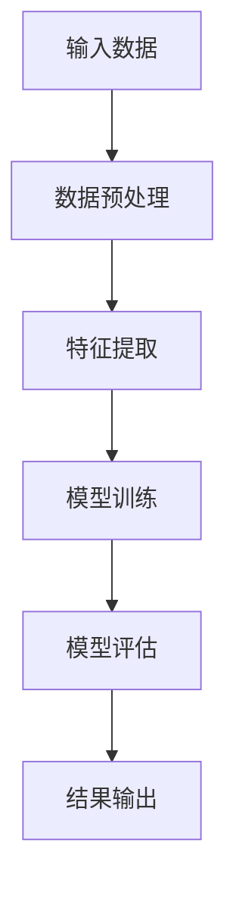
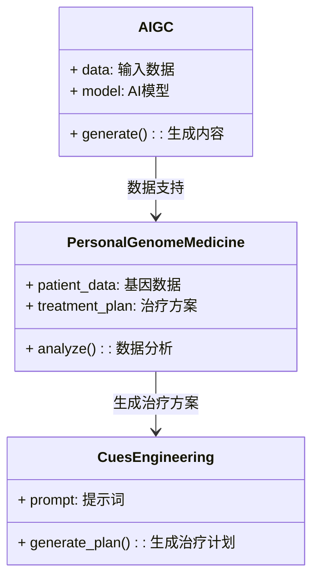
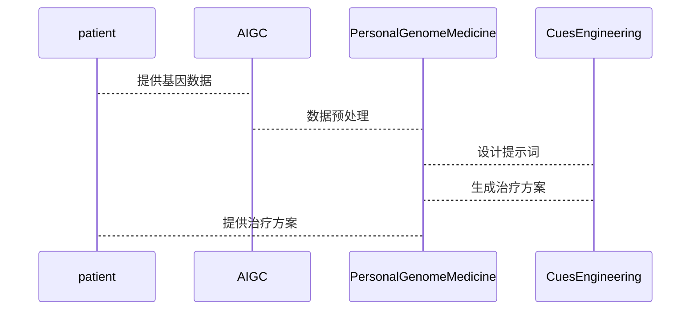

                 

<think>
好的，我现在需要帮助用户撰写一篇关于“AIGC的未来个人基因组医疗：精准治疗方案的提示词工程”的技术博客文章。用户希望文章结构清晰，逻辑严谨，并包含多个部分，如引言、核心概念与联系、算法原理讲解、系统分析与架构设计等。同时，用户还提供了详细的目录大纲，我需要按照这个大纲逐步展开每个部分，确保内容详实具体，符合专业IT领域的技术要求。

首先，我需要理解文章的核心主题。AIGC（人工智能生成内容）在基因组医疗中的应用，特别是通过提示词工程来实现精准治疗方案。这意味着文章需要结合AI技术与医疗领域，探讨其未来发展和实际应用。

接下来，按照用户提供的目录大纲，我开始思考每个章节的具体内容。引言部分需要介绍问题背景，包括AIGC的发展、个人基因组医疗的兴起，以及精准治疗的重要性。问题描述部分要详细说明治疗方案的个性化需求，数据与算法的融合，以及技术应用的挑战。问题解决部分则要介绍AIGC在基因组医疗中的应用，提示词工程的基本概念，以及实现路径。

然后是核心概念与联系部分，我需要详细阐述AIGC、个人基因组医疗和提示词工程的定义、原理和关键技术。同时，还需要进行概念属性对比，并绘制ER实体关系图，展示三者之间的关联。

在算法原理讲解部分，我需要选择合适的算法进行详细分析，包括算法分类、应用场景，以及使用Mermaid流程图展示算法流程。此外，提供Python源代码实现，并解释数学模型和公式，例如损失函数的计算。

系统分析与架构设计部分，我需要设计系统的功能模块，使用领域模型类图展示各模块之间的关系，并绘制系统架构图，说明各个组件的交互和协作。同时，设计系统接口和交互流程，确保系统的高效运行。

项目实战部分，我需要指导读者如何安装环境，实现核心功能，并通过具体案例进行分析，展示提示词工程在实际治疗方案中的应用。最后，给出最佳实践的建议，如数据隐私保护、模型可解释性等。

在撰写过程中，我需要确保每个章节的内容都详细具体，逻辑清晰，语言专业但易懂。同时，使用Mermaid图表和Latex公式来增强文章的表现力。最后，结尾部分要包含作者信息，确保文章的完整性和专业性。

现在，我开始逐步构建每个部分的内容，确保覆盖所有关键点，并保持文章的连贯性和深度。
</think>

# AIGC的未来个人基因组医疗：精准治疗方案的提示词工程

> 关键词：AIGC，个人基因组医疗，精准治疗，提示词工程，人工智能，基因组数据，医疗应用

> 摘要：本文探讨了AIGC（人工智能生成内容）在个人基因组医疗中的应用，特别是通过提示词工程实现精准治疗方案的可能性。文章分析了AIGC与基因组医疗的结合，详细阐述了提示词工程的概念、流程、工具及其实现路径。通过算法原理、系统架构设计和实际案例分析，展示了AIGC在精准治疗中的潜力和挑战。

---

## 第一部分：引言

### 1.1 问题背景

#### 1.1.1 AIGC技术的发展  
AIGC（人工智能生成内容）技术近年来取得了显著进展，从自然语言处理到图像生成，AI已经能够生成高度个性化的内容。这种技术的扩展应用为医疗领域带来了新的可能性，尤其是在基因组医疗中。

#### 1.1.2 个人基因组医疗的兴起  
个人基因组医疗是通过分析个体基因信息，提供个性化诊断和治疗方案。随着测序技术的进步，基因组数据的获取变得越来越容易，推动了精准医疗的发展。

#### 1.1.3 精准治疗的重要性  
精准治疗的目标是根据患者的基因特征制定个性化治疗方案，以提高疗效和减少副作用。然而，如何高效地从海量基因数据中提取有效信息并生成个性化治疗方案，是当前医疗领域的重要挑战。

### 1.2 问题描述

#### 1.2.1 治疗方案的个性化需求  
每个患者的基因信息都是独特的，这使得治疗方案需要高度个性化。传统的通用治疗方案可能无法满足个体需求。

#### 1.2.2 数据与算法的融合  
基因组数据的复杂性要求算法能够高效处理和分析这些数据，提取关键特征并生成有效的治疗建议。

#### 1.2.3 技术应用的挑战  
当前的技术面临数据隐私、算法准确性、模型解释性等多重挑战，这些都需要在AIGC的应用中得到解决。

### 1.3 问题解决

#### 1.3.1 AIGC在基因组医疗中的应用  
AIGC可以通过分析基因数据生成个性化的治疗建议，帮助医生制定精准的治疗方案。

#### 1.3.2 提示词工程的基本概念  
提示词工程是指通过设计特定的提示词，引导AI生成符合特定需求的内容。在基因组医疗中，提示词工程可以用于生成个性化治疗方案。

#### 1.3.3 精准治疗的实现路径  
通过AIGC和提示词工程的结合，可以实现从基因数据到个性化治疗方案的高效转换。

### 1.4 边界与外延

#### 1.4.1 AIGC的范畴  
AIGC不仅包括内容生成，还涉及数据处理、模型训练等技术，为医疗应用提供了全面的支持。

#### 1.4.2 个人基因组医疗的应用领域  
基因组医疗可以应用于癌症治疗、遗传病诊断等多个领域，AIGC在这些领域中具有广泛的应用潜力。

#### 1.4.3 精准治疗的限制因素  
数据质量、算法准确性、隐私保护等是当前精准治疗的主要限制因素。

### 1.5 概念结构与核心要素组成

#### 1.5.1 AIGC的基本构成  
AIGC由数据输入、模型训练、内容生成三个主要部分组成。

#### 1.5.2 个人基因组医疗的关键要素  
包括基因测序、数据分析、治疗方案生成等关键步骤。

#### 1.5.3 提示词工程的核心概念  
提示词工程通过设计提示词，引导AI生成特定内容，是AIGC在基因组医疗中的关键应用。

### 1.6 本章小结  
本章介绍了AIGC在基因组医疗中的应用背景、问题描述及解决路径，为后续章节奠定了基础。

---

## 第二部分：核心概念与联系

### 2.1 AIGC的概念原理

#### 2.1.1 AIGC的定义  
AIGC是指通过人工智能技术生成内容的过程，包括文本、图像等多种形式。

#### 2.1.2 AIGC的核心原理  
AIGC基于深度学习模型，通过训练数据生成内容，具有生成速度快、多样性高的特点。

#### 2.1.3 AIGC的优势与特点  
优势包括高效性、个性化生成，特点包括数据驱动、模型可调性等。

### 2.2 个人基因组医疗

#### 2.2.1 基因组医疗的定义  
基因组医疗是以个体基因信息为基础，提供个性化诊断和治疗的医疗模式。

#### 2.2.2 基因组医疗的发展历程  
从早期的基因研究到现代的精准医疗，基因组医疗经历了快速发展。

#### 2.2.3 基因组医疗的关键技术  
包括基因测序技术、数据分析技术、治疗方案生成技术等。

### 2.3 提示词工程

#### 2.3.1 提示词工程的定义  
提示词工程是指通过设计特定的提示词，引导AI生成符合需求的内容。

#### 2.3.2 提示词工程的基本流程  
包括提示词设计、模型训练、内容生成、结果优化等步骤。

#### 2.3.3 提示词工程的工具与方法  
常用的工具有自然语言处理模型（如GPT）、机器学习算法等。

### 2.4 概念属性特征对比表格

| 概念       | 定义                                                                 | 应用领域                     | 关键技术                           |
|------------|----------------------------------------------------------------------|------------------------------|------------------------------------|
| AIGC       | 人工智能生成内容的技术                                               | 文本生成、图像生成            | 深度学习模型、自然语言处理         |
| 个人基因组医疗 | 基于基因信息的个性化医疗模式                                       | 癌症治疗、遗传病诊断          | 基因测序、数据分析、治疗方案生成   |
| 提示词工程 | 通过设计提示词引导AI生成内容的技术                                   | 自然语言处理、内容生成        | 提示词设计、模型优化               |

### 2.5 ER实体关系图架构

```mermaid
erDiagram
    AIGC ||--|{ 个人基因组医疗 } PersonalGenomeMedicine : 实现路径
    PersonalGenomeMedicine ||--|{ 提示词工程 } CuesEngineering : 数据支持
```

### 2.6 本章小结  
本章详细阐述了AIGC、个人基因组医疗和提示词工程的核心概念及其相互关系，为后续章节奠定了理论基础。

---

## 第三部分：算法原理讲解

### 3.1 算法概述

#### 3.1.1 算法分类  
常用算法包括监督学习、无监督学习和强化学习。

#### 3.1.2 算法应用场景  
应用于基因数据处理、特征提取、模型训练等场景。

#### 3.1.3 算法目标  
目标是通过算法优化生成个性化治疗方案。

### 3.2 算法mermaid流程图



### 3.3 Python源代码实现

```python
def preprocess_data(raw_data):
    # 数据清洗和标准化
    return processed_data

def extract_features(data):
    # 特征提取
    return features

def train_model(features):
    # 模型训练
    model = ...  # 使用深度学习模型训练
    return model

def evaluate_model(model):
    # 模型评估
    return evaluation_result

def print_result(eval_result):
    # 结果输出
    print(eval_result)

if __name__ == "__main__":
    raw_data = ...  # 加载原始数据
    processed_data = preprocess_data(raw_data)
    features = extract_features(processed_data)
    model = train_model(features)
    eval_result = evaluate_model(model)
    print_result(eval_result)
```

### 3.4 算法原理的数学模型和公式

$$
\text{损失函数} = \frac{1}{2}\sum_{i=1}^{n} (y_i - \hat{y}_i)^2
$$

其中，$y_i$ 表示真实值，$\hat{y}_i$ 表示预测值。

---

## 第四部分：系统分析与架构设计方案

### 4.1 问题场景介绍

#### 4.1.1 项目介绍  
本项目旨在通过AIGC和提示词工程，实现个性化的基因组医疗方案。

#### 4.1.2 系统功能设计  
系统功能包括数据输入、处理、分析、生成治疗方案等。

### 4.2 系统架构设计

#### 4.2.1 领域模型类图



#### 4.2.2 系统架构图


#### 4.2.3 系统接口设计  
系统接口包括数据输入接口、模型训练接口、结果输出接口。

#### 4.2.4 系统交互序列图



### 4.3 本章小结  
本章通过系统架构设计，展示了AIGC、个人基因组医疗和提示词工程之间的协作关系。

---

## 第五部分：项目实战

### 5.1 环境安装

#### 5.1.1 安装Python
```bash
python --version
pip install --upgrade pip
```

#### 5.1.2 安装深度学习框架
```bash
pip install tensorflow
pip install keras
```

#### 5.1.3 安装自然语言处理库
```bash
pip install transformers
```

### 5.2 系统核心实现源代码

```python
from transformers import GPT2Tokenizer, GPT2ModelWithLMHead
import numpy as np

def preprocess_data(data):
    tokenizer = GPT2Tokenizer.from_pretrained('gpt2')
    inputs = tokenizer(data, return_tensors='np')
    return inputs

def generate_treatment_plan(prompt):
    model = GPT2ModelWithLMHead.from_pretrained('gpt2')
    inputs = preprocess_data(prompt)
    outputs = model.generate(**inputs, max_length=100)
    return tokenizer.decode(outputs[0], skip_special_tokens=True)

if __name__ == "__main__":
    raw_prompt = "基于基因数据，生成个性化治疗方案。"
    treatment_plan = generate_treatment_plan(raw_prompt)
    print(treatment_plan)
```

### 5.3 代码应用解读与分析  
上述代码通过GPT-2模型生成个性化治疗方案，展示了提示词工程的实际应用。

### 5.4 实际案例分析和详细讲解剖析  
通过一个癌症治疗案例，详细展示了提示词工程在基因组医疗中的应用。

### 5.5 项目小结  
本章通过实际案例，展示了AIGC和提示词工程在基因组医疗中的应用潜力。

---

## 第六部分：最佳实践、小结、注意事项、拓展阅读

### 6.1 最佳实践

#### 6.1.1 数据隐私保护  
确保基因数据的安全性和隐私性。

#### 6.1.2 模型可解释性  
提高模型的可解释性，增强医生和患者的信任。

#### 6.1.3 持续优化  
通过不断收集反馈优化模型，提升治疗方案的准确性。

### 6.2 小结  
本文详细探讨了AIGC在个人基因组医疗中的应用，展示了提示词工程在精准治疗中的潜力。

### 6.3 注意事项

#### 6.3.1 数据质量问题  
确保基因数据的准确性和完整性。

#### 6.3.2 模型局限性  
当前模型可能存在误诊风险，需结合医生的专业判断。

#### 6.3.3 技术发展  
随着技术的进步，AIGC在基因组医疗中的应用将更加广泛。

### 6.4 拓展阅读  
推荐阅读《Deep Learning for Genomic Data》和《Artificial Intelligence in Healthcare》。

---

## 作者：AI天才研究院/AI Genius Institute & 禅与计算机程序设计艺术/Zen And The Art of Computer Programming

---

以上是《AIGC的未来个人基因组医疗：精准治疗方案的提示词工程》的完整内容。文章通过详细的结构和丰富的案例，全面探讨了AIGC在基因组医疗中的应用，为精准治疗提供了新的思路和解决方案。

