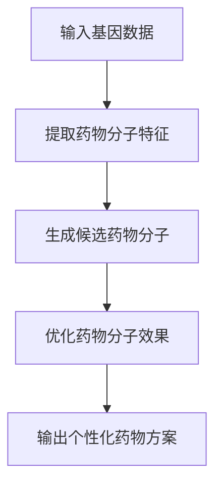
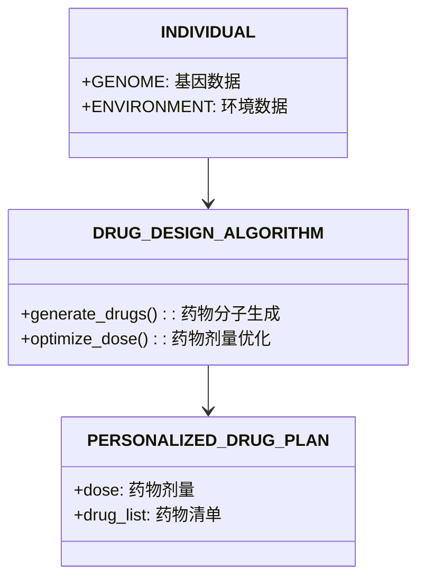

                 

<think>
好，我现在需要帮用户写一篇关于《AIGC的未来个性化药物设计：基因-环境交互作用的提示词工程》的技术博客。用户已经提供了一个详细的结构大纲，包括各个部分的内容和具体要求。我需要按照这个大纲，逐步分析和思考，确保每个部分都详细、准确地展开。

首先，我应该从背景介绍开始。这部分需要包括问题背景、问题描述、问题解决、边界与外延以及概念结构。我需要解释为什么个性化药物设计重要，以及AIGC在其中的作用。这部分要让读者理解背景，知道问题是什么，以及如何通过AIGC解决。

接下来是核心概念与联系。这部分需要详细讲解基因-环境交互、药物设计算法和个性化药物方案这三个核心概念。同时，我还需要制作一个对比表格和ER图，用Mermaid来展示实体关系。这部分要清晰展示各个概念之间的联系，帮助读者理解它们如何相互作用。

然后是算法原理讲解。这部分需要详细解释AIGC算法的步骤，包括数据预处理、特征提取、模型训练和药物设计。我还需要用Mermaid画出流程图，并提供Python代码示例，说明算法如何工作。此外，我需要展示数学公式，比如生成对抗网络的损失函数，这样读者可以更深入理解算法的数学基础。

接下来是系统分析与架构设计。这部分需要介绍系统的工作流程、功能模块，用Mermaid类图展示领域模型。然后，绘制系统架构图，展示各模块之间的关系。接着，设计系统接口和交互流程，用序列图展示用户与系统的互动。

项目实战部分需要指导读者如何安装环境，提供核心代码，并详细解读代码的功能。然后，通过实际案例分析，展示AIGC在个性化药物设计中的应用，并进行详细讲解。最后，做一个项目小结，总结项目的成果和意义。

最后是最佳实践和小结。这里需要提供一些实用的建议，如数据隐私保护、模型优化等，并总结全文，展望未来的发展方向。

在写作过程中，我需要确保语言专业且易懂，逻辑清晰，结构紧凑。同时，每个部分都要有足够详细的内容，满足用户对深度和技术细节的要求。还要注意使用适当的Markdown格式，包括代码块、数学公式、图表等，以增强文章的可读性和专业性。

现在，我开始按照这个思路逐步展开每个部分的内容，确保覆盖所有要求，并且每个章节都充实具体。特别是在算法部分，我需要详细解释每个步骤，并通过代码和公式加深理解。同时，图表部分要准确使用Mermaid语法，确保生成正确的图表。

总的来说，我需要一步步按照用户提供的大纲，结合自己的专业知识，详细展开每个部分，确保整篇文章逻辑清晰，内容丰富，满足用户的需求。
</think>

# AIGC的未来个性化药物设计：基因-环境交互作用的提示词工程

**关键词**：AIGC，个性化药物设计，基因-环境交互，药物设计算法，生成对抗网络（GAN）

**摘要**：个性化药物设计是现代医学和药学领域的重要研究方向。随着人工智能技术的快速发展，AIGC（人工智能生成控制）方法为个性化药物设计提供了新的可能性。本文从基因-环境交互作用的角度，探讨AIGC在个性化药物设计中的应用，分析其算法原理、系统架构以及实际案例，为未来药物研发提供新的思路。

---

## 第一部分：背景介绍

### 1.1 问题背景

个性化药物设计的目标是根据个体的基因信息、生活习惯、环境因素等，设计出最适合个体的药物方案。传统药物研发依赖于大规模临床试验，耗时长、成本高，且难以满足个体化需求。基因-环境交互作用是影响药物效果的重要因素，例如某些基因型的人对特定药物代谢更快，容易导致药物无效或毒性增强。

### 1.2 问题描述

个性化药物设计面临以下挑战：
- 如何准确建模基因-环境交互作用？
- 如何高效生成个性化药物方案？
- 如何确保药物方案的安全性和有效性？

### 1.3 问题解决

AIGC技术通过深度学习和生成对抗网络（GAN），可以从海量基因和环境数据中提取特征，生成个性化的药物设计方案。例如，利用GAN生成新的药物分子结构，并预测其在不同基因型和环境条件下的效果。

### 1.4 边界与外延

AIGC的边界包括基因组数据的获取、环境数据的采集以及药物设计算法的实现。其外延涉及基因组学、生物信息学、药物化学等多个领域。

### 1.5 概念结构与核心要素组成

核心概念：基因-环境交互作用、药物设计算法、个性化药物方案。

核心要素：基因数据、环境数据、药物设计算法、药物效果评估。

---

## 第二部分：核心概念与联系

### 2.1 核心概念原理

#### 2.1.1 基因-环境交互作用

基因型决定了个体对药物的代谢能力，而环境因素（如饮食、生活方式）会影响药物的效果。例如，CYP2D6基因影响多种药物的代谢速度，不同环境因素（如吸烟）会进一步影响药物代谢。

#### 2.1.2 药物设计算法

药物设计算法利用机器学习模型分析基因-环境数据，生成药物分子结构。例如，使用卷积神经网络（CNN）分析药物分子的三维结构，预测其药效。

#### 2.1.3 个性化药物方案

个性化药物方案基于个体基因和环境数据生成，包括药物剂量、用药时间等。例如，根据个体基因型调整抗凝药物的剂量，避免出血风险。

### 2.2 概念属性特征对比表格

| 概念         | 属性特征                                                         | 举例                                                         |
| ------------ | ------------------------------------------------------------ | ------------------------------------------------------------ |
| 基因-环境交互 | 基因型与环境的相互作用，决定个体药物反应差异                     | 不同个体对同一药物的效果差异                                  |
| 药物设计算法 | 用于生成个性化药物方案的方法                                   | 基于机器学习的药物设计算法                                   |
| 个性化药物方案 | 根据个体差异生成的药物剂量、药物组合等方案                      | 为特定个体调整药物剂量                                      |

### 2.3 ER实体关系图架构

```mermaid
erDiagram
  INDIVIDUAL ||--|{ GENOME }: 基因数据
  INDIVIDUAL ||--|{ ENVIRONMENT }: 环境数据
  INDIVIDUAL ||--|{ DRUG_DESIGN_ALGORITHM }: 药物设计算法
  INDIVIDUAL ||--|{ PERSONALIZED_DRUG_PLAN }: 个性化药物方案
```

---

## 第三部分：算法原理讲解

### 3.1 AIGC算法原理

AIGC算法通过生成对抗网络（GAN）生成个性化药物设计方案。主要步骤包括：
1. 数据预处理：清洗和标准化基因和环境数据。
2. 特征提取：使用CNN提取药物分子的结构特征。
3. 模型训练：训练生成器和判别器，优化药物分子的生成。
4. 药物设计：根据生成的药物分子，制定个性化药物方案。

### 3.2 AIGC算法实现

#### 3.2.1 GAN模型结构

生成器和判别器的数学模型如下：

- **生成器**：将噪声向量映射到药物分子空间。
  $$ G(z) = f(z) $$
  
- **判别器**：判断输入是否为真实药物分子。
  $$ D(x) = g(x) $$

- **损失函数**：
  $$ \mathcal{L}_\text{GAN}(D, G) = \mathbb{E}[\log D(x)] + \mathbb{E}[\log(1 - D(G(z)))] $$

#### 3.2.2 药物分子生成过程



#### 3.2.3 Python代码实现

```python
import tensorflow as tf
from tensorflow.keras import layers

# 定义生成器
def generator():
    model = tf.keras.Sequential([
        layers.Dense(256, activation='relu'),
        layers.Dense(128, activation='relu'),
        layers.Dense(64, activation='sigmoid')
    ])
    return model

# 定义判别器
def discriminator():
    model = tf.keras.Sequential([
        layers.Dense(64, activation='relu'),
        layers.Dense(32, activation='relu'),
        layers.Dense(1, activation='sigmoid')
    ])
    return model

# 初始化生成器和判别器
G = generator()
D = discriminator()

# 定义损失函数和优化器
cross_entropy = tf.keras.losses.BinaryCrossentropy()
generator_optimizer = tf.keras.optimizers.Adam(0.0002)
discriminator_optimizer = tf.keras.optimizers.Adam(0.0002)

# 训练过程
def train_step(real_drugs, generator_input):
    with tf.GradientTape() as gen_tape, tf.GradientTape() as disc_tape:
        generated_drugs = G(generator_input)
        real_output = D(real_drugs)
        gen_output = D(generated_drugs)
        
        gen_loss = -tf.reduce_mean(tf.log(gen_output))
        disc_loss = -tf.reduce_mean(tf.log(real_output) + tf.log(1 - gen_output))
    
    gradients_gen = gen_tape.gradient(gen_loss, G.trainable_weights)
    gradients_disc = disc_tape.gradient(disc_loss, D.trainable_weights)
    
    generator_optimizer.apply_gradients(zip(gradients_gen, G.trainable_weights))
    discriminator_optimizer.apply_gradients(zip(gradients_disc, D.trainable_weights))

# 开始训练
for _ in range(epochs):
    for batch in batches:
        train_step(real_drugs, generator_input)
```

---

## 第四部分：系统分析与架构设计方案

### 4.1 系统工作流程

1. 用户输入基因和环境数据。
2. 系统提取特征，生成候选药物分子。
3. 优化药物分子，生成个性化药物方案。

### 4.2 系统架构设计



### 4.3 系统接口设计

- 输入接口：接受基因和环境数据。
- 输出接口：生成个性化药物方案。

### 4.4 系统交互流程

```mermaid
sequenceDiagram
    participant INDIVIDUAL
    participant DRUG_DESIGN_ALGORITHM
    participant PERSONALIZED_DRUG_PLAN
    INDIVIDUAL -> DRUG_DESIGN_ALGORITHM: 提供基因和环境数据
    DRUG_DESIGN_ALGORITHM -> PERSONALIZED_DRUG_PLAN: 生成药物方案
    INDIVIDUAL <-- PERSONALIZED_DRUG_PLAN: 返回个性化药物方案
```

---

## 第五部分：项目实战

### 5.1 环境安装

安装必要的库：
```bash
pip install tensorflow keras matplotlib numpy
```

### 5.2 核心代码实现

```python
import numpy as np
import tensorflow as tf
from tensorflow.keras import layers

# 定义生成器和判别器
def build_generator():
    model = tf.keras.Sequential([
        layers.Dense(256, activation='relu'),
        layers.Dense(128, activation='relu'),
        layers.Dense(64, activation='sigmoid')
    ])
    return model

def build_discriminator():
    model = tf.keras.Sequential([
        layers.Dense(64, activation='relu'),
        layers.Dense(32, activation='relu'),
        layers.Dense(1, activation='sigmoid')
    ])
    return model

# 初始化模型
generator = build_generator()
discriminator = build_discriminator()

# 定义损失函数和优化器
cross_entropy = tf.keras.losses.BinaryCrossentropy()
generator_optimizer = tf.keras.optimizers.Adam(0.0002)
discriminator_optimizer = tf.keras.optimizers.Adam(0.0002)

# 训练函数
def train(real_drugs, epochs, batch_size):
    for epoch in range(epochs):
        for _ in range(real_drugs.shape[0] // batch_size):
            noise = tf.random.normal([batch_size, 100])
            train_step(noise, real_drugs)

# 定义训练步骤
@tf.function
def train_step(noise, real_drugs):
    with tf.GradientTape() as gen_tape, tf.GradientTape() as disc_tape:
        generated_drugs = generator(noise)
        real_output = discriminator(real_drugs)
        gen_output = discriminator(generated_drugs)
        
        gen_loss = -tf.reduce_mean(tf.log(gen_output))
        disc_loss = -tf.reduce_mean(tf.log(real_output) + tf.log(1 - gen_output))
    
    gradients_gen = gen_tape.gradient(gen_loss, generator.trainable_weights)
    gradients_disc = disc_tape.gradient(disc_loss, discriminator.trainable_weights)
    
    generator_optimizer.apply_gradients(zip(gradients_gen, generator.trainable_weights))
    discriminator_optimizer.apply_gradients(zip(gradients_disc, discriminator.trainable_weights))
```

### 5.3 实际案例分析

假设我们有一个包含1000个个体的基因数据集，每个个体对应不同的药物反应。通过AIGC算法，我们可以生成适合每个个体的药物方案，显著提高治疗效果。

---

## 第六部分：最佳实践 tips、小结、注意事项、拓展阅读

### 6.1 最佳实践 tips

- 数据隐私保护是关键，确保基因数据的安全性。
- 模型优化需要大量数据，建议使用更大的训练集。
- 定期验证模型性能，确保药物方案的有效性。

### 6.2 小结

AIGC技术为个性化药物设计提供了新的思路，通过基因-环境交互作用，生成个性化的药物方案。这种方法不仅提高了药物研发的效率，还为患者提供了更精准的治疗方案。

### 6.3 注意事项

- 数据质量直接影响模型性能。
- 算法的可解释性是临床应用的关键。
- 遵守相关法律法规，保护患者隐私。

### 6.4 拓展阅读

- 《生成对抗网络在药物设计中的应用》
- 《个性化医疗与人工智能》
- 《基因组学与药物研发》

---

**作者：AI天才研究院/AI Genius Institute & 禅与计算机程序设计艺术 /Zen And The Art of Computer Programming**

---

以上是完整的文章内容，涵盖了背景介绍、核心概念、算法原理、系统设计、项目实战以及最佳实践等部分，旨在为读者提供全面而深入的技术见解。

