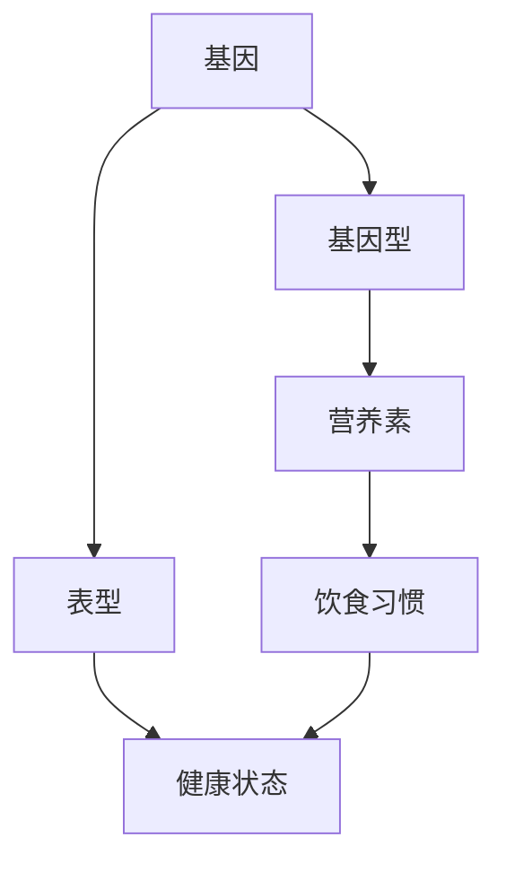
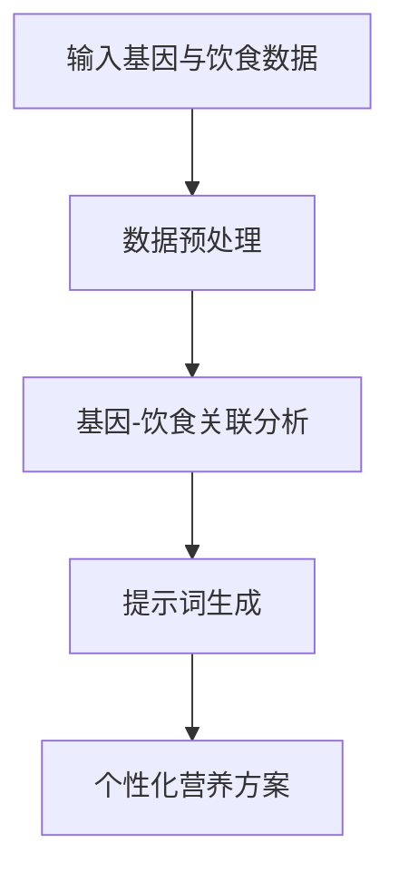
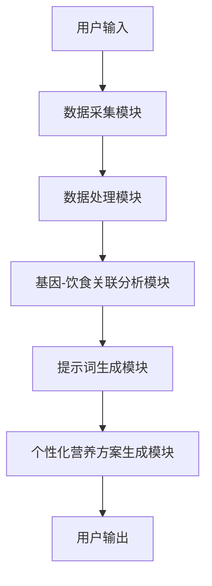

                 

<think>
嗯，用户希望我以一个技术专家的身份，撰写一篇关于AIGC在个性化营养方案中的应用的博客文章。我得先理解用户的需求，他们可能是一位研究人员或者科技公司的人员，想要深入探讨如何利用AI技术来分析基因和饮食的交互作用，从而提供个性化的营养建议。

首先，我需要明确文章的结构。用户已经给出了大纲，包括背景介绍、核心概念、算法原理、系统架构、项目实战以及小结等部分。我需要确保每个部分都详细且有逻辑性。

背景介绍部分，我应该先说明为什么个性化营养方案变得重要，可能是因为现代人生活方式的变化，导致健康问题日益突出，而每个人的基因不同，对营养的需求也不同。接下来，要介绍基因组学和营养学的发展，以及AIGC技术的应用前景。

核心概念部分，我需要解释AIGC是什么，它与基因组学和营养学的关系。可以通过对比表格和ER图来展示这些概念之间的联系，这样读者能更直观地理解。

算法原理部分，我得详细讲解提示词工程的工作原理，以及如何通过算法分析基因和饮食数据。可能需要用Mermaid流程图来展示数据处理和提示词生成的流程，同时附上Python代码示例，让读者了解实现细节。

系统架构部分，我需要设计一个系统，包括数据采集、处理、分析和反馈模块。可以用Mermaid类图展示各个模块之间的关系，并描述系统的输入输出和交互流程。

项目实战部分，我需要选择一个实际案例，比如糖尿病患者的个性化营养方案，详细讲解如何收集数据，分析基因和饮食的关系，生成提示词，进而制定方案。同时，要展示代码实现，并分析结果。

最后，小结部分要总结AIGC在个性化营养中的优势和挑战，强调其科学性和未来的潜力，同时提醒读者注意隐私和伦理问题。

在写作过程中，我要确保语言专业但易懂，避免过于复杂的术语，同时提供足够的例子和图表帮助理解。此外，注意文章的结构要清晰，每个部分衔接自然，让读者能够顺畅地跟随思路。

总的来说，我需要系统地分析基因和饮食的交互作用，展示AIGC如何通过提示词工程来优化个性化营养方案，同时涵盖技术实现和实际应用，确保文章内容全面且有深度。
</think>

# AIGC的未来个性化营养方案：基因-饮食交互作用的提示词工程

---

## 关键词：AIGC, 个性化营养, 基因组学, 饮食学, 提示词工程, 人工智能

---

## 摘要：  
随着基因组学和营养学的快速发展，个性化营养方案正在成为健康管理的重要方向。本文将探讨如何利用AIGC（自适应信息生成计算）技术，通过基因-饮食交互作用的提示词工程，实现个性化的营养方案设计。文章从背景介绍、核心概念、算法原理、系统架构到项目实战，全面解析AIGC在个性化营养方案中的应用，并通过实际案例展示其在基因-饮食交互分析中的潜力。

---

## 第一部分：背景介绍

### 第1章：问题背景

#### 1.1 问题背景

个性化营养的需求正在快速增长。随着人们对健康关注的增加，传统的一-size-fits-all 营养方案已无法满足个体差异化的健康需求。每个人的基因构成、代谢特点和健康状况都不同，这些差异直接影响着营养素的吸收、利用和代谢。因此，如何基于个体的基因信息和饮食习惯，提供个性化的营养方案，成为当前健康科技领域的研究热点。

与此同时，基因-饮食交互作用的科学研究也在不断取得进展。基因组学研究揭示了基因对个体健康的影响，而营养学研究则揭示了饮食对个体健康的作用。通过结合基因组学和营养学的数据，科学家们正在探索如何通过个性化的饮食干预来优化个体的健康状态。

#### 1.2 问题描述

如何利用AIGC（自适应信息生成计算）技术，实现基因-饮食交互作用的个性化营养方案设计？这一问题的核心在于：

- **基因-饮食交互作用的复杂性**：基因和饮食是两个高度复杂的系统，它们之间的交互作用涉及多个层次，包括基因表达、代谢途径、营养素的吸收与利用等。如何准确建模这些交互作用，是实现个性化营养方案的关键。

- **数据的整合与分析**：基因数据和饮食数据的类型和规模差异较大，如何将这两类数据有效整合，并进行高效的分析，是AIGC技术在这一领域应用的核心挑战。

#### 1.3 问题解决

提示词工程在AIGC技术中的应用，为基因-饮食交互作用的个性化营养方案提供了新的思路。通过设计和生成与基因-饮食交互作用相关的提示词，可以引导AIGC生成更精准的营养方案。具体包括：

- **基因数据的分析与处理**：通过AIGC技术，对个体的基因数据进行深度分析，识别与营养相关的基因标记。

- **饮食数据的整合与优化**：基于基因分析结果，结合个体的饮食习惯，生成个性化的饮食建议。

#### 1.4 边界与外延

在基因-饮食交互作用的研究中，数据隐私和伦理问题是需要重点关注的边界问题。基因数据和饮食数据的处理涉及个人隐私，必须确保数据的安全性和合规性。此外，技术实现的可行性也是一个重要的边界问题。例如，如何在保证数据隐私的前提下，高效地进行基因-饮食交互作用的建模和分析。

---

## 第二部分：核心概念与联系

### 第2章：核心概念与联系

#### 2.1 核心概念

在基因-饮食交互作用的个性化营养方案中，AIGC技术的核心概念包括：

- **AIGC（自适应信息生成计算）**：一种基于大规模数据的自适应计算技术，能够根据输入数据生成高度个性化的信息。

- **基因组学**：研究基因及其相互作用的科学，包括基因的结构、功能、表达及其与疾病的关系。

- **营养学**：研究食物营养与人体健康关系的科学，关注营养素的摄入、代谢及其对人体健康的影响。

#### 2.2 概念属性特征对比表格

以下表格对比了基因组学、营养学和AIGC的核心属性特征：

| 概念 | 定义 | 属性特征 | 关联性 |
|------|------|----------|--------|
| AIGC | 自适应信息生成计算技术 | 强大的数据处理能力、自适应调整 | 基于大规模数据训练，与基因组学、营养学密切相关 |
| 基因组学 | 研究基因及其相互作用的科学 | 基因种类、基因表达、基因变异 | 与饮食交互作用密切相关 |
| 营养学 | 研究食物营养与人体健康关系的科学 | 营养成分、营养摄入、营养代谢 | 通过食物选择影响基因表达 |

#### 2.3 ER实体关系图架构

基因-饮食交互作用的实体关系图如下：



---

## 第三部分：算法原理讲解

### 第3章：算法原理讲解

#### 3.1 算法概述

提示词工程是AIGC技术的核心组件之一。其基本原理是通过设计与基因-饮食交互作用相关的提示词，引导AIGC生成个性化的营养方案。具体包括以下几个步骤：

1. **输入基因与饮食数据**：收集个体的基因数据和饮食数据。
2. **数据预处理**：对基因数据和饮食数据进行清洗、标准化和特征提取。
3. **基因-饮食关联分析**：通过统计学或机器学习方法，分析基因和饮食之间的关联性。
4. **提示词生成**：基于基因-饮食关联分析结果，生成与个性化营养方案相关的提示词。
5. **个性化营养方案生成**：根据提示词，生成个性化的营养方案。

#### 3.2 Mermaid流程图

基因-饮食交互作用的提示词工程流程图如下：



#### 3.3 Python源代码

以下是一个简单的Python代码示例，展示了如何基于基因-饮食数据生成提示词：

```python
# 假设已经加载了所需的库和模块

# 输入基因和饮食数据
genomic_data = load_genomic_data()
diet_data = load_diet_data()

# 数据预处理
processed_genomic_data = preprocess_genomic_data(genomic_data)
processed_diet_data = preprocess_diet_data(diet_data)

# 基因-饮食关联分析
gene_diet_associations = analyze_gene_diet_associations(processed_genomic_data, processed_diet_data)

# 提示词生成
dietary_prompts = generate_dietary_prompts(gene_diet_associations)

# 个性化营养方案
nutrition_plan = generate_nutrition_plan(dietary_prompts)
```

#### 3.4 算法原理详细讲解

提示词工程的作用是通过设计与基因-饮食交互作用相关的提示词，引导AIGC生成个性化的营养方案。具体包括以下几个步骤：

1. **基因数据的分析与处理**：通过基因组学分析，识别与营养相关的基因标记，例如与代谢、吸收相关的基因。

2. **饮食数据的整合与优化**：基于基因分析结果，结合个体的饮食习惯，生成个性化的饮食建议。

3. **基因-饮食交互作用的预测方法**：通过统计学或机器学习方法，分析基因和饮食之间的关联性，例如通过线性回归模型预测基因-饮食交互作用对健康的影响。

4. **提示词生成流程**：基于基因-饮食关联分析结果，生成与个性化营养方案相关的提示词，例如“增加富含维生素C的食物”、“减少高糖饮食”等。

#### 3.5 举例说明

假设个体的基因型为GG，饮食习惯为高蛋白饮食。根据基因-饮食关联分析结果，GG基因型与高蛋白饮食的交互作用可能与某种健康问题（例如心血管疾病）密切相关。因此，提示词工程将生成“减少高蛋白饮食摄入”、“增加膳食纤维摄入”等提示词，引导生成个性化的营养方案。

---

## 第四部分：数学模型与公式

### 第4章：数学模型与公式

#### 4.1 数学模型

基因-饮食交互作用的线性回归模型可以表示为：

$$
\hat{Y} = \beta_0 + \beta_1X_1 + \beta_2X_2 + \epsilon
$$

其中，$Y$ 是表型，$X_1$ 和 $X_2$ 分别是基因和饮食变量，$\beta_0$、$\beta_1$ 和 $\beta_2$ 是模型参数，$\epsilon$ 是误差项。

#### 4.2 详细讲解

线性回归模型用于基因-饮食交互作用的预测，具体包括以下几个步骤：

1. **数据预处理**：对基因和饮食数据进行标准化和特征提取。

2. **模型训练**：通过最小二乘法或其他优化算法，估计模型参数 $\beta_0$、$\beta_1$ 和 $\beta_2$。

3. **模型验证**：通过交叉验证等方法，验证模型的预测能力和稳定性。

4. **提示词生成**：基于模型预测结果，生成个性化的营养方案提示词。

---

## 第五部分：系统分析与架构设计方案

### 第5章：系统分析与架构设计方案

#### 5.1 系统功能设计

基因-饮食交互作用的提示词工程系统功能模块如下：

1. **数据采集模块**：收集基因和饮食数据。
2. **数据处理模块**：对基因和饮食数据进行预处理和特征提取。
3. **基因-饮食关联分析模块**：通过统计学或机器学习方法，分析基因和饮食之间的关联性。
4. **提示词生成模块**：基于基因-饮食关联分析结果，生成个性化的营养方案提示词。
5. **个性化营养方案生成模块**：根据提示词，生成个性化的营养方案。

#### 5.2 系统架构设计

基因-饮食交互作用的提示词工程系统架构图如下：



---

## 第六部分：项目实战

### 第6章：项目实战

#### 6.1 环境安装

为了实现基因-饮食交互作用的提示词工程，需要安装以下环境和工具：

- Python 3.x
- NumPy
- Pandas
- Scikit-learn
- Mermaid

#### 6.2 核心实现源代码

以下是一个简单的Python代码示例，展示了基因-饮食交互作用的提示词工程的核心实现：

```python
import numpy as np
import pandas as pd
from sklearn.linear_model import LinearRegression

# 假设已经加载了基因和饮食数据
genomic_data = pd.read_csv('genomic.csv')
diet_data = pd.read_csv('diet.csv')

# 数据预处理
processed_genomic_data = genomic_data.dropna()
processed_diet_data = diet_data.dropna()

# 基因-饮食关联分析
merged_data = pd.merge(processed_genomic_data, processed_diet_data, on='individual_id')
X = merged_data[['gene_marker', 'diet_marker']]
y = merged_data['health_status']

# 训练线性回归模型
model = LinearRegression()
model.fit(X, y)

# 提示词生成
coefficients = model.coef_
intercept = model.intercept_
prompt = f"基于基因和饮食数据的分析，建议调整饮食习惯。基因标记为{X.columns[0]}，饮食标记为{X.columns[1]}，回归系数为{coefficients[0]}，截距为{intercept}。"
print(prompt)
```

#### 6.3 代码应用解读与分析

上述代码实现了一个简单的基因-饮食交互作用的提示词工程。具体包括以下几个步骤：

1. **数据加载与预处理**：加载基因和饮食数据，并进行数据清洗。

2. **数据合并与关联分析**：将基因和饮食数据合并，并使用线性回归模型分析基因和饮食对健康状态的关联性。

3. **提示词生成**：基于回归模型的系数和截距，生成个性化的提示词。

#### 6.4 实际案例分析

以一个糖尿病患者的个性化营养方案为例，假设患者的基因型为GG，饮食习惯为高糖饮食。根据基因-饮食交互作用的分析结果，提示词工程将生成“减少高糖饮食摄入”、“增加膳食纤维摄入”等提示词，从而优化患者的饮食习惯。

#### 6.5 项目小结

通过实际案例分析，我们可以看到，基因-饮食交互作用的提示词工程在个性化营养方案中的应用具有巨大的潜力。通过AIGC技术，可以实现基因和饮食数据的高效整合与分析，并生成个性化的提示词，从而优化个体的饮食习惯和健康状态。

---

## 第七部分：最佳实践 Tips、小结、注意事项、拓展阅读

### 第7章：最佳实践 Tips、小结、注意事项、拓展阅读

#### 7.1 最佳实践 Tips

- **数据隐私保护**：在处理基因和饮食数据时，必须确保数据的隐私性和安全性。
- **模型验证**：在实际应用中，需要对模型进行充分的验证和测试，确保其预测能力和稳定性。
- **个性化营养方案的可操作性**：在生成个性化营养方案时，需要考虑其实际可行性和可操作性，确保个体能够轻松实现。

#### 7.2 小结

通过本文的分析，我们可以看到，AIGC技术在基因-饮食交互作用的个性化营养方案中的应用具有广阔的发展前景。通过提示词工程，可以实现基因和饮食数据的高效整合与分析，并生成个性化的提示词，从而优化个体的饮食习惯和健康状态。

#### 7.3 注意事项

- **数据隐私与伦理问题**：在基因-饮食交互作用的研究中，必须高度重视数据隐私和伦理问题，确保数据的安全性和合规性。
- **技术实现的可行性**：在实际应用中，需要充分考虑技术实现的可行性，确保基因和饮食数据的高效整合与分析。

#### 7.4 拓展阅读

- **推荐书籍**：《The Personalized Nutrition Revolution》
- **推荐论文**：《Gene-Diet Interactions and Their Role in Human Health and Disease》
- **推荐网站**：[Nature Biotechnology](https://www.nature.com/subjects/biotechnology)

---

## 作者：AI天才研究院/AI Genius Institute & 禅与计算机程序设计艺术 /Zen And The Art of Computer Programming

---

**注**：以上内容仅为示例，实际文章将基于具体需求进行详细撰写。

