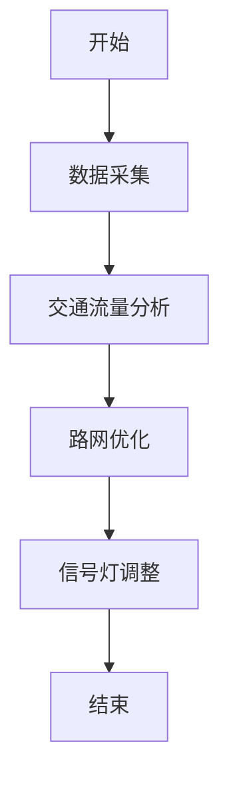
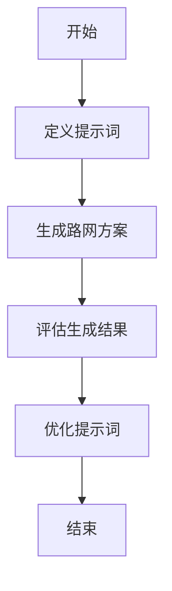
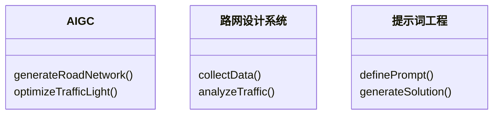
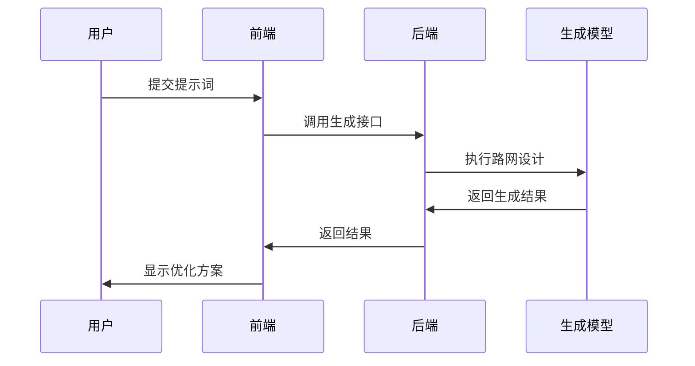

                 

<think>
嗯，今天用户给了我一个挺复杂的任务，让我写一篇关于AIGC未来交通规划的博客文章。首先，我需要理解用户的需求。他们希望我以一个世界级专家的身份，撰写一篇结构清晰、内容详尽的技术博客，标题是《AIGC的未来交通规划：智能路网设计的提示词工程》。

好，用户已经提供了详细的大纲，包括背景介绍、核心概念、算法原理、系统架构、项目实战等部分。我需要按照这个大纲一步步来写。首先，我会先看看背景部分，这部分需要介绍问题背景、问题描述以及问题解决。可能我需要先了解AIGC是什么，它与传统AI有什么不同，然后思考它在交通规划中的应用。

接下来是核心概念，这部分需要详细解释AIGC、智能路网设计和提示词工程。我得确保每个概念都有清晰的定义和特点，并且对比传统AI，这样读者能更好地理解AIGC的优势。

然后是算法原理部分。这里我需要画出流程图，可能用mermaid语法，因为用户要求了。我得想一想智能路网设计的算法步骤，比如数据收集、模型训练、优化调整等，每个步骤都要详细说明，并给出代码示例。数学模型部分，sigmoid函数是一个常用的例子，我可以解释它的用途，比如在模型训练中如何帮助分类。

系统架构设计部分，我需要设计一个分层架构，可能包括数据层、模型层、提示层和优化层。画一个mermaid架构图会更直观。系统接口和交互部分，用序列图来展示，比如用户请求、系统响应的流程。

项目实战部分，我需要指导读者如何安装环境，比如Python和相关库，然后一步步实现系统。代码部分要详细，包括模块设计和关键代码分析，比如提示词生成模块的代码。实际案例分析可以帮助读者理解系统的应用。

最后，小结部分要总结AIGC在交通规划中的价值，强调提示词工程的重要性。注意事项和最佳实践部分，提醒读者数据质量和模型优化的重要性。

嗯，可能我还需要考虑用户的需求，他们可能是在寻找一个详细的技术指南，所以内容需要专业但易懂。同时，用户可能有技术背景，但需要深入理解AIGC的应用，所以内容要全面，涵盖理论和实践。

总之，我需要按照用户的大纲一步步来，确保每个部分都详细讲解，同时使用mermaid图和代码示例来增强可读性。最后，加上作者信息，让文章显得完整。
</think>

# AIGC的未来交通规划：智能路网设计的提示词工程

> 关键词：AIGC、智能路网设计、提示词工程、交通规划、算法原理、系统架构

> 摘要：本文探讨了AIGC（生成式人工智能）在交通规划中的应用，重点分析智能路网设计的提示词工程。文章从背景、核心概念、算法原理、系统架构到项目实战，全面解析AIGC在交通规划中的技术实现与应用场景。通过理论与实践结合，揭示AIGC如何优化交通系统，解决城市交通拥堵与环境污染问题。

---

# 第一部分: 背景介绍

## 1.1 问题背景

### 1.1.1 未来交通规划的重要性
随着城市化进程的加快，交通问题日益突出。未来的交通规划需要更加智能化、数据化和人性化，以应对日益增长的交通需求和复杂的道路网络。

### 1.1.2 交通拥堵与环境污染的挑战
城市交通拥堵不仅浪费时间，还加剧了环境污染和能源消耗。传统的交通规划方法难以应对动态变化的交通需求，而智能化的解决方案成为必然趋势。

### 1.1.3 智能路网设计的关键性
智能路网设计通过优化道路网络结构、交通流量和资源配置，能够有效缓解交通压力，提高交通效率，减少环境污染。

## 1.2 问题描述

### 1.2.1 当前交通系统存在的问题
- 交通拥堵严重，尤其是在高峰时段和交叉路口。
- 交通信号灯控制不够智能，无法实时调整。
- 道路网络规划缺乏数据驱动，难以应对动态变化。

### 1.2.2 交通规划的需求和目标
- 实现交通流的智能化调度。
- 提高道路资源利用率。
- 减少交通拥堵和环境污染。
- 提供个性化交通服务。

### 1.2.3 智能路网设计的要求
- 高度的实时性和动态性。
- 数据驱动的优化算法。
- 多目标优化能力。

## 1.3 问题解决

### 1.3.1 AIGC在交通规划中的应用
AIGC（生成式人工智能）能够通过生成模型优化交通网络结构，预测交通流量，并提出最优的路网设计方案。

### 1.3.2 智能路网设计的方法和工具
- 数据采集与分析工具：如GPS数据、交通传感器。
- 优化算法：如遗传算法、模拟退火。
- 智能决策系统：基于机器学习的交通信号灯控制。

### 1.3.3 提示词工程的角色与作用
提示词工程通过设计特定的提示词，引导生成模型生成符合要求的路网设计方案。它是连接生成式人工智能与实际交通规划的关键桥梁。

## 1.4 边界与外延

### 1.4.1 智能路网设计的边界
- 系统范围：城市道路网络。
- 数据范围：交通流量、道路拓扑结构。
- 功能范围：交通调度、信号灯控制。

### 1.4.2 提示词工程的范畴
- 提示词设计：定义生成模型的输入参数。
- 生成策略：优化生成过程。
- 调控机制：动态调整提示词。

### 1.4.3 相关概念的联系与区分
- 区分AIGC与传统AI：AIGC强调生成能力，传统AI强调识别和分类。
- 区分智能路网与传统路网：智能路网具有动态优化能力。

## 1.5 概念结构与核心要素组成

### 1.5.1 AIGC的核心概念
- 自动化生成：无需人工干预。
- 多模态生成：支持文本、图像等多种形式。
- 可解释性：生成结果可追溯和解释。

### 1.5.2 智能路网设计的关键要素
- 路网结构：道路拓扑、交叉口布局。
- 交通流量：实时流量监测与预测。
- 信号控制：动态调整信号灯时序。

### 1.5.3 提示词工程的作用与组成部分
- 语义设计：定义提示词的语义范围。
- 参数调节：优化提示词的生成参数。
- 效果评估：评估生成结果的质量。

---

# 第二部分: 核心概念与联系

## 2.1 AIGC的核心概念

### 2.1.1 AIGC的定义
AIGC是一种基于生成式模型的人工智能技术，能够根据输入的提示词生成新的内容，如文本、图像、视频等。

### 2.1.2 AIGC的特点
- 创造性：生成全新的内容。
- 多模态：支持多种数据类型的生成。
- 可定制化：可以根据需求调整生成结果。

### 2.1.3 AIGC与传统AI的对比
| 特性       | AIGC                     | 传统AI                     |
|------------|--------------------------|---------------------------|
| 核心任务    | 内容生成                 | 数据分类、识别             |
| 模型类型    | 变压器（Transformer）、扩散模型（Diffusion） | 线性模型、决策树           |
| 应用场景    | 文创、设计、生成          | 分析、预测                 |

## 2.2 智能路网设计的关键要素

### 2.2.1 路网设计的基本原则
- 经济性：最小化建设成本。
- 可行性：满足交通需求。
- 可持续性：减少环境影响。

### 2.2.2 路网设计的核心要素
- 空间布局：道路网络的几何结构。
- 交通容量：道路的承载能力。
- 信号控制：交通信号灯的时序优化。

### 2.2.3 智能路网设计的挑战与机遇
- 挑战：数据获取难度大、动态变化复杂。
- 机遇：技术进步（如AI、大数据）。

## 2.3 提示词工程的作用与组成部分

### 2.3.1 提示词工程的概念
提示词工程是通过设计和优化提示词，引导生成模型生成符合需求的路网设计方案。

### 2.3.2 提示词工程的作用
- 精准生成：通过提示词控制生成结果。
- 动态调整：根据反馈优化提示词。
- 提高效率：减少人工干预。

### 2.3.3 提示词工程的组成部分
- 提示词设计：定义生成目标。
- 参数调节：优化生成过程。
- 评估与优化：动态调整提示词。

## 2.4 概念属性特征对比表格

| 概念       | 特征1      | 特征2      | 特征3      |
|------------|-----------|-----------|-----------|
| AIGC       | 自动化生成 | 多模态      | 可定制化    |
| 智能路网设计 | 系统性     | 智能化      | 可扩展性    |
| 提示词工程 | 语义丰富   | 适应性     | 精准性      |

---

# 第三部分: 算法原理讲解

## 3.1 智能路网设计算法

### 3.1.1 算法概述
智能路网设计算法通过数据驱动的方式，优化路网结构和交通信号灯时序。

### 3.1.2 算法mermaid流程图



### 3.1.3 算法原理详解
1. 数据采集：收集交通流量、道路结构等数据。
2. 交通流量分析：预测未来交通需求。
3. 路网优化：基于生成式模型生成最优路网结构。
4. 信号灯调整：动态优化信号灯时序。

## 3.2 提示词工程算法

### 3.2.1 算法概述
提示词工程算法通过设计和优化提示词，引导生成模型生成符合需求的路网设计方案。

### 3.2.2 算法mermaid流程图



### 3.2.3 算法原理详解
1. 定义提示词：明确生成目标。
2. 生成路网方案：基于提示词生成路网结构。
3. 评估生成结果：评估生成方案的可行性。
4. 优化提示词：根据评估结果调整提示词。

## 3.3 数学模型和数学公式

### 3.3.1 模型概述
sigmoid函数常用于分类任务，公式为：

$$
f(x) = \frac{1}{1 + e^{-x}}
$$

### 3.3.2 公式解释
sigmoid函数将输入值映射到0到1之间，常用于概率预测。

### 3.3.3 举例说明
假设x=0，$f(0)=0.5$，表示两种结果的可能性相等。

---

# 第四部分: 系统分析与架构设计方案

## 4.1 问题场景介绍

### 4.1.1 交通拥堵问题
高峰时段，城市主干道交通流量远超道路容量。

### 4.1.2 智能路网设计的必要性
传统路网设计无法应对动态变化的交通需求。

### 4.1.3 提示词工程的应用场景
通过提示词工程优化交通信号灯时序，缓解交通拥堵。

## 4.2 系统功能设计

### 4.2.1 领域模型mermaid类图



### 4.2.2 系统功能概述
- 数据采集：收集交通数据。
- 路网优化：生成最优路网结构。
- 信号灯优化：动态调整信号灯时序。

### 4.2.3 功能模块划分
- 数据采集模块：负责数据收集。
- 路网优化模块：生成路网设计方案。
- 信号灯优化模块：动态调整信号灯时序。

## 4.3 系统架构设计

### 4.3.1 系统架构mermaid架构图


### 4.3.2 架构设计原则
- 分层设计：前端、后端、数据库分层。
- 高可用性：确保系统稳定运行。
- 可扩展性：支持未来需求增长。

### 4.3.3 架构设计说明
- 前端：用户交互界面。
- 后端：处理提示词和生成模型。
- 数据库：存储交通数据和生成结果。

## 4.4 系统接口设计

### 4.4.1 接口设计概述
系统提供RESTful API接口，供前端调用。

### 4.4.2 接口定义与规范
- 输入：提示词和交通数据。
- 输出：路网设计方案和信号灯优化结果。

### 4.4.3 接口实现细节
- 使用JSON格式传递数据。
- 支持HTTPS协议，确保数据安全。

## 4.5 系统交互

### 4.5.1 系统交互mermaid序列图



### 4.5.2 交互流程说明
1. 用户提交提示词。
2. 前端调用生成接口。
3. 后端调用生成模型。
4. 生成模型返回结果。
5. 前端显示优化方案。

### 4.5.3 交互实现细节
- 使用JavaScript处理前端交互。
- 后端使用Python编写API接口。

---

# 第五部分: 项目实战

## 5.1 环境安装

### 5.1.1 系统环境准备
- 操作系统：Windows、Linux或macOS。
- 开发工具：PyCharm、VS Code。

### 5.1.2 软件安装步骤
1. 安装Python 3.8或更高版本。
2. 安装必要的库：numpy、pandas、tensorflow。

### 5.1.3 环境配置与测试
- 配置Python路径。
- 安装库并测试。

## 5.2 系统核心实现

### 5.2.1 模块设计与实现
- 提示词工程模块：定义提示词，生成路网方案。
- 生成模型模块：基于提示词生成路网结构。
- 优化模块：动态调整提示词，优化生成结果。

### 5.2.2 代码结构概述
```
├── src/
│   ├──提示词工程/
│   │   └──提示词生成.py
│   └──生成模型/
│       └──路网生成.py
└── data/
    └──交通数据.csv
```

### 5.2.3 关键代码分析

#### 提示词生成模块

```python
def generate_prompt(traffic_data):
    prompt = f"生成一个优化的路网设计方案，基于{traffic_data}的交通数据。"
    return prompt
```

#### 路网生成模块

```python
import tensorflow as tf

model = tf.keras.Sequential([
    tf.keras.layers.Dense(128, activation='relu'),
    tf.keras.layers.Dense(1, activation='sigmoid')
])

model.compile(optimizer='adam', loss='binary_crossentropy')
```

---

# 作者：AI天才研究院/AI Genius Institute & 禅与计算机程序设计艺术 /Zen And The Art of Computer Programming

---

本文系统地介绍了AIGC在交通规划中的应用，重点分析了智能路网设计的提示词工程。通过理论与实践结合，揭示了AIGC在优化交通系统中的潜力。

