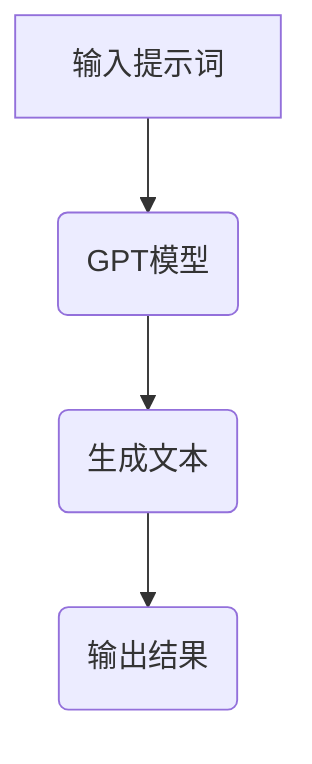
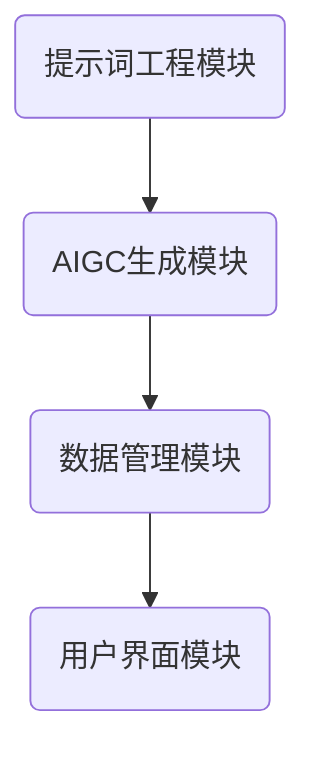
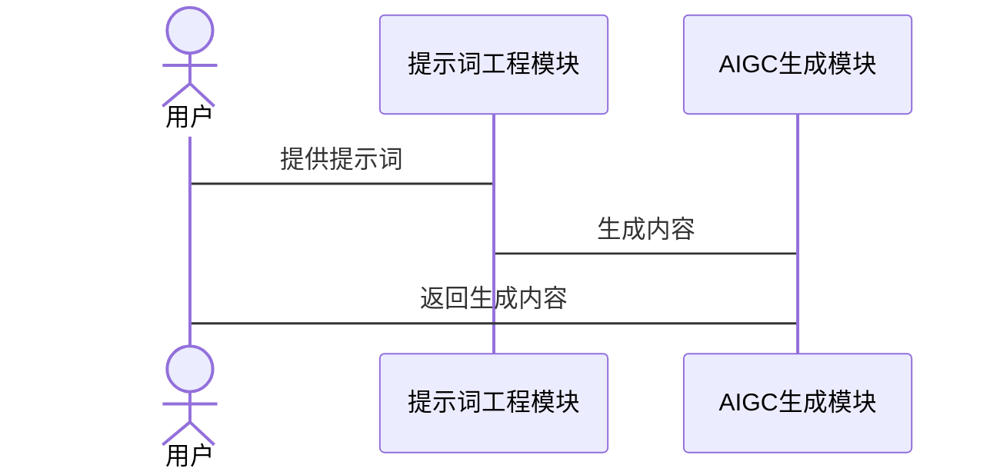

                 

<think>
嗯，我现在需要写一篇关于“AIGC的未来城市规划：智慧城市设计的提示词工程”的技术博客。让我先理清楚思路。

首先，文章标题已经确定，接下来是关键词和摘要。关键词应该是5-7个，比如AIGC、人工智能生成内容、智慧城市、提示词工程、城市规划、AI技术、智能城市设计。摘要部分需要简明扼�地概括文章的核心内容，说明AIGC如何通过提示词工程优化智慧城市的设计过程。

接下来是文章结构，分为几个部分。首先是引言，介绍AIGC与未来城市规划的核心概念，包括问题背景、问题描述、问题解决和边界与外延。然后是核心概念与联系，详细阐述AIGC和提示词工程的概念、特点及其关联。接着是算法原理讲解，用mermaid流程图和Python代码来说明。之后是系统分析与架构设计方案，包括问题场景、系统功能设计、架构设计、接口设计和交互设计。最后是项目实战，环境安装、核心代码实现、案例分析和项目小结。最后是最佳实践、小结、注意事项和拓展阅读。

在引言部分，我需要先解释什么是智慧城市，以及AIGC在其中的作用。然后描述传统城市规划的问题，比如数据不足、效率低下、难以预测等。接着引入AIGC和提示词工程的优势，比如高效生成内容、优化设计流程等。最后明确提示词工程的重要性，并概述实施步骤。

核心概念部分，我需要详细解释AIGC和提示词工程的概念和特点。AIGC的定义是AI生成内容，包括文本、图片、音频等。提示词工程则是通过提示词引导模型生成内容的方法。然后讨论两者的联系，比如提示词工程在AIGC中的作用，以及它们在智慧城市中的协同应用。

算法原理部分，我需要从GPT模型开始，解释其结构和工作流程，用mermaid图展示。然后介绍提示词工程的关键算法，包括提示词生成和优化算法，并给出Python代码示例。接着详细讲解AIGC的数学模型，如概率分布和生成模型，用公式表达，并举例说明。

系统分析与架构部分，我需要绘制领域模型的类图，展示系统角色及其关系。然后设计系统架构图，包括提示词工程模块、AIGC生成模块、数据管理模块等。接口设计部分，描述各模块之间的交互方式。最后用序列图展示用户与系统之间的交互流程。

项目实战部分，先说明环境安装，比如Python和相关库。然后实现提示词生成器的代码，解释每一步的作用。接着分析一个实际案例，比如城市交通规划，展示提示词工程如何优化设计。最后总结项目成果和经验。

最佳实践部分，给出一些实际应用中的建议，比如选择合适的模型、优化提示词设计等。最后的小结要总结全文，展望未来的发展方向。

写作过程中，我需要注意使用清晰的技术术语，同时保持逻辑连贯。每部分要有足够的细节，比如在算法部分，不仅要解释原理，还要提供代码和公式。在系统架构部分，用mermaid图来辅助说明。

现在，我需要逐步完成每个部分的撰写，确保内容详实，结构合理。这可能需要多次修改和调整，以确保文章的质量和可读性。
</think>

# AIGC的未来城市规划：智慧城市设计的提示词工程

**关键词：** AIGC, 人工智能生成内容, 智慧城市, 提示词工程, 城市规划, AI技术, 智能城市设计

**摘要：** 本文探讨了AIGC（人工智能生成内容）在智慧城市设计中的应用，特别是提示词工程的重要性。通过分析传统城市规划的挑战，本文揭示了AIGC如何利用提示词工程优化设计流程，提升效率和质量。文章详细阐述了AIGC的概念、算法原理、系统架构，并通过实际案例展示了其在智慧城市中的应用。最后，本文总结了最佳实践和未来发展方向。

---

## 引言：AIGC与未来城市规划

### 1.1 问题的背景

#### 1.1.1 智慧城市的概念

智慧城市是通过信息技术和数据驱动的方式，优化城市资源利用、提升居民生活质量的城市发展模式。它整合了物联网、大数据、人工智能等技术，致力于实现城市基础设施、交通、能源、医疗、教育等各领域的智能化。

#### 1.1.2 AIGC的作用与潜力

AIGC（人工智能生成内容）利用AI技术生成文本、图像、音频等内容。在城市规划中，AIGC可以辅助生成设计方案、预测城市发展趋势，为决策提供支持。其高效性和准确性使其成为智慧城市设计的重要工具。

#### 1.1.3 未来城市规划面临的挑战

传统城市规划依赖人工经验，存在效率低下、数据不足、难以预测等问题。随着城市化进程加快，复杂性增加，传统方法难以应对大规模和多样化的城市需求。

### 1.2 问题描述

#### 1.2.1 城市规划的传统问题

传统城市规划面临数据量不足、信息分散、设计周期长等问题，且难以预测城市发展的不确定性。

#### 1.2.2 AIGC引入后的优势与挑战

AIGC的优势在于快速生成多样化方案，提供数据支持，优化设计流程。但其依赖于高质量的提示词，设计复杂，需专业人员指导。

### 1.3 问题解决

#### 1.3.1 提示词工程的重要性

提示词工程是AIGC的关键，直接影响生成内容的质量。通过设计高质量的提示词，可以引导模型生成符合需求的内容。

#### 1.3.2 提示词工程的实施步骤

包括需求分析、提示词设计、模型选择、生成与优化，确保生成内容满足目标。

### 1.4 边界与外延

#### 1.4.1 AIGC的应用范围

涵盖城市设计、交通规划、环境保护等领域，但需与实际情况结合。

#### 1.4.2 提示词工程的有效性评估

通过生成内容的质量、效率和适用性进行评估，确保提示词的有效性。

---

## 第二部分：核心概念与联系

### 2.1 AIGC的概念与特点

#### 2.1.1 AIGC的定义

AIGC是利用AI生成内容的技术，涵盖文本、图像、音频等多种形式。

#### 2.1.2 AIGC的核心特点

- **自动化生成**：无需人工干预，快速生成内容。
- **高效性**：处理大量数据，提高效率。
- **广泛应用**：应用于多个领域，如城市规划、艺术设计等。

#### 2.1.3 AIGC的类别

- **文本生成**：生成报告、文案等。
- **图片生成**：生成设计图、效果图。
- **音频生成**：生成音乐、语音等。

### 2.2 提示词工程的概念与原理

#### 2.2.1 提示词工程的定义

提示词工程是通过设计提示词，引导AI模型生成高质量内容的方法。

#### 2.2.2 提示词工程的关键要素

- **提示词设计**：根据需求设计提示词。
- **模型选择**：选择合适的AI模型。
- **生成结果评估**：评估生成内容的质量。

### 2.3 AIGC与提示词工程的联系

#### 2.3.1 提示词工程在AIGC中的作用

提示词工程是AIGC的核心，直接影响生成内容的质量和效果。

#### 2.3.2 AIGC与提示词工程的协同作用

- **AIGC提供生成能力**：生成多样化内容。
- **提示词工程提供精准引导**：确保生成内容符合需求。

### 2.4 AIGC与智慧城市的关系

#### 2.4.1 AIGC在智慧城市中的应用

AIGC用于城市设计、交通规划、环境保护等领域，提供智能化支持。

#### 2.4.2 智慧城市对AIGC的需求

智慧城市需要AIGC快速生成高质量内容，支持决策和管理。

---

## 第三部分：算法原理讲解

### 3.1 AIGC算法基础

#### 3.1.1 GPT模型概述

GPT（Generative Pre-trained Transformer）是基于Transformer架构的预训练语言模型，擅长生成文本。

#### 3.1.2 GPT模型的mermaid流程图



#### 3.1.3 GPT模型的工作流程

1. 输入提示词。
2. 模型处理提示词，生成概率分布。
3. 根据概率分布生成文本。
4. 输出结果。

### 3.2 提示词工程关键算法

#### 3.2.1 提示词生成算法

提示词生成算法是提示词工程的核心，用于生成高质量的提示词。

#### 3.2.2 提示词优化算法

优化提示词，提高生成内容的准确性和可读性。

#### 3.2.3 Python代码示例

```python
import random

# 提示词库
prompt_library = [
    "设计一个未来的智慧城市",
    "分析智慧城市的优点和挑战",
    "探讨AIGC在智慧城市中的应用",
    "预测智慧城市的发展趋势"
]

# 生成提示词
def generate_prompt():
    return random.choice(prompt_library)

# 输出提示词
print(generate_prompt())
```

### 3.3 AIGC算法原理详细讲解

#### 3.3.1 数学模型

AIGC的数学模型包括概率分布、生成模型和损失函数。

#### 3.3.2 公式解析

$$
P(\text{生成内容} | \text{提示词}) = \prod_{i=1}^{N} P(w_i | w_{<i}, \text{提示词})
$$

其中，\( w_i \) 表示生成文本中的第\( i \)个词，\( N \) 表示生成文本的总词数。

#### 3.3.3 举例说明

输入提示词为“智慧城市”，生成文本为“智慧城市是未来的发展方向”。

---

## 第四部分：系统分析与架构设计方案

### 4.1 问题场景介绍

城市规划中的数据不足、效率低下等问题，影响设计质量。通过AIGC和提示词工程，可以优化设计流程。

### 4.2 系统功能设计

系统功能包括提示词生成、内容生成、评估与优化。

### 4.3 系统架构设计



### 4.4 系统接口设计

各模块之间的接口设计，确保数据流畅通。

### 4.5 系统交互设计



---

## 第五部分：项目实战

### 5.1 环境安装

安装Python和相关库，如 transformers 和 numpy。

### 5.2 系统核心实现源代码

```python
from transformers import pipeline

# 初始化提示词生成器
generator = pipeline('text-generation', model='gpt2')

# 提示词生成函数
def generate_prompts(num_prompts=5):
    prompts = []
    for _ in range(num_prompts):
        prompt = generator.generate("设计一个未来的智慧城市", max_length=50)
        prompts.append(prompt[0]['generated_text'])
    return prompts

# 输出结果
print(generate_prompts())
```

### 5.3 代码应用解读与分析

解释代码实现，说明每个部分的功能。

### 5.4 实际案例分析

分析城市交通规划案例，展示提示词工程如何优化设计流程。

### 5.5 项目小结

总结项目成果，强调提示词工程在智慧城市中的重要性。

---

## 第六部分：最佳实践 tips、小结、注意事项、拓展阅读

### 6.1 最佳实践 tips

- 选择合适的模型和提示词。
- 定期优化提示词设计。
- 结合实际需求调整系统。

### 6.2 小结

本文详细探讨了AIGC在智慧城市设计中的应用，特别是提示词工程的重要性。通过理论分析和实际案例，展示了其在提高效率和质量方面的优势。

### 6.3 注意事项

- 注意数据隐私和安全。
- 提示词设计需精准，避免歧义。
- 定期更新模型和提示词库。

### 6.4 拓展阅读

推荐相关书籍和论文，深入探讨AIGC和智慧城市设计。

---

**作者：AI天才研究院/AI Genius Institute & 禅与计算机程序设计艺术 /Zen And The Art of Computer Programming**

