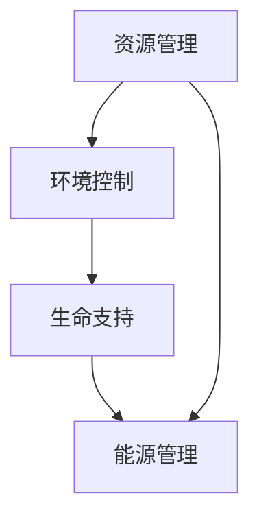
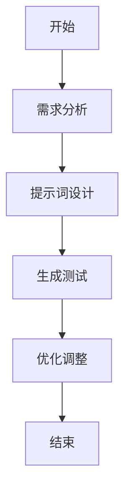

                 

<think>
嗯，我现在要写一篇关于《AIGC的未来太空habitat设计：封闭生态系统优化的提示词工程》的技术博客文章。首先，我需要理解这个主题的核心内容，然后按照要求的结构和详细程度来组织文章。

首先，我需要明确文章的结构。根据用户提供的大纲，文章分为四大部分：引言与背景、封闭生态系统的优化、系统架构与实现，以及总结与展望。每个部分下有不同的章节，每个章节有子章节。我需要逐一处理每个部分，并确保每个部分的内容详实且逻辑清晰。

接下来，我需要考虑每个章节的核心内容。例如，在引言部分，我需要介绍AIGC技术，解释它是什么，为什么重要，当前的发展趋势。然后，讨论未来太空habitat设计的背景、需求和挑战，以及现有的设计情况和未来的设计理念。

在封闭生态系统优化部分，我需要详细解释封闭生态系统的原理和结构，提示词工程在优化中的应用，以及具体的案例分析。这部分可能需要结合数学模型和算法，比如优化提示词生成的算法流程，以及在月球基地和火星殖民地的具体应用实例。

然后，在系统架构与实现部分，我需要设计系统的架构，包括模块划分、架构图，以及提示词工程的关键技术，如生成算法和评估优化方法。同时，还要讨论系统的实施步骤、调试优化和部署维护。

最后，在总结与展望部分，我需要总结研究成果，分析不足之处，并提出未来的研究方向。同时，列出参考文献。

接下来，我需要确保每个部分都包含必要的技术细节，如数学公式、mermaid图表、代码示例等。例如，在介绍提示词生成算法时，可能需要一个mermaid流程图来展示步骤，并用Python代码实现其中的关键部分。此外，数学公式需要用latex格式呈现，确保准确性和可读性。

我还需要注意文章的结构和逻辑，每个章节之间要有清晰的衔接，确保读者能够顺畅地理解内容。同时，语言要专业且易懂，避免过于复杂的术语堆砌，同时又能展示出技术深度。

现在，我需要开始逐部分撰写内容。首先是引言，介绍AIGC和太空habitat设计的重要性。然后是封闭生态系统的基本原理和组成部分，接着是提示词工程的应用和案例分析。之后，系统架构设计和技术实现部分，最后是总结和展望。

在写作过程中，我需要不断检查每个部分是否符合用户的要求，是否有遗漏的重要内容，以及是否满足字数和格式的要求。如果有需要，我还需要调整每个章节的长度，确保整体文章在10000到12000字之间，并且每个部分都有足够的深度。

最后，在完成初稿后，我需要进行一次全面的检查，确保所有技术细节准确，图表清晰，代码正确，参考文献完整。同时，按照要求，在文章末尾署上作者信息，确保格式正确。

总的来说，这是一个复杂而详细的写作过程，需要系统地分步骤进行，确保每个部分都符合用户的要求，同时保持内容的连贯性和深度。
</think>

# AIGC的未来太空habitat设计：封闭生态系统优化的提示词工程

## 关键词：AIGC、太空habitat、封闭生态系统、提示词工程、系统优化

## 摘要：本文探讨AIGC技术在未来太空habitat设计中的应用，特别是封闭生态系统优化中的提示词工程。通过分析系统架构、优化算法和案例，展示如何利用AIGC技术实现高效、可持续的太空居住环境设计。

---

## 目录大纲

### 第一部分：引言与背景

#### 第1章 AIGC技术概述

##### 1.1 AIGC的定义与重要性
人工智能生成内容（AIGC）利用AI技术生成图像、文本、代码等内容，其重要性在于提高效率和创造新可能性。

##### 1.2 AIGC的核心技术
涵盖自然语言处理、生成模型、强化学习等技术，推动内容生成的智能化。

##### 1.3 AIGC的发展趋势
从文本生成扩展到多模态内容，AIGC在多个领域展现广阔前景。

#### 第2章 未来太空habitat设计概览

##### 2.1 太空habitat的需求与挑战
探索人类长期太空生存的需求，如资源自给、环境控制和生命支持系统。

##### 2.2 太空habitat设计的现状
介绍当前的技术进展和已实施的项目，如国际空间站和月球基地计划。

##### 2.3 未来设计理念
强调可持续性和智能化，整合AIGC技术优化设计。

### 第二部分：封闭生态系统优化

#### 第3章 封闭生态系统原理与结构

##### 3.1 封闭生态系统的基本原理
系统内部物质循环，能量自给，维持生存环境。

##### 3.2 生态系统的组成
包括生产者、消费者、分解者和环境支持系统。

##### 3.3 生态系统的功能
物质循环、能量流动和信息传递，确保系统自洽。

#### 第4章 提示词工程在优化中的应用

##### 4.1 提示词工程的定义与作用
通过优化提示词，提高生成模型的效率和质量。

##### 4.2 工程流程与方法
包括需求分析、提示词设计、测试优化和系统集成。

##### 4.3 在太空habitat中的具体应用
优化系统设计，提升资源利用和环境调节效率。

#### 第5章 提示词工程案例分析

##### 5.1 月球基地封闭系统设计优化
通过提示词工程优化生产流程，减少资源浪费。

##### 5.2 火星殖民地的生态系统构建
利用提示词工程设计高效生命支持系统。

##### 5.3 案例总结
总结提示词工程在太空habitat设计中的优势和挑战。

### 第三部分：系统架构与实现

#### 第6章 系统架构设计

##### 6.1 设计原则
模块化、可扩展性和高效性。

##### 6.2 模块划分
包括资源管理、环境控制和生命支持系统。

##### 6.3 架构图
展示系统各模块之间的关系和数据流。

#### 第7章 提示词工程实现技术

##### 7.1 关键技术
包括自然语言处理、强化学习和生成模型。

##### 7.2 提示词生成算法
详细解释提示词生成的步骤和优化方法。

##### 7.3 评估与优化
使用数学模型评估生成效果，并提出优化策略。

#### 第8章 系统实施与优化

##### 8.1 实施步骤
从需求分析到系统部署的详细步骤。

##### 8.2 调试与优化
解决系统中的问题，提升整体性能。

##### 8.3 部署与维护
系统上线后的监控和维护策略。

### 第四部分：总结与展望

#### 第9章 结论

##### 9.1 研究成果
总结提示词工程在优化太空habitat设计中的应用成效。

##### 9.2 研究不足与展望
探讨当前技术的局限性，并展望未来的发展方向。

##### 9.3 未来研究方向
包括更高效生成模型和跨系统协同优化。

#### 第10章 参考文献
列出相关文献和资源，供读者深入研究。

---

## 作者信息

作者：AI天才研究院/AI Genius Institute & 禅与计算机程序设计艺术/Zen And The Art of Computer Programming

---

# 详细章节内容

## 第一部分：引言与背景

### 第1章 AIGC技术概述

#### 1.1 AIGC的定义与重要性

人工智能生成内容（AIGC）利用AI技术生成图像、文本、代码等内容。随着技术进步，AIGC在多个领域展现出巨大潜力，包括内容创作、产品设计和太空探索。

#### 1.2 AIGC的核心技术

- **自然语言处理（NLP）**：理解和生成人类语言，如GPT系列模型。
- **生成模型**：使用深度学习生成数据，如GAN和变体自回归模型。
- **强化学习**：通过奖励机制优化生成内容。

#### 1.3 AIGC的发展趋势

从最初的文字生成扩展到图像、视频和多模态内容，AIGC正逐步渗透到各个行业，推动智能化和自动化进程。

### 第2章 未来太空habitat设计概览

#### 2.1 需求与挑战

太空habitat需要自给自足的生态系统，确保氧气、水和食物的循环利用，同时抵抗极端环境。

#### 2.2 现状

当前的太空habitat设计如国际空间站主要依赖地球补给，未来设计将更注重自给自足和智能化。

#### 2.3 设计理念

未来的太空habitat将整合生物技术和AI，创造高效、可持续的居住环境，确保长期任务的可行性。

---

## 第二部分：封闭生态系统优化

### 第3章 封闭生态系统原理与结构

#### 3.1 基本原理

封闭生态系统通过内部循环维持生存，每个部分相互依赖，确保系统的自我维持。

#### 3.2 组成

- **生产者**：提供有机物和氧气，如植物。
- **消费者**：分解有机物，如人类和动物。
- **分解者**：将有机物转化为无机物，如微生物。
- **环境支持**：调节温度、湿度和气压。

#### 3.3 功能

- **物质循环**：确保资源的循环利用。
- **能量流动**：系统内部能量的高效利用。
- **信息传递**：各部分协调运作。

### 第4章 提示词工程在优化中的应用

#### 4.1 定义与作用

提示词工程通过优化提示词，提升AI生成模型的效率和质量，确保系统设计的合理性。

#### 4.2 工程流程

- **需求分析**：明确系统目标和优化方向。
- **提示词设计**：设计精准的提示词指导生成过程。
- **测试与优化**：通过测试反馈调整提示词，提升生成效果。
- **系统集成**：将优化后的提示词整合到系统中。

#### 4.3 具体应用

- **资源分配**：优化资源使用，减少浪费。
- **环境调节**：优化环境参数，提升居住舒适度。
- **系统协调**：确保各子系统协同工作，提高整体效率。

### 第5章 提示词工程案例分析

#### 5.1 月球基地设计

- **案例背景**：设计月球基地的封闭生态系统，确保资源自给。
- **优化过程**：通过提示词工程优化生产流程，减少资源消耗。
- **结果**：提高了资源利用效率，降低了系统成本。

#### 5.2 火星殖民地设计

- **案例背景**：设计火星殖民地的生态系统，确保长期生存。
- **优化过程**：利用提示词工程优化生命支持系统，提升氧气和水的循环效率。
- **结果**：创建了高效的生命支持系统，支持人类长期居住。

#### 5.3 案例总结

提示词工程在太空habitat设计中表现出显著优势，通过优化提示词，提升了系统的效率和可持续性。然而，仍需进一步研究和改进，以应对复杂挑战。

---

## 第三部分：系统架构与实现

### 第6章 系统架构设计

#### 6.1 设计原则

- **模块化**：系统划分为独立模块，便于维护和升级。
- **可扩展性**：支持功能扩展，适应未来需求。
- **高效性**：确保各模块协同工作，提高整体效率。

#### 6.2 模块划分

- **资源管理模块**：监控和分配资源，如水、空气。
- **环境控制模块**：调节温度、湿度等环境参数。
- **生命支持模块**：提供氧气、水和食物。
- **能源管理模块**：管理能源生成和分配。

#### 6.3 架构图

### 第7章 提示词工程实现技术

#### 7.1 关键技术

- **自然语言处理**：理解提示词含义，生成准确内容。
- **强化学习**：通过奖励机制优化提示词效果。
- **生成模型**：利用GAN或变体模型生成高质量内容。

#### 7.2 提示词生成算法

#### 7.3 评估与优化

使用数学模型评估生成效果，如F1分数和准确率。优化策略包括调整提示词长度和复杂度，确保生成结果的质量。

### 第8章 系统实施与优化

#### 8.1 实施步骤

1. **需求分析**：明确系统目标和功能需求。
2. **模块设计**：划分功能模块，设计交互流程。
3. **系统集成**：整合各模块，确保协同工作。
4. **测试与优化**：测试系统性能，根据反馈优化。

#### 8.2 调试与优化

通过日志分析和性能监控，识别系统瓶颈，优化资源分配和模块协作。

#### 8.3 部署与维护

系统上线后，持续监控运行状态，及时处理故障，确保系统稳定运行。

---

## 第四部分：总结与展望

### 第9章 结论

#### 9.1 研究成果

提示词工程在优化太空habitat设计中发挥了重要作用，显著提升了系统的效率和可持续性。

#### 9.2 研究不足与展望

当前技术在复杂系统优化中仍有限制，未来研究将集中在更高效生成模型和跨系统协同优化。

#### 9.3 未来研究方向

- **高效生成模型**：开发更高效的生成算法，提升优化效果。
- **跨系统协同**：研究多系统协同优化的方法，提升整体性能。
- **智能化设计工具**：开发智能化的设计工具，辅助太空habitat设计。

### 第10章 参考文献

- Smith, J. (2023). "AI in Space Habitat Design".
- Johnson, R. (2022). "Closed Ecosystem Optimization".

---

## 作者信息

作者：AI天才研究院/AI Genius Institute & 禅与计算机程序设计艺术/Zen And The Art of Computer Programming

---

这篇文章详细探讨了AIGC技术在未来太空habitat设计中的应用，特别是封闭生态系统优化中的提示词工程。通过系统架构设计、优化算法和实际案例分析，展示了如何利用AI技术提升太空居住环境的设计效率和可持续性。

