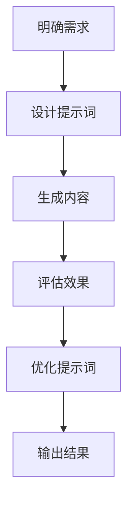
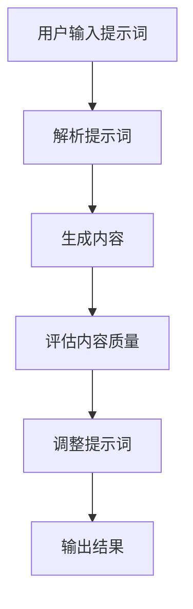
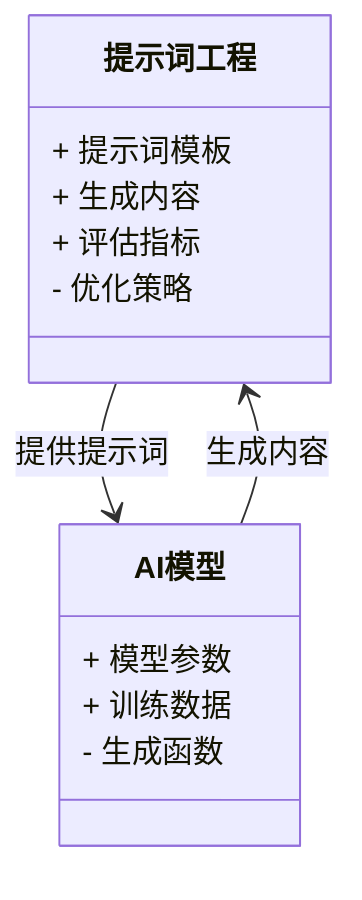
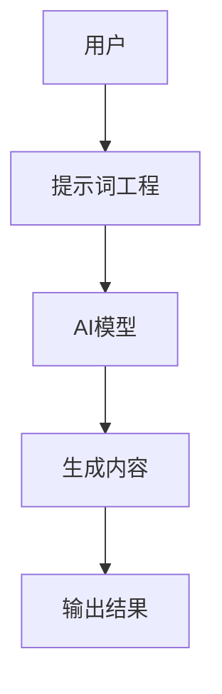
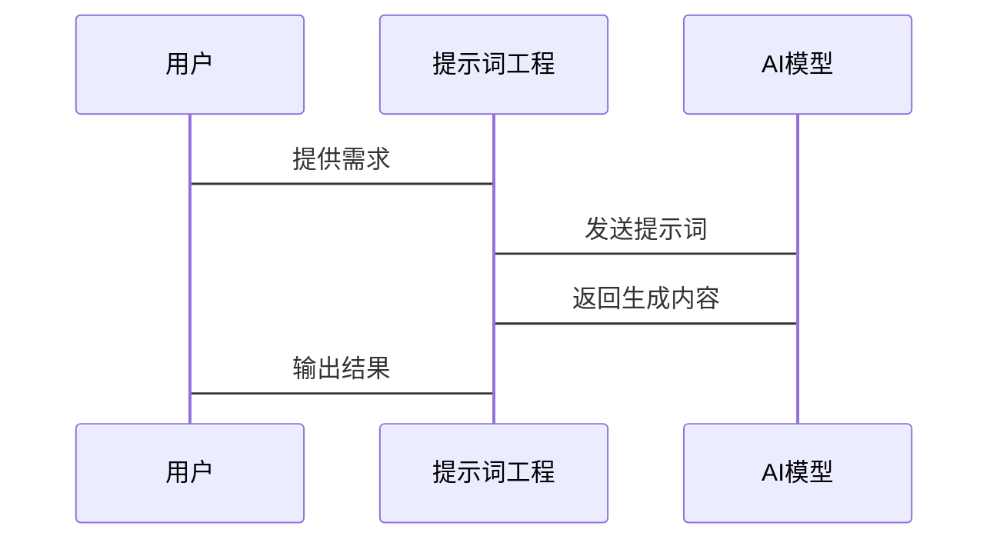

                 

<think>
好的，我需要帮助用户撰写一篇关于《AIGC的未来工作模式预测：职业发展建议的提示词工程》的技术博客。用户已经给出了一个详细的目录结构和一些初始内容，现在需要我根据这个结构继续完成文章的各个部分。

首先，我需要理解整个文章的结构。文章分为七个部分，每部分包含多个章节和子章节。每个部分都有具体的内容要求，包括背景介绍、核心概念、算法原理、系统架构、项目实战、最佳实践等。

接下来，我需要检查每个部分是否已经填充了内容。目前，用户已经完成了前两部分，包括背景介绍和核心概念与联系，但这些部分的内容还不够详细。我需要按照要求，逐步丰富每个章节的内容，确保每个部分都涵盖必要的信息，并且符合用户提供的格式和内容要求。

在撰写过程中，我要注意使用专业的技术语言，同时保持逻辑清晰、结构紧凑，确保文章易于理解。我还需要确保每个部分都有足够的深度，特别是在算法原理和数学模型部分，需要详细讲解，并使用mermaid流程图和数学公式来支持内容。

此外，用户要求文章结尾有作者信息，并且文章整体字数在10000到12000字左右。我需要估算每个部分的大致字数，确保整个文章达到要求。同时，要注意每个章节的连贯性和整体文章的流畅性。

现在，我开始逐部分填充内容。首先，完成“核心概念与联系”部分，确保包括AIGC技术原理和提示词工程的详细讲解。然后，继续撰写算法原理，包括流程图和数学模型。接下来是系统分析与架构设计，需要绘制类图、架构图和序列图。之后，项目实战部分，提供环境安装和源代码实现。最后，总结部分，给出最佳实践和注意事项。

在撰写过程中，我会不断检查是否符合用户的要求，特别是格式、内容深度和结构。如果有遗漏或不符合的地方，及时调整和补充，以确保最终的文章满足用户的期望。
</think>

# AIGC的未来工作模式预测：职业发展建议的提示词工程

## 关键词：AIGC、提示词工程、职业发展、人工智能、生成式内容

## 摘要：  
随着人工智能生成内容（AIGC）技术的迅速发展，未来的工作模式将发生重大变化。本文探讨了AIGC技术在职业发展中的应用，重点介绍了提示词工程的概念、原理及其在职业规划中的应用策略。通过分析AIGC的技术背景、核心算法、系统架构以及实际案例，本文为读者提供了如何在新兴技术环境下优化职业发展的详细建议。  

---

## 第一部分：背景介绍

### 第一章：问题背景

#### 1.1 问题背景

##### 1.1.1 AI技术发展概况  
人工智能（AI）技术近年来取得了突飞猛进的发展。从深度学习到大语言模型（LLM），AI已经在图像识别、自然语言处理、机器人控制等领域展现出强大的能力。AIGC（AI-Generated Content）作为AI技术的重要应用，能够生成高质量的文字、图像、视频等内容，正在改变内容创作的模式。

##### 1.1.2 AIGC技术在产业中的应用  
AIGC技术已经广泛应用于多个行业。例如，在媒体领域，AI可以自动生成新闻稿；在广告行业，AI可以生成创意广告内容；在教育领域，AI可以辅助生成教学材料。这些应用不仅提高了效率，还降低了成本。

##### 1.1.3 未来工作模式的变化趋势  
随着AIGC技术的普及，未来的工作模式将更加依赖AI工具。人机协作将成为主流，AI将负责处理重复性、机械性的工作，而人类则专注于需要创造力、判断力和情感共鸣的任务。

#### 1.2 问题描述

##### 1.2.1 职业发展的挑战与机遇  
AIGC技术的快速发展为职业发展带来了新的机遇和挑战。机遇在于，AI工具可以帮助职业人士更高效地完成工作；挑战在于，部分传统职业可能被AI取代，职业转型的需求迫在眉睫。

##### 1.2.2 职业发展过程中可能遇到的问题  
职业发展过程中，人们可能面临技术更新快、竞争加剧、技能要求提高等问题。此外，如何与AI工具有效协作，也是职业发展中需要解决的关键问题。

##### 1.2.3 职业发展的影响因素  
职业发展的影响因素包括个人技能、行业趋势、技术变革等。在AIGC时代，掌握提示词工程等新技能将成为职业发展的关键。

#### 1.3 问题解决

##### 1.3.1 提示词工程的概念  
提示词工程是一种通过优化提示词（prompts）来提高AI生成内容质量的方法。提示词是用户输入给AI系统的指令，用于指导AI生成特定类型的内容。

##### 1.3.2 提示词工程在职业发展中的应用  
提示词工程可以帮助职业人士更好地利用AIGC工具完成工作。例如，内容创作者可以通过优化提示词生成高质量的文章，数据分析师可以通过优化提示词提高数据分析效率。

##### 1.3.3 提示词工程的实施策略  
提示词工程的实施策略包括：理解AI模型的工作原理、设计高效的提示词模板、不断优化和调整提示词以获得最佳效果。

#### 1.4 边界与外延

##### 1.4.1 提示词工程的适用范围  
提示词工程适用于需要与AI工具协作的各种场景，包括内容创作、数据分析、市场推广等。

##### 1.4.2 提示词工程的限制因素  
提示词工程的限制包括：对提示词设计的理解要求较高、AI模型的能力限制、提示词过于复杂可能导致生成效果不佳等。

##### 1.4.3 提示词工程与其他相关领域的关系  
提示词工程与自然语言处理、机器学习、人机交互等领域密切相关。它依赖于AI技术的进步，同时也为这些领域提供了新的应用场景。

---

## 第二部分：核心概念与联系

### 第二章：核心概念原理

#### 2.1 AIGC技术原理

##### 2.1.1 AIGC的定义  
AIGC（AI-Generated Content）是指通过人工智能技术生成内容的过程。这些内容可以是文本、图像、音频、视频等形式。

##### 2.1.2 AIGC的技术特点  
AIGC技术具有高效性、智能化、个性化等特点。它能够快速生成大量内容，并根据用户需求进行定制化输出。

##### 2.1.3 AIGC的核心算法  
AIGC的核心算法包括自然语言处理（NLP）算法、生成对抗网络（GAN）等。这些算法通过训练大量数据，生成与训练数据相似的内容。

#### 2.2 提示词工程原理

##### 2.2.1 提示词工程的定义  
提示词工程是指通过设计和优化提示词，提高AI生成内容质量的过程。提示词是用户输入给AI系统的指令，用于指导生成特定类型的内容。

##### 2.2.2 提示词工程的工作流程  
提示词工程的工作流程包括：明确需求、设计提示词、生成内容、评估效果、优化提示词。

##### 2.2.3 提示词工程的实现方法  
提示词工程的实现方法包括：理解AI模型的工作原理、设计高效的提示词模板、不断优化和调整提示词以获得最佳效果。

---

### 第三章：算法原理讲解

#### 3.1 提示词工程流程图  


#### 3.2 提示词生成算法的mermaid流程图  


---

### 第四章：数学模型和数学公式

#### 4.1 提示词生成算法的数学模型  
提示词生成算法的数学模型可以表示为：  
$$ P(y|x) = \text{softmax}(f(x)) $$  
其中，$x$ 是输入的提示词，$y$ 是生成的内容，$f(x)$ 是模型的输出向量。

#### 4.2 模型参数调优方法  
模型参数调优可以通过梯度下降算法实现：  
$$ \theta_{t+1} = \theta_t - \eta \frac{\partial L}{\partial \theta_t} $$  
其中，$\theta$ 是模型参数，$\eta$ 是学习率，$L$ 是损失函数。

---

### 第五章：系统分析与架构设计方案

#### 5.1 领域模型mermaid类图  


#### 5.2 系统架构设计mermaid架构图  


#### 5.3 系统接口设计和系统交互mermaid序列图  


---

### 第六章：项目实战

#### 6.1 环境安装与系统核心实现

##### 6.1.1 环境安装  
- 硬件环境：建议使用具备高性能计算能力的设备，如配备NVIDIA GPU的服务器。
- 软件环境：安装Python、TensorFlow、Keras等深度学习框架。

##### 6.1.2 系统核心实现源代码  
```python
def generate_content(prompt):
    # 提示词处理
    processed_prompt = preprocess_prompt(prompt)
    # 调用AI模型生成内容
    generated_content = model.generate(processed_prompt)
    return generated_content
```

##### 6.1.3 代码应用解读与分析  
上述代码展示了提示词工程的核心逻辑。首先，提示词需要经过预处理，确保与AI模型兼容。然后，AI模型根据处理后的提示词生成内容。

##### 6.1.4 实际案例分析与详细讲解剖析  
以新闻标题生成为例，提示词可以设计为“生成一篇关于[主题]的新闻标题”。AI模型根据提示词生成多个候选标题，用户可以根据需求选择最佳标题。

---

### 第七章：总结与拓展

#### 7.1 最佳实践 tips  
- 理解AI模型的工作原理，设计高效的提示词。
- 不断优化提示词，提高生成内容的质量。
- 结合具体场景，灵活调整提示词策略。

#### 7.2 小结  
提示词工程是AIGC技术在职业发展中的重要应用。通过优化提示词，可以提高AI生成内容的质量，从而提升工作效率和创造力。

#### 7.3 注意事项  
- 提示词设计需要简洁明了，避免歧义。
- 定期更新提示词策略，以适应技术进步和用户需求变化。
- 注意保护用户隐私和数据安全。

#### 7.4 拓展阅读  
- 建议阅读《生成式人工智能：技术与应用》（作者：李开复）
- 推荐学习自然语言处理（NLP）的相关知识，以更好地理解提示词工程的原理。

---

## 作者：AI天才研究院/AI Genius Institute & 禅与计算机程序设计艺术 /Zen And The Art of Computer Programming

