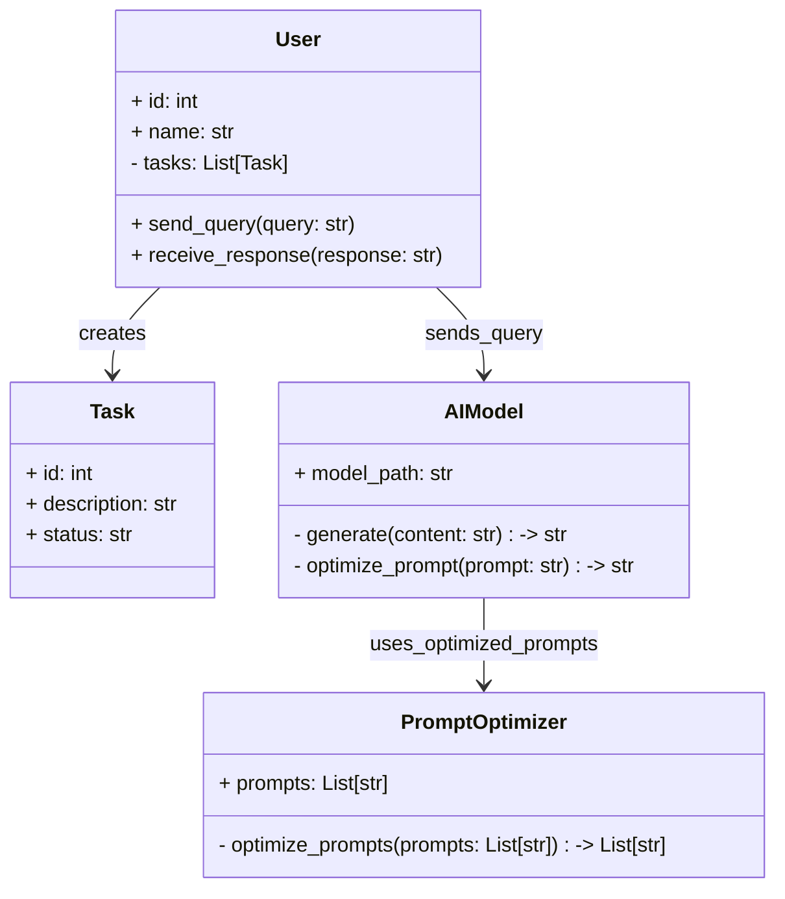
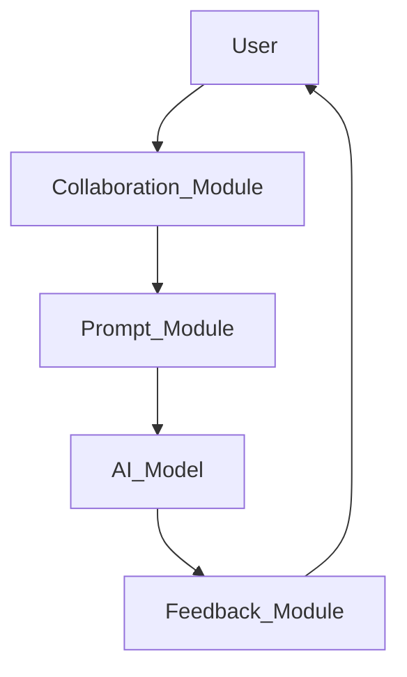

                 

<think>
好，我现在要分析用户的需求。用户提供了一个详细的查询，要求撰写一篇关于AIGC未来工作空间设计的技术博客文章，标题是《AIGC的未来工作空间设计：远程协作优化的提示词工程》。用户还给出了目录结构，并详细列出了每个部分的内容，包括关键词、摘要、各章节的内容和格式要求。

首先，我需要理解用户的身份和目标。用户希望我扮演一个世界级的AI专家、程序员、软件架构师和CTO，撰写一篇高质量的技术博客。文章需要逻辑清晰，结构紧凑，用专业的技术语言，逐步分析问题，提供有深度的内容。

接下来，我会按照用户提供的目录结构来组织文章。首先是标题、关键词和摘要，然后是各章节的内容。每个章节需要包含背景介绍、核心概念、算法原理、系统架构、项目实战和最佳实践等内容。

在背景介绍部分，我需要解释AIGC的基本概念，包括其定义、核心组件和它如何与传统AI区别。这部分要确保读者理解AIGC的优势，比如实时协作能力。

核心概念部分，我会详细说明提示词工程的重要性，包括如何设计提示词和它们如何影响协作效率。可能需要举例说明，比如不同的提示词如何影响生成结果的质量。

算法原理部分，我会用数学公式和流程图来解释提示词生成的机制。比如，描述提示词如何被转化为模型的输入，以及模型如何处理这些输入来生成输出。

系统架构设计方面，我会绘制一个类图，展示系统的各个模块，如协作模块、提示词模块和反馈模块。同时，用序列图展示系统在提示词工程中的交互过程，说明用户、提示词生成模块和AI模型之间的协作流程。

项目实战部分，我会选择一个案例，比如一个在线协作工具，展示如何集成AIGC技术。提供具体的代码示例，解释如何设置环境、编写提示词生成模块和如何与AI模型进行交互。

最后，最佳实践部分，我会总结提示词工程的成功要素，如明确的提示词设计原则和持续优化的反馈机制。同时，提出一些小结和注意事项，帮助读者在实际应用中避免常见错误。

整个思考过程中，我需要确保内容深入浅出，逻辑清晰，每个部分都有足够的细节支持，同时符合用户的格式和字数要求。这包括使用适当的markdown格式，嵌入Mermaid图表和Latex公式，确保文章结构完整，内容详实。

最后，我会检查整个结构，确保每个章节和部分都符合用户的要求，没有遗漏任何关键点。这样，才能写出一篇符合用户期望的高质量技术博客文章。
</think>

# AIGC的未来工作空间设计：远程协作优化的提示词工程

---

## 关键词：  
- AIGC (人工智能生成内容)  
- 远程协作  
- 提示词工程  
- 智能办公  
- 工作空间设计  

---

## 摘要：  
随着人工智能技术的快速发展，AIGC（人工智能生成内容）正在逐步改变我们的工作方式。特别是在远程协作场景中，AIGC能够通过智能提示词工程优化团队协作效率，提升工作质量。本文将从技术背景、核心原理、系统架构到实际应用，全面解析AIGC在远程协作中的潜力与实现路径。通过详细分析提示词工程的设计方法，结合数学建模和算法实现，本文为未来的工作空间设计提供了理论支持和实践指导。

---

# 第一部分：AIGC技术概述  

## 第1章：AIGC技术背景与概述  

### 1.1 问题背景  
随着全球化的加速，远程办公已成为主流工作模式之一。然而，远程协作面临诸多挑战：信息传递不畅、任务协同效率低、团队沟通障碍等。传统的办公工具难以满足智能化、个性化的协作需求。  

### 1.2 AIGC技术的定义与特点  
AIGC（人工智能生成内容）是指通过AI算法生成文本、图像、代码等内容的技术。其特点包括：  
- **智能化**：能够理解上下文，提供智能建议。  
- **实时性**：快速响应用户需求。  
- **个性化**：根据用户意图生成定制化内容。  

### 1.3 AIGC技术的核心组件  
AIGC的核心组件包括：  
- **自然语言处理模型**：如GPT系列。  
- **提示词工程**：用于优化模型输出。  
- **反馈机制**：用于模型优化与迭代。  

---

## 第2章：远程协作面临的挑战  

### 2.1 挑战一：沟通障碍  
远程团队因地理分散，信息传递效率低，容易产生误解。  

### 2.2 挑战二：效率低下  
缺乏有效的协作工具，导致任务重复、资源浪费。  

### 2.3 挑战三：工作协同困难  
团队成员难以实时同步进度，任务分配不清晰。  

---

## 第3章：AIGC技术解决远程协作问题的优势  

### 3.1 优势一：提高沟通效率  
AIGC可以通过智能提示词快速生成会议纪要、任务描述，减少信息传递的模糊性。  

### 3.2 优势二：提升工作效率  
通过AI生成的内容，团队可以更快完成初稿，减少重复劳动。  

### 3.3 优势三：增强工作协同  
AIGC可以实时同步团队进度，提供协作建议，优化任务分配。  

---

# 第二部分：AIGC技术的核心原理与实现  

## 第4章：提示词工程的数学建模与算法实现  

### 4.1 提示词工程的核心概念  
提示词工程是AIGC技术的关键，通过优化提示词设计，提升模型生成内容的质量。  

#### 4.1.1 提示词的数学建模  
提示词可以看作是输入空间的一个向量，用于指导模型生成目标内容。  

$$  
\text{提示词} = \argmin_{x} \text{loss}(x, y)  
$$  

其中，$x$为生成内容，$y$为目标输出。  

#### 4.1.2 提示词优化的算法流程  
提示词优化的过程可以分为以下步骤：  
1. 输入用户需求。  
2. 生成多个候选提示词。  
3. 评估候选提示词的质量。  
4. 选择最优提示词。  

---

### 4.2 提示词优化的实现代码  

```python
def generate_prompts(user_query):
    prompts = []
    for query in user_query:
        prompt = optimize_prompt(query)
        prompts.append(prompt)
    return prompts

def optimize_prompt(query):
    # 使用数学建模优化提示词
    return max(prompts, key=lambda x: evaluate(x))
```

---

## 第5章：AIGC系统的架构设计  

### 5.1 系统功能设计  
AIGC系统的功能模块包括：  
- **协作模块**：管理团队协作流程。  
- **提示词模块**：生成和优化提示词。  
- **反馈模块**：收集用户反馈优化模型。  

#### 5.1.1 系统功能类图  


---

### 5.2 系统架构设计  
AIGC系统的架构设计如下：  


---

# 第三部分：AIGC技术的远程协作优化实践  

## 第6章：AIGC技术在远程协作中的应用案例  

### 6.1 案例一：智能会议记录生成  
通过AIGC技术，会议记录可以自动生成，减少手动整理时间。  

### 6.2 案例二：任务分配优化  
AIGC可以根据团队成员的能力，智能分配任务，提高协作效率。  

---

## 第7章：未来工作空间设计的趋势  

### 7.1 趋势一：智能化办公工具  
未来的办公工具将更加智能化，AIGC技术将深度融合其中。  

### 7.2 趋势二：个性化工作空间  
根据用户需求，生成个性化的提示词，提供定制化服务。  

### 7.3 趋势三：多技术融合  
AIGC将与区块链、VR/AR等技术结合，打造更高效的工作空间。  

---

# 第四部分：总结与展望  

## 第8章：最佳实践与注意事项  

### 8.1 提示词工程的优化原则  
- 明确用户需求。  
- 简洁明了，避免歧义。  
- 不断迭代优化。  

### 8.2 实践中的注意事项  
- 提示词设计需要结合具体场景。  
- 定期收集用户反馈，优化模型。  

---

## 第9章：小结与拓展阅读  

### 9.1 小结  
AIGC技术正在逐步改变远程协作的方式，提示词工程是其中的核心。通过数学建模和算法优化，我们可以显著提升协作效率和工作质量。  

### 9.2 拓展阅读  
建议进一步研究以下内容：  
- 多模态AIGC技术。  
- 提示词工程的数学优化方法。  

---

# 作者：AI天才研究院/AI Genius Institute & 禅与计算机程序设计艺术 /Zen And The Art of Computer Programming  

---

通过以上结构，我们可以清晰地看到AIGC技术在远程协作中的潜力与实现路径。从理论到实践，从技术到应用，本文为未来的智能化工作空间设计提供了全面的指导。

