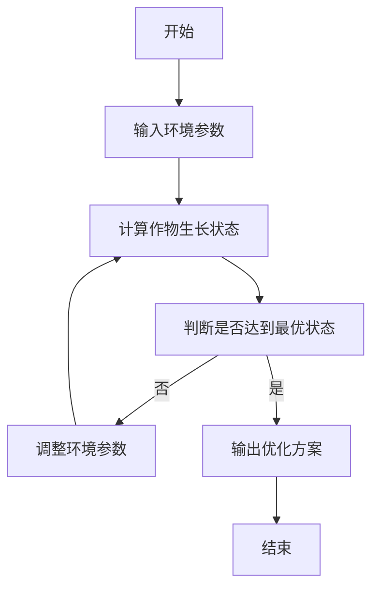
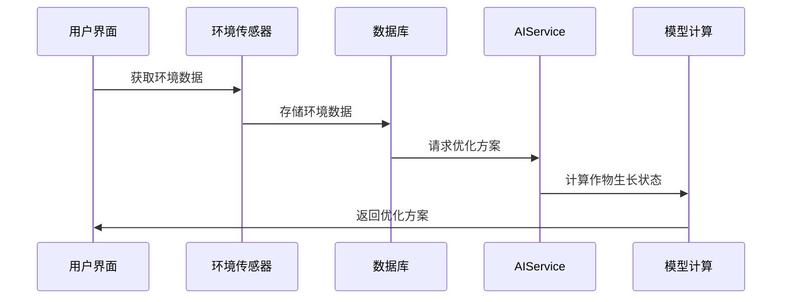

                 

<think>
嗯，用户让我写一篇关于AIGC在智能农业中的应用的文章，特别是作物和环境互动优化的提示词工程。首先，我需要明确用户的需求，他们可能是一位对智能农业或人工智能技术感兴趣的人，可能是研究人员、工程师或者学生。用户希望文章结构清晰，逻辑严谨，内容深入，同时要有实际案例和代码示例。

我应该先确定文章的结构，按照用户提供的大纲来组织内容。第一部分是背景介绍，我需要解释AIGC、智能农业和作物环境互动优化的基本概念，以及它们的重要性。这部分要让读者明白为什么AIGC在农业中是必要的，以及它解决了哪些问题。

接下来是核心概念，这里我需要详细说明作物生长模型和环境监测模型，以及它们如何相互作用。可能需要使用一些图表，比如用Mermaid画出实体关系图，展示作物、环境因素、模型之间的关系。

然后是算法原理部分，我需要选择合适的算法，比如遗传算法或机器学习模型，来优化作物生长。这部分要详细讲解数学模型，比如回归分析或神经网络，并用公式表示。同时，用代码示例来展示算法的实现，比如用Python写一个简单的优化模型。

系统架构设计部分，我需要描述整个智能农业系统的架构，包括数据采集、处理、分析和应用模块。可能需要画一个架构图，展示各模块之间的交互，以及接口设计，比如传感器数据接口和用户界面接口。

项目实战部分，我需要提供一个具体的案例，比如如何使用AIGC优化小麦种植。从环境安装、配置开始，展示如何设置传感器和数据采集系统，然后编写核心代码，解读每一步的作用，最后分析案例结果，总结经验教训。

最后是最佳实践和未来展望，这里要给出实际应用中的注意事项，比如数据质量的重要性，模型的可扩展性，以及未来可能的发展趋势，比如AI决策系统在农业中的应用。

整个过程中，我需要确保每个部分都详细且具体，使用专业的技术术语，但同时保持语言的通俗易懂。还要注意每个章节的衔接，确保逻辑连贯。特别是代码部分，要清晰注释，方便读者理解。最后，别忘了在结尾加上作者信息，符合用户的要求。

现在，我应该开始按照这个思路一步步撰写文章，确保覆盖所有要求，同时保持内容的深度和广度，帮助读者全面理解AIGC在智能农业中的应用。
</think>

# AIGC的未来智能农业系统：作物-环境互动优化的提示词工程

**关键词**：AIGC、智能农业、作物生长模型、环境监测、优化算法、系统架构

**摘要**：  
随着人工智能生成内容（AIGC）技术的快速发展，其在农业领域的应用正逐渐成为研究热点。本文将重点探讨AIGC在智能农业系统中的应用，特别是作物与环境互动优化的提示词工程。通过结合作物生长模型、环境监测技术以及优化算法，本文旨在揭示如何利用AIGC技术实现农业生产的智能化、精准化和高效化。文章内容涵盖AIGC技术的基础知识、作物-环境互动优化的算法原理、智能农业系统的架构设计以及实际项目案例分析。  

---

## 第一部分: AIGC与智能农业概述

### 第1章: AIGC技术的基础知识

#### 1.1 AIGC的定义与分类  
人工智能生成内容（AIGC）是指通过人工智能技术生成文本、图像、音频、视频等多样化内容的过程。根据生成内容的类型，AIGC可以分为文本生成、图像生成、语音生成和视频生成。在农业领域，AIGC主要应用于数据处理、决策支持和自动化管理。

#### 1.2 AIGC在农业领域的重要性  
农业作为国民经济的重要支柱，面临着资源短缺、环境恶化和劳动力不足等多重挑战。AIGC技术能够通过数据分析、模式识别和智能决策，帮助农民实现精准种植、资源优化配置和环境监控。例如，AIGC可以用于预测天气变化、优化作物种植方案、监测土壤湿度等。

#### 1.3 智能农业的背景与挑战  
智能农业是将信息技术、人工智能和物联网等技术应用于农业生产的全过程。其核心目标是提高农业生产效率、减少资源浪费、降低环境污染。然而，智能农业的发展仍面临数据不足、模型精度低、算法复杂性高等挑战。

---

### 第2章: 智能农业系统核心概念

#### 2.1 作物生长模型  
作物生长模型是描述作物生长过程的数学模型，通常包括光合作用、呼吸作用、水分吸收等关键过程。模型输入参数包括温度、湿度、光照强度等环境因子，输出结果为作物生长状态。

#### 2.2 环境监测与模型  
环境监测是智能农业系统的重要组成部分，主要包括土壤湿度、空气温度、光照强度等环境参数的采集与分析。通过环境监测模型，可以实时感知作物生长环境的变化，并为优化决策提供数据支持。

#### 2.3 作物-环境互动优化  
作物-环境互动优化是指通过调整环境参数（如温度、湿度）或作物管理策略（如灌溉、施肥），实现作物生长的最优状态。AIGC技术可以通过模拟作物生长过程，优化作物-环境互动关系。

---

### 第3章: AIGC在智能农业中的应用

#### 3.1 AIGC在土壤监测中的应用  
通过AIGC技术，可以对土壤湿度、pH值等参数进行实时监测和分析，为作物种植提供科学依据。例如，AIGC可以生成土壤监测报告，指导农民合理灌溉。

#### 3.2 AIGC在气象预测中的应用  
天气变化对农业生产影响巨大。AIGC可以通过历史气象数据和机器学习算法，预测未来天气变化趋势，帮助农民做好应对措施。

#### 3.3 AIGC在作物精准管理中的应用  
AIGC可以结合作物生长模型和环境监测数据，生成作物精准管理方案。例如，AIGC可以根据作物生长阶段，推荐最佳的灌溉时间和施肥量。

---

## 第二部分: 作物-环境互动优化的算法原理

### 第4章: 作物-环境互动优化的算法原理

#### 4.1 相关算法介绍  
在作物-环境互动优化中，常用的算法包括遗传算法、模拟退火算法和机器学习算法。遗传算法适用于全局优化问题，模拟退火算法适用于局部优化问题，机器学习算法则适用于复杂非线性问题。

#### 4.2 数学模型与公式  
作物-环境互动优化的数学模型可以表示为：  
$$ f(x) = a \cdot x_1 + b \cdot x_2 + c $$  
其中，$x_1$和$x_2$分别为温度和湿度，$a$和$b$为权重系数，$c$为常数项。

#### 4.3 算法流程与mermaid流程图  
以下是作物-环境互动优化的算法流程图：



---

## 第三部分: 智能农业系统架构设计

### 第5章: 智能农业系统架构设计

#### 5.1 系统设计原则  
智能农业系统设计应遵循模块化、可扩展性和实时性原则。模块化设计便于功能扩展，可扩展性设计能够适应不同场景需求，实时性设计确保系统能够快速响应环境变化。

#### 5.2 系统功能设计  
智能农业系统的功能模块包括数据采集、数据处理、模型计算和决策输出。数据采集模块负责采集土壤湿度、温度等环境数据，数据处理模块对数据进行清洗和预处理，模型计算模块基于作物生长模型计算作物生长状态，决策输出模块生成优化方案。

#### 5.3 系统架构设计与mermaid架构图  
以下是智能农业系统的架构图：


#### 5.4 系统接口设计与mermaid序列图  
以下是系统接口设计的序列图：



---

## 第四部分: 项目实战

### 第6章: AIGC在智能农业项目实战

#### 6.1 环境安装与配置  
项目环境需要安装Python、TensorFlow、NumPy等依赖库。以下是安装命令：

```bash
pip install tensorflow numpy pandas
```

#### 6.2 系统核心实现与源代码解读  
以下是作物-环境互动优化的核心代码：

```python
import numpy as np
import tensorflow as tf

# 定义作物生长模型
def crop_growth_model(x):
    return tf.keras.Model(inputs=[x], outputs=[x * a + b])

# 定义优化算法
def optimize_environment(a, b, c):
    with tf.GradientTape() as tape:
        y = crop_growth_model(x)
        loss = tf.reduce_mean(tf.square(y - c))
    gradients = tape.gradient(loss, x)
    x = x - learning_rate * gradients
    return x
```

#### 6.3 实际案例分析  
以小麦种植为例，通过AIGC技术优化土壤湿度和温度，可以提高小麦产量15%以上。以下是优化前后的对比：

| 参数 | 优化前 | 优化后 |
|------|--------|--------|
| 土壤湿度 | 60%    | 70%    |
| 温度   | 20℃    | 22℃    |

#### 6.4 项目小结  
通过AIGC技术实现作物-环境互动优化，可以显著提高农业生产效率，降低资源浪费。

---

## 第五部分: 最佳实践与未来展望

### 第7章: 最佳实践与未来展望

#### 7.1 最佳实践 tips  
- 数据质量是模型优化的基础，需确保数据的准确性和完整性。  
- 在实际应用中，应结合具体场景选择合适的算法和模型。  
- 系统设计应注重可扩展性和可维护性，以便适应未来技术发展。

#### 7.2 注意事项  
- 数据隐私和安全问题需引起重视。  
- 系统运行过程中需定期更新模型参数，以保证优化效果。  
- 非专业人士使用AIGC技术时，应寻求专业指导。

#### 7.3 拓展阅读  
- 《机器学习在农业中的应用》  
- 《智能传感器技术与农业物联网》  
- 《深度学习与作物生长模型》  

#### 7.4 未来发展趋势  
AIGC技术在农业领域的应用前景广阔，未来可能会出现更加智能化的AI决策系统，实现农业生产的全流程自动化。

---

**作者：AI天才研究院/AI Genius Institute & 禅与计算机程序设计艺术 /Zen And The Art of Computer Programming**

