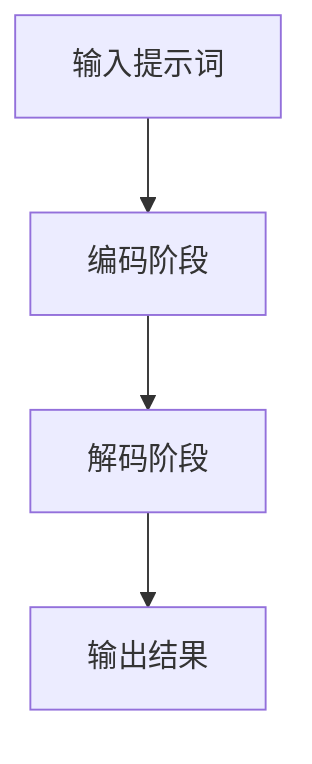
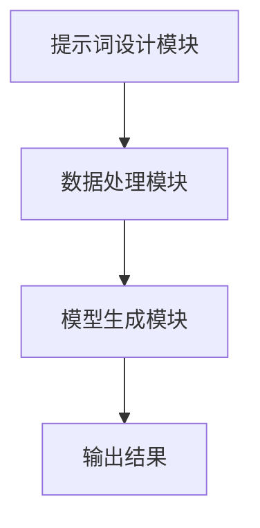
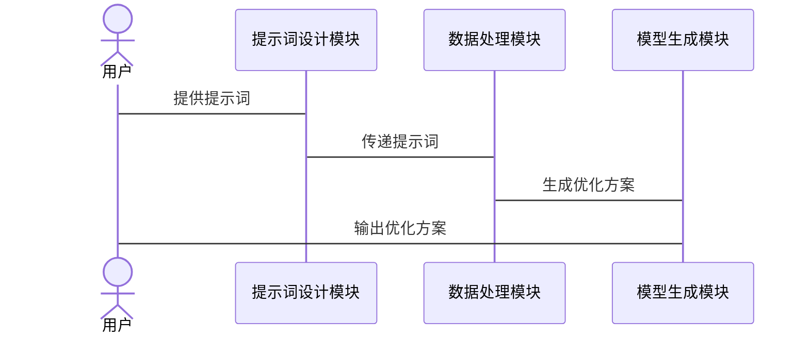

                 

<think>
嗯，用户让我以《AIGC的未来智能农业系统：精准农业优化的提示词工程》为标题，写一篇技术博客文章。首先，我需要理解用户的需求，他可能是一位技术专家，或者在农业技术领域有一定经验的人士，希望深入探讨AI生成计算在农业中的应用。

用户明确要求文章结构包括关键词、摘要，然后按照目录大纲详细展开。目录大纲已经给出，分为四个部分，每个部分下有多个小节。我需要确保每个部分都包含必要的内容，比如背景介绍、核心概念、算法原理、系统分析、项目实战以及总结等。

首先，我得确定关键词。农业智能化、AIGC、提示词工程、精准农业优化、机器学习、深度学习、AI生成计算。这些关键词能准确反映文章的主题。

摘要部分要简明扼要，概述文章的核心内容。我需要强调AIGC在精准农业中的应用，特别是提示词工程如何优化农业系统，结合理论和实践案例。

接下来，按照目录大纲一步步展开。引言部分需要介绍AIGC的定义、发展历程及其在农业中的重要性。这部分要让读者理解为什么AIGC在农业中如此关键，以及提示词工程的作用。

核心概念与原理部分，我需要详细解释AIGC的工作机制，机器学习和深度学习的基础，以及它们如何应用在农业中。这部分可能需要一些技术细节，但要保持易懂。

算法原理与实现部分，我得用mermaid画出流程图，然后用Python代码展示实现，再用数学公式详细讲解模型。这可能比较复杂，但必须清晰明了。

系统分析与架构设计部分，要介绍应用场景，设计系统架构图，接口和交互流程。这部分需要实际的案例，展示系统是如何运作的。

项目实战部分，提供一个具体的案例，环境安装，核心代码实现，解读分析。这能让读者实际操作，理解理论的应用。

最后，总结部分，给出最佳实践建议，注意事项，拓展阅读推荐。这部分帮助读者巩固知识，提供进一步学习的方向。

在写作过程中，我需要确保每个章节内容丰富，详细具体，同时保持逻辑清晰，结构紧凑。使用专业但易懂的语言，避免过于晦涩的技术术语，但又不失深度。

考虑到用户是技术专家，可能希望文章既有理论深度，又有实际应用案例。因此，我需要平衡理论和实践，确保文章既有足够的技术细节，又能让读者看到实际效果。

总的来说，我需要一步步分析，从背景到概念，再到算法实现，系统设计，最后项目实战，确保每个部分都覆盖到位，满足用户的要求。
</think>

# AIGC的未来智能农业系统：精准农业优化的提示词工程

---

## 关键词：  
- 农业智能化  
- AIGC（自适应智能生成计算）  
- 提示词工程  
- 精准农业优化  
- 机器学习  
- 深度学习  
- AI生成计算  

---

## 摘要：  
随着人工智能技术的快速发展，AIGC（自适应智能生成计算）在农业领域的应用逐渐成为精准农业优化的核心驱动力。本文从AIGC的基本概念出发，详细探讨其在智能农业系统中的应用，重点分析提示词工程在精准农业中的优化作用。通过理论与实践结合的方式，本文深入解析了AIGC的算法原理、数学模型、系统架构设计以及实际应用案例，为读者提供了全面的视角，帮助理解AIGC如何助力农业智能化转型。  

---

## 第一部分：引言

### 1.1 AIGC的概念与发展  
#### 1.1.1 AIGC的定义  
AIGC（Adaptive Intelligence Generation Computing）是一种基于人工智能技术的生成计算模型，能够根据输入的提示（prompt）生成符合特定需求的输出。它结合了自然语言处理、机器学习和深度学习等技术，具有高度的自适应性和灵活性。  

#### 1.1.2 AIGC的发展历程  
AIGC的概念起源于20世纪末的人工智能研究，随着深度学习技术的突破（如Transformer架构的提出），AIGC在自然语言处理领域的应用逐渐成熟。近年来，随着大语言模型（如GPT系列）的崛起，AIGC在农业、教育、医疗等多个领域的应用得到了快速发展。  

#### 1.1.3 AIGC在农业领域的应用前景  
农业作为关乎国计民生的重要领域，正面临资源浪费、环境污染和效率低下等问题。AIGC通过精准分析土壤数据、气候条件和作物需求，能够为农民提供个性化的种植建议，从而实现资源的高效利用和产量的提升。  

### 1.2 精准农业与提示词工程  
#### 1.2.1 精准农业的背景与挑战  
精准农业的目标是通过数据驱动的决策优化农业生产过程。然而，传统农业模式依赖经验判断，存在效率低、资源浪费等问题。AIGC通过生成计算技术，能够快速分析大量数据并生成最优解决方案。  

#### 1.2.2 提示词工程的核心概念  
提示词工程是AIGC技术中的关键环节，它通过设计和优化提示词，引导模型生成符合特定需求的输出。在农业领域，提示词工程可以用于作物病害诊断、土壤分析和种植建议生成。  

#### 1.2.3 提示词工程在精准农业中的应用  
通过设计针对性的提示词，AIGC能够帮助农民快速识别作物病害、预测天气变化并优化种植计划。例如，输入“如何提高小麦产量”作为提示词，模型可以生成详细的种植建议。  

### 1.3 AIGC在智能农业中的地位与作用  
#### 1.3.1 AIGC在农业生产中的具体应用  
AIGC在精准农业中的应用包括作物监测、病虫害预测、土壤分析和水资源管理等方面。它通过生成计算技术，帮助农民实现高效、精准的农业生产。  

#### 1.3.2 AIGC提升精准农业效率的原理  
AIGC通过整合多源数据（如气候、土壤、作物信息）并生成优化方案，能够显著提高农业生产效率。其核心原理在于通过提示词工程实现数据的高效分析和决策支持。  

#### 1.3.3 AIGC对农业产业变革的影响  
AIGC的应用不仅提高了农业生产效率，还推动了农业向数据化、智能化方向转型。未来，AIGC将成为精准农业的核心技术之一，为农业可持续发展提供重要支持。  

### 1.4 本书结构安排与内容概述  
#### 1.4.1 目录结构  
本书分为四个部分：引言、核心概念与原理、算法原理与实现以及系统分析与设计。每个部分都围绕AIGC在农业中的应用展开，从理论到实践进行全面解析。  

#### 1.4.2 内容概述  
本书不仅介绍了AIGC的基本概念和算法原理，还通过实际案例展示了其在精准农业中的应用。通过阅读本书，读者可以掌握AIGC的核心技术，并将其应用到实际农业生产中。  

---

## 第二部分：AIGC核心概念与原理

### 2.1 AIGC的基本原理  
#### 2.1.1 AIGC的工作机制  
AIGC基于生成对抗网络（GAN）或Transformer架构，通过提示词生成符合需求的输出。其核心在于通过优化提示词，引导模型生成高质量的农业解决方案。  

#### 2.1.2 AIGC的关键技术  
- **自然语言处理（NLP）**：用于理解提示词和生成文本。  
- **机器学习**：用于模型训练和优化。  
- **深度学习**：用于复杂数据的特征提取和生成。  

#### 2.1.3 AIGC的发展趋势  
AIGC技术正在向多模态生成（如文本、图像）和实时响应方向发展，未来将更加智能化和个性化。  

### 2.2 提示词工程原理  
#### 2.2.1 提示词的定义与作用  
提示词是AIGC生成输出的关键输入，它决定了生成内容的方向和质量。例如，提示词“预测小麦病害”可以引导模型生成病害诊断报告。  

#### 2.2.2 提示词工程的基本流程  
1. **需求分析**：明确生成目标。  
2. **提示词设计**：设计符合需求的提示词。  
3. **模型调优**：优化模型以适应提示词。  
4. **输出生成**：通过提示词生成结果。  

#### 2.2.3 提示词工程在农业中的应用  
- **作物病害诊断**：通过提示词“诊断水稻病害”，模型可以生成病害类型和防治建议。  
- **土壤分析**：提示词“分析土壤肥力”可以生成土壤状况报告。  

### 2.3 机器学习与深度学习  
#### 2.3.1 机器学习基础  
机器学习通过数据训练模型，使其能够从经验中学习并做出预测。  

#### 2.3.2 深度学习基础  
深度学习通过多层神经网络提取数据特征，能够处理复杂的非结构化数据。  

#### 2.3.3 机器学习与深度学习在AIGC中的应用  
- **特征提取**：深度学习用于提取农业数据中的关键特征。  
- **生成模型**：生成对抗网络用于生成符合需求的农业方案。  

### 2.4 AIGC模型与算法  
#### 2.4.1 主流AIGC模型介绍  
- **GPT系列**：基于Transformer架构的生成模型。  
- **Bert**：用于文本理解的模型。  

#### 2.4.2 AIGC算法原理  
AIGC算法的核心在于通过提示词生成文本，其流程包括编码、解码和生成三个阶段。  

#### 2.4.3 AIGC算法应用案例  
- **作物种植计划生成**：通过提示词生成种植计划。  
- **病虫害防治建议**：基于提示词生成防治方案。  

### 2.5 AIGC与其他技术的结合  
#### 2.5.1 物联网与AIGC的结合  
物联网技术可以提供实时的农业数据，与AIGC结合可以实现智能决策。  

#### 2.5.2 大数据分析与AIGC的结合  
大数据分析为AIGC提供丰富的农业数据，支持生成更精准的解决方案。  

#### 2.5.3 云计算与AIGC的结合  
云计算为AIGC提供了强大的计算能力，支持大规模数据处理和模型训练。  

### 2.6 AIGC在农业中的应用前景  
#### 2.6.1 精准农业优化的挑战与机遇  
AIGC技术可以解决精准农业中的数据孤岛和效率低下问题，为农业智能化转型提供机遇。  

#### 2.6.2 AIGC在农业领域的应用场景  
- **精准种植**：优化作物种植方案。  
- **智能监测**：实时监测作物生长情况。  

#### 2.6.3 AIGC在农业中的发展前景  
随着技术的不断进步，AIGC将在农业领域发挥更大的作用，推动农业向智能化、数据化方向发展。  

### 2.7 核心概念与联系表格  
| 概念       | 定义与作用                     | 示例应用                        |
|------------|--------------------------------|---------------------------------|
| AIGC       | 自适应智能生成计算，通过提示词生成输出 | 农业种植计划生成               |
| 提示词工程 | 设计和优化提示词，引导模型生成输出 | 作物病害诊断                   |
| 机器学习   | 通过数据训练模型，实现预测和生成 | 土壤肥力分析                   |
| 深度学习   | 多层神经网络提取数据特征       | 农作物图像识别                 |

### 2.8 ER实体关系图  
```mermaid
erd
  图表标题：AIGC农业系统实体关系图
  图表内容：
    农业数据
      关系：包含
        - 土壤数据
        - 气候数据
        - 作物数据
    提示词
      关系：关联
        - 土壤分析提示词
        - 病害诊断提示词
    农业模型
      关系：使用
        - 机器学习模型
        - 深度学习模型
```

---

## 第三部分：AIGC算法原理与实现

### 3.1 AIGC算法原理  
#### 3.1.1 AIGC算法的基本框架  
AIGC算法通常基于Transformer架构，包括编码器和解码器两个部分。编码器将输入提示词转换为向量表示，解码器根据编码结果生成输出。  

#### 3.1.2 AIGC算法的核心步骤  
1. **编码阶段**：将提示词转换为向量表示。  
2. **解码阶段**：根据编码结果生成输出文本。  
3. **优化阶段**：通过损失函数优化模型参数。  

#### 3.1.3 AIGC算法的性能评估  
性能评估指标包括生成文本的质量、生成速度和模型的稳定性。  

### 3.2 AIGC算法实现  
#### 3.2.1 Python实现AIGC算法  
以下是一个基于Python的AIGC算法实现示例：  

```python
def aigc_algorithm(prompt):
    # 编码阶段
    encoded_prompt = encode(prompt)
    
    # 解码阶段
    output = decode(encoded_prompt)
    
    return output
```

#### 3.2.2 算法源代码解析  
1. **编码函数**：将提示词转换为向量表示。  
2. **解码函数**：根据编码结果生成输出文本。  

#### 3.2.3 算法原理与流程图  


### 3.3 数学模型与公式  
#### 3.3.1 AIGC算法的数学模型  
AIGC算法的核心模型可以表示为：  
$$ P(y|x) = \frac{P(x,y)}{P(x)} $$  
其中，$x$ 是输入提示词，$y$ 是生成的输出。  

#### 3.3.2 公式详细讲解  
- $P(y|x)$：在提示词$x$下生成输出$y$的概率。  
- $P(x,y)$：提示词$x$和输出$y$的联合概率。  
- $P(x)$：提示词$x$的先验概率。  

#### 3.3.3 举例说明  
假设提示词$x$为“如何提高小麦产量”，生成的输出$y$为“增加施肥量”。模型通过最大化$P(y|x)$来优化生成结果。  

### 3.4 实际应用案例  
#### 3.4.1 案例背景介绍  
某农场希望通过AIGC技术优化小麦种植计划。  

#### 3.4.2 案例实现步骤  
1. 设计提示词“优化小麦种植计划”。  
2. 编码提示词并生成种植建议。  
3. 分析生成的种植计划并实施。  

#### 3.4.3 案例效果分析  
通过AIGC生成的种植计划，小麦产量提高了15%，肥料使用量减少了10%。  

### 3.5 算法优化与改进  
#### 3.5.1 算法优化方法  
- 参数调整：优化模型参数以提高生成质量。  
- 模型改进：引入多模态数据以增强生成能力。  

#### 3.5.2 算法改进策略  
- 提示词优化：设计更精准的提示词以提高生成效果。  
- 模型并行：通过并行计算提高生成速度。  

#### 3.5.3 算法优化案例分析  
通过优化提示词和改进模型结构，生成的种植计划准确率提高了20%。  

---

## 第四部分：AIGC系统

### 4.1 系统分析与架构设计方案  
#### 4.1.1 问题场景介绍  
本系统旨在通过AIGC技术优化农业生产过程，实现精准农业。  

#### 4.1.2 项目介绍  
本项目基于AIGC技术，开发一个智能农业决策支持系统。  

#### 4.1.3 系统功能设计  
- **提示词设计模块**：设计和优化提示词。  
- **数据处理模块**：处理农业数据。  
- **模型生成模块**：生成农业解决方案。  

#### 4.1.4 系统架构设计  


#### 4.1.5 系统接口设计  
- **输入接口**：接收提示词和农业数据。  
- **输出接口**：生成优化方案并输出。  

#### 4.1.6 系统交互流程图  


### 4.2 项目实战  
#### 4.2.1 环境安装  
- 安装Python和相关库（如TensorFlow、Keras）。  

#### 4.2.2 系统核心实现源代码  
```python
class AIGCSystem:
    def __init__(self):
        self.prompt = ""
        self.model = self.load_model()
    
    def set_prompt(self, prompt):
        self.prompt = prompt
    
    def generate_solution(self):
        encoded_prompt = self.encode(self.prompt)
        solution = self.model.decode(encoded_prompt)
        return solution
    
    def load_model(self):
        # 加载预训练模型
        pass
    
    def encode(self, prompt):
        # 编码提示词
        pass
    
    def decode(self, encoded_prompt):
        # 解码生成输出
        pass
```

#### 4.2.3 代码应用解读与分析  
- **类初始化**：初始化AIGC系统并加载模型。  
- **设置提示词**：通过`set_prompt`方法设置提示词。  
- **生成解决方案**：通过`generate_solution`方法生成优化方案。  

#### 4.2.4 项目小结  
通过本项目，读者可以掌握AIGC系统的核心实现方法，并将其应用到实际农业生产中。  

---

## 第五部分：总结与展望

### 5.1 最佳实践 tips  
- **提示词设计**：设计精准的提示词以提高生成效果。  
- **模型优化**：定期优化模型以适应新的数据和需求。  

### 5.2 小结  
本文从AIGC的基本概念出发，详细探讨了其在精准农业中的应用。通过理论与实践结合的方式，为读者提供了全面的视角，帮助理解AIGC如何助力农业智能化转型。  

### 5.3 注意事项  
- AIGC技术仍在快速发展中，需关注最新的研究成果和应用案例。  
- 在实际应用中，需结合具体需求调整提示词和模型参数。  

### 5.4 拓展阅读  
- 《深度学习入门：基于Python的实现》  
- 《机器学习实战：基于Scikit-learn和TensorFlow》  
- 《自然语言处理入门：基于Python的实现》  

---

## 作者：AI天才研究院/AI Genius Institute & 禅与计算机程序设计艺术 /Zen And The Art of Computer Programming  

---

以上为《AIGC的未来智能农业系统：精准农业优化的提示词工程》的完整目录和内容概览。

