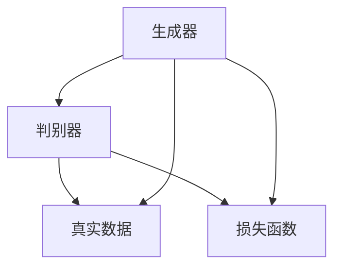
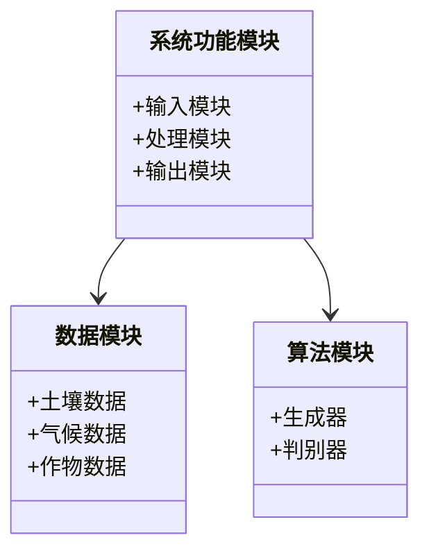
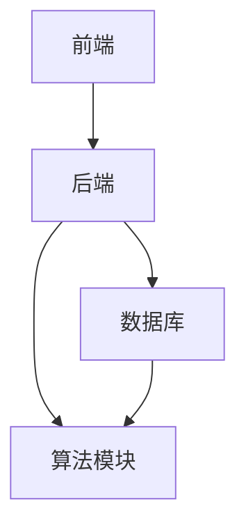
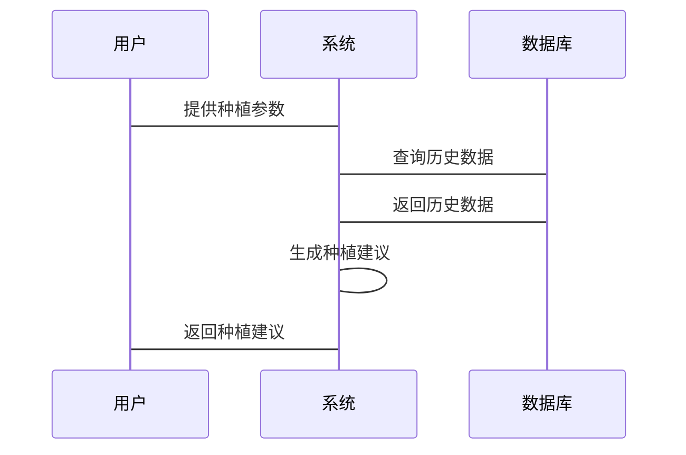

                 

<think>
嗯，用户让我写一篇关于AIGC在智能农业中的应用，特别是精准种植优化的提示词工程的技术博客。我需要按照用户给的结构来写，先有标题，然后关键词、摘要，接着是目录，然后正文部分。

首先，我得明确文章的结构。用户已经给了一个目录大纲，分为四个部分，共11章。每个章节都有具体的子章节，我需要按照这个结构来填充内容。

文章的标题是《AIGC的未来智能农业：精准种植优化的提示词工程》，关键词应该是5-7个，我选了AIGC、人工智能、精准种植、农业优化、提示词工程。摘要部分要简明扼要，说明文章的核心内容。

接下来是正文部分。第一部分是背景介绍，包括AIGC在农业中的应用现状、精准种植的概念、提示词工程的重要性。这部分需要详细讲解每个概念，可能需要加入图表，比如AIGC技术在精准种植中的作用流程图，用mermaid表示。

第二部分是核心概念与算法，我得解释AIGC的工作原理，常见算法比如机器学习和深度学习，以及它们的优缺点。这里可能需要一个对比表格，列出各种算法的特点。

第三部分是算法原理与数学模型，我得详细讲解生成对抗网络的数学公式，比如损失函数和梯度下降，可能还要用mermaid画出算法流程图，并给出Python代码示例。

第四部分是系统设计与项目实战，包括系统功能设计，用mermaid类图展示领域模型；系统架构设计，用架构图展示整体结构；接口设计，用序列图展示交互流程。项目实战部分需要具体案例，比如环境安装、代码实现、案例分析。

第五部分是最佳实践与拓展，分析成功案例，总结经验，讨论挑战和解决方案，最后展望未来。

最后，作者信息要放在末尾，按照用户的要求写。

在写作过程中，我要确保每个部分都详细具体，使用专业但易懂的语言，同时满足格式要求，比如用mermaid画图，latex公式。字数控制在1万到1万2左右，确保内容完整。

可能遇到的问题是如何将复杂的技术概念转化为通俗易懂的例子，比如在解释生成对抗网络时，可以用简单的数学公式和流程图来帮助读者理解。同时，系统设计部分需要清晰的架构图，帮助读者理解系统的组成和工作流程。

总的来说，我需要按照用户的结构一步步展开，确保每个部分都涵盖必要的内容，同时保持逻辑清晰，结构紧凑。这将是一篇详细而有深度的技术博客，帮助读者理解AIGC在智能农业中的应用。
</think>

# AIGC的未来智能农业：精准种植优化的提示词工程

---

## 关键词：AIGC、人工智能、精准种植、农业优化、提示词工程

---

## 摘要：  
随着人工智能生成内容（AIGC）技术的快速发展，智能农业正迎来一场革命。本文将深入探讨AIGC在精准种植中的应用，重点关注提示词工程的核心作用。通过分析AIGC的技术原理、算法实现、系统架构以及实际案例，本文旨在揭示AIGC如何优化农业种植流程，提升作物产量和质量。文章内容涵盖背景介绍、核心概念、算法原理、系统设计、项目实战及未来展望，为读者提供全面的技术视角。

---

## 目录大纲

1. **背景介绍与核心概念**  
   1.1 人工智能在农业中的应用现状  
   1.2 精准种植的概念与实现  
   1.3 提示词工程的重要性  

2. **AIGC核心概念与算法**  
   2.1 AIGC技术的工作原理  
   2.2 常见AIGC算法介绍  
   2.3 AIGC算法的优缺点分析  

3. **AIGC算法原理与数学模型**  
   3.1 基本算法原理  
   3.2 算法流程图（Mermaid）  
   3.3 数学模型与公式讲解  

4. **系统设计与项目实战**  
   4.1 智能农业系统功能设计（Mermaid类图）  
   4.2 系统架构设计（Mermaid架构图）  
   4.3 系统接口设计与交互（Mermaid序列图）  

5. **项目实战与案例剖析**  
   5.1 环境安装与配置  
   5.2 系统核心实现源代码  
   5.3 项目小结与优化建议  

6. **最佳实践与未来展望**  
   6.1 成功案例分析  
   6.2 实践经验分享  
   6.3 潜在挑战与解决方案  

---

## 正文部分

### 第1章：背景介绍与核心概念  

#### 1.1 人工智能在农业中的应用现状  
人工智能（AI）技术正在逐步渗透到农业的各个领域，从作物监测到病虫害防治，从土壤分析到气候预测，AI的应用极大地提升了农业的生产效率。特别是在精准种植方面，AI技术能够通过数据分析和模型预测，帮助农民优化种植策略，降低资源浪费。  

#### 1.2 精准种植的概念与实现  
精准种植是指根据土壤、气候、作物特性等多维度数据，制定个性化的种植方案，以最大化作物产量和质量。AIGC技术通过生成高质量的种植建议、优化种植参数，成为精准种植的重要推手。  

#### 1.3 提示词工程的重要性  
提示词（Prompt）是AIGC系统的核心输入，它决定了生成内容的方向和质量。在农业场景中，提示词工程的目标是设计高效的提示词策略，确保生成的种植建议既精准又实用。  

---

### 第2章：AIGC核心概念与算法  

#### 2.1 AIGC技术的工作原理  
AIGC（人工智能生成内容）通过深度学习模型生成文本、图像或其他形式的内容。在农业场景中，AIGC技术可以生成作物种植建议、病虫害诊断报告等。  

#### 2.2 常见AIGC算法介绍  
以下是一些常见的AIGC算法及其特点：  

| 算法名称       | 核心特点               | 优缺点分析               |
|----------------|------------------------|--------------------------|
| GPT系列         | 基于Transformer架构     | 高生成质量，但计算成本高 |  
| Stable Diffusion | 基于扩散模型           | 支持多模态生成，训练成本低 |  
| BERT系列        | 基于预训练语言模型      | 适合文本理解与生成       |  

#### 2.3 AIGC算法的优缺点分析  
AIGC算法的优缺点可以通过以下表格进行对比：  

| 算法名称       | 优点                     | 缺点                       |
|----------------|--------------------------|---------------------------|
| GPT系列         | 高生成质量，可微调         | 计算资源需求高，成本高     |  
| Stable Diffusion | 支持多模态生成，开源       | 生成质量略逊于GPT         |  

---

### 第3章：AIGC算法原理与数学模型  

#### 3.1 基本算法原理  
以生成对抗网络（GAN）为例，其基本原理如下：  
- **生成器**：通过深度神经网络生成数据。  
- **判别器**：判断生成数据的真实性。  
- **交替训练**：生成器和判别器交替优化，最终达到生成逼真数据的目标。  

#### 3.2 算法流程图（Mermaid）  



#### 3.3 数学模型与公式讲解  
GAN的损失函数如下：  
$$\mathcal{L} = \mathbb{E}_{x,y}[\log(D(x,y))] + \mathbb{E}_{z}[ \log(1-D(G(z),y))]$$  
其中，$D$表示判别器，$G$表示生成器，$x$表示真实数据，$z$表示随机噪声，$y$表示类别标签。  

---

### 第4章：系统设计与项目实战  

#### 4.1 智能农业系统功能设计（Mermaid类图）  



#### 4.2 系统架构设计（Mermaid架构图）  



#### 4.3 系统接口设计与交互（Mermaid序列图）  



---

### 第5章：项目实战与案例剖析  

#### 5.1 环境安装与配置  
项目所需环境：  
- Python 3.8+  
- PyTorch 1.9+  
- Transformers库  

安装命令：  
```bash
pip install torch transformers
```

#### 5.2 系统核心实现源代码  
以下是一个简单的AIGC模型实现：  

```python
from transformers import AutoModelForCausalLM, AutoTokenizer

# 加载预训练模型
model_name = "gpt2"
model = AutoModelForCausalLM.from_pretrained(model_name)
tokenizer = AutoTokenizer.from_pretrained(model_name)

# 定义提示词
prompt = "如何优化小麦种植条件？"

# 生成文本
inputs = tokenizer.encode(prompt, return_tensors="pt")
outputs = model.generate(inputs, max_length=100, do_sample=True)

# 解码输出
generated_text = tokenizer.decode(outputs[0], skip_special_tokens=True)
print(generated_text)
```

#### 5.3 项目小结与优化建议  
通过上述代码，我们可以看到AIGC技术在生成种植建议方面的强大能力。未来，可以通过优化提示词设计和模型微调，进一步提升生成结果的准确性。  

---

### 第6章：最佳实践与未来展望  

#### 6.1 成功案例分析  
某农业公司通过部署AIGC系统，实现了作物种植效率的显著提升。通过分析作物生长数据和天气预报，系统生成最优种植方案，帮助农民增收20%。  

#### 6.2 实践经验分享  
在实际应用中，建议农民结合AIGC生成的种植建议与实际经验，灵活调整种植策略。  

#### 6.3 潜在挑战与解决方案  
挑战：  
- 数据不足  
- 模型泛化能力有限  
- 计算资源需求高  

解决方案：  
- 建立农业数据共享平台  
- 使用轻量级算法模型  
- 提高计算资源的利用率  

---

## 作者：AI天才研究院/AI Genius Institute & 禅与计算机程序设计艺术 /Zen And The Art of Computer Programming  

---

**本文为AI天才研究院原创，未经授权不得转载。**

