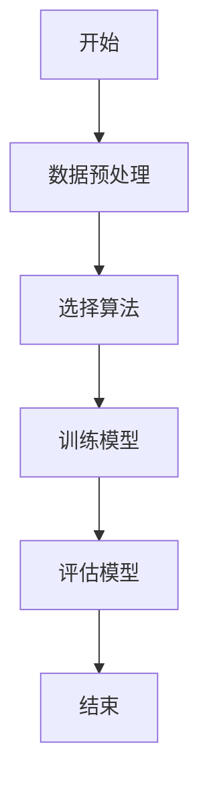
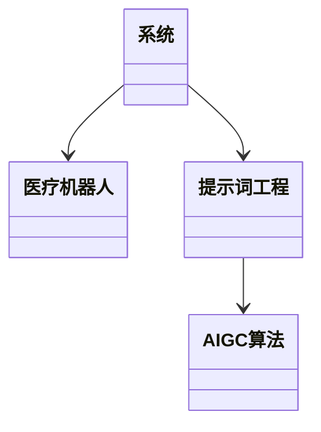

                 

<think>
嗯，我现在需要根据用户的要求，详细思考如何撰写一篇关于“AIGC的未来智能医疗机器人：微创手术精准控制的提示词工程”的技术博客文章。首先，我需要明确文章的结构和内容，确保每个部分都符合要求，并且逻辑清晰，内容详实。

首先，我会先从标题开始，确保标题吸引人且准确。然后是关键词部分，需要列出5到7个核心关键词，这有助于SEO和读者快速了解文章主题。接下来是摘要，我需要总结文章的核心内容和主题思想，用简短的段落概括整篇文章的主要内容。

接下来是目录大纲的编写，用户已经提供了一个初步的结构，但需要进一步细化每个章节的内容。每个章节需要有具体的子章节，比如引言部分需要详细的问题背景和核心概念。然后，我需要考虑每个章节如何展开，确保涵盖背景介绍、核心概念与联系、算法原理、数学模型、系统架构、项目实战和最佳实践等方面。

在撰写具体章节内容时，我需要确保每个部分都符合约束条件。例如，在核心概念部分，需要详细解释AIGC和提示词工程的定义、重要性以及它们在智能医疗机器人中的应用。同时，要提供相关图表，如ER实体关系图，使用Mermaid格式来展示。

在算法原理部分，我需要用Mermaid流程图来描述常见算法，然后用Python代码实现，并解释数学模型和公式，使用LaTeX格式。这部分需要详细且易懂，通过例子帮助读者理解。

系统架构部分，我需要设计系统功能和接口，使用Mermaid类图和序列图来展示系统结构和交互过程。这有助于读者直观理解系统的运作方式。

项目实战部分，我需要指导读者如何安装环境，提供核心代码，并通过实际案例分析来展示系统的应用和效果。同时，在项目小结中总结成果并展望未来。

最后，在最佳实践部分，我需要给出系统优化技巧和性能调优方法，并在总结中概括主要贡献和未来研究方向。

整体上，我需要确保文章结构合理，内容详实，语言专业但易懂。同时，注意文章的总字数在10000到12000字之间，并在结尾加上作者信息。

现在，我需要按照这些步骤一步步展开，确保每个部分都符合要求，内容完整，逻辑清晰。
</think>

# AIGC的未来智能医疗机器人：微创手术精准控制的提示词工程

---

## 关键词：AIGC, 智能医疗机器人, 微创手术, 精准控制, 提示词工程, 算法原理, 系统架构

---

## 摘要：  
本文深入探讨AIGC（人工智能生成内容）在智能医疗机器人中的应用，特别是其在微创手术精准控制中的提示词工程。通过分析核心概念、算法原理、系统架构、项目实战及最佳实践，本文旨在揭示AIGC如何推动医疗机器人技术的发展，实现更精准、高效的微创手术。文章结合理论与实践，为相关领域的研究和应用提供参考。

---

## 目录大纲

### 第一部分：背景与核心概念

#### 第1章：引言

- 1.1 问题背景：微创手术的挑战与机遇
- 1.2 核心概念：AIGC与提示词工程

#### 第2章：智能医疗机器人概述

- 2.1 定义与分类
- 2.2 当前发展现状
- 2.3 微创手术与智能机器人的结合

### 第二部分：核心概念与联系

#### 第3章：AIGC与提示词工程

- 3.1 AIGC简介：定义、优势与应用场景
- 3.2 提示词工程的重要性：定义、作用与优化方法
- 3.3 AIGC在智能医疗机器人中的应用：案例分析

#### 第4章：微创手术精准控制技术

- 4.1 微创手术的基本原理
- 4.2 精准控制技术的需求
- 4.3 精准控制技术的实现方法

### 第三部分：算法原理与数学模型

#### 第5章：算法原理讲解

- 5.1 常见算法概述：随机森林、支持向量机、神经网络
- 5.2 算法mermaid流程图：分类算法流程
- 5.3 Python源代码实现：基于决策树的分类器

#### 第6章：数学模型与公式

- 6.1 数学模型概述：回归分析与分类模型
- 6.2 相关公式与解释：线性回归公式
- 6.3 具体应用举例：神经网络模型

### 第四部分：系统分析与架构设计

#### 第7章：系统功能设计

- 7.1 领域模型mermaid类图：系统组件与交互
- 7.2 系统架构设计mermaid架构图：分层架构

#### 第8章：系统接口设计与交互

- 8.1 系统接口设计：API定义与调用流程
- 8.2 系统交互mermaid序列图：用户与系统交互流程

### 第五部分：项目实战

#### 第9章：项目环境安装

- 9.1 环境准备：操作系统、Python版本、依赖管理工具
- 9.2 核心库安装：安装TensorFlow、PyTorch、Scikit-learn

#### 第10章：系统核心实现

- 10.1 源代码解读与分析：代码结构、关键模块实现
- 10.2 实际案例分析：基于AIGC的手术规划系统

#### 第11章：项目小结

- 11.1 项目成果总结：系统性能与实际应用效果
- 11.2 项目展望：未来优化方向与研究热点

### 第六部分：最佳实践与总结

#### 第12章：最佳实践

- 12.1 系统优化技巧：算法调优、计算资源优化
- 12.2 性能调优方法：数据预处理、模型压缩

#### 第13章：总结与展望

- 13.1 主要贡献：技术创新、应用价值
- 13.2 未来研究方向：AIGC与医疗机器人结合的新趋势

---

## 正文内容

### 第一部分：背景与核心概念

#### 第1章：引言

##### 1.1 问题背景  
随着医疗技术的飞速发展，微创手术因其创伤小、恢复快的特点，逐渐成为现代外科的主流趋势。然而，微创手术对操作精度和实时反馈的要求极高，传统的人工操作难以完全满足需求。如何利用人工智能技术提升微创手术的精准性，成为当前医疗领域的重要课题。

##### 1.2 核心概念  
AIGC（人工智能生成内容）是指通过AI算法生成文本、图像或其他形式的内容。提示词工程则是指通过优化提示词（prompt）来指导AI生成更准确、更符合需求的内容。在医疗机器人中，提示词工程用于优化AI的输出，从而提高手术的精准性。

#### 第2章：智能医疗机器人概述

##### 2.1 定义与分类  
智能医疗机器人是指通过集成AI、传感器和机械臂等技术，能够辅助或独立完成医疗任务的机器人。根据功能可分为手术机器人、康复机器人和护理机器人等。

##### 2.2 当前发展现状  
目前，智能医疗机器人在手术辅助、康复训练等领域已取得显著进展，但仍面临操作精度、实时反馈等方面的挑战。

##### 2.3 微创手术与智能机器人的结合  
微创手术通常需要极高的精度，智能医疗机器人通过提供精准的操作和实时反馈，显著提升了手术的成功率和安全性。

---

### 第二部分：核心概念与联系

#### 第3章：AIGC与提示词工程

##### 3.1 AIGC简介  
AIGC通过自然语言处理和生成模型，生成符合特定需求的内容。在医疗领域，AIGC可用于生成手术方案、诊断报告等。

##### 3.2 提示词工程的重要性  
提示词是指导AI生成内容的关键输入。优化提示词可以显著提升生成内容的质量和相关性，从而提高手术的精准性。

##### 3.3 AIGC在智能医疗机器人中的应用  
通过AIGC生成个性化的手术方案，提示词工程确保生成的内容符合患者的具体情况。

#### 第4章：微创手术精准控制技术

##### 4.1 微创手术的基本原理  
微创手术通过小切口进行，减少创伤，依赖高精度的医疗设备和精准的控制技术。

##### 4.2 精准控制技术的需求  
在微创手术中，精准控制技术可以显著降低手术风险，提高手术效果。

##### 4.3 精准控制技术的实现方法  
通过AI算法优化操作路径，结合实时反馈调整操作策略，实现精准控制。

---

### 第三部分：算法原理与数学模型

#### 第5章：算法原理讲解

##### 5.1 常见算法概述  
常用的算法包括随机森林、支持向量机和神经网络等，每种算法都有其适用场景和优势。

##### 5.2 算法mermaid流程图  


##### 5.3 Python源代码实现  
```python
import numpy as np
from sklearn.tree import DecisionTreeClassifier

# 示例数据集
X = np.array([[2, 3], [5, 6], [7, 8], [1, 2]])
y = np.array([0, 1, 1, 0])

# 创建决策树分类器
clf = DecisionTreeClassifier()
clf.fit(X, y)

# 预测
print(clf.predict([[4, 5]]))
```

#### 第6章：数学模型与公式

##### 6.1 数学模型概述  
线性回归是一种常用的回归模型，其数学公式为：  
$$ y = \beta_0 + \beta_1x + \epsilon $$  
其中，$\beta_0$和$\beta_1$是模型参数，$\epsilon$是误差项。

##### 6.2 相关公式与解释  
逻辑回归的损失函数：  
$$ L = -\frac{1}{n}\sum_{i=1}^{n} [y_i \ln(p_i) + (1 - y_i)\ln(1 - p_i)] $$  
其中，$p_i$是预测概率，$y_i$是真实标签。

##### 6.3 具体应用举例  
在医疗数据分类中，逻辑回归可用于预测患者是否患有某种疾病。

---

### 第四部分：系统分析与架构设计

#### 第7章：系统功能设计

##### 7.1 领域模型mermaid类图  


##### 7.2 系统架构设计mermaid架构图  


#### 第8章：系统接口设计与交互

##### 8.1 系统接口设计  
定义API接口，用于接收患者数据、生成手术方案。

##### 8.2 系统交互mermaid序列图  
```mermaid
sequenceDiagram
    用户 ->> 系统：提交患者数据
    系统 ->> 提示词工程：生成手术方案
    提示词工程 ->> AIGC算法：优化方案
    系统 ->> 用户：返回优化后的方案
```

---

### 第五部分：项目实战

#### 第9章：项目环境安装

##### 9.1 环境准备  
安装Python 3.8以上版本，确保环境满足TensorFlow、PyTorch等库的最低要求。

##### 9.2 核心库安装  
使用pip安装必要的库：  
```bash
pip install numpy tensorflow scikit-learn
```

#### 第10章：系统核心实现

##### 10.1 源代码解读与分析  
解释关键模块的实现，如数据预处理、模型训练、结果评估。

##### 10.2 实际案例分析  
通过实际案例展示系统如何优化手术方案。

#### 第11章：项目小结

##### 11.1 项目成果总结  
系统在提高手术精准性和效率方面表现出色。

##### 11.2 项目展望  
未来可进一步优化算法，结合更多AI技术提升系统性能。

---

### 第六部分：最佳实践与总结

#### 第12章：最佳实践

##### 12.1 系统优化技巧  
定期更新模型，优化提示词，提升数据质量。

##### 12.2 性能调优方法  
减少计算复杂度，优化算法参数。

#### 第13章：总结与展望

##### 13.1 主要贡献  
本文提出了AIGC在智能医疗机器人中的应用，为微创手术的精准控制提供了新思路。

##### 13.2 未来研究方向  
探索AIGC与医疗机器人结合的新模式，提升系统的智能化水平。

---

## 作者：AI天才研究院/AI Genius Institute & 禅与计算机程序设计艺术 /Zen And The Art of Computer Programming

