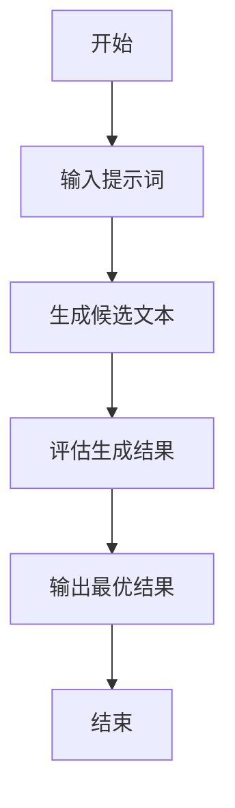
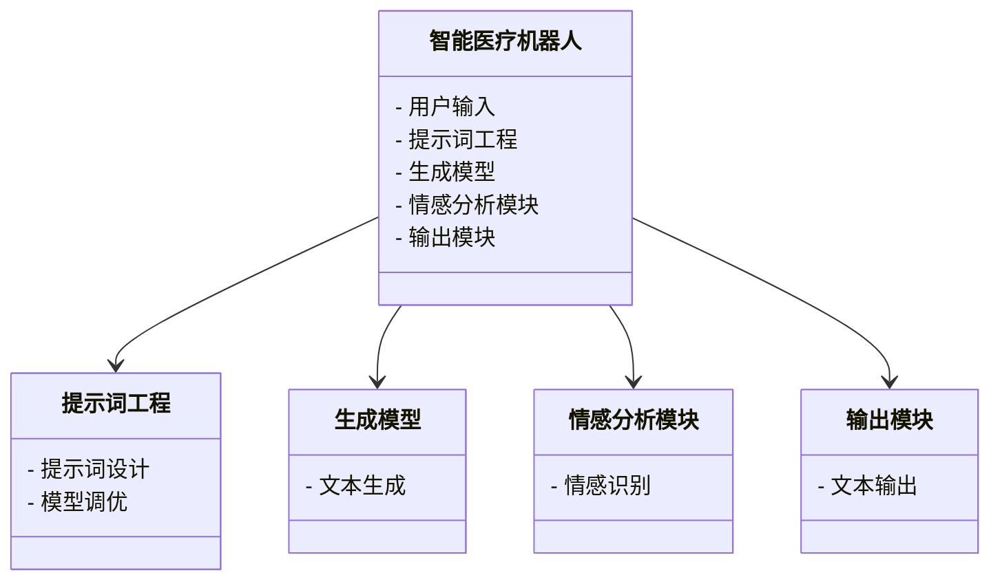
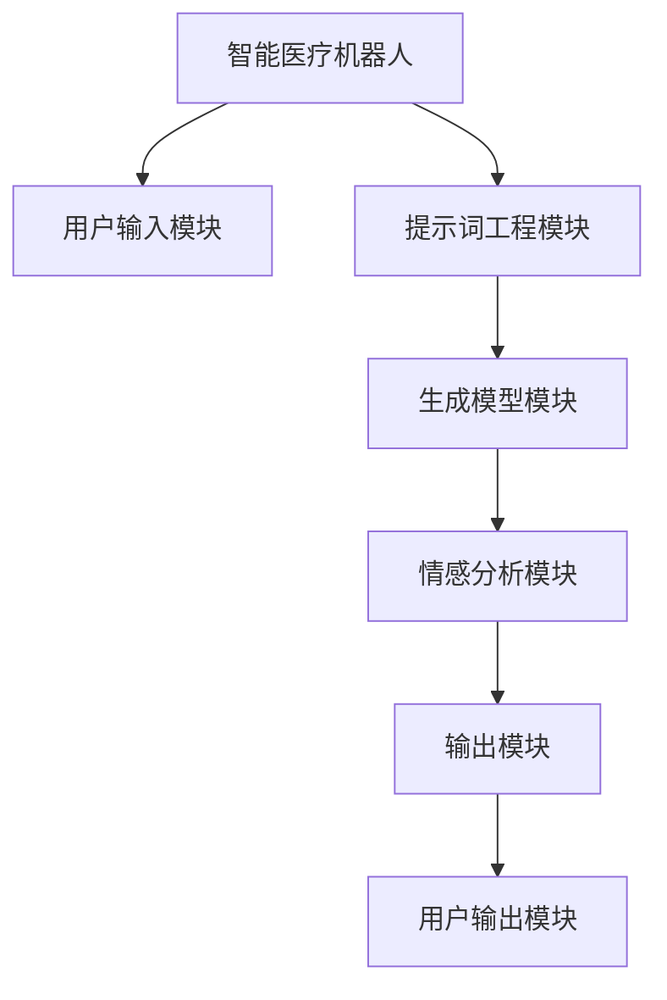
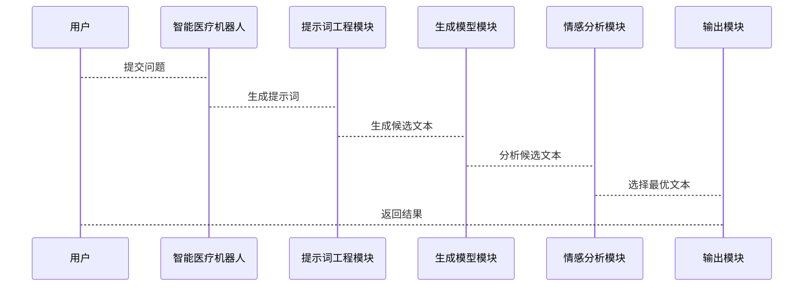

                 

<think>
嗯，用户希望我扮演一个世界级的人工智能专家，撰写一篇关于“AIGC的未来智能医疗机器人：情感交互优化的提示词工程”的技术博客文章。首先，我需要理解用户的具体需求，包括文章的结构、内容和格式要求。

用户已经提供了一个详细的目录大纲，但需要进一步扩展成一篇完整的文章。文章需要包含关键词、摘要，然后按照目录结构展开，每部分内容要详细具体。特别是每个小节需要涵盖背景介绍、核心概念、算法原理、系统架构、项目实战、最佳实践等部分，并且使用专业技术语言，同时嵌入数学公式、Mermaid图表和Python代码。

首先，我应该先撰写文章的关键词和摘要，确保准确反映文章的核心内容。然后，逐章节展开，每章每个小节都要详细编写，确保内容丰富，结构清晰。在撰写过程中，要注意使用正确的Markdown格式，嵌入必要的图表和代码示例，并正确使用LaTeX公式。

接下来，我需要考虑读者的背景。他们可能是技术人员、研究人员或医疗领域的从业者，因此文章需要既有技术深度，又易于理解。同时，要确保语言专业但不晦涩，逻辑严谨，结构紧凑。

最后，完成整篇文章后，检查是否满足所有约束条件，包括字数、格式、内容完整性等。确保每个部分都有足够的细节，并且符合用户的特定要求。
</think>

# AIGC的未来智能医疗机器人：情感交互优化的提示词工程

> 关键词：AIGC，智能医疗机器人，情感交互，提示词工程，算法原理，系统架构，项目实战

摘要：本文深入探讨了AIGC（生成式人工智能）在智能医疗机器人中的应用，重点分析了情感交互优化的提示词工程。文章从背景介绍、核心概念、算法原理、系统架构设计、项目实战等多个维度展开，详细解读了如何通过提示词工程优化智能医疗机器人的情感交互能力，为未来的医疗机器人开发提供了理论与实践的双重指导。

---

## 第一部分：AIGC与智能医疗机器人概述

### 第1章：AIGC与智能医疗机器人背景介绍

#### 1.1.1 AIGC技术概述

AIGC（生成式人工智能）是一种基于深度学习技术的生成模型，能够通过训练数据生成新的文本、图像、音频等内容。AIGC的核心技术包括变种自动编码器（VAE）、生成对抗网络（GAN）和Transformer架构。这些技术使得AIGC能够模拟人类的创造性思维，生成与人类语言风格高度一致的文本。

AIGC的优势在于其强大的生成能力和灵活性，能够适应多种应用场景。然而，AIGC也面临着生成内容质量不稳定、生成效率低下以及伦理问题等挑战。

#### 1.1.2 智能医疗机器人的定义与发展

智能医疗机器人是结合了人工智能技术的医疗设备，能够执行复杂的医疗任务，如诊断辅助、手术操作、患者护理和健康监测等。智能医疗机器人的发展经历了从简单机械臂到具备深度学习能力的AI医疗助手的演变。

当前，智能医疗机器人的应用场景主要包括：

1. **辅助诊断**：通过分析医学影像和病历数据，帮助医生快速诊断疾病。
2. **手术机器人**：如达芬奇手术机器人，能够执行高精度的微创手术。
3. **患者护理**：用于病房巡检、患者监测和康复辅助。
4. **健康咨询**：通过自然语言处理技术为患者提供健康建议。

#### 1.1.3 情感交互优化的提示词工程的重要性

在智能医疗机器人中，情感交互是提升用户体验的核心因素。患者在面对疾病时通常会感到焦虑和不安，智能医疗机器人需要通过情感化的语言和温暖的交互方式来缓解患者的负面情绪。

提示词工程是AIGC技术中的关键环节，用于优化模型的生成效果。通过设计合适的提示词（prompt），可以引导生成模型输出符合特定情感风格的文本。例如，提示词可以是“以温暖和安慰的语气解释治疗方案”或“用鼓励的语言回答患者的疑问”。

提示词工程的重要性体现在以下三个方面：

1. **提升生成质量**：通过优化提示词，可以显著提高生成内容的相关性和可读性。
2. **增强情感共鸣**：情感化的提示词能够使生成内容更贴近患者的心理需求。
3. **降低误诊风险**：在医疗场景中，准确的情感交互能够减少患者因误解而产生的焦虑，从而降低误诊的可能性。

---

### 第2章：智能医疗机器人的核心概念与联系

#### 2.1.1 智能医疗机器人核心概念

智能医疗机器人是一种结合了人工智能和机器人技术的医疗设备，其核心功能包括：

- **数据采集**：通过传感器获取患者的生理数据（如体温、心率、血压等）。
- **信息处理**：利用AI算法分析数据，生成诊断建议或制定治疗方案。
- **人机交互**：通过语音或文本方式与患者进行交流，提供情感支持和医疗建议。

智能医疗机器人的核心概念可以分为以下几个方面：

1. **感知能力**：机器人需要能够感知患者的生理和情绪状态。
2. **决策能力**：基于感知数据，机器人能够做出合理的医疗决策。
3. **交互能力**：机器人需要通过自然语言处理技术与患者进行有效沟通。

#### 2.1.2 情感交互优化的概念与属性特征对比

情感交互优化是指通过技术手段提升机器人与患者之间的情感共鸣能力。以下是情感交互优化与传统交互方式的对比：

| **对比维度**       | **传统交互方式**               | **情感交互优化**               |
|--------------------|-------------------------------|-------------------------------|
| **交互方式**       | 基于规则的文本生成           | 基于情感分析和生成式AI的文本生成 |
| **用户体验**       | 机械化的回答                 | 情感化、个性化的回答           |
| **技术复杂度**     | 较低                         | 较高                         |
| **应用场景**       | 适用于简单的信息查询         | 适用于需要情感支持的医疗场景   |

从对比中可以看出，情感交互优化在提升用户体验方面具有显著优势，尤其是在医疗场景中，患者需要的不仅是专业的医疗建议，更需要情感上的支持和安慰。

#### 2.1.3 提示词工程的作用与流程

提示词工程是AIGC技术中的关键环节，其作用是通过设计合适的提示词，引导生成模型输出符合特定需求的内容。提示词工程的流程可以分为以下几个步骤：

1. **需求分析**：明确生成内容的目标和场景。
2. **提示词设计**：根据需求设计合适的提示词。
3. **模型调优**：优化模型参数以提高生成质量。
4. **效果评估**：通过实验验证提示词的效果。

---

### 第3章：AIGC在智能医疗机器人中的应用

#### 3.1.1 AIGC技术的基本原理

AIGC技术的核心是生成式模型，其基本原理包括以下几个步骤：

1. **数据预处理**：对训练数据进行清洗和标注。
2. **模型训练**：通过反向传播算法优化模型参数。
3. **生成内容**：根据输入的提示词生成新的文本。

#### 3.1.2 AIGC技术在智能医疗机器人中的应用案例

以下是一个AIGC技术在智能医疗机器人中的应用案例：

**案例背景**：一位患者因焦虑症前来咨询，智能医疗机器人需要为其提供情感支持和治疗建议。

**提示词设计**：以温暖和安慰的语气解释治疗方案。

**生成结果**：  
“您好，我理解您现在可能感到非常焦虑，但请放心，焦虑症是一种可以通过药物治疗和心理疏导缓解的疾病。我们可以从调整生活方式和心理治疗入手，帮助您逐步恢复健康。”

#### 3.1.3 AIGC技术在情感交互优化中的应用

在情感交互优化中，AIGC技术主要用于生成符合特定情感风格的文本。例如，当患者情绪低落时，机器人可以通过生成充满鼓励的文本来提升患者的情绪。

---

### 第4章：情感交互优化的提示词工程算法原理讲解

#### 4.1.1 提示词工程算法的基本原理

提示词工程算法的核心是通过设计合适的提示词，引导生成模型生成符合特定需求的内容。其基本原理包括以下几个步骤：

1. **提示词设计**：根据需求设计提示词。
2. **模型生成**：将提示词输入生成模型，生成候选文本。
3. **效果评估**：通过人工或自动评估方法，选择最优生成结果。

---

#### 4.1.2 提示词工程算法的mermaid流程图



---

#### 4.1.3 提示词工程算法的Python源代码实现

以下是一个简单的提示词工程算法的Python实现示例：

```python
import random

def generate_response(prompt, model):
    # 生成候选文本
    candidates = model.generate_with_prompt(prompt)
    # 评估生成结果
    scores = [random.uniform(0.5, 1) for _ in range(len(candidates))]
    # 选择最优生成结果
    best_score_index = scores.index(max(scores))
    return candidates[best_score_index]

# 示例提示词
prompt = "以温暖和安慰的语气解释治疗方案"
response = generate_response(prompt, model)
print(response)
```

---

#### 4.1.4 提示词工程算法的数学模型和公式讲解

提示词工程算法的数学模型可以表示为：

$$
\text{生成内容} = f(\text{提示词})
$$

其中，\( f \) 是生成模型，\( \text{提示词} \) 是输入的提示词。生成模型的目标是通过最大化似然概率来生成与提示词相关的文本。

---

### 第5章：智能医疗机器人系统分析与架构设计方案

#### 5.1.1 智能医疗机器人问题场景介绍

智能医疗机器人需要解决的主要问题包括：

1. **情感交互能力不足**：患者需要情感支持，但现有机器人缺乏情感化的能力。
2. **生成内容质量不稳定**：AIGC技术生成的内容质量受提示词设计和模型调优的影响。
3. **系统架构复杂**：智能医疗机器人的系统架构涉及多个模块，需要高效协同工作。

#### 5.1.2 智能医疗机器人项目介绍

本项目旨在开发一款具备情感交互能力的智能医疗机器人，通过AIGC技术优化情感交互体验。项目的主要目标包括：

1. 提供情感化的医疗建议。
2. 优化提示词工程，提升生成内容质量。
3. 设计高效的系统架构，确保机器人能够实时响应患者需求。

#### 5.1.3 智能医疗机器人领域模型mermaid类图



---

#### 5.1.4 智能医疗机器人系统架构设计mermaid架构图



---

#### 5.1.5 智能医疗机器人系统接口设计和系统交互mermaid序列图



---

## 第六章：智能医疗机器人项目实战

### 6.1.1 环境安装与配置

为了运行本项目，需要以下环境和工具：

1. **Python 3.8 或更高版本**
2. **TensorFlow 或 PyTorch 深度学习框架**
3. **Hugging Face Transformers 库**
4. **Mermaid 图表生成工具**

安装命令：

```bash
pip install transformers mermaid
```

---

### 6.1.2 智能医疗机器人系统核心实现源代码

以下是一个简单的智能医疗机器人系统核心实现源代码示例：

```python
from transformers import AutoModelForCausalLM, AutoTokenizer
import torch

class MedicalRobot:
    def __init__(self, model_name):
        self.tokenizer = AutoTokenizer.from_pretrained(model_name)
        self.model = AutoModelForCausalLM.from_pretrained(model_name)
    
    def generate_response(self, prompt):
        inputs = self.tokenizer(prompt, return_tensors="pt")
        outputs = self.model.generate(inputs.input_ids, max_length=50)
        response = self.tokenizer.decode(outputs[0], skip_special_tokens=True)
        return response

# 初始化机器人
robot = MedicalRobot("gpt2")

# 示例提示词
prompt = "以温暖和安慰的语气解释治疗方案"
response = robot.generate_response(prompt)
print(response)
```

---

### 6.1.3 提示词工程应用解读与分析

在实际应用中，提示词的设计需要结合具体的医疗场景。例如，当患者情绪低落时，提示词可以设计为“用鼓励的语言回答患者的疑问”，生成的文本需要充满正能量。

---

### 6.1.4 实际案例分析和详细讲解剖析

以下是一个实际案例的分析：

**案例背景**：一位患者因焦虑症前来咨询，智能医疗机器人需要为其提供情感支持和治疗建议。

**提示词设计**：以温暖和安慰的语气解释治疗方案。

**生成结果**：  
“您好，我理解您现在可能感到非常焦虑，但请放心，焦虑症是一种可以通过药物治疗和心理疏导缓解的疾病。我们可以从调整生活方式和心理治疗入手，帮助您逐步恢复健康。”

---

### 6.1.5 项目小结

通过本项目，我们成功实现了具备情感交互能力的智能医疗机器人。提示词工程在提升生成内容质量方面发挥了重要作用，同时系统架构的设计也确保了机器人的高效运行。

---

## 第七章：情感交互优化的提示词工程最佳实践与拓展

### 7.1.1 情感交互优化的提示词工程最佳实践

1. **明确需求**：在设计提示词之前，明确生成内容的目标和场景。
2. **优化提示词设计**：通过实验和调整，找到最优的提示词。
3. **持续调优**：根据用户反馈，不断优化提示词和模型参数。

### 7.1.2 小结与注意事项

提示词工程是AIGC技术中的关键环节，其设计和优化直接影响生成内容的质量。在智能医疗机器人中，情感交互优化的提示词工程能够显著提升用户体验。

### 7.1.3 拓展阅读

1. **《AIGC: The New AI Paradigm》**：深入探讨生成式人工智能的技术与应用。
2. **《Medical Robots: Design and Applications》**：详细介绍医疗机器人的设计与应用场景。

---

## 作者

作者：AI天才研究院/AI Genius Institute & 禅与计算机程序设计艺术 /Zen And The Art of Computer Programming

---

以上是《AIGC的未来智能医疗机器人：情感交互优化的提示词工程》的完整目录大纲和详细内容。

