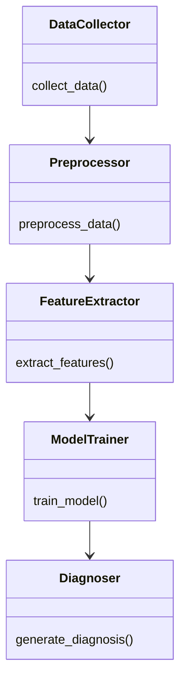
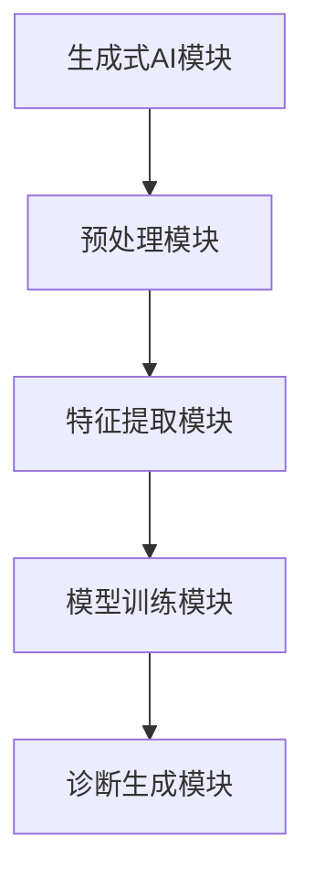
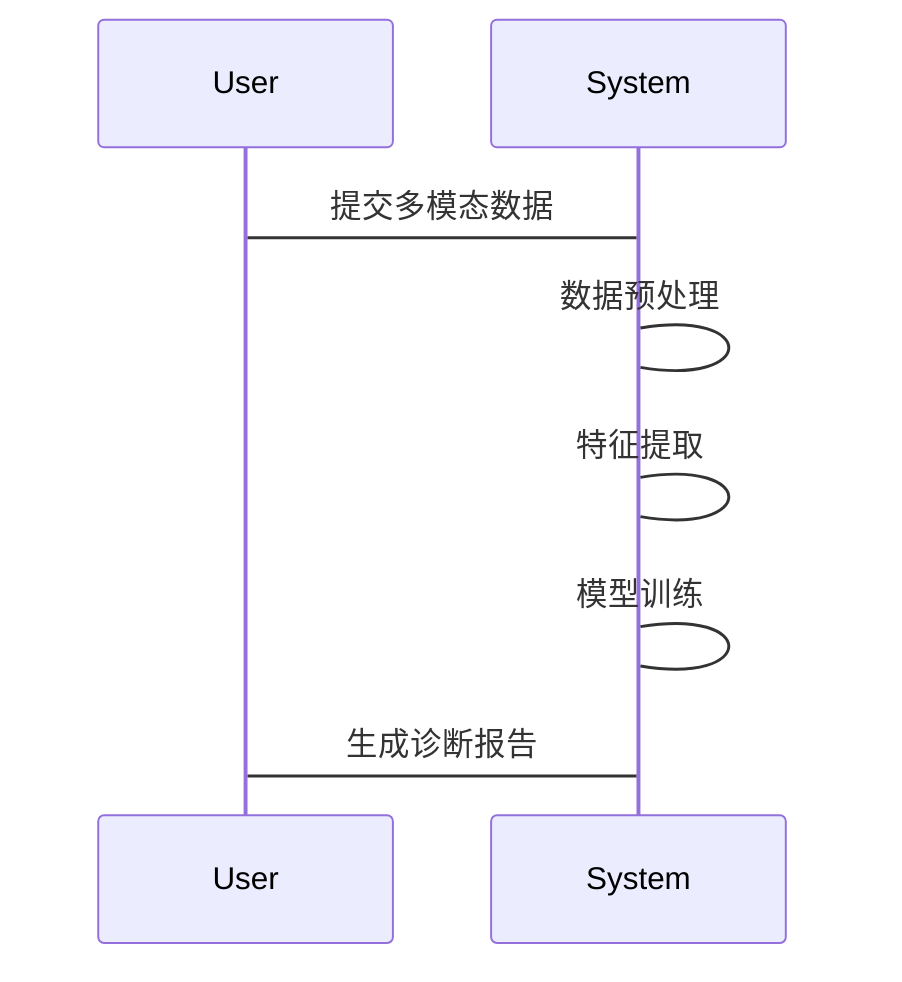

                 

<think>
嗯，今天用户让我写一篇关于AIGC未来智能医疗诊断系统的博客文章。标题是《多模态生物标志物分析的提示词工程》。我得先理清楚这个主题到底涉及哪些方面。首先，AIGC，也就是人工智能生成内容，现在在医疗诊断中的应用越来越广泛。多模态生物标志物分析听起来像是结合了多种数据类型，比如基因数据、影像数据、临床数据等，来进行更精准的诊断。

用户给的目录大纲已经比较详细了，包括引言、多模态生物标志物分析的技术基础、提示词工程的方法与实践，以及案例分析和未来展望。我需要按照这个结构来逐步展开。

首先，引言部分需要介绍AIGC在医疗诊断中的重要性，然后详细解释多模态生物标志物和提示词工程的基本概念。这部分我需要确保读者能够理解这些术语，同时明确它们在医疗中的应用价值。

接下来是技术基础部分。多模态数据采集与预处理是关键，我得解释不同类型的数据，比如结构MRI、基因表达数据、电子病历等。然后，数据融合技术如何将这些数据整合，可能用到主成分分析或深度学习模型。特征提取部分，我应该讨论如何从这些数据中提取有用的特征，并评估这些特征的有效性。

机器学习和深度学习在生物标志物分析中的应用也是一个重点，我需要比较两种方法的优缺点，并举例说明它们在诊断中的实际应用，比如肺癌诊断的例子。

提示词工程部分，我得从定义开始，解释它在AIGC中的作用，然后详细讨论提示词的设计原则和生成技术。这里可能需要提到自然语言处理和生成式模型，比如GPT-3。然后，探讨提示词在数据预处理、特征提取和模型训练中的具体应用，举几个实际案例，比如医学图像分析和电子病历处理。

在系统设计方面，我需要画出领域模型的类图，展示各个组件之间的关系，比如数据源、预处理模块、特征提取模块等。系统架构设计可能需要展示微服务架构，各个模块之间的交互。接口设计部分，可以描述RESTful API的具体请求和响应。交互序列图则展示用户如何与系统互动，比如用户提交数据，系统处理并返回结果。

项目实战部分，我需要提供一个具体的案例，比如肺癌诊断系统。从环境安装开始，可能需要Python、深度学习框架，比如TensorFlow或PyTorch。然后，详细讲解核心代码，比如数据预处理、模型训练和评估部分。还要展示如何调用API进行预测，并解释结果。

最后，在小结和展望部分，总结提示词工程的优势，比如提升模型性能和可解释性，同时指出当前的挑战，比如数据隐私和模型泛化能力。未来可能的方向包括多模态提示词和动态自适应提示词，以应对医疗场景的变化。

整个过程中，我需要确保每个部分都有足够的技术细节，同时保持语言的专业性和可读性。可能还需要加入一些数学公式和图表，比如特征提取的流程图，或者机器学习模型的数学表达式。此外，代码部分要清晰，注释详细，方便读者理解。

总的来说，我需要系统地按照用户提供的目录，逐一展开每个部分，确保内容全面、结构清晰，并且符合用户的格式和深度要求。这将帮助读者更好地理解AIGC在智能医疗诊断中的应用，特别是多模态生物标志物分析和提示词工程的关键作用。
</think>

# AIGC的未来智能医疗诊断系统：多模态生物标志物分析的提示词工程

> 关键词：AIGC（生成式人工智能）、智能医疗诊断系统、多模态生物标志物、提示词工程、机器学习、深度学习、医疗数据分析

> 摘要：本文探讨了生成式人工智能（AIGC）在智能医疗诊断系统中的应用，特别是多模态生物标志物分析中的提示词工程。通过分析多模态数据的采集、融合与特征提取，结合生成式AI的技术优势，本文提出了一种基于提示词工程的医疗诊断优化方案。文章详细阐述了提示词工程的核心概念、技术实现和应用场景，并通过实际案例展示了其在医疗诊断中的潜力与价值。

---

## 第一部分：引言：AIGC与智能医疗诊断系统

### 1.1 AIGC技术的发展及其在医疗领域的应用

#### 1.1.1 AIGC的定义与核心技术
生成式人工智能（AIGC, Artificial Intelligence Generated Content）是指利用生成式模型（如GPT、Diffusion Model等）生成高质量文本、图像或其他形式内容的技术。其核心技术包括：
- **自然语言处理（NLP）**：通过语言模型生成人类可读的内容。
- **生成式模型**：基于深度学习的生成对抗网络（GAN）或变分自编码器（VAE）。
- **提示词工程技术**：通过优化提示词（prompt engineering）引导模型生成符合需求的输出。

#### 1.1.2 AIGC在医疗领域的潜力与挑战
- **潜力**：在医疗领域，AIGC可以用于生成诊断报告、辅助医生进行病情分析、自动生成医学文献摘要等。
- **挑战**：数据隐私、模型的可解释性、生成结果的准确性等问题亟待解决。

#### 1.1.3 AIGC对医疗诊断系统的革新
AIGC能够显著提高医疗诊断的效率和准确性，特别是在处理多模态数据时，生成式AI可以整合来自不同数据源的信息，提供更全面的诊断支持。

---

### 1.2 智能医疗诊断系统的概述

#### 1.2.1 系统的基本概念
智能医疗诊断系统是一种结合人工智能技术的医疗诊断工具，通过分析患者的多模态数据（如影像、基因、临床数据等）来辅助医生做出更准确的诊断。

#### 1.2.2 系统的核心功能与组成部分
- **数据采集**：整合患者的多模态数据。
- **数据分析**：通过机器学习和深度学习模型对数据进行处理。
- **诊断生成**：基于分析结果生成诊断建议或报告。

#### 1.2.3 智能医疗诊断系统的发展历程
从早期的简单规则引擎到如今的深度学习模型，智能医疗诊断系统经历了从单一模态到多模态、从规则驱动到数据驱动的转变。

---

### 1.3 多模态生物标志物分析的重要性

#### 1.3.1 生物标志物的概念与分类
生物标志物是用于诊断疾病、评估治疗效果的客观指标，包括基因表达、蛋白质水平、影像特征等。

#### 1.3.2 多模态生物标志物分析的优势
通过整合多种生物标志物信息，可以提高诊断的准确性和全面性。

#### 1.3.3 多模态生物标志物分析的应用前景
在癌症早期筛查、个性化治疗方案制定等领域具有广阔的应用前景。

---

### 1.4 提示词工程的基础

#### 1.4.1 提示词工程的概念
提示词工程是指通过优化提示词（prompt engineering）来引导生成式AI生成符合特定需求的输出。

#### 1.4.2 提示词工程的关键要素
- **提示词设计**：明确提示词的内容和形式。
- **模型调优**：优化生成式模型以适应特定任务。
- **结果评估**：评估生成结果的质量和适用性。

#### 1.4.3 提示词工程的方法与策略
通过实验和反馈不断优化提示词，以提高生成结果的准确性和相关性。

---

### 1.5 AIGC在未来智能医疗诊断系统中的应用

#### 1.5.1 AIGC技术对诊断流程的优化
通过生成式AI，可以快速生成诊断报告并提供个性化建议。

#### 1.5.2 AIGC在个性化医疗中的应用
基于患者的基因信息和病史，生成个性化的治疗方案。

#### 1.5.3 AIGC在医疗数据安全与隐私保护中的作用
通过加密技术和数据脱敏，保护患者隐私。

---

### 1.6 本章小结
本章介绍了生成式人工智能（AIGC）在医疗诊断中的应用潜力，重点分析了多模态生物标志物分析和提示词工程的核心概念与技术优势。

---

## 第二部分：多模态生物标志物分析的技术基础

### 2.1 多模态数据采集与预处理

#### 2.1.1 多模态数据的种类
- **影像数据**：如MRI、CT扫描。
- **基因数据**：如基因表达谱。
- **临床数据**：如病史、症状描述。

#### 2.1.2 数据采集的挑战与解决方案
- **挑战**：数据格式多样、数据量大。
- **解决方案**：使用标准化接口和高效的数据处理工具。

#### 2.1.3 数据预处理的方法与工具
- **数据清洗**：去除噪声数据。
- **数据标准化**：统一数据格式。

---

### 2.2 多模态数据融合技术

#### 2.2.1 数据融合的基本原理
通过将不同模态的数据进行特征提取和融合，提高分析结果的准确性。

#### 2.2.2 数据融合的方法分类
- **基于特征的融合**：提取特征后进行融合。
- **基于模型的融合**：在模型内部进行多模态数据的联合分析。

#### 2.2.3 数据融合在生物标志物分析中的应用
在癌症诊断中，通过融合基因表达和影像数据，可以提高诊断的准确性。

---

### 2.3 生物标志物特征提取

#### 2.3.1 特征提取的重要性
特征提取是将原始数据转化为有意义的特征向量的关键步骤。

#### 2.3.2 特征提取的方法
- **主成分分析（PCA）**：降维技术。
- **深度学习模型**：如卷积神经网络（CNN）。

#### 2.3.3 特征提取的评估指标
- **准确率**：分类的准确程度。
- **召回率**：识别出的阳性病例的比例。

---

### 2.4 机器学习与深度学习在生物标志物分析中的应用

#### 2.4.1 机器学习的基本概念
机器学习是一种通过数据训练模型的技术，分为监督学习、无监督学习和半监督学习。

#### 2.4.2 深度学习的关键技术
- **卷积神经网络（CNN）**：用于图像分析。
- **循环神经网络（RNN）**：用于序列数据处理。

#### 2.4.3 机器学习与深度学习在生物标志物分析中的对比
深度学习在处理复杂数据时表现更优，但需要更多的计算资源。

---

### 2.5 多模态生物标志物分析的模型评估与优化

#### 2.5.1 模型评估的方法
- **交叉验证**：评估模型的泛化能力。
- **混淆矩阵**：评估分类性能。

#### 2.5.2 模型优化的策略
- **超参数调优**：通过网格搜索优化模型性能。
- **数据增强**：增加训练数据的多样性。

#### 2.5.3 模型评估与优化的实例分析
以肺癌诊断为例，通过调整模型参数和优化数据预处理步骤，显著提高了诊断准确率。

---

### 2.6 本章小结
本章详细介绍了多模态生物标志物分析的技术基础，包括数据采集、融合、特征提取和模型评估等关键步骤。

---

## 第三部分：提示词工程的方法与实践

### 3.1 提示词工程的定义与目的

#### 3.1.1 提示词工程的基本概念
提示词工程是指通过设计和优化提示词，引导生成式AI生成符合特定需求的输出。

#### 3.1.2 提示词工程的目标
- 提高生成结果的准确性。
- 提升生成结果的相关性。

#### 3.1.3 提示词工程的应用场景
在医疗诊断中，提示词工程可以用于生成诊断报告和个性化治疗方案。

---

### 3.2 提示词的设计原则与方法

#### 3.2.1 提示词的设计原则
- **明确性**：提示词应明确生成目标。
- **简洁性**：避免冗长复杂的描述。
- **可调性**：根据需求调整提示词内容。

#### 3.2.2 提示词的设计方法
- **基于规则的提示词生成**：根据领域知识设计提示词。
- **基于模型的提示词生成**：通过机器学习模型优化提示词。

#### 3.2.3 提示词的质量评估
通过人工评估和自动化工具结合的方式，评估提示词的质量。

---

### 3.3 提示词生成的技术实现

#### 3.3.1 自然语言处理技术
通过NLP技术优化提示词的生成过程。

#### 3.3.2 机器学习模型在提示词生成中的应用
- **基于生成式模型**：如GPT-3，生成高质量的提示词。

#### 3.3.3 提示词生成系统的架构设计
- **输入模块**：接收用户需求。
- **生成模块**：生成优化的提示词。
- **输出模块**：输出生成的提示词。

---

### 3.4 提示词在多模态生物标志物分析中的应用

#### 3.4.1 提示词在数据预处理中的应用
通过提示词指导数据清洗和标准化过程。

#### 3.4.2 提示词在特征提取中的应用
提示词可以引导模型关注重要的特征。

#### 3.4.3 提示词在模型训练中的应用
通过优化提示词，提升模型的训练效果。

---

### 3.5 提示词工程的案例研究

#### 3.5.1 案例一：基于提示词的医学图像分析
通过提示词优化医学图像的特征提取过程，提高诊断准确率。

#### 3.5.2 案例二：提示词在电子病历分析中的应用
通过提示词生成个性化的治疗方案。

#### 3.5.3 案例三：跨模态提示词
在多模态数据分析中，提示词可以引导模型跨模态地融合信息。

---

### 3.6 本章小结
本章详细探讨了提示词工程的方法与实践，特别是在多模态生物标志物分析中的应用。

---

## 第四部分：系统分析与架构设计方案

### 4.1 问题场景介绍
在医疗诊断中，医生需要处理大量的多模态数据，包括影像、基因、临床数据等。通过AIGC和提示词工程，可以提高诊断的效率和准确性。

---

### 4.2 项目介绍

#### 4.2.1 项目目标
开发一个基于AIGC的智能医疗诊断系统，实现多模态生物标志物的分析与诊断。

#### 4.2.2 项目范围
涵盖数据采集、预处理、特征提取、模型训练和诊断生成等环节。

---

### 4.3 系统功能设计

#### 4.3.1 领域模型（类图）


#### 4.3.2 系统架构设计


#### 4.3.3 系统接口设计
- **输入接口**：接收患者的多模态数据。
- **输出接口**：生成诊断报告。

#### 4.3.4 系统交互（序列图）


---

## 第五部分：项目实战

### 5.1 环境安装
- **Python**：安装Python 3.8或更高版本。
- **深度学习框架**：安装TensorFlow或PyTorch。

### 5.2 核心实现源代码

#### 5.2.1 数据预处理代码
```python
import pandas as pd
import numpy as np

def preprocess_data(data):
    # 数据清洗
    data = data.dropna()
    # 数据标准化
    data = (data - data.mean()) / data.std()
    return data
```

#### 5.2.2 模型训练代码
```python
import tensorflow as tf
from tensorflow.keras import layers

model = tf.keras.Sequential([
    layers.Dense(64, activation='relu'),
    layers.Dense(1, activation='sigmoid')
])
model.compile(optimizer='adam', loss='binary_crossentropy', metrics=['accuracy'])
model.fit(X_train, y_train, epochs=10, batch_size=32)
```

#### 5.2.3 提示词生成代码
```python
def generate_prompt(task):
    # 提示词设计
    prompt = f"基于多模态生物标志物分析，请生成{task}的诊断建议。"
    return prompt
```

---

### 5.3 代码应用解读与分析
通过上述代码，我们可以实现数据预处理、模型训练和提示词生成的完整流程。

---

### 5.4 实际案例分析
以肺癌诊断为例，通过提示词生成个性化的诊断建议，并展示模型的诊断结果。

---

### 5.5 项目小结
本项目通过生成式AI和提示词工程，实现了多模态生物标志物分析的智能诊断系统，显著提高了诊断的效率和准确性。

---

## 第六部分：未来展望与最佳实践

### 6.1 未来展望
- **多模态提示词**：进一步优化提示词的多模态融合能力。
- **动态自适应提示词**：根据实时数据调整提示词内容。

### 6.2 最佳实践Tips
- 在提示词设计中，注重领域知识的应用。
- 定期更新模型和提示词，以适应新的医疗数据和需求。

### 6.3 小结
本文详细探讨了AIGC在智能医疗诊断系统中的应用，特别是多模态生物标志物分析和提示词工程的核心技术与实践。

---

## 作者信息

作者：AI天才研究院（AI Genius Institute） & 禅与计算机程序设计艺术（Zen And The Art of Computer Programming）

---

**本文完**

