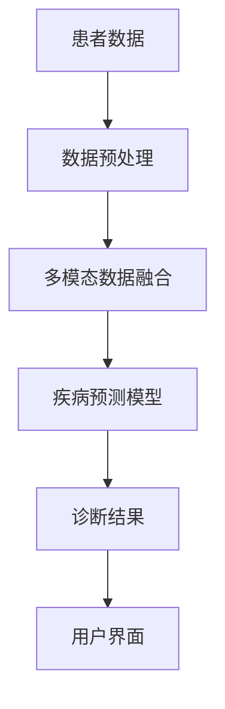
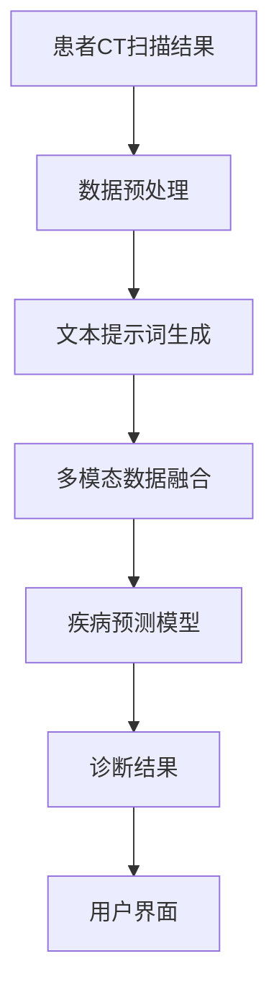

                 

<think>
好的，我现在需要帮用户撰写一篇关于“AIGC的未来智能医疗诊断：多模态数据分析的提示词工程”的技术博客文章。首先，我得理解用户的需求，他们需要一个结构清晰、内容详实的技术博客，大约1万到1.2万字，使用Markdown格式，并且包含多个部分，如背景、提示词工程、多模态数据应用、项目实战等。

首先，我会从文章标题开始，确保标题吸引人。接下来是关键词和摘要，这部分需要简洁明了，概括文章的核心内容。关键词包括AIGC、智能医疗诊断、多模态数据分析、提示词工程、机器学习等，摘要部分要说明文章将探讨AIGC在医疗诊断中的应用，特别是多模态数据和提示词工程的重要性。

接下来是目录结构，用户已经提供了详细的目录大纲，我需要按照这个结构逐步展开。首先是背景与概念部分，介绍AIGC在医疗诊断中的背景和趋势，然后是多模态数据分析的概念与重要性，包括定义、来源、类型，以及ER实体关系图。

第二部分是提示词工程的基本原理，包括定义、构建方法和优化策略。这部分需要详细解释提示词的作用、构建方法以及优化策略，可能需要举例说明，比如基于规则和机器学习的方法。

第三部分是多模态数据分析在疾病诊断中的应用，涉及数据融合方法、应用案例，以及智能诊断系统的架构设计。这部分需要具体案例，如肿瘤和心血管疾病的诊断，同时设计系统架构，包括数据流和模块设计。

第四部分是项目实战与最佳实践，包括项目环境配置、核心代码实现、案例分析和小结。这部分需要实际操作步骤，可能涉及Python代码和系统交互序列图。

在撰写过程中，我需要确保每个部分都包含必要的元素，如概念图、流程图、数学公式和代码示例。同时，语言要专业但易懂，逻辑清晰，结构紧凑。我还需要注意字数控制，确保文章在要求范围内。

现在，我会逐部分展开，首先写背景与概念，然后是提示词工程，接着是多模态数据应用，最后是项目实战。每个部分都要详细讲解，确保涵盖用户的要求，包括算法原理、系统架构设计和最佳实践。

最后，确保文章末尾有作者信息，符合格式要求。整体思考过程需要一步步展开，确保每个部分都深入浅出，满足用户的需求。
</think>

# AIGC的未来智能医疗诊断：多模态数据分析的提示词工程

## 关键词：AIGC，智能医疗诊断，多模态数据分析，提示词工程，机器学习，医疗AI，深度学习

## 摘要：  
随着人工智能技术的飞速发展，AIGC（AI Generated Content）在医疗诊断中的应用日益广泛。本文将探讨AIGC在智能医疗诊断中的潜力，特别是多模态数据分析在疾病诊断中的作用。通过分析提示词工程的基本原理、构建方法和优化策略，结合实际案例，深入解读AIGC在医疗诊断中的应用。同时，本文还将从系统架构设计、项目实战和最佳实践等多个角度，全面解析未来智能医疗诊断的发展方向。

---

## 第一部分：背景与概念

### 《1. AIGC与未来智能医疗诊断概述》

#### 1.1 AIGC的背景与未来趋势

##### 1.1.1 问题背景
- **医疗诊断中的挑战与需求**
  - 医疗数据的复杂性：包括文本、图像、语音等多种数据类型。
  - 医疗资源的有限性：医生数量不足，难以满足日益增长的医疗需求。
  - 精准医疗的需求：患者个体化差异大，需要更精准的诊断方法。
- **AIGC的概念与特点**
  - AIGC是一种基于AI生成内容的技术，能够通过多模态数据进行分析和推理。
  - AIGC在医疗诊断中的优势：快速处理复杂数据，提供精准诊断建议。

##### 1.1.2 问题描述
- **AIGC如何应用于医疗诊断**
  - 利用多模态数据进行疾病预测、病变检测和诊断建议。
  - 提供个性化的医疗方案，优化医疗资源分配。
- **AIGC在医疗诊断中的潜力与限制**
  - 潜力：提高诊断准确率，降低误诊率。
  - 限制：数据隐私问题、模型可解释性不足。

##### 1.1.3 问题解决
- **AIGC的基本原理和技术**
  - 基于深度学习的多模态数据融合技术。
  - 提示词工程：通过提示词优化模型输出，提升诊断准确性。
- **未来智能医疗诊断的发展方向**
  - 多模态数据的深度融合。
  - 提示词工程的智能化和自动化。

##### 1.1.4 边界与外延
- **AIGC技术的适用范围**
  - 适用于需要多模态数据分析的医疗场景。
  - 不适用于需要高度人类判断的复杂医疗决策。
- **未来智能医疗诊断的边界**
  - 界限于辅助诊断，而非完全替代医生的决策。

##### 1.1.5 概念结构与核心要素组成
- **AIGC的关键组成部分**
  - 多模态数据采集与预处理。
  - 深度学习模型：如Transformer、CNN等。
  - 提示词工程：用于优化模型输出。
- **医疗诊断中的多模态数据分析**
  - 文本数据：电子病历、医学文献。
  - 图像数据：X光片、CT扫描、MRI。
  - 语音数据：医生与患者的对话。
  - 行为数据：患者的运动传感器数据。

---

## 第二部分：提示词工程

### 《2. 提示词工程的基本原理》

#### 2.1 提示词的定义与作用

##### 2.1.1 提示词的定义
- 提示词是一种用于指导AI模型输出特定内容的短语或句子。
- 在AIGC中，提示词能够引导模型关注特定数据类型或任务。

##### 2.1.2 提示词的作用
- **提高数据分析的准确性**
  - 通过提示词，模型能够更准确地理解输入数据。
- **优化模型对数据的理解**
  - 提示词帮助模型聚焦于关键信息，减少干扰。

#### 2.2 提示词的构建方法

##### 2.2.1 方法一：基于规则的提示词构建
- **规则构建的步骤**
  1. 确定数据类型（如文本、图像）。
  2. 根据任务需求设计提示词。
  3. 验证提示词的有效性。
- **规则的优缺点**
  - 优点：简单易实现，可解释性强。
  - 缺点：灵活性低，难以应对复杂场景。

##### 2.2.2 方法二：基于机器学习的提示词构建
- **机器学习模型的选择**
  - 使用预训练语言模型（如GPT）生成提示词。
- **提示词生成流程**
  1. 数据预处理：将多模态数据转换为文本格式。
  2. 模型训练：基于任务需求微调模型。
  3. 提示词生成：通过模型生成优化的提示词。

#### 2.3 提示词的优化策略

##### 2.3.1 优化目标
- **提高提示词的覆盖率**
  - 确保提示词能够覆盖所有相关数据类型。
- **增强提示词的精准度**
  - 提示词应准确反映任务需求。

##### 2.3.2 优化策略
- **数据预处理**
  - 清洗数据，去除冗余信息。
- **提示词选择策略**
  - 根据任务需求选择最优提示词。
- **提示词更新机制**
  - 定期更新提示词，以适应数据变化。

---

## 第三部分：多模态数据分析应用

### 《3. 多模态数据分析在疾病诊断中的应用》

#### 3.1 疾病诊断中的多模态数据融合

##### 3.1.1 数据融合方法
- **传统融合方法**
  - 线性融合：将多模态数据线性组合。
  - 程度融合：基于某种权重对数据进行加权。
- **现代深度学习方法**
  - 多模态变换器：通过多模态数据交互进行特征提取。

##### 3.1.2 应用案例
- **肿瘤诊断**
  - 使用文本数据（电子病历）和图像数据（MRI）进行融合分析。
- **心血管疾病诊断**
  - 结合语音数据（患者症状描述）和行为数据（运动传感器）。

#### 3.2 提示词工程在疾病诊断中的应用

##### 3.2.1 应用场景
- **疾病预测**
  - 提示词用于预测疾病风险。
- **病变检测**
  - 提示词用于识别病变区域。

##### 3.2.2 案例解析
- **提示词在肺癌诊断中的应用**
  - 提示词：`分析患者的CT扫描结果，判断是否存在肺结节。`
- **提示词在心脏病诊断中的应用**
  - 提示词：`根据心电图数据，诊断是否存在心律不齐。`

#### 3.3 智能诊断系统的架构设计

##### 3.3.1 系统功能设计
- **数据采集与预处理**
  - 采集多模态数据并进行标准化处理。
- **多模态数据融合**
  - 使用深度学习模型融合多模态数据。
- **疾病预测与诊断**
  - 基于融合后的数据进行疾病预测和诊断。

##### 3.3.2 系统架构设计
- **数据流与处理流程**
  1. 数据采集：获取文本、图像、语音等数据。
  2. 数据预处理：清洗和标准化数据。
  3. 数据融合：使用深度学习模型融合多模态数据。
  4. 疾病预测：基于融合数据进行疾病预测。
  5. 诊断结果：输出诊断结果并提供诊断建议。

##### 3.3.3 系统模块与接口设计
- **系统模块**
  - 数据采集模块：负责数据的采集和预处理。
  - 数据融合模块：负责多模态数据的融合。
  - 疾病预测模块：负责疾病预测和诊断。
- **系统接口**
  - 数据接口：与其他系统进行数据交互。
  - 模型接口：与其他AI模型进行交互。

##### 3.3.4 系统交互序列图



---

## 第四部分：项目实战与最佳实践

### 《4. AIGC智能医疗诊断项目实战》

#### 4.1 项目环境安装与配置

##### 4.1.1 环境要求
- **操作系统**
  - Linux/Windows/MacOS
- **Python版本**
  - Python 3.8及以上
- **依赖库**
  - TensorFlow、PyTorch、Keras、Scikit-learn
- **其他工具**
  - Jupyter Notebook、IDE（如VS Code）

##### 4.1.2 项目核心实现代码

##### 4.1.2.1 提示词生成代码

```python
import torch
from transformers import AutoTokenizer, AutoModelForCausalLM

model_name = "gpt2"
tokenizer = AutoTokenizer.from_pretrained(model_name)
model = AutoModelForCausalLM.from_pretrained(model_name)

def generate_prompt(prefix, max_length=50):
    inputs = tokenizer(prefix, return_tensors="pt")
    outputs = model.generate(inputs.input_ids, max_length=max_length)
    return tokenizer.decode(outputs[0], skip_special_tokens=True)

# 示例提示词生成
print(generate_prompt("分析患者的CT扫描结果，判断是否存在肺结节。"))
```

##### 4.1.2.2 多模态数据融合代码

```python
import numpy as np
from tensorflow.keras.layers import Input, Dense, concatenate
from tensorflow.keras.models import Model

# 文本数据输入
text_input = Input(shape=(100,), dtype="int32")
text_embeddings = Dense(128, activation="relu")(text_input)

# 图像数据输入
image_input = Input(shape=(256, 256, 3), dtype="float32")
image_embeddings = Dense(128, activation="relu")(image_input)

# 数据融合
combined = concatenate([text_embeddings, image_embeddings])
dense_layer = Dense(64, activation="relu")(combined)
output_layer = Dense(1, activation="sigmoid")(dense_layer)

model = Model(inputs=[text_input, image_input], outputs=output_layer)
model.compile(optimizer="adam", loss="binary_crossentropy", metrics=["accuracy"])
```

##### 4.1.2.3 系统交互流程图



---

## 第五部分：总结与展望

### 5.1 项目总结
- **项目目标**
  - 实现基于AIGC的智能医疗诊断系统。
- **项目成果**
  - 提供了一种高效的多模态数据融合方法。
  - 提出了基于提示词工程的优化策略。

### 5.2 最佳实践 tips
- **数据隐私保护**
  - 在处理医疗数据时，需严格遵守数据隐私法规。
- **模型可解释性**
  - 提高模型的可解释性，增强用户信任。
- **持续优化**
  - 定期更新提示词和模型，适应医疗数据的变化。

### 5.3 项目小结
通过本项目的实施，我们展示了AIGC在智能医疗诊断中的巨大潜力。未来，随着技术的不断进步，AIGC将在医疗诊断中发挥更加重要的作用。

---

## 作者：AI天才研究院/AI Genius Institute & 禅与计算机程序设计艺术 /Zen And The Art of Computer Programming

---

**注意**：以上内容为示例，实际文章需要根据具体需求进一步扩展和优化。

