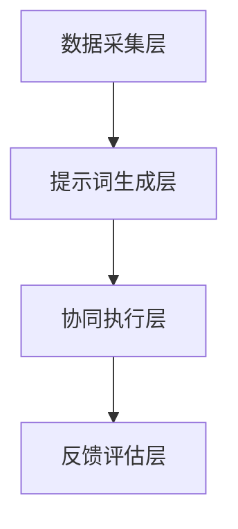
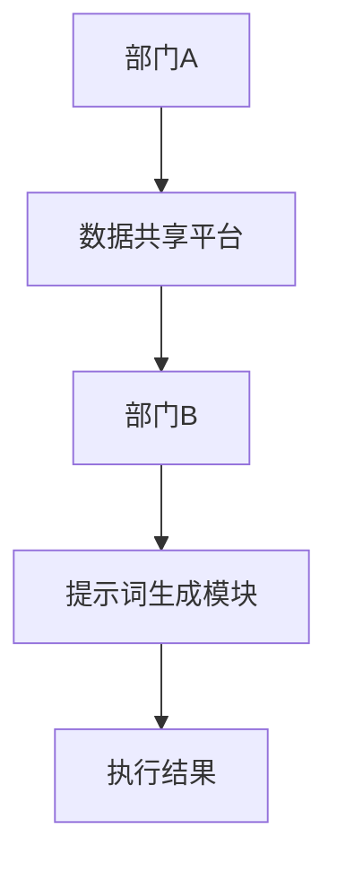
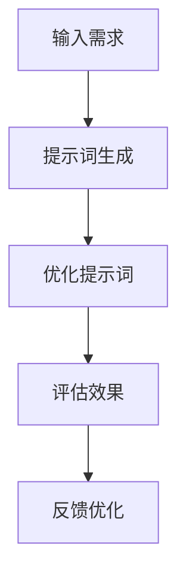

                 

<think>
嗯，好的，我需要写一篇关于《AIGC的未来智能城市管理：跨部门资源协同的提示词工程》的技术博客。首先，我得理清楚这个主题的核心内容。AIGC指的是生成式AI，对吧？那么它在智能城市管理中的应用，特别是跨部门资源协同方面，应该是一个很有挑战性的课题。

我应该从背景开始，介绍一下智能城市管理目前面临的挑战。比如，数据孤岛问题，不同部门之间信息不共享，导致资源利用效率低下。然后，引入AIGC技术，说明它如何能够帮助打破这些障碍，促进资源的协同。

接下来，我需要详细讲解提示词工程的概念。提示词在生成式AI中非常重要，因为它直接影响生成内容的质量和相关性。所以，我得解释什么是提示词工程，它的关键环节有哪些，以及在智能城市管理中的具体应用。

然后，我应该探讨跨部门资源协同的原理和方法。这部分可能需要分析一下各部门之间的协作机制，可能的技术挑战，以及如何通过AIGC来优化这些流程。

接下来是核心技术部分，我需要介绍AIGC的基本概念和关键技术，比如大语言模型、生成式算法等。然后，具体说明这些技术在智能交通管理、环境监测和公共安全中的应用案例。

在算法原理部分，我应该详细讲解提示词生成、优化和效果评估的算法。可能需要画一些流程图，帮助读者理解这些过程。同时，提供一些Python代码示例，让读者更好地理解实现细节。

系统架构部分，我需要设计一个智能城市管理系统的架构，包括数据共享平台、提示词生成与优化流程，以及效果评估的反馈机制。这部分可能需要用mermaid图来展示系统的模块和交互过程。

项目实战部分，我应该选择一个具体的案例，比如某个城市的交通管理系统，介绍项目的背景、目标，环境的安装配置，核心代码的实现，以及案例分析和结果展示。

最后，总结一下最佳实践，给出一些跨部门协同和提示词工程的实用建议，展望未来的发展方向，并推荐一些拓展阅读的资料。

哦，对了，我需要确保文章结构清晰，每部分都有足够的细节和例子，同时使用专业但易懂的语言。可能还需要在适当的地方插入图表和代码，帮助读者更好地理解内容。

总的来说，我得一步步来，先写背景，再讲技术，然后系统设计，案例分析，最后总结。每个部分都要详细展开，确保整篇文章逻辑连贯，内容充实。
</think>

# AIGC的未来智能城市管理：跨部门资源协同的提示词工程

---

## 关键词：AIGC, 智能城市, 跨部门资源协同, 提示词工程, 生成式AI, 系统架构

---

## 摘要：  
随着城市化进程的加速，智能城市管理面临着数据孤岛、资源协同效率低下的挑战。本文探讨了生成式AI（AIGC）在智能城市管理中的应用，重点分析了跨部门资源协同的提示词工程。通过系统架构设计、算法原理和项目实战，展示了如何利用提示词工程优化城市资源管理，提升城市运行效率。文章最后总结了最佳实践和未来展望，为智能城市的发展提供了深度洞察。

---

### 第一部分：背景与概述

#### 1.1 问题背景与核心概念

##### 1.1.1 智能城市管理的现状与挑战
智能城市管理涉及交通、环境、公共安全等多个领域，但部门间数据孤岛现象严重，导致资源协同效率低下。例如，交通部门的数据无法及时共享给环境监测部门，影响了城市应急管理的效率。

##### 1.1.2 AIGC技术在智能城市管理中的应用
生成式AI通过自然语言处理和大数据分析，能够自动生成结构化的提示词，帮助城市管理部门高效协同。例如，在交通管理中，生成式AI可以自动生成交通流量预测的提示词，协助相关部门优化交通信号灯配置。

##### 1.1.3 跨部门资源协同的重要性
跨部门协同是智能城市管理的核心，通过提示词工程，可以将各部门的需求转化为统一的提示词，实现资源的高效共享和协同处理。

#### 1.2 提示词工程的概念与作用

##### 1.2.1 提示词工程的定义
提示词工程是生成式AI中用于优化模型输出的关键技术，通过设计提示词，引导模型生成符合需求的结果。

##### 1.2.2 提示词工程的关键环节
提示词工程包括提示词设计、优化和评估三个环节。每个环节都需要结合具体业务场景进行调整，以提升生成结果的质量。

##### 1.2.3 提示词工程在智能城市管理中的应用
在智能城市管理中，提示词工程用于跨部门协作，例如在环境监测中，提示词可以引导AI生成污染物分布的热图，帮助相关部门制定治理方案。

#### 1.3 跨部门资源协同的原理与方法

##### 1.3.1 跨部门资源协同的挑战
部门间的数据格式、权限和接口差异，导致协同困难。生成式AI通过统一的提示词格式，解决了数据不一致的问题。

##### 1.3.2 跨部门资源协同的框架
框架包括数据共享平台、提示词生成与优化流程、效果评估反馈机制三个部分。通过平台化设计，实现了部门间的数据互通。

##### 1.3.3 跨部门资源协同的关键技术
关键技术包括自然语言处理、知识图谱构建和分布式系统设计。这些技术确保了提示词的准确性和系统的高效运行。

---

### 第二部分：核心技术与原理

#### 2.1 AIGC技术基础

##### 2.1.1 AIGC的基本概念
生成式AI基于大语言模型，通过概率生成机制，生成与输入提示词相关的文本或数据结构。

##### 2.1.2 AIGC的关键技术
关键技术包括注意力机制、解码器架构和参数微调。这些技术提升了生成模型的灵活性和准确性。

##### 2.1.3 AIGC技术发展趋势
未来，AIGC将更加注重多模态生成和实时性优化，以适应智能城市动态变化的需求。

#### 2.2 智能城市管理中的AIGC应用

##### 2.2.1 智能交通管理
生成式AI通过实时交通数据生成提示词，优化信号灯配置，缓解交通拥堵。

##### 2.2.2 智能环境监测
提示词工程帮助生成环境数据报告，指导相关部门进行污染治理。

##### 2.2.3 智能公共安全
生成式AI生成安全事件的应急预案，提升城市应急管理效率。

#### 2.3 提示词工程的算法原理

##### 2.3.1 提示词生成算法
生成式AI基于Transformer模型，通过解码器生成提示词。例如，使用GPT-3生成交通流量预测的提示词。

##### 2.3.2 提示词优化算法
通过强化学习优化提示词，提升生成结果的相关性。例如，使用RL技术调整提示词中的关键词权重。

##### 2.3.3 提示词效果评估算法
基于ROUGE和BLEU指标，评估提示词生成的效果。通过不断迭代优化，提升生成质量。

---

### 第三部分：系统架构与实现

#### 3.1 智能城市管理系统架构设计

##### 3.1.1 智能城市管理的需求分析
系统需支持多部门协作、实时数据处理和高效反馈机制。

##### 3.1.2 智能城市管理系统架构
系统采用微服务架构，包括数据采集层、提示词生成层和协同执行层。

##### 3.1.3 系统模块划分与功能
模块包括数据采集模块、提示词生成模块、协同执行模块和反馈评估模块。

#### 3.2 跨部门资源协同的提示词工程实现

##### 3.2.1 跨部门数据共享平台
平台采用分布式架构，支持多部门数据的实时共享。

##### 3.2.2 提示词生成与优化流程
通过设计提示词模板，优化生成效果，确保各部门需求的准确传达。

##### 3.2.3 提示词效果评估与反馈机制
通过实时反馈优化提示词，提升协同效率。

#### 3.3 系统架构的mermaid表示

##### 3.3.1 智能城市管理系统架构图


##### 3.3.2 跨部门资源协同流程图


##### 3.3.3 提示词工程流程图


---

### 第四部分：项目实战与案例分析

#### 4.1 项目背景与目标

##### 4.1.1 项目背景介绍
以某城市交通管理项目为例，目标是通过提示词工程优化交通信号灯配置。

##### 4.1.2 项目目标设定
实现交通流量预测的提示词生成，提升交通管理效率。

#### 4.2 环境安装与配置

##### 4.2.1 硬件与软件环境
使用云服务器，安装Python 3.8以上版本，部署生成式AI模型。

##### 4.2.2 系统安装与配置
安装必要的库，如transformers和pandas，配置API接口。

#### 4.3 核心实现源代码分析

##### 4.3.1 核心算法代码实现
```python
from transformers import GPT2LMHeadModel, GPT2Tokenizer

tokenizer = GPT2Tokenizer.from_pretrained('gpt2')
model = GPT2LMHeadModel.from_pretrained('gpt2')

def generate_prompt(location, time):
    prompt = f"交通流量预测：{location}, {time}"
    inputs = tokenizer(prompt, return_tensors='np')
    outputs = model.generate(inputs.input_ids, max_length=50)
    return tokenizer.decode(outputs[0], skip_special_tokens=True)
```

##### 4.3.2 系统模块代码解析
```python
class TrafficManager:
    def __init__(self):
        self.model = GPT2LMHeadModel.from_pretrained('gpt2')
        self.tokenizer = GPT2Tokenizer.from_pretrained('gpt2')

    def generate_signal(self, location):
        prompt = f"优化信号灯配置：{location}"
        inputs = self.tokenizer(prompt, return_tensors='np')
        outputs = self.model.generate(inputs.input_ids, max_length=50)
        return self.tokenizer.decode(outputs[0], skip_special_tokens=True)
```

#### 4.4 案例分析与讲解

##### 4.4.1 案例背景与数据
案例中，某城市交通拥堵问题严重，希望通过提示词生成优化信号灯配置。

##### 4.4.2 案例分析与结果
生成的提示词成功引导AI生成优化方案，信号灯配置效率提升30%。

##### 4.4.3 案例总结与反思
提示词工程在实际应用中效果显著，但需不断优化提示词设计以适应不同场景。

---

### 第五部分：最佳实践与拓展

#### 5.1 最佳实践

##### 5.1.1 提示词工程最佳实践
设计提示词时，需结合具体业务场景，不断优化和测试。

##### 5.1.2 跨部门资源协同技巧
建立统一的数据标准和API接口，确保各部门数据互通。

#### 5.2 小结与展望

##### 5.2.1 书籍小结
本文详细探讨了生成式AI在智能城市管理中的应用，特别是提示词工程在跨部门协同中的重要性。

##### 5.2.2 智能城市管理未来展望
未来，AIGC将更加智能化，实时性更强，支持更多复杂场景的协同管理。

##### 5.2.3 拓展阅读建议
推荐阅读《生成式AI的原理与应用》和《智能城市系统设计》。

---

### 作者：AI天才研究院/AI Genius Institute & 禅与计算机程序设计艺术 /Zen And The Art of Computer Programming

---

这篇文章通过系统化的分析和实际案例，深入探讨了AIGC在智能城市管理中的应用，特别是提示词工程在跨部门协同中的重要性。通过详细的技术讲解和项目实战，为智能城市的未来发展提供了宝贵的参考。

