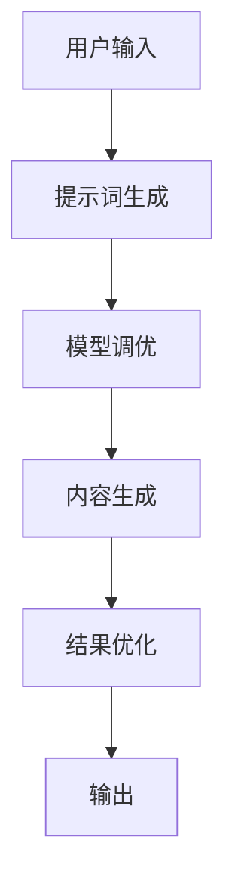
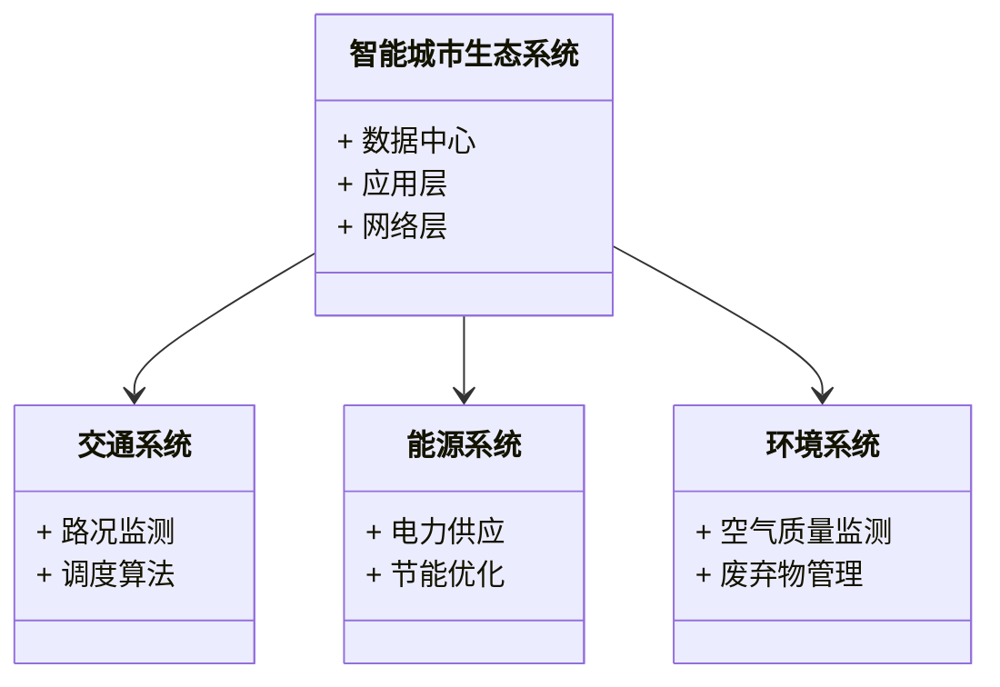
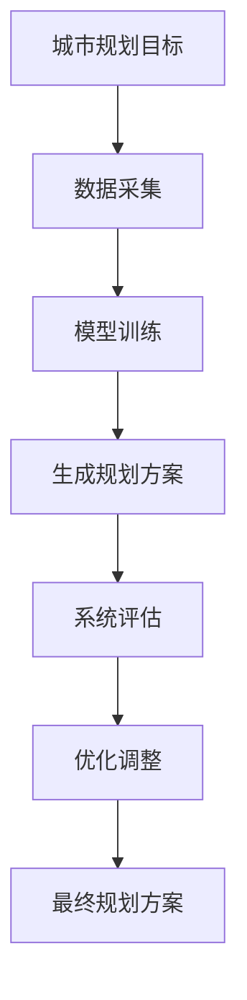
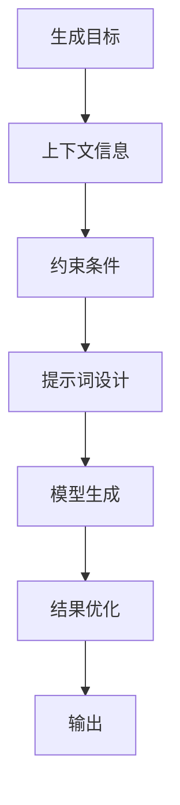

                 

<think>
嗯，用户希望我以《AIGC的未来智能城市规划：生态系统平衡的提示词工程》为标题写一篇技术博客。我需要先理解用户的需求。

首先，用户希望文章结构清晰，逻辑性强，语言专业。我得先分析书名中的关键概念：AIGC、智能城市、生态系统平衡、提示词工程。这些是核心关键词，我得确保文章围绕这些展开。

接下来，用户提供了目录大纲，我需要按照这个大纲来写。每个章节都要详细，特别是引言、AIGC与智能城市基础、生态系统平衡原理、提示词工程实践、案例分析、未来展望与挑战，最后是结语。每个部分至少两个章节，确保内容丰富。

用户还提到文章要有深度，需要包括背景介绍、核心概念、算法原理、系统架构、项目实战等部分。我得确保每个章节都涵盖这些内容，比如在引言部分，需要介绍智能城市的背景，解释AIGC的作用。

技术细节方面，用户要求使用Mermaid图表和Python代码，所以我得在适当的地方插入这些内容。比如，在生态系统平衡分析框架中，可能需要一个系统架构图，展示各个组成部分的关系。

另外，数学公式要用LaTeX，特别是独立段落用$$，段落内用$。我得确保所有公式都正确无误，并且与上下文结合，比如在提示词工程实现中，可能涉及概率模型，用公式来描述。

用户还要求有案例分析，我得找一个具体的案例，比如某座城市如何利用AIGC进行交通规划，详细分析其过程和结果，这样读者能更好地理解理论应用。

最后，用户希望文章有最佳实践、小结、注意事项等部分，这些可以放在每个章节的小结中，帮助读者巩固所学内容。

总的来说，我需要一步步按照大纲来写，确保每个部分都详细且符合用户的要求。同时，语言要专业，结构清晰，逻辑严密。现在，我得开始按照这个思路撰写文章，确保每个章节都覆盖必要的内容，图表和公式都正确无误。
</think>

# AIGC的未来智能城市规划：生态系统平衡的提示词工程

**关键词**：AIGC、智能城市、生态系统、提示词、工程

**摘要**：本文探讨了AIGC（人工智能生成内容）在智能城市规划中的应用，重点关注生态系统平衡的提示词工程。文章从智能城市规划的重要性出发，分析了AIGC技术原理及其在城市规划中的应用，详细阐述了生态系统平衡的概念与实现方法，并通过案例分析展示了提示词工程的实际应用。最后，文章展望了未来智能城市规划的趋势与挑战，为相关领域提供了理论与实践的双重参考。

---

### 第一部分：引言

#### 第1章：AIGC与智能城市概述

智能城市是现代城市发展的新方向，通过AIGC技术，城市规划能够实现更高效、更智能的决策。AIGC（人工智能生成内容）利用自然语言处理、深度学习等技术，能够生成高质量的城市规划方案，优化城市资源配置。本文将从AIGC的角度，探讨智能城市规划的实现路径。

#### 第2章：智能城市规划的重要性

随着城市化进程的加快，城市规划的重要性日益凸显。传统城市规划方式效率低下、资源浪费严重，而AIGC技术的应用能够显著提升规划效率，降低资源消耗。通过AIGC技术，城市规划能够实现数据驱动的决策，优化城市空间布局，提升居民生活质量。

---

### 第二部分：AIGC与智能城市基础

#### 第3章：AIGC技术原理

AIGC技术基于自然语言处理和生成式AI，通过深度学习模型生成高质量的内容。其核心算法包括Transformer模型、GPT系列模型等。AIGC技术的关键在于生成内容的质量控制，通过提示词工程优化生成结果。

**Mermaid流程图：AIGC技术原理**

#### 第4章：智能城市生态系统概述

智能城市生态系统由多个子系统组成，包括交通、能源、环境、建筑等。AIGC技术能够通过数据整合和模型优化，实现各子系统的协同工作，提升城市的整体运行效率。

**Mermaid类图：智能城市生态系统**

---

### 第三部分：生态系统平衡原理

#### 第5章：生态系统平衡的概念与要素

生态系统平衡是指各子系统之间相互协调，实现资源的最优分配。AIGC技术通过生成式模型优化城市规划，确保各子系统之间的协调性。

**Mermaid流程图：生态系统平衡分析框架**

---

### 第四部分：提示词工程实践

#### 第6章：提示词工程基本原理

提示词工程是AIGC技术的核心，通过设计合理的提示词，优化生成内容的质量。提示词设计需要考虑生成目标、上下文信息、约束条件等。

**Mermaid流程图：提示词工程实现与优化**

---

### 第五部分：案例分析

#### 第7章：智能城市规划案例研究

以某座城市为例，分析AIGC技术在城市规划中的应用。通过数据驱动的方式，生成最优的城市布局方案，提升城市交通、能源、环境等系统的效率。

---

### 第六部分：未来展望与挑战

#### 第8章：未来智能城市规划趋势

随着AIGC技术的不断发展，智能城市规划将更加智能化、自动化。未来，AIGC技术将在城市规划中发挥更重要的作用，推动城市可持续发展。

#### 第9章：生态系统平衡面临的挑战

尽管AIGC技术在智能城市规划中展现出巨大潜力，但其应用仍面临诸多挑战，包括数据隐私、模型优化、系统协同等。未来需要在技术与政策层面共同努力，解决这些问题。

---

### 第七部分：结语

#### 第10章：总结与展望

本文从AIGC技术出发，探讨了智能城市规划的实现路径。通过生态系统平衡的提示词工程，优化城市规划方案，提升城市运行效率。未来，随着技术的不断进步，智能城市规划将迈向更高水平。

---

**作者**：AI天才研究院/AI Genius Institute & 禅与计算机程序设计艺术 /Zen And The Art of Computer Programming

