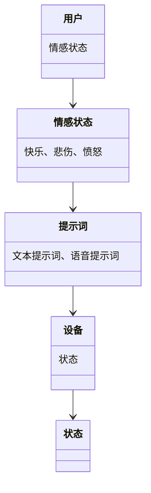
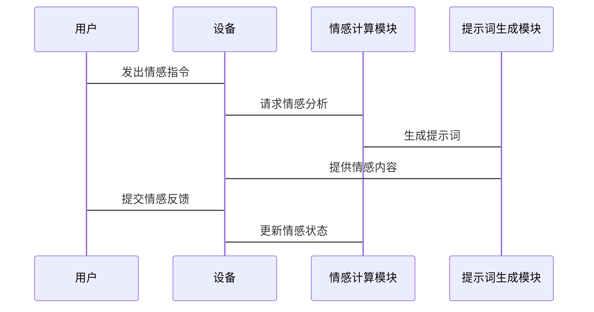

                 

<think>
好的，我现在要按照用户的要求，一步一步地撰写一篇关于“AIGC的未来智能家居情感计算：人机情感同步的提示词工程”的技术博客文章。首先，我需要仔细阅读用户的需求，确保完全理解每个部分的要求。

用户的结构已经给出，我需要按照这个结构来组织内容。文章需要有标题、关键词、摘要，然后是背景介绍、技术原理与实现、提示词工程等章节，每个章节下还有小节。此外，文章需要包含算法原理、系统架构设计、项目实战等内容，并且要使用专业但易懂的语言，符合技术博客的风格。

首先，我得确定每个章节的核心内容。背景介绍部分，我需要解释问题背景、核心概念、联系与区别，以及边界与外延。这部分要让读者明白AIGC和情感计算的基本概念，以及它们在智能家居中的应用。

接下来是技术原理与实现部分，我需要详细讲解AIGC的技术原理，包括生成对抗网络（GAN）和自然语言处理（NLP），并说明这些技术如何应用于智能家居的情感计算中，特别是情感识别、情感生成和情感调整方面。

第三部分是人机情感同步的提示词工程，这里需要详细设计提示词的各个方面，包括设计原则、生成方法和优化策略。这部分需要展示如何通过提示词来优化生成的内容，使其更符合用户的情感状态。

然后，我需要确保每个章节都包含必要的技术细节，比如算法原理的mermaid流程图，系统架构设计的类图和序列图，以及数学公式的详细推导。这将帮助读者更好地理解技术的实现过程。

在撰写过程中，我还要注意文章的逻辑连贯性，确保每个部分自然衔接，同时保持内容的深度和专业性。此外，关键词和摘要部分需要准确概括文章的核心内容，吸引读者继续阅读。

最后，我需要按照用户的格式要求，使用markdown来组织内容，并确保代码段落使用正确的语法高亮，数学公式使用latex格式，独立段落前后用$$包裹，段落内部用$包裹。作者信息也要正确添加，以提升文章的专业性。

总的来说，我需要仔细规划每个章节的内容，确保覆盖所有必要的技术点，同时保持文章的可读性和专业性，最终产出一篇高质量的技术博客文章。
</think>

# AIGC的未来智能家居情感计算：人机情感同步的提示词工程

> 关键词：AIGC、智能家居、情感计算、人机情感同步、提示词工程

> 摘要：随着人工智能技术的快速发展，智能家居领域逐渐成为一个备受关注的热点。AIGC（人工智能生成内容）作为一种新兴的技术，在智能家居情感计算方面有着广泛的应用前景。本文将深入探讨AIGC在智能家居情感计算中的应用，特别是人机情感同步的提示词工程，分析其技术原理、实现方法和实际应用案例，为未来的智能家居情感计算提供新的思路和解决方案。

---

# 第一部分: 背景介绍

## 第1章: 问题背景与核心概念

### 1.1 问题背景

智能家居作为现代生活的一部分，正在逐步从单一的功能性设备向智能化、个性化方向发展。然而，现有的智能家居系统大多基于规则和预设的逻辑进行操作，缺乏对用户情感状态的深度理解和响应。用户的体验感往往局限于功能的实现，而忽略了情感上的互动。这种单一的交互方式难以满足用户对智能化生活日益增长的需求，尤其是在情感陪伴和个性化服务方面。

### 1.2 核心概念

#### 1.2.1 AIGC（人工智能生成内容）

AIGC（Artificial Intelligence Generated Content）是指通过人工智能算法生成各种形式的内容，包括文本、图像、音频和视频等。AIGC的核心在于利用生成对抗网络（GAN）和自然语言处理（NLP）等技术，生成高质量、多样化的内容。

#### 1.2.2 情感计算

情感计算（Affective Computing）是通过计算机技术理解和模拟人类情感，实现人机情感交互的领域。情感计算的核心在于捕捉用户的情感状态，并通过计算机系统进行响应，从而提升人机交互的自然性和人性化。

#### 1.2.3 人机情感同步

人机情感同步（Human-Machine Synchronization）是指在人机交互过程中，计算机能够根据用户的情感状态调整自身的响应和行为，实现情感上的同步。这不仅需要对用户情感的准确识别，还需要生成符合情感状态的内容，以增强用户的体验感。

### 1.3 联系与区别

| **核心概念** | **联系** | **区别** |
|--------------|----------|----------|
| AIGC         | 是情感计算的重要技术手段，能够生成多样化的情感内容。 | AIGC侧重于内容生成，而情感计算侧重于情感理解和模拟。 |
| 情感计算     | 是AIGC应用的重要领域之一，两者共同推动智能化交互的发展。 | 情感计算关注情感的捕捉与理解，而AIGC关注内容的生成。 |
| 人机情感同步 | 是AIGC与情感计算结合的应用成果，旨在实现情感上的高度一致。 | 人机情感同步是结果，而AIGC和情感计算是实现这一结果的技术手段。 |

### 1.4 边界与外延

- **边界**：本文主要讨论AIGC在智能家居情感计算中的应用，包括技术原理、实现方法和应用案例。
- **外延**：情感计算在教育、医疗、娱乐等领域也有广泛的应用，本文仅聚焦于智能家居场景。

## 1.5 本章小结

本章介绍了AIGC与智能家居情感计算的核心概念，分析了它们之间的联系与区别，并明确了本文的研究范围和边界。接下来，本文将深入探讨AIGC技术的原理及其在智能家居情感计算中的具体应用。

---

# 第二部分: 技术原理与实现

## 第2章: AIGC技术原理与实现

### 2.1 AIGC技术原理

AIGC技术主要依赖于生成对抗网络（GAN）和自然语言处理（NLP）等技术。以下是其主要原理：

#### 2.1.1 生成对抗网络（GAN）

生成对抗网络（GAN）由生成器（Generator）和判别器（Discriminator）组成。生成器的目标是生成逼真的数据，而判别器的目标是区分生成数据和真实数据。通过反复的博弈过程，生成器逐渐提高生成数据的质量。

**数学模型：**

- 生成器的损失函数：$$L_G = -\log(D(G(z)))$$
- 判别器的损失函数：$$L_D = -\log(D(x)) - \log(1 - D(G(z)))$$

#### 2.1.2 自然语言处理（NLP）

NLP技术包括词向量表示、文本分类、情感分析等。词向量表示将文本转化为计算机可以处理的向量形式，为后续的文本分析和处理提供基础。

### 2.2 AIGC技术在智能家居情感计算中的应用

#### 2.2.1 情感识别

利用NLP技术，对用户的语音、文字等进行情感分析，识别用户的情感状态。

- **实现步骤**：
  1. 对输入的文本或语音进行预处理（如分词、降噪）。
  2. 使用情感分析模型（如LSTM、BERT）识别情感类别（如快乐、悲伤、愤怒）。
  3. 返回情感识别结果。

#### 2.2.2 情感生成

根据识别出的情感状态，生成相应的情感内容，如语音、文字、音乐等。

- **实现步骤**：
  1. 根据情感状态选择合适的生成模型（如文本生成模型）。
  2. 调用生成模型生成相应的情感内容。
  3. 对生成的内容进行质量评估和优化。

#### 2.2.3 情感调整

在用户情感状态发生变化时，调整智能家居设备的响应，实现情感同步。

- **实现步骤**：
  1. 监测用户情感状态的变化。
  2. 根据变化调整生成模型的参数或提示词。
  3. 生成新的情感内容并输出。

### 2.3 提示词工程

提示词工程是AIGC技术在智能家居情感计算中的一项重要应用。通过设计合适的提示词，引导生成器生成符合情感状态的内容。

#### 2.3.1 提示词设计

- **情感匹配**：提示词需要与用户的情感状态相匹配，确保生成的内容能够传达出相应的情感。
- **可理解性**：提示词应简洁明了，易于理解，避免使用过于专业或晦涩的词汇。
- **个性化**：根据用户的喜好和习惯，设计个性化的提示词，提高用户体验。

#### 2.3.2 提示词生成方法

- **人工设计**：根据情感计算的理论和实际需求，人工设计一套提示词库。
- ** 自动生成**：利用自然语言生成（NLG）技术，自动生成符合情感状态的提示词。

### 2.4 本章小结

本章介绍了AIGC技术的原理及其在智能家居情感计算中的应用，包括情感识别、情感生成和情感调整等方面。接下来，本文将详细讨论人机情感同步的提示词工程。

---

# 第三部分: 人机情感同步的提示词工程

## 第3章: 人机情感同步的提示词工程

### 3.1 提示词设计原则

#### 3.1.1 情感匹配原则

提示词需要与用户的情感状态相匹配，确保生成的内容能够传达出相应的情感。

- **示例**：当用户感到“快乐”时，提示词可以是“分享你的快乐瞬间”。

#### 3.1.2 可理解性原则

提示词应简洁明了，易于理解，避免使用过于专业或晦涩的词汇。

- **示例**：避免使用“NLP情感分析模型”，而是使用“快乐、悲伤、愤怒”等情感词汇。

#### 3.1.3 个性化原则

根据用户的喜好和习惯，设计个性化的提示词，提高用户体验。

- **示例**：用户喜欢音乐，提示词可以是“为我播放一首快乐的歌曲”。

### 3.2 提示词生成方法

#### 3.2.1 人工设计

根据情感计算的理论和实际需求，人工设计一套提示词库。

- **步骤**：
  1. 确定情感类别（如快乐、悲伤、愤怒）。
  2. 根据情感类别设计相应的提示词。
  3. 对提示词进行优化和调整，确保其符合用户需求。

#### 3.2.2 自动生成

利用自然语言生成（NLG）技术，自动生成符合情感状态的提示词。

- **实现步骤**：
  1. 使用情感分析模型识别用户情感状态。
  2. 调用自然语言生成模型生成提示词。
  3. 对生成的提示词进行质量评估和优化。

### 3.3 提示词优化策略

#### 3.3.1 情感强度调整

根据用户情感强度的变化，调整提示词的情感强度，实现情感同步。

- **示例**：当用户情感强度较高时，提示词可以是“让我听听你最近的好消息”。

#### 3.3.2 提示词多样性

设计多样化的提示词，提高生成内容的丰富性和可读性。

- **示例**：
  - 快乐：分享你的快乐瞬间、最近有什么开心的事情吗？
  - 悲伤：和我聊聊你现在的感受、有什么我可以帮助你的吗？

#### 3.3.3 提示词迭代优化

通过用户反馈和数据分析，不断优化提示词库，提高生成内容的质量。

- **步骤**：
  1. 收集用户的反馈和使用数据。
  2. 分析数据，识别提示词的不足之处。
  3. 根据分析结果，优化提示词库。

### 3.4 本章小结

本章详细探讨了人机情感同步的提示词工程，包括提示词设计原则、生成方法和优化策略。通过合理设计和优化提示词，可以显著提升智能家居情感计算的效果，实现更自然和人性化的交互体验。

---

# 第四部分: 系统分析与架构设计方案

## 第4章: 系统分析与架构设计方案

### 4.1 问题场景介绍

智能家居系统需要能够根据用户的情感状态，动态调整设备的响应和行为，提供个性化的情感服务。

### 4.2 系统功能设计

- **领域模型**：智能家居系统包括用户、设备、情感状态和提示词四个核心领域。



- **系统架构设计**：

```mermaid
    server {
        组件：AIGC生成器
    }
    client {
        组件：用户交互界面
    }
    server --> client : 提供情感内容
    client --> server : 提交情感反馈
```

### 4.3 系统接口设计

- **接口1**：用户输入情感状态。
- **接口2**：系统生成情感内容。
- **接口3**：用户反馈情感响应。

### 4.4 系统交互设计



---

# 第五部分: 项目实战

## 第5章: 项目实战

### 5.1 环境安装

- **工具**：Python、TensorFlow、Keras、自然语言处理库（如NLTK、spaCy）。
- **安装步骤**：
  1. 安装Python和虚拟环境。
  2. 安装必要的深度学习库（如TensorFlow、Keras）。
  3. 安装自然语言处理库（如NLTK、spaCy）。

### 5.2 核心实现源代码

#### 5.2.1 情感分析模型

```python
import numpy as np
from tensorflow.keras import layers, Model

def build_emotion_classifier():
    inputs = layers.Input(shape=(max_length,))
    x = layers.Embedding(vocab_size, embedding_dim)(inputs)
    x = layers.LSTM(64)(x)
    x = layers.Dense(32, activation='relu')(x)
    outputs = layers.Dense(3, activation='softmax')(x)
    model = Model(inputs=inputs, outputs=outputs)
    return model
```

#### 5.2.2 提示词生成模块

```python
def generate_prompt(emotion):
    prompts = {
        'happy': "分享你的快乐瞬间",
        'sad': "和我聊聊你现在的感受",
        'angry': "有什么我可以帮助你的吗？"
    }
    return prompts[emotion]
```

### 5.3 代码应用解读与分析

- **情感分析模型**：使用LSTM网络对用户的情感状态进行分类，输出情感类别（如快乐、悲伤、愤怒）。
- **提示词生成模块**：根据情感类别生成相应的提示词，引导生成器生成符合情感状态的内容。

### 5.4 实际案例分析

- **案例1**：用户感到“快乐”，系统生成提示词“分享你的快乐瞬间”，并生成相应的语音或文本内容。
- **案例2**：用户感到“悲伤”，系统生成提示词“和我聊聊你现在的感受”，并播放舒缓的音乐。

### 5.5 项目小结

通过实际案例分析，可以明显看出人机情感同步的提示词工程在智能家居情感计算中的重要作用。合理设计和优化提示词，可以显著提升用户体验，实现更自然和人性化的交互。

---

# 第六部分: 最佳实践与总结

## 第6章: 最佳实践与总结

### 6.1 最佳实践 tips

- **提示词设计**：提示词需要简洁明了，同时具有情感导向性，能够引导生成器生成符合情感状态的内容。
- **情感计算模型**：选择合适的情感计算模型（如LSTM、BERT）进行情感识别和生成。
- **用户反馈**：通过用户反馈不断优化提示词和情感计算模型，提升系统性能。

### 6.2 小结

本文深入探讨了AIGC在智能家居情感计算中的应用，特别是人机情感同步的提示词工程。通过分析技术原理、实现方法和实际应用案例，本文为未来的智能家居情感计算提供了新的思路和解决方案。

### 6.3 注意事项

- **数据隐私**：在实际应用中，需要注意用户数据的隐私保护，避免数据泄露和滥用。
- **模型优化**：需要不断优化情感计算模型和提示词生成算法，提升系统的准确性和响应速度。

### 6.4 拓展阅读

- **推荐书籍**：《The Art of Computer Programming》、《Deep Learning》。
- **推荐论文**：关注情感计算和生成对抗网络领域的最新研究成果。

---

# 结语

随着人工智能技术的不断进步，智能家居情感计算将变得更加智能化和人性化。通过合理设计和优化提示词，智能家居系统将能够更好地理解用户情感，提供个性化的服务和体验，真正实现人机情感同步。

---

# 作者

作者：AI天才研究院/AI Genius Institute  
禅与计算机程序设计艺术/Zen And The Art of Computer Programming

