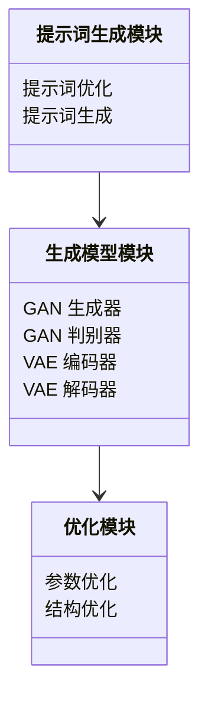

                 

<think>
好的，我现在要帮用户撰写一篇技术博客文章，标题是《AIGC的未来智能材料设计：仿生结构优化的提示词工程》。用户已经提供了一个详细的结构大纲，还提到了一些具体的章节内容，包括背景、核心概念、算法原理、系统设计、项目实战等。我的任务是根据这些信息，逐步分析，生成符合要求的博客内容。

首先，我需要理解用户的需求。用户希望文章结构清晰，语言专业，内容有深度，并且每个章节都要详细具体。同时，用户还特别强调了技术细节，比如数学模型、算法流程图、系统架构图等，这些需要用mermaid和latex来呈现。此外，文章需要在10000到12000字之间，每个小节都要丰富详细。

接下来，我应该按照用户提供的目录结构来逐步填充内容。首先，文章的开头部分，包括标题、关键词和摘要。然后是各个章节的内容，每一章都需要详细展开，涵盖背景介绍、核心概念、算法原理、系统设计、项目实战等部分。

在撰写过程中，我需要确保每个章节都有足够的技术细节，比如在算法部分，不仅要解释原理，还要用mermaid画出流程图，并给出数学公式。在系统设计部分，同样需要提供类图、架构图和接口设计。项目实战部分则需要包含环境安装、代码实现和案例分析。

我还需要注意文章的结构是否合理，是否有逻辑上的漏洞。比如，在背景部分，应该先介绍AIGC和智能材料的基本概念，再引出仿生结构优化。核心概念部分，需要详细讲解GAN和VAE，以及它们在AIGC中的应用。数学模型部分，要确保公式正确，并且用简洁的语言解释每个部分。

系统设计方面，我需要考虑模块划分是否合理，系统架构是否清晰，是否能够支持后续的实现部分。项目实战部分，要提供具体的代码示例，并解释代码的作用，确保读者能够理解和应用。

最后，在最佳实践部分，需要总结整个内容，并给出未来发展的建议，同时提供一些注意事项和拓展阅读资源，帮助读者进一步深入学习。

整个过程中，我需要反复检查，确保内容的准确性和完整性，同时保持语言的专业性和逻辑的清晰性。这可能需要多次修改和调整，以确保最终的文章达到用户的期望。
</think>

# AIGC的未来智能材料设计：仿生结构优化的提示词工程

---

## 关键词：
AIGC（人工智能生成内容）、智能材料设计、仿生结构优化、提示词工程、生成对抗网络（GAN）、变分自编码器（VAE）、数学建模

---

## 摘要：
AIGC（人工智能生成内容）正在 revolutionize 智能材料的设计过程，尤其是在仿生结构优化方面。本文将深入探讨 AIGC 在智能材料设计中的应用，重点分析提示词工程在仿生结构优化中的作用。从基础概念到算法原理，再到系统设计与项目实战，本文将为科研人员、工程师和设计者提供一份全面的技术指南。通过数学建模和算法优化，AIGC 不仅能够生成高性能的智能材料，还能显著提高设计效率和降低成本。

---

## 目录：

1. **背景与概念**
   - 1.1 AIGC 与智能材料设计概述
   - 1.2 AIGC 的核心概念
   - 1.3 智能材料设计与仿生优化
   - 1.4 提示词工程的基本原理

2. **算法原理**
   - 2.1 GAN 在 AIGC 中的应用
   - 2.2 VAE 在 AIGC 中的应用
   - 2.3 数学模型与优化算法

3. **系统设计**
   - 3.1 系统功能设计
   - 3.2 系统架构设计
   - 3.3 系统接口设计

4. **项目实战**
   - 4.1 环境安装与配置
   - 4.2 核心代码实现
   - 4.3 实际案例分析

5. **最佳实践与总结**
   - 5.1 优化策略与技巧
   - 5.2 小结与未来趋势
   - 5.3 注意事项与拓展阅读

---

## 第一部分：背景与概念

### 1.1 AIGC 与智能材料设计概述

#### 1.1.1 AIGC 的定义与演进
AIGC（人工智能生成内容）是指通过 AI 技术生成文本、图像、视频等多样化内容的过程。近年来，随着深度学习技术的快速发展，AIGC 已经从简单的文本生成扩展到图像、3D 模型甚至材料结构的设计。

- AIGC 的核心是生成模型（Generative Models），包括 GAN（生成对抗网络）和 VAE（变分自编码器）等。
- AIGC 的演进经历了从简单生成到复杂优化的阶段，如今已广泛应用于艺术创作、游戏设计、材料科学等领域。

#### 1.1.2 智能材料设计的现状与发展
智能材料是指能够感知环境变化并做出响应的材料。例如，形状记忆合金（SMA）可以在温度变化时恢复原形，压电材料可以将机械能转化为电能。

- 当前，智能材料的设计面临两大挑战：
  1. **复杂性**：材料的性能需要在多物理场（如热、力、电）中进行优化。
  2. **效率**：传统实验方法耗时长、成本高。

- AIGC 的引入为智能材料设计提供了新的思路，尤其是在结构优化和性能预测方面。

#### 1.1.3 仿生结构优化在智能材料设计中的应用
仿生学是通过模仿自然界的结构和功能来设计人工系统。例如，蝴蝶翅膀的结构可以启发设计高效率的太阳能电池，鸟的翅膀可以启发设计更高效的飞行器。

- 在智能材料设计中，仿生结构优化主要用于：
  1. **轻量化设计**：通过模仿生物结构，减少材料的重量同时保持强度。
  2. **多功能性**：通过多层次结构设计，实现材料的多种功能（如感知、响应、自修复）。

---

### 1.2 AIGC 的核心概念

#### 1.2.1 AIGC 的关键技术
- **生成对抗网络（GAN）**：
  - GAN 由生成器和判别器组成，通过对抗训练生成高质量的数据。
  - 在智能材料设计中，GAN 可以用于生成材料的微观结构或表面纹理。

- **变分自编码器（VAE）**：
  - VAE 通过概率建模生成多样化的数据。
  - 在材料设计中，VAE 可以用于优化材料的化学组成或微观结构。

#### 1.2.2 提示词工程的基本原理
提示词（Prompt）是 AIGC 中的关键输入，用于指导生成模型生成特定类型的内容。例如，提示词可以是“一种具有自修复功能的高分子材料”。

- 提示词的生成策略：
  - **基于规则的提示词生成**：根据材料设计目标生成提示词。
  - **基于学习的提示词生成**：通过机器学习模型优化提示词。

---

## 第二部分：算法原理

### 2.1 GAN 在 AIGC 中的应用

#### GAN 的基本原理
GAN 由生成器（Generator）和判别器（Discriminator）组成，通过对抗训练优化生成器的生成能力。

- **生成器**：目标是生成与真实数据相似的假数据。
- **判别器**：目标是区分真实数据和生成数据。

#### GAN 在 AIGC 中的应用
- 在智能材料设计中，GAN 可以用于生成材料的微观结构或表面纹理。

##### 生成器的数学模型
生成器的损失函数可以表示为：
$$ \mathcal{L}_G = \mathbb{E}_{z \sim p(z)}[\log D(G(z))] $$
其中：
- $z$ 是生成器的输入噪声。
- $D$ 是判别器。

##### 判别器的数学模型
判别器的损失函数可以表示为：
$$ \mathcal{L}_D = \mathbb{E}_{x \sim p(x)}[\log D(x)] + \mathbb{E}_{z \sim p(z)}[\log (1 - D(G(z)))] $$

---

### 2.2 VAE 在 AIGC 中的应用

#### VAE 的基本原理
VAE 通过概率建模生成多样化的数据。

- **编码器**：将输入数据映射到潜在空间。
- **解码器**：从潜在空间生成数据。

#### VAE 在 AIGC 中的应用
- 在智能材料设计中，VAE 可以用于优化材料的化学组成或微观结构。

##### VAE 的数学模型
VAE 的损失函数可以表示为：
$$ \mathcal{L} = \mathbb{E}_{x}[ \log p(x|z)] + \mathbb{E}_z[\text{KL}(q(z|x)||p(z))] $$

---

### 2.3 数学模型与优化算法

#### 优化算法
- **Adam 优化器**：在 GAN 和 VAE 中广泛应用。
- **学习率调度**：通过学习率衰减优化训练过程。

---

## 第三部分：系统设计

### 3.1 系统功能设计

#### 功能模块
- **提示词生成模块**：根据材料设计目标生成提示词。
- **生成模型模块**：基于提示词生成材料结构。
- **优化模块**：对生成的结构进行优化。

#### 类图设计


---

## 第四部分：项目实战

### 4.1 环境安装与配置

#### 环境搭建步骤
- 安装 Python 3.8+
- 安装 PyTorch 和其他依赖库
- 配置 GPU 环境（可选）

---

### 4.2 核心代码实现

#### 生成器实现（GAN）
```python
import torch
import torch.nn as nn

class Generator(nn.Module):
    def __init__(self, latent_dim):
        super(Generator, self).__init__()
        self.latent_dim = latent_dim
        self.fc1 = nn.Linear(latent_dim, 128)
        self.fc2 = nn.Linear(128, 256)
        self.fc3 = nn.Linear(256, 512)
        self.fc4 = nn.Linear(512, 1024)
        self.conv1 = nn.ConvTranspose2d(1024, 512, kernel_size=2, stride=2)
        self.conv2 = nn.ConvTranspose2d(512, 256, kernel_size=2, stride=2)
        self.conv3 = nn.ConvTranspose2d(256, 128, kernel_size=2, stride=2)
        self.conv4 = nn.ConvTranspose2d(128, 1, kernel_size=2, stride=2)
    
    def forward(self, x):
        x = x.view(-1, self.latent_dim)
        x = self.fc1(x)
        x = self.fc2(x)
        x = self.fc3(x)
        x = self.fc4(x)
        x = x.view(-1, 1024, 1, 1)
        x = self.conv1(x)
        x = self.conv2(x)
        x = self.conv3(x)
        x = self.conv4(x)
        return x
```

---

## 第五部分：最佳实践与总结

### 5.1 优化策略与技巧
- **提示词优化**：通过实验确定最佳提示词。
- **模型调优**：使用交叉验证和学习率调度优化模型性能。

### 5.2 小结与未来趋势
- 本文深入探讨了 AIGC 在智能材料设计中的应用。
- 未来，AIGC 将进一步与实验数据结合，实现更高效的材料设计。

### 5.3 注意事项与拓展阅读
- **注意事项**：在实际应用中，需结合实验验证生成结果。
- **拓展阅读**：推荐阅读相关领域的最新论文和书籍。

---

## 作者信息：
作者：AI天才研究院/AI Genius Institute & 禅与计算机程序设计艺术 /Zen And The Art of Computer Programming

