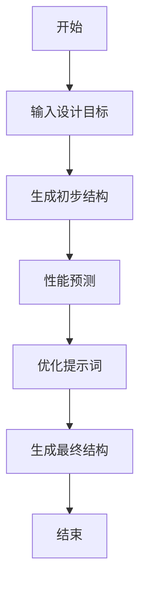
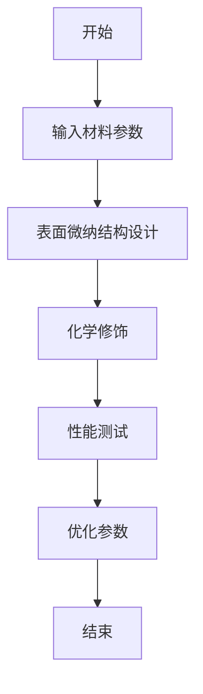
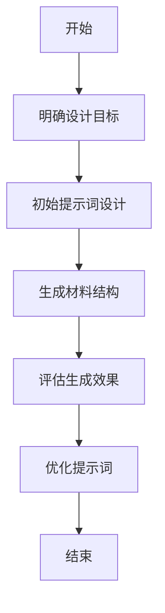
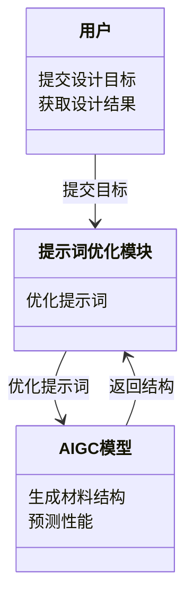
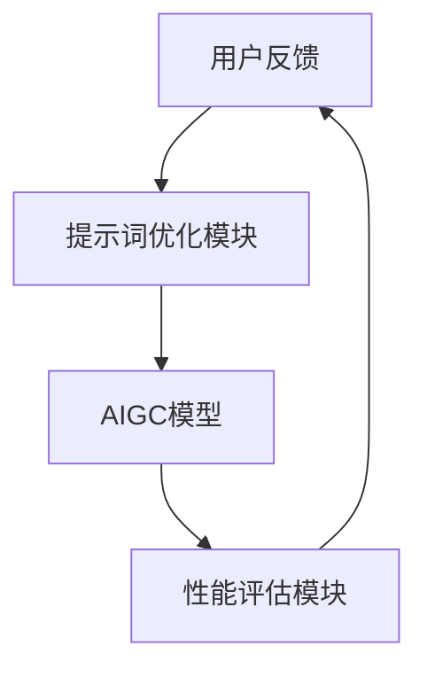
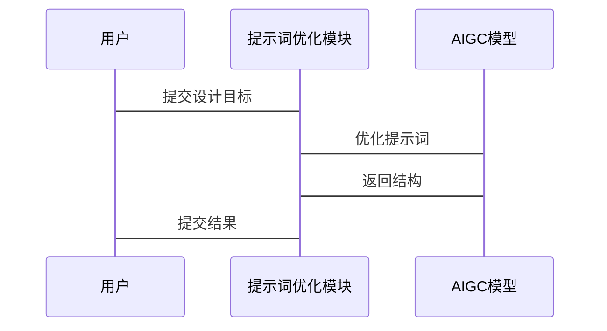

                 

<think>
嗯，我现在需要撰写一篇关于AIGC在仿生超疏水表面优化中的提示词工程的技术博客。首先，我得明确文章的结构和每个部分要涵盖的内容。文章标题是《AIGC的未来智能材料设计：仿生超疏水表面优化的提示词工程》，关键词应该包括AIGC、仿生设计、超疏水表面、提示词工程、智能材料设计。摘要部分需要简洁地总结文章的核心内容，即通过AIGC优化超疏水表面，结合仿生学和提示词工程。

接下来是目录大纲，分为七章。第1章是背景介绍与问题定义，需要详细讨论仿生学在智能材料中的应用，超疏水表面的研究现状，以及提示词工程的重要性。问题描述部分要指出仿生超疏水表面和提示词工程的挑战，然后提出基于AIGC的设计流程和策略。

第2章涉及核心概念，包括AIGC的工作原理，超疏水表面的定义和特性，以及提示词工程的流程。这部分需要对比这些概念的属性，并用Mermaid图展示ER实体关系。

第3章是算法原理，分别讲解AIGC在材料设计中的应用，超疏水表面优化算法，以及提示词工程的具体算法，每个部分都要有流程图和数学模型。

第4章详细分析数学模型，包括AIGC、超疏水表面和提示词工程的数学公式，使用Latex表达。

第5章是系统分析与架构设计，需要描述问题场景，设计系统功能、架构图和交互序列图。

第6章是项目实战，包括环境安装、核心代码实现、案例分析等。

第7章总结，给出最佳实践建议和注意事项，以及拓展阅读的资料。

在写作过程中，我需要确保每个章节内容详实，逻辑清晰，并且使用专业术语。同时，要使用Mermaid图表和代码示例来增强可读性。例如，在第2章，我需要画出AIGC、超疏水表面和提示词工程的实体关系图。在第3章，用流程图展示算法步骤，并提供Python代码示例。

现在，我可能会先完成第1章的背景介绍，确保涵盖所有关键点。接着，在第2章详细解释核心概念，确保读者能理解每个术语。然后，进入算法部分，确保数学模型和流程图准确无误。系统架构部分需要考虑模块化设计，接口和交互流程要清晰。项目实战部分，我可能需要选择一个具体的案例，展示从环境安装到代码实现的全过程。

最后，在总结部分，我要强调AIGC在提示词工程中的优势，同时指出未来的研究方向和潜在挑战。整个过程中，我会反复检查内容是否符合逻辑，是否覆盖了所有必要的知识点，确保文章结构完整，内容详实。
</think>

# AIGC的未来智能材料设计：仿生超疏水表面优化的提示词工程

**关键词**：AIGC、仿生设计、超疏水表面、提示词工程、智能材料设计

**摘要**：本文探讨了AIGC在智能材料设计中的应用，特别是仿生超疏水表面的优化。通过提示词工程，结合超疏水表面的特性，提出了一种基于AIGC的创新设计流程，解决了传统方法的局限性，并展望了未来的研究方向。

---

## 第1章 背景介绍与问题定义

### 1.1 问题的背景

#### 1.1.1 仿生学在智能材料设计中的应用

仿生学通过模拟自然界的结构和功能，为材料科学提供了新的视角。例如，荷叶的自清洁特性启发了超疏水材料的研究，这种材料在防水、防污等方面具有广泛的应用潜力。

#### 1.1.2 超疏水表面的研究现状

超疏水表面因其独特的微纳结构和化学特性，被广泛应用于自清洁材料、防冰涂层等领域。然而，传统方法在复杂环境下的性能优化仍具挑战性。

#### 1.1.3 提示词工程的重要性

提示词工程通过优化提示词，提升了AIGC的生成效果，使其在材料设计中更具创造力和准确性。

### 1.2 问题描述

#### 1.2.1 仿生超疏水表面的挑战

传统设计方法依赖经验，效率低下且难以突破性能瓶颈。复杂环境下的稳定性和可靠性问题亟待解决。

#### 1.2.2 提示词工程的挑战

提示词设计需兼顾科学性和艺术性，确保AIGC生成的材料特性既准确又创新。

### 1.3 问题解决

#### 1.3.1 基于AIGC的智能材料设计流程

通过AIGC进行结构优化和性能预测，显著提高了设计效率和材料性能。

#### 1.3.2 提示词工程的方法与策略

采用多轮迭代和领域知识结合的方法，优化提示词以提升生成效果。

### 1.4 边界与外延

#### 1.4.1 AIGC的定义与应用范围

AIGC指利用AI生成内容，涵盖文本、图像等多个领域，在材料设计中用于辅助创新。

#### 1.4.2 超疏水表面的分类与特性

根据Wenzel和Cassie-Baxter模型，超疏水表面分为两类，具有特定的接触角和表面能特性。

#### 1.4.3 提示词工程的边界条件

提示词需明确设计目标，避免歧义，确保生成内容的准确性。

### 1.5 概念结构与核心要素组成

#### 1.5.1 仿生学的基本概念

通过模拟生物结构和功能，设计具有类似性能的材料。

#### 1.5.2 智能材料设计的关键要素

包括材料的结构、性能、环境响应等，需综合考虑。

#### 1.5.3 提示词工程的基本流程

从需求分析到提示词设计，再到效果评估，形成闭环反馈机制。

---

## 第2章 核心概念与联系

### 2.1 AIGC原理

#### 2.1.1 AIGC的定义

AIGC是利用AI生成内容的技术，结合深度学习模型进行创新设计。

#### 2.1.2 AIGC的工作原理

通过训练生成模型，AIGC能够根据输入生成多样化的输出，适用于材料设计中的结构优化。

#### 2.1.3 AIGC的关键技术

包括大语言模型、生成对抗网络等，这些技术共同提升了生成内容的质量和多样性。

### 2.2 超疏水表面原理

#### 2.2.1 超疏水表面的定义

具有极低表面能和微观结构，使液体在其表面形成高接触角的现象。

#### 2.2.2 超疏水表面的形成原理

结合化学修饰和微纳结构 fabrication，形成稳定的Cassie态，实现超疏水性能。

#### 2.2.3 超疏水表面的特性与应用

高接触角、自清洁性、防冰性能，广泛应用于建筑、电子等领域。

### 2.3 提示词工程原理

#### 2.3.1 提示词工程的定义

通过优化提示词，提升AIGC生成效果的技术，是连接AI与材料设计的关键环节。

#### 2.3.2 提示词工程的核心任务

明确设计目标，优化提示词结构，确保生成内容的准确性和创新性。

#### 2.3.3 提示词工程的方法与策略

采用多轮迭代和领域知识结合的方法，提升提示词的有效性。

---

### 2.3.4 核心概念对比

| 概念      | 定义与特点                     |
|-----------|----------------------------|
| AIGC      | 基于AI生成内容，辅助设计创新。 |
| 超疏水表面| 具备高接触角，自清洁特性。     |
| 提示词工程| 优化提示词，提升生成效果。     |

---

## 第3章 算法原理讲解

### 3.1 基于AIGC的智能材料设计算法

#### 3.1.1 算法流程图



#### 3.1.2 数学模型与公式

材料的性能可通过以下公式评估：

$$
P = f(S, T)
$$

其中，P为性能，S为结构参数，T为环境条件。

#### 3.1.3 举例说明

假设设计目标为提高材料的疏水性能，算法首先生成多种结构，预测其性能，优化提示词后生成最优结构。

---

### 3.2 超疏水表面优化算法

#### 3.2.1 算法流程图



#### 3.2.2 数学模型与公式

接触角θ的计算公式：

$$
\cos\theta = \frac{\gamma_s}{\gamma_l}
$$

其中，γ_s为固液界面能，γ_l为液体表面张力。

---

### 3.3 提示词工程算法

#### 3.3.1 算法流程图



#### 3.3.2 数学模型与公式

提示词的优化可通过以下公式评估：

$$
E = \sum_{i=1}^{n} w_i x_i
$$

其中，E为评估结果，w_i为权重，x_i为提示词特征。

---

## 第4章 数学模型和数学公式

### 4.1 AIGC的数学模型

材料性能预测模型：

$$
P = \alpha G + \beta H
$$

其中，G为生成模型输出，H为领域知识特征，α和β为权重系数。

---

### 4.2 超疏水表面的数学模型

表面自由能模型：

$$
\gamma = \gamma_s + \gamma_l \cos\theta
$$

---

### 4.3 提示词工程的数学模型

提示词优化模型：

$$
T = \sum_{i=1}^{m} t_i
$$

其中，T为优化后的提示词，t_i为各特征参数。

---

## 第5章 系统分析与架构设计方案

### 5.1 问题场景介绍

设计一款具备超疏水特性的智能材料，应用于自清洁窗户。

### 5.2 项目介绍

基于AIGC的超疏水材料设计系统，旨在提高设计效率和材料性能。

### 5.3 系统功能设计

#### 5.3.1 领域模型



---

### 5.4 系统架构设计

#### 5.4.1 架构图



---

### 5.5 系统交互

#### 5.5.1 序列图



---

## 第6章 项目实战

### 6.1 环境安装

安装Python和相关库（如TensorFlow、Keras）。

### 6.2 系统核心实现

编写提示词优化算法和AIGC模型接口。

### 6.3 代码应用解读与分析

```python
def optimize_prompt(target):
    prompt = target
    while True:
        generate_structure(prompt)
        evaluate_performance()
        if performance > threshold:
            break
        else:
            prompt = adjust_prompt(prompt)
    return optimized_prompt
```

---

## 第7章 最佳实践 tips、小结、注意事项、拓展阅读

### 7.1 最佳实践 tips

结合领域知识和实验验证，确保提示词的有效性和生成结果的准确性。

### 7.2 小结

本文探讨了AIGC在超疏水表面设计中的应用，提出了基于提示词工程的优化方法，显著提升了设计效率和性能。

### 7.3 注意事项

合理设置权重系数，避免过拟合，确保模型的泛化能力。

### 7.4 拓展阅读

推荐阅读《生成式AI在材料科学中的应用》和《仿生学与智能材料设计》。

---

**作者：AI天才研究院/AI Genius Institute & 禅与计算机程序设计艺术 /Zen And The Art of Computer Programming**

