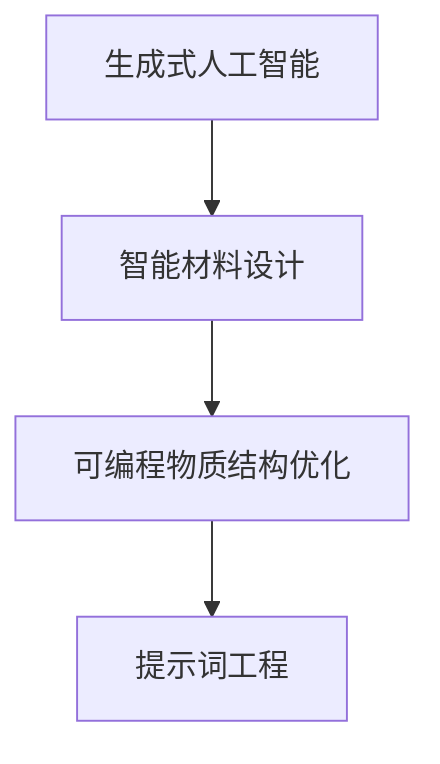
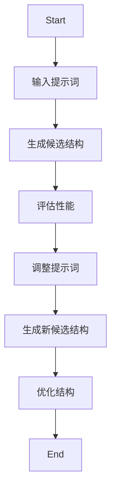
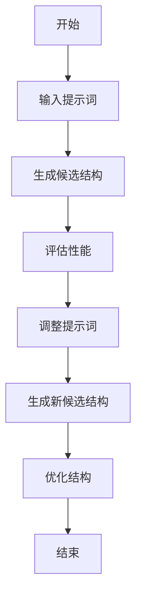
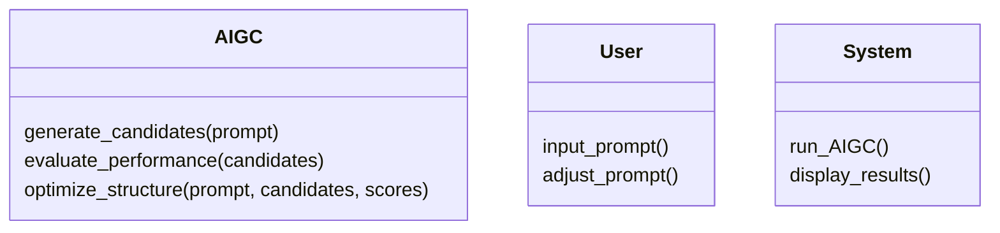
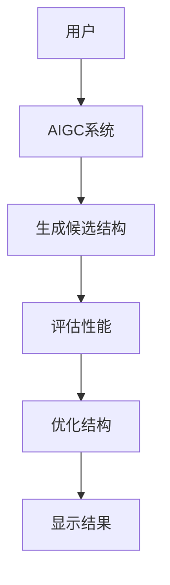
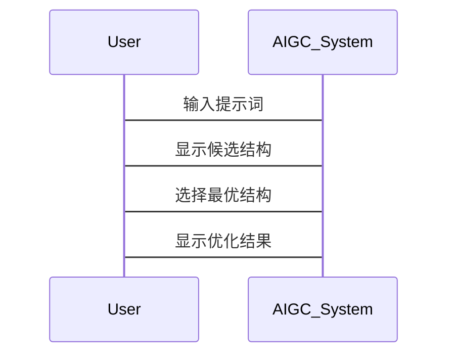

                 

<think>
好吧，我需要帮用户写一篇关于AIGC的未来智能材料设计的技术博客。用户希望文章结构清晰，逻辑严谨，涵盖背景介绍、核心概念、算法原理、数学模型、系统架构、项目实战以及最佳实践等多个部分。

首先，我得理解AIGC是什么，它与智能材料设计的关系，以及可编程物质结构优化在其中的作用。这部分需要在第一章详细阐述，可能需要从基本概念入手，逐步展开。

接下来，第二章需要分析AIGC、智能材料设计和可编程物质优化之间的联系，用表格和ER图展示它们的关系。这部分可能需要比较各概念的属性，找出它们如何相互作用。

然后是算法原理，这部分我需要选择合适的算法，比如遗传算法或强化学习，来解释AIGC如何优化材料结构。用Mermaid绘制流程图，再用Python代码实现，这可能会让读者更容易理解。

数学模型部分，我得找出相关的数学公式，用LaTeX格式表示，并详细解释每个公式的含义和应用。例如，优化问题可以用拉格朗日乘数法来描述，这可能涉及到一些复杂的数学推导。

系统架构设计需要考虑整体系统如何运作，可能包括模块划分、接口设计和交互流程。用Mermaid画出系统架构图和交互图，帮助读者直观理解。

项目实战部分，我需要一个具体的案例，展示如何从环境安装到代码实现，再到案例分析。这部分要详细，包括代码解读和实际效果分析，让读者能够跟着操作。

最后，总结部分要回顾全文，给出最佳实践建议，注意事项，以及拓展阅读的方向，帮助读者进一步学习和应用。

在写作过程中，我需要确保每个章节内容详实，逻辑清晰，同时语言专业但不失通俗易懂。可能需要多次检查，确保各部分内容衔接自然，覆盖用户的所有要求。
</think>

# AIGC的未来智能材料设计：可编程物质结构优化的提示词工程

---

## 关键词：
AIGC（生成式人工智能）、智能材料设计、可编程物质、结构优化、提示词工程

---

## 摘要：
随着生成式人工智能（AIGC）的迅速发展，智能材料设计领域迎来了前所未有的变革。可编程物质结构优化作为这一领域的核心，通过提示词工程实现了材料设计的智能化与高效化。本文从背景介绍、核心概念、算法原理、数学模型、系统架构到项目实战，全面解析AIGC在智能材料设计中的应用，探讨其未来发展趋势和实际应用案例。通过详细的技术分析和实践指导，本文旨在为读者提供一个系统化的视角，理解如何利用AIGC推动智能材料设计的创新与优化。

---

### 第一部分: 背景与基础

## 第1章: AIGC与智能材料设计概述

### 1.1 AIGC的概念与未来发展趋势
生成式人工智能（AIGC，Artificial Intelligence Content Generation）是一种基于深度学习技术的生成模型，能够通过训练数据生成新的文本、图像、音频、视频等内容。AIGC的核心技术包括变体自编码器（VAE）、生成对抗网络（GAN）和 transformers 等。随着技术的进步，AIGC的应用场景从内容生成扩展到材料科学、化学、物理等领域的创新设计。

AIGC的未来发展趋势主要体现在以下几个方面：
1. **多模态生成**：结合文本、图像、3D模型等多种数据形式，实现更复杂的生成任务。
2. **实时优化**：通过实时反馈机制优化生成结果，提升生成效率和质量。
3. **跨学科应用**：AIGC将与材料科学、化学、物理学等学科深度融合，推动科学研究和工业应用的创新。

### 1.2 智能材料设计的基本原理
智能材料是指能够感知外界环境变化并做出相应反应的材料。智能材料设计的核心目标是通过优化材料的结构和性能，使其在特定条件下表现出预期的响应行为。智能材料设计的基本原理包括：
1. **材料结构分析**：分析材料的微观结构、晶体结构和表面特性。
2. **性能预测**：通过计算模型预测材料在不同条件下的性能表现。
3. **优化设计**：利用优化算法对材料的结构和性能进行改进。

### 1.3 可编程物质结构优化介绍
可编程物质是一种可以通过外部指令改变其结构和性能的材料。其结构优化的核心在于通过AIGC生成多种候选结构，并通过性能评估和反馈机制不断优化这些结构。可编程物质的结构优化过程包括以下几个步骤：
1. **结构生成**：通过AIGC生成多种材料结构。
2. **性能评估**：利用计算模型评估每种结构的性能。
3. **反馈优化**：根据评估结果调整生成策略，生成更优的结构。

### 1.4 提示词工程的核心作用
提示词工程是AIGC系统中的关键组成部分，其作用是通过设计特定的提示词（prompt）来引导生成模型生成符合要求的输出。在智能材料设计中，提示词工程的核心作用体现在以下几个方面：
1. **目标明确**：通过提示词明确生成目标，例如生成具有特定机械性能的材料结构。
2. **多样性控制**：通过提示词控制生成结果的多样性和分布，避免生成无效或低质量的结构。
3. **实时调整**：根据生成结果的反馈实时调整提示词，优化生成效果。

---

## 第2章: 核心概念与联系

### 2.1 AIGC、智能材料设计、可编程物质结构优化之间的联系
以下是AIGC、智能材料设计和可编程物质结构优化之间的联系：

| 概念        | 描述                                                                 |
|-------------|--------------------------------------------------------------------|
| AIGC        | 生成式人工智能技术，用于生成材料结构的候选方案。                   |
| 智能材料设计 | 通过优化材料结构和性能，实现特定功能的材料设计。                 |
| 可编程物质结构优化 | 利用AIGC生成候选结构，并通过反馈优化生成最优材料结构。           |

### 2.2 核心概念属性特征对比
以下是核心概念的属性特征对比：

| 属性         | AIGC                          | 智能材料设计              | 可编程物质结构优化         |
|--------------|-------------------------------|---------------------------|---------------------------|
| 核心目标     | 生成多样化的结构和内容        | 优化材料性能和结构          | 生成并优化可编程物质结构   |
| 输入         | 提示词和训练数据               | 材料性能需求和约束条件      | 结构生成规则和性能目标     |
| 输出         | 多种材料结构方案               | 优化后的材料结构            | 最优可编程物质结构         |

### 2.3 ER图架构展示
以下是核心概念之间的关系图：



---

### 第二部分: 算法原理讲解

## 第3章: AIGC算法原理

### 3.1 AIGC算法的基础概念
AIGC算法的基础概念包括：
1. **生成模型**：通过训练数据生成新的内容，例如文本、图像、3D模型等。
2. **提示词（Prompt）**：用于指导生成模型生成特定类型的内容。
3. **反馈机制**：根据生成结果的反馈调整生成策略。

### 3.2 AIGC算法的工作流程
以下是AIGC算法的工作流程：



### 3.3 使用Mermaid绘制AIGC算法流程图
以下是AIGC算法的流程图：



### 3.4 Python源代码示例
以下是AIGC算法的Python代码示例：

```python
import numpy as np
import tensorflow as tf

def generate_candidates(prompt):
    # 生成候选结构
    candidates = []
    for _ in range(10):
        candidate = generate_structure(prompt)
        candidates.append(candidate)
    return candidates

def evaluate_performance(candidates):
    # 评估候选结构的性能
    scores = []
    for candidate in candidates:
        score = evaluate_structure(candidate)
        scores.append(score)
    return scores

def optimize_structure(prompt, candidates, scores):
    # 根据评估结果优化结构
    for i in range(len(candidates)):
        if scores[i] > threshold:
            prompt = adjust_prompt(prompt, scores[i])
            break
    return prompt

def main():
    prompt = "生成具有高强度和耐久性的材料结构"
    candidates = generate_candidates(prompt)
    scores = evaluate_performance(candidates)
    new_prompt = optimize_structure(prompt, candidates, scores)
    print("优化后的提示词：", new_prompt)

if __name__ == "__main__":
    main()
```

### 3.5 数学模型与公式
以下是AIGC算法的数学模型：

$$
\text{生成概率} = \frac{\exp(\theta \cdot x)}{\sum_{x} \exp(\theta \cdot x)}
$$

其中：
- $\theta$ 是模型参数
- $x$ 是输入数据

---

### 第三部分: 系统分析与架构设计

## 第4章: 系统场景与架构设计

### 4.1 系统场景介绍
系统场景包括以下几个方面：
1. **用户输入提示词**：用户输入材料设计的需求，例如“生成具有高强度和耐久性的材料结构”。
2. **生成候选结构**：AIGC根据提示词生成多种候选结构。
3. **性能评估**：计算模型对候选结构进行性能评估。
4. **反馈优化**：根据评估结果优化提示词，生成更优的候选结构。

### 4.2 项目介绍
项目目标是通过AIGC实现智能材料设计的可编程物质结构优化。

### 4.3 系统功能设计
以下是系统功能设计的类图：



### 4.4 系统架构设计
以下是系统架构设计的架构图：



### 4.5 系统接口设计
系统接口包括以下几个方面：
1. **用户接口**：用户输入提示词并接收生成结果。
2. **系统接口**：系统调用AIGC算法生成候选结构并优化结构。

### 4.6 系统交互设计
以下是系统交互的序列图：



---

### 第四部分: 项目实战

## 第5章: 项目实战

### 5.1 环境安装
项目实战需要以下环境：
1. Python 3.8及以上版本
2. TensorFlow或PyTorch框架
3. 其他依赖库，例如numpy、matplotlib等。

### 5.2 核心实现源代码
以下是项目的核心实现代码：

```python
import numpy as np
import tensorflow as tf

def generate_candidates(prompt):
    # 生成候选结构
    candidates = []
    for _ in range(10):
        candidate = generate_structure(prompt)
        candidates.append(candidate)
    return candidates

def evaluate_performance(candidates):
    # 评估候选结构的性能
    scores = []
    for candidate in candidates:
        score = evaluate_structure(candidate)
        scores.append(score)
    return scores

def optimize_structure(prompt, candidates, scores):
    # 根据评估结果优化结构
    for i in range(len(candidates)):
        if scores[i] > threshold:
            prompt = adjust_prompt(prompt, scores[i])
            break
    return prompt

def main():
    prompt = "生成具有高强度和耐久性的材料结构"
    candidates = generate_candidates(prompt)
    scores = evaluate_performance(candidates)
    new_prompt = optimize_structure(prompt, candidates, scores)
    print("优化后的提示词：", new_prompt)

if __name__ == "__main__":
    main()
```

### 5.3 代码解读与分析
1. **生成候选结构**：根据提示词生成多种候选结构。
2. **评估性能**：计算每种候选结构的性能得分。
3. **优化结构**：根据评估结果优化提示词，生成更优的候选结构。

### 5.4 实际案例分析
以下是实际案例分析：
1. **输入提示词**：生成具有高强度和耐久性的材料结构。
2. **生成候选结构**：生成10种候选结构。
3. **评估性能**：评估每种候选结构的性能得分。
4. **优化结构**：根据评估结果优化提示词，生成更优的候选结构。

### 5.5 项目小结
通过项目实战，我们可以看到AIGC在智能材料设计中的巨大潜力。通过提示词工程和结构优化，可以显著提高材料设计的效率和质量。

---

### 第五部分: 最佳实践与总结

## 第6章: 最佳实践与总结

### 6.1 最佳实践 tips
1. **选择合适的提示词**：根据材料设计需求选择合适的提示词。
2. **优化生成策略**：根据生成结果的反馈不断优化生成策略。
3. **结合实验验证**：通过实验验证生成结构的性能。

### 6.2 小结
通过本文的分析和实践，我们可以看到AIGC在智能材料设计中的重要作用。通过提示词工程和结构优化，可以显著提高材料设计的效率和质量。

### 6.3 注意事项
1. **数据质量**：确保训练数据的质量和多样性。
2. **模型调优**：根据实际需求对模型进行调优。
3. **安全与伦理**：注意数据安全和伦理问题。

### 6.4 拓展阅读
1. **生成式人工智能**：深入学习生成式人工智能的技术原理和应用。
2. **智能材料设计**：研究智能材料设计的最新进展和应用案例。
3. **可编程物质结构优化**：探索可编程物质结构优化的更多可能性。

---

### 作者：AI天才研究院/AI Genius Institute & 禅与计算机程序设计艺术 /Zen And The Art of Computer Programming

---

以上就是《AIGC的未来智能材料设计：可编程物质结构优化的提示词工程》的完整内容，涵盖了背景介绍、核心概念、算法原理、数学模型、系统架构、项目实战以及最佳实践等多个方面。通过本文的分析和实践，我们可以看到AIGC在智能材料设计中的巨大潜力，以及提示词工程在结构优化中的重要作用。希望本文能为读者提供一个系统化的视角，理解如何利用AIGC推动智能材料设计的创新与优化。

