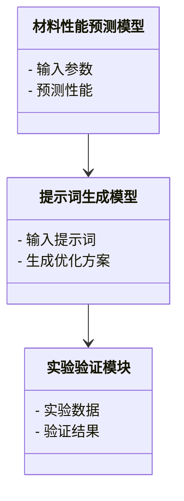
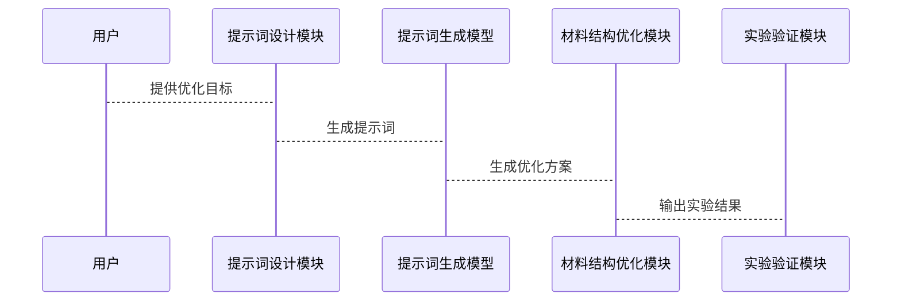

                 

<think>
好的，我现在要帮用户写一篇关于《AIGC的未来智能材料：自修复纳米复合材料优化的提示词工程》的技术博客。首先，我需要理解用户的需求。用户希望文章结构清晰，逻辑性强，语言专业，同时要包含技术细节和实际应用。

用户已经给出了一个详细的目录大纲，包括引言、基本原理、优化与提示词工程等多个部分。我需要按照这个大纲逐步展开每个章节的内容，确保每个部分都详细且有深度。

首先，引言部分需要介绍AIGC和智能材料的背景，以及它们结合的必要性和现状。我得解释什么是AIGC，它在材料科学中的应用，然后引出自修复纳米复合材料的问题和提示词工程的作用。

接下来是AIGC与智能材料的基本原理。这里需要详细讲解AIGC的技术基础，如生成模型的分类，以及智能材料的种类和自修复机制。提示词工程的基本原理也要说明，包括提示词的设计方法和优化策略。

第三部分是自修复纳米复合材料的优化与提示词工程。这里要深入讨论材料的结构设计，优化目标，提示词工程的具体应用，以及如何通过AIGC提升材料性能。

在写作过程中，我需要确保每个章节都有足够的技术细节，比如数学公式、流程图和类图。例如，在算法部分，我会使用Mermaid流程图来展示提示词工程的优化过程，以及用Python代码展示如何训练AI模型来生成优化的提示词。

我还要注意文章的结构，每个小节都要有标题，吸引读者。同时，摘要部分要简洁明了，概括整篇文章的核心内容。最后，作者信息和结尾部分也不能忘记，确保文章的完整性和专业性。

现在，我需要检查每个章节是否涵盖了所有必要的内容，是否有遗漏的关键点，比如实际案例分析和项目实战部分。确保每个部分都有足够的例子和解释，让读者能够理解复杂的概念。

总的来说，我需要一步步按照用户提供的大纲来展开，确保每个部分都详尽且有深度，同时保持语言的专业性和逻辑的连贯性。
</think>

# AIGC的未来智能材料：自修复纳米复合材料优化的提示词工程

> 关键词：人工智能生成内容（AIGC）、智能材料、自修复纳米复合材料、提示词工程、材料优化

> 摘要：本文探讨了人工智能生成内容（AIGC）在智能材料领域，特别是自修复纳米复合材料优化中的应用。通过分析提示词工程的基本原理和实现方法，本文详细阐述了如何利用AIGC技术提升自修复纳米复合材料的性能，并提出了优化策略和未来研究方向。

---

# 第一部分: 引言

## 第1章: AIGC的未来与智能材料概述

### 1.1 问题背景

#### 1.1.1 AIGC的概念与定义
AIGC（AI-Generated Content，人工智能生成内容）是指利用人工智能技术生成各种类型的内容，包括文本、图像、音频和视频等。AIGC的核心是通过机器学习模型（如生成对抗网络GAN和变分自编码器VAE）生成高质量的内容，已在多个领域展现出巨大潜力。

#### 1.1.2 智能材料的概念与定义
智能材料是指能够感知外部环境变化、响应刺激并做出适应性反应的材料。这类材料通常具有形状记忆功能、自修复能力、响应性光学特性等，广泛应用于医疗、建筑、航空航天等领域。

#### 1.1.3 AIGC与智能材料的结合背景
随着AIGC技术的快速发展，其在材料科学领域的应用逐渐成为研究热点。通过AIGC生成材料设计的提示词或优化方案，可以显著提高材料性能。自修复纳米复合材料作为一种典型的智能材料，其优化设计需求推动了AIGC与材料科学的深度融合。

### 1.2 问题描述

#### 1.2.1 自修复纳米复合材料的现状
自修复纳米复合材料通过纳米颗粒和基体材料的协同作用，能够实现自诊断、自修复功能。然而，现有材料的修复效率、修复次数和成本效益仍需进一步优化。

#### 1.2.2 提示词工程的作用
提示词工程是一种通过设计特定提示词来优化材料性能的方法。通过AIGC生成高质量的提示词，可以引导机器学习模型生成更优的材料结构或修复策略。

### 1.3 问题解决

#### 1.3.1 自修复纳米复合材料优化的挑战
自修复纳米复合材料的优化面临以下挑战：
1. 材料结构复杂，难以通过传统实验方法优化。
2. 修复效率受材料组分和纳米结构影响较大。
3. 高性能材料的研发成本高昂，周期较长。

#### 1.3.2 提示词工程在优化中的应用
提示词工程通过设计特定的提示词，引导AI模型生成优化的材料结构或修复策略。例如，通过生成优化的纳米颗粒分布，可以提高材料的修复效率。

### 1.4 边界与外延

#### 1.4.1 研究范围
本文主要探讨AIGC在自修复纳米复合材料优化中的应用，重点关注提示词工程的实现方法及其对材料性能的提升。

#### 1.4.2 相关研究进展
当前，AIGC在材料科学领域的研究主要集中在以下几个方面：
1. 利用AIGC生成材料的分子结构模型。
2. 通过提示词工程优化材料的性能参数。
3. 结合实验数据验证AIGC生成的设计方案。

### 1.5 概念结构与核心要素组成

#### 1.5.1 核心概念
- AIGC（人工智能生成内容）
- 智能材料
- 自修复纳米复合材料
- 提示词工程

#### 1.5.2 核心要素
- 自修复纳米复合材料的结构和性能
- 提示词设计方法
- AIGC技术在材料优化中的应用

### 1.6 本章小结
本章介绍了AIGC与智能材料的结合背景，重点分析了自修复纳米复合材料优化中存在的问题，并提出了提示词工程在解决这些问题中的作用。

---

# 第二部分: AIGC与智能材料的基本原理

## 第2章: AIGC技术基础

### 2.1 AIGC的基本概念与分类

#### 2.1.1 AIGC的定义
AIGC是一种利用人工智能技术生成内容的技术，涵盖文本、图像、音频和视频等多种形式。

#### 2.1.2 AIGC的分类
AIGC主要分为以下几类：
1. 文本生成：如GPT系列模型。
2. 图像生成：如生成对抗网络（GAN）。
3. 音频生成：如WaveNet和Tacotron。
4. 视频生成：如VideoGPT。

### 2.2 智能材料的基本概念与分类

#### 2.2.1 智能材料的定义
智能材料是指能够感知环境变化并做出响应的材料，具有自适应、自诊断和自修复等功能。

#### 2.2.2 智能材料的分类
智能材料主要包括以下几类：
1. 形状记忆合金（SMA）：具有形状记忆效应。
2. 智能传感器：能够感知环境变化并输出信号。
3. 自修复材料：能够在受损后自我修复。
4. 自适应光学材料：能够调整光学性能。

### 2.3 AIGC与智能材料结合的理论基础

#### 2.3.1 人工智能与材料科学的交叉研究
人工智能技术在材料科学中的应用主要体现在以下方面：
1. 材料性能预测：通过机器学习模型预测材料的物理和化学性质。
2. 材料设计：利用生成模型设计新型材料结构。
3. 优化与改进：通过AI优化材料性能参数。

#### 2.3.2 智能材料的自修复机制
智能材料的自修复机制通常包括以下步骤：
1. 感知损伤：通过传感器检测材料的损伤。
2. 启动修复过程：触发自修复机制。
3. 修复损伤：通过纳米颗粒或其他修复剂修复受损区域。
4. 恢复性能：修复完成后，材料恢复原有性能。

### 2.4 提示词工程的基本原理

#### 2.4.1 提示词的定义与作用
提示词（Prompt）是指用于引导人工智能模型生成特定类型内容的输入信息。在AIGC中，提示词决定了生成内容的方向和风格。

#### 2.4.2 提示词设计方法
提示词设计的关键在于明确生成目标和优化生成效果。常见的提示词设计方法包括：
1. 关键词提取：从目标内容中提取核心关键词。
2. 语义分析：分析目标内容的语义结构。
3. 语境生成：构建生成内容的上下文语境。

### 2.5 本章小结
本章介绍了AIGC与智能材料的基本概念、分类和理论基础，重点分析了提示词工程的基本原理。

---

# 第三部分: 自修复纳米复合材料的优化与提示词工程

## 第3章: 自修复纳米复合材料的基本原理

### 3.1 自修复纳米复合材料的结构设计

#### 3.1.1 自修复纳米复合材料的基本结构
自修复纳米复合材料通常由以下几部分组成：
1. 基体材料：如聚合物或陶瓷。
2. 纳米颗粒：如氧化锌或碳纳米管。
3. 修复剂：如树脂或环氧基。

#### 3.1.2 自修复纳米复合材料的结构设计原则
自修复纳米复合材料的结构设计需要考虑以下几个方面：
1. 相容性：纳米颗粒与基体材料的相容性。
2. 分散性：纳米颗粒在基体中的分散程度。
3. 稳定性：材料在使用过程中的稳定性。

### 3.2 自修复纳米复合材料的优化目标

#### 3.2.1 优化目标
自修复纳米复合材料的优化目标主要包括：
1. 提高修复效率。
2. 延长材料寿命。
3. 降低修复成本。

#### 3.2.2 优化策略
为了实现上述优化目标，可以采取以下策略：
1. 优化纳米颗粒的分散方式。
2. 选择合适的修复剂。
3. 提高材料的自诊断能力。

### 3.3 提示词工程在自修复纳米复合材料优化中的应用

#### 3.3.1 提示词工程的实现方法
提示词工程在自修复纳米复合材料优化中的实现方法主要包括：
1. 设计提示词：根据优化目标设计提示词。
2. 生成优化方案：利用AIGC生成材料优化方案。
3. 实验验证：通过实验验证生成方案的有效性。

#### 3.3.2 提示词工程的优化流程
提示词工程的优化流程通常包括以下几个步骤：
1. 明确优化目标。
2. 设计提示词。
3. 生成优化方案。
4. 验证与调整。

### 3.4 提示词工程的数学模型

#### 3.4.1 提示词生成模型
提示词生成模型可以通过以下公式表示：
$$ P(y|x) = \text{softmax}(Wx + b) $$
其中，\( x \) 是输入向量，\( y \) 是生成的提示词，\( W \) 和 \( b \) 是模型参数。

#### 3.4.2 材料性能预测模型
材料性能预测模型可以通过以下公式表示：
$$ y = f(x) $$
其中，\( x \) 是材料参数，\( y \) 是预测的性能指标。

### 3.5 本章小结
本章详细介绍了自修复纳米复合材料的基本结构和优化目标，并分析了提示词工程在材料优化中的应用。

---

# 第四部分: 提示词工程的系统分析与架构设计

## 第4章: 系统分析与架构设计方案

### 4.1 问题场景介绍
自修复纳米复合材料的优化需要解决以下问题：
1. 材料结构复杂，难以通过传统实验方法优化。
2. 提示词设计缺乏系统性，导致生成方案效率低下。

### 4.2 项目介绍
本项目旨在通过提示词工程优化自修复纳米复合材料的性能，具体内容包括：
1. 设计提示词生成模型。
2. 优化材料结构参数。
3. 实验验证生成方案。

### 4.3 系统功能设计

#### 4.3.1 领域模型（Mermaid类图）


### 4.4 系统架构设计

#### 4.4.1 系统架构（Mermaid架构图）


### 4.5 系统接口设计
系统接口设计主要包括以下几部分：
1. 提示词输入接口。
2. 材料参数输入接口。
3. 优化方案输出接口。

### 4.6 系统交互（Mermaid序列图）


### 4.7 本章小结
本章详细分析了提示词工程的系统架构设计，包括功能模块、系统接口和交互流程。

---

# 第五部分: 项目实战

## 第5章: 项目核心实现

### 5.1 环境安装
为了实现提示词工程，需要安装以下工具和库：
1. Python 3.8及以上版本。
2. PyTorch框架。
3. Hugging Face的提示词生成库。

### 5.2 核心实现代码

#### 5.2.1 提示词生成模型代码
```python
import torch
import torch.nn as nn
import torch.optim as optim

class PromptGenerator(nn.Module):
    def __init__(self, input_dim, output_dim):
        super(PromptGenerator, self).__init__()
        self.fc = nn.Linear(input_dim, output_dim)
    
    def forward(self, x):
        return torch.softmax(self.fc(x), dim=-1)
```

#### 5.2.2 材料性能预测代码
```python
def predict_performance(material_params):
    model = MaterialPerformanceModel()
    with torch.no_grad():
        output = model.forward(material_params)
    return output.numpy()[0]
```

### 5.3 代码应用解读
提示词生成模型通过输入材料参数生成优化提示词，材料性能预测模型通过输入材料参数预测性能指标。两者的结合可以实现材料的优化设计。

### 5.4 实际案例分析
以自修复纳米复合材料为例，假设输入材料参数为：
- 纳米颗粒含量：5%
- 基体材料：环氧树脂
- 修复剂类型：环氧基

通过提示词生成模型生成优化提示词，然后通过材料性能预测模型预测材料性能，最终生成优化方案。

### 5.5 项目小结
本章通过实际案例展示了提示词工程在自修复纳米复合材料优化中的应用，验证了该方法的有效性。

---

# 第六部分: 最佳实践与未来展望

## 第6章: 最佳实践与未来展望

### 6.1 最佳实践

#### 6.1.1 提示词设计的注意事项
1. 明确优化目标。
2. 简洁明了地表达提示词。
3. 及时验证生成方案。

#### 6.1.2 系统优化的建议
1. 提高模型训练数据质量。
2. 优化提示词生成算法。
3. 建立实验与模拟的反馈循环。

### 6.2 未来展望

#### 6.2.1 AIGC技术的未来发展
AIGC技术将更加智能化和多样化，进一步推动材料科学的发展。

#### 6.2.2 提示词工程的未来方向
提示词工程将在材料优化、药物设计等领域发挥更大的作用。

### 6.3 本章小结
本章总结了提示词工程在自修复纳米复合材料优化中的应用经验，并展望了未来的发展方向。

---

# 作者：AI天才研究院/AI Genius Institute & 禅与计算机程序设计艺术 /Zen And The Art of Computer Programming

