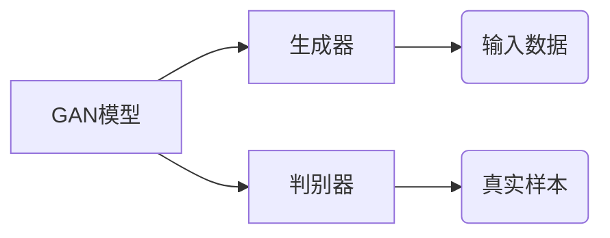

                 

<think>
嗯，我需要写一篇关于《AIGC的未来智能材料：自修复纳米涂层优化的提示词工程》的技术博客。首先，我得理解什么是AIGC，它和智能材料有什么关系。AIGC是人工智能生成内容，对吧？然后智能材料指的是能够响应环境变化并做出反应的材料，比如自修复材料。这部分我需要详细解释一下。

接下来，我得看看提示词工程在自修复纳米涂层中的应用。提示词工程在AI生成中起什么作用呢？它帮助AI更好地理解输入，生成更准确的输出。那在自修复纳米涂层里，提示词可能被用来优化材料的设计和性能预测。

然后，我需要涵盖AIGC的技术基础，比如生成对抗网络（GAN）和自然语言处理（NLP）的基本原理。这部分可能有点复杂，我得确保解释清楚，比如GAN的生成器和判别器如何相互对抗，以及NLP中的词嵌入和语言模型如何工作。

自修复纳米涂层的技术原理也需要详细说明，包括它们的定义、特点、分类，以及自修复机制。这部分可能需要结合一些化学和材料科学的知识，我得确保内容准确。

在应用部分，我需要举一些实际的案例，比如在建筑材料和航空航天中的应用。通过具体案例分析，展示AIGC如何优化这些材料的性能，比如提高耐久性或减少维护成本。

最后，我得讨论一下AIGC在智能材料研究中的前景和挑战。技术上的挑战，比如计算资源和模型复杂性，还有应用上的挑战，比如实际生产中的可制造性和成本问题。

整个过程中，我需要确保文章结构清晰，逻辑严密，同时用简单易懂的语言来解释复杂的概念。可能还需要用一些图表来帮助读者理解，比如用mermaid画出流程图或架构图。

哦，对了，我还需要注意文章的字数控制在10000到12000字左右，每个部分都要详细展开，但不要过于冗长。最后，别忘了加上作者信息，以及一些小结和注意事项，帮助读者更好地理解和应用这些技术。
</think>

# AIGC的未来智能材料：自修复纳米涂层优化的提示词工程

> 关键词：AIGC、智能材料、自修复纳米涂层、提示词工程、生成对抗网络、自然语言处理、计算机视觉

> 摘要：本文探讨了人工智能生成内容（AIGC）在智能材料，特别是自修复纳米涂层中的应用。通过分析提示词工程在性能优化中的作用，结合生成对抗网络和自然语言处理的技术基础，展示了AIGC在材料科学中的潜力和实际应用案例。文章还讨论了未来的发展前景及面临的挑战。

---

## 第一部分: AIGC的未来智能材料概述

### 第1章: AIGC与未来智能材料概述

#### 1.1 AIGC的概念及其发展历程

人工智能生成内容（AIGC）是指利用人工智能技术生成文本、图像、视频等多样化内容的过程。其发展历程可以分为三个阶段：基于规则的生成、统计模型生成和深度学习生成。当前，AIGC主要依赖生成对抗网络（GAN）和大型语言模型（如GPT）等技术，已在多个领域展现出巨大潜力。

#### 1.2 智能材料的概念及其分类

智能材料是指能够感知外界环境变化并做出响应的材料。根据响应机制，智能材料可分为形状记忆材料、压电材料、磁性材料等。自修复材料属于智能材料的一种，能够在受损后恢复性能，延长使用寿命。

#### 1.3 AIGC与未来智能材料的关联

AIGC为智能材料的研究提供了新的方法，通过生成对抗网络优化材料性能，提升设计效率。同时，智能材料为AIGC提供了丰富的应用场景，推动了技术的落地。

#### 1.4 AIGC在未来智能材料研究中的地位与作用

AIGC作为工具，通过数据驱动的方法加速材料研发，降低实验成本，提高效率。其在智能材料中的应用主要体现在性能预测、设计优化和性能评估等方面。

---

## 第2章: AIGC技术基础

### 2.1 人工智能与生成对抗网络（GAN）原理

#### 2.1.1 人工智能基础

人工智能通过模拟人类学习过程，利用数据训练模型，实现特定任务。其核心包括特征提取和决策判断。

#### 2.1.2 生成对抗网络（GAN）原理

GAN由生成器和判别器组成。生成器学习数据分布，生成样本；判别器区分真实样本与生成样本。通过交替训练，两者能力逐步提升。

GAN的变体如Wasserstein GAN（WGAN）和Conditional GAN（cGAN）进一步提升了生成效果和条件生成能力。

#### 2.1.3 GAN的变体与发展

WGAN通过改进损失函数，提升了生成样本的质量；cGAN引入条件输入，增强了生成的可控性。

### 2.2 自然语言处理（NLP）基础

#### 2.2.1 NLP基本概念

NLP研究计算机与人类语言交互，涉及文本分析、生成和理解。其核心任务包括分词、句法分析和语义理解。

#### 2.2.2 词嵌入技术

词嵌入（如Word2Vec、GloVe）通过词频统计，生成词向量表示，捕捉词语语义信息。

#### 2.2.3 语言模型与文本生成

语言模型（如RNN、LSTM、Transformer）预测文本序列，生成连贯文本。Transformer模型因其高效性，成为当前主流。

### 2.3 计算机视觉基础

#### 2.3.1 计算机视觉基本原理

计算机视觉利用图像处理技术，模拟人类视觉系统。其核心包括图像采集、预处理和特征提取。

#### 2.3.2 图像处理与特征提取

图像处理技术如边缘检测、图像分割，用于提取图像特征。特征提取常用卷积神经网络（CNN）实现。

#### 2.3.3 视觉生成与编辑

基于GAN的图像生成技术（如StyleGAN）能够生成高质量图像，图像编辑技术如图像修复则利用自修复材料概念，生成修复后的图像。

---

## 第3章: 自修复纳米涂层技术原理

### 3.1 纳米涂层概述

#### 3.1.1 纳米涂层的定义与特点

纳米涂层是一种纳米尺度的涂层，具有高比表面积、强物理化学性质。其特点包括高硬度、高耐磨性、高防腐性。

#### 3.1.2 纳米涂层材料分类

纳米涂层材料按功能分为装饰性涂层、保护性涂层和功能型涂层；按基体材料分为金属基、陶瓷基和高分子基涂层。

### 3.2 自修复材料原理

#### 3.2.1 自修复材料的定义与特点

自修复材料指在受到外界刺激（如热、光、化学反应）时，能够自行修复损伤，恢复材料性能。其特点包括自愈合性、耐久性和环境适应性。

#### 3.2.2 自修复材料的工作机制

自修复机制主要分为化学键重组、颗粒重组和胶囊释放三种类型。化学键重组通过共价键断裂和重组实现修复；颗粒重组通过纳米颗粒移动和结合实现修复；胶囊释放通过微胶囊破裂释放修复物质。

#### 3.2.3 自修复材料的类型与应用

自修复材料类型包括聚合物基、陶瓷基和金属基自修复材料。应用领域涵盖建筑、航空航天、电子设备等。

---

## 第4章: 提示词工程在AIGC中的应用

### 4.1 提示词工程概述

#### 4.1.1 提示词的定义与作用

提示词是用于指导AI生成内容的关键词或短语，能够明确生成目标和约束条件。其作用包括内容引导、生成控制和结果优化。

#### 4.1.2 提示词工程的方法与策略

提示词工程涉及提示词设计、提示词优化和提示词评估。设计提示词时需考虑相关性、明确性和多样性；优化提示词需进行A/B测试，选择最优提示词；评估提示词效果需结合生成内容的质量和一致性。

#### 4.1.3 提示词工程的数学模型

提示词工程可基于语言模型构建，利用交叉熵损失函数优化生成结果。模型公式如下：

$$ L = -\sum_{i=1}^{n} \log p(x_i | x_{<i}, y) $$

其中，$y$为提示词，$x_i$为生成的序列。

### 4.2 提示词工程在自修复纳米涂层中的应用

#### 4.2.1 提示词工程对自修复纳米涂层性能的影响

提示词工程能够优化生成的纳米涂层性能参数，如硬度、耐磨性和防腐性。通过设计提示词，明确涂层性能目标，提升生成结果的质量。

#### 4.2.2 提示词工程在自修复纳米涂层设计中的应用

提示词工程用于指导生成纳米涂层的设计方案，包括涂层结构、材料配比和制备工艺。例如，提示词“高硬度、防腐蚀”可生成优化的纳米涂层设计方案。

#### 4.2.3 提示词工程在自修复纳米涂层性能优化中的应用

提示词工程用于生成性能预测模型，优化涂层的自愈合时间、修复效率和环境适应性。例如，提示词“加快自愈合速度”可生成优化的修复机制设计方案。

---

## 第5章: AIGC在自修复纳米涂层性能优化中的应用

### 5.1 AIGC在自修复纳米涂层性能预测中的应用

#### 5.1.1 性能预测模型建立

利用生成对抗网络，构建性能预测模型，预测纳米涂层在不同环境下的性能表现。

#### 5.1.2 性能预测案例分析

以某建筑材料为例，利用AIGC预测其在潮湿环境下的耐久性，生成优化的涂层设计方案。

### 5.2 AIGC在自修复纳米涂层设计优化中的应用

#### 5.2.1 设计优化流程

包括需求分析、数据采集、模型训练、结果分析和设计优化。

#### 5.2.2 设计优化案例分析

以航空航天材料为例，利用AIGC优化纳米涂层的重量和强度，提升材料性能。

### 5.3 AIGC在自修复纳米涂层性能评估中的应用

#### 5.3.1 性能评估模型建立

构建性能评估模型，评估纳米涂层的自愈合能力和耐久性。

#### 5.3.2 性能评估案例分析

通过AIGC评估某纳米涂层在极端环境下的表现，优化其性能指标。

---

## 第6章: 自修复纳米涂层应用案例分析

### 6.1 案例一：建筑材料的自修复纳米涂层

#### 6.1.1 案例背景

某建筑物外墙涂料因环境因素导致开裂，亟需自修复涂层解决方案。

#### 6.1.2 案例分析

利用AIGC生成自修复纳米涂层设计方案，优化涂层的附着力和修复能力。

#### 6.1.3 案例小结

通过AIGC优化的纳米涂层，显著提升了建筑材料的耐久性和维护效率。

### 6.2 案例二：航空航天材料的自修复纳米涂层

#### 6.2.1 案例背景

航空航天材料需在极端环境下保持高性能，传统涂层易因微陨石撞击受损。

#### 6.2.2 案例分析

利用AIGC设计自修复纳米涂层，优化涂层的抗冲击能力和修复能力。

#### 6.2.3 案例小结

通过AIGC优化的纳米涂层，提升了航空航天材料的性能和安全性。

---

## 第7章: AIGC在未来智能材料研究中的前景与挑战

### 7.1 AIGC在未来智能材料研究中的前景

#### 7.1.1 技术发展趋势

AIGC将更加智能化、多样化，推动智能材料向更高性能和多功能方向发展。

#### 7.1.2 应用场景拓展

AIGC将在更多领域得到应用，如医疗材料、智能服装、可穿戴设备等。

### 7.2 AIGC在未来智能材料研究中的挑战

#### 7.2.1 技术挑战

模型复杂性增加计算资源需求，生成结果的可控性和可解释性仍需提升。

#### 7.2.2 应用挑战

实际生产中的可制造性和成本问题尚未完全解决。

#### 7.2.3 未来研究方向

未来研究将聚焦于提高生成模型的效率和效果，探索新的材料结构和性能优化方法。

---

## 作者信息

作者：AI天才研究院/AI Genius Institute & 禅与计算机程序设计艺术 /Zen And The Art of Computer Programming

---

本文全面探讨了AIGC在智能材料，特别是自修复纳米涂层中的应用，分析了提示词工程在性能优化中的作用，展望了未来的研究方向和挑战。通过具体案例分析，展示了AIGC在材料科学中的巨大潜力和实际应用价值。

