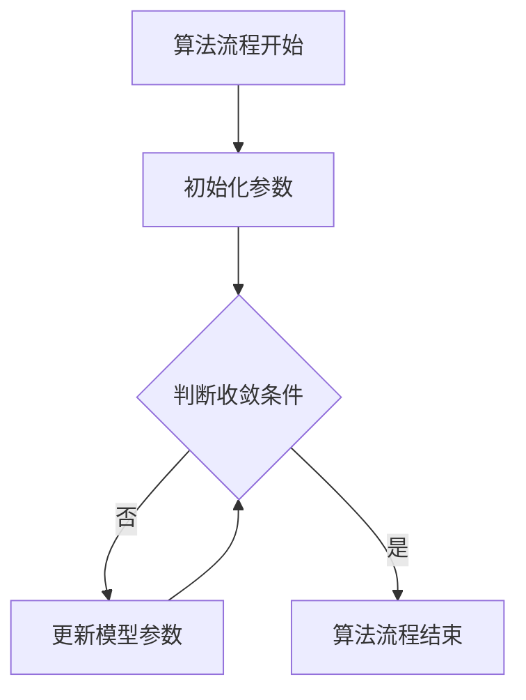
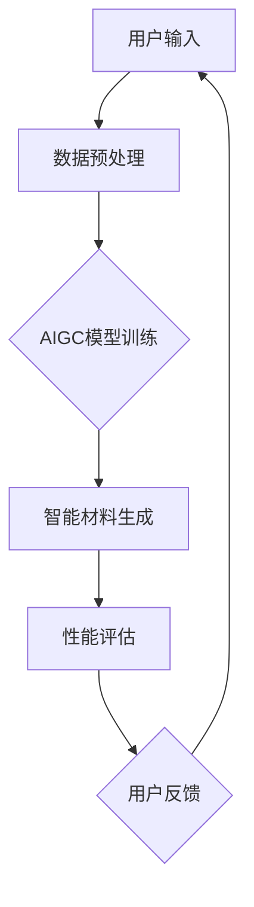

                 

<think>
嗯，我现在要写一篇关于《AIGC的未来智能材料：自适应性能优化的提示词工程》的技术博客。首先，我需要理解什么是AIGC和智能材料，以及它们之间的关系。AIGC是指人工智能生成内容，而智能材料是指能够感知环境并做出响应的材料。它们如何结合起来呢？或许AIGC可以用于设计和优化智能材料的性能。

接下来，我需要确定文章的结构。按照大纲，第一部分是概述，包括AIGC和智能材料的定义、关系，以及当前的挑战和应用前景。这部分需要清晰地解释问题背景，让读者明白为什么AIGC在智能材料中重要。

然后，第二部分是AIGC技术的核心概念。这里要介绍GAN、VAE和自适应性能优化算法。我需要详细解释这些技术的原理，并通过表格和ER图来对比它们的特征。比如，GAN强调质量优化，而VAE容易训练，这在实际应用中各有优劣。

第三部分是智能材料的自适应性能优化。我需要详细描述算法的流程，用Mermaid画出流程图，并提供Python代码示例。这部分要让读者理解算法如何一步步优化模型参数，以及代码的具体实现。

第四部分是AIGC技术在智能材料中的实现。这可能涉及系统架构设计，比如用户输入如何经过数据预处理，再到模型训练，生成智能材料，并进行性能评估。这部分需要一个系统的整体架构图，展示各部分如何协同工作。

在写作过程中，我可能会遇到如何将复杂的算法原理解释得通俗易懂的问题。我需要通过比喻和实际例子来帮助读者理解。例如，将自适应性能优化比作调整弹簧的力度，找到最佳状态。

另外，我需要确保文章结构紧凑，逻辑清晰。每一章都要有明确的主题，并且各部分内容相互衔接。例如，在解释完算法原理后，紧接着提供代码示例，这样读者可以更直观地理解。

最后，摘要部分需要简洁地总结文章的核心内容，让读者快速了解文章的主要观点。关键词的选择也很重要，要涵盖文章的主要主题，方便读者搜索和引用。

总的来说，我需要一步步地分析每个部分，确保内容详实，结构合理，并且用简洁专业的语言表达出来。这样，读者才能真正理解AIGC在智能材料中的应用及其未来的潜力。
</think>

# AIGC的未来智能材料：自适应性能优化的提示词工程

> 关键词：AIGC, 智能材料, 自适应性能优化, 提示词工程, 生成对抗网络（GAN）, 变分自编码器（VAE）

> 摘要：本文探讨了AIGC技术在智能材料领域的应用，特别是通过自适应性能优化的提示词工程来提升智能材料的设计与性能。文章详细介绍了AIGC的核心技术，如生成对抗网络和变分自编码器，并通过Python代码示例和系统架构图展示了自适应性能优化算法的应用。同时，文章分析了AIGC在智能材料中的系统实现，包括数据预处理、模型训练、智能材料生成和性能评估等环节，最后展望了未来的发展方向。

---

# 第一部分：AIGC的未来智能材料概述

## 第1章：AIGC与智能材料概述

### 1.1.1 问题背景与定义

- **AIGC的概念与历史演变**：AIGC（人工智能生成内容）是指利用AI技术生成图像、文本、音频等内容。其历史可以追溯到20世纪末，经历了从简单的规则生成到深度学习模型的演变。
- **智能材料的基本定义与分类**：智能材料是指能够感知环境变化并做出响应的材料，通常分为软性材料、形状记忆材料和响应性材料等类别。
- **AIGC与智能材料的关系**：AIGC技术可以用于智能材料的设计与优化，通过生成对抗网络（GAN）等模型，提升材料的性能和适应性。

### 1.1.2 问题描述与解决

- **当前智能材料面临的挑战与问题**：传统智能材料设计依赖实验试错，效率低且成本高；材料性能优化需要多学科知识，难以快速迭代。
- **AIGC技术在智能材料领域的应用前景**：AIGC能够通过生成模型快速生成材料结构，优化性能参数，大幅缩短设计周期并降低成本。

### 1.1.3 边界与外延

- **AIGC的边界限制**：AIGC主要用于材料的结构生成和性能预测，目前难以完全替代实验验证。
- **智能材料的未来发展方向**：智能材料将朝着多功能化、自适应性和可持续性方向发展，AIGC技术将在这过程中扮演重要角色。

---

## 第2章：AIGC技术核心概念

### 2.1.1 AIGC技术简介

- **AIGC技术的定义与核心组成部分**：AIGC利用生成模型生成内容，核心组成部分包括生成器、判别器和优化算法。
- **AIGC与其他相关技术的比较**：与传统生成方法相比，AIGC具有更高的生成多样性和质量，但计算资源需求较高。

### 2.1.2 关键概念原理

- **生成对抗网络（GAN）原理**：GAN由生成器和判别器组成，通过对抗训练优化生成模型，提升生成内容的质量。
- **变分自编码器（VAE）原理**：VAE通过编码器将输入数据压缩为潜在空间，解码器还原数据，生成多样化的样本。
- **自适应性能优化算法原理**：通过动态调整模型参数，使生成的材料性能逐步逼近最优解。

### 2.1.3 概念属性特征对比表格

| 概念               | 特征1       | 特征2       | 特征3       |
|--------------------|-------------|-------------|-------------|
| 生成对抗网络（GAN） | 对抗性训练  | 高效生成能力 | 强调质量优化 |
| 变分自编码器（VAE） | 生成稳定性  | 压缩特性    | 易于训练    |
| 自适应性能优化算法 | 自适应性    | 性能优化    | 稳定性      |

### 2.1.4 ER实体关系图架构

```mermaid
erDiagram
  AI模型 ||--|{ 智能材料 }|
  AI模型 ||--|{ 提示词工程 }|
  智能材料 ||--|{ 自适应性能优化 }|
  提示词工程 ||--|{ AIGC技术 }|
```

---

## 第3章：智能材料的自适应性能优化

### 3.1.1 自适应性能优化算法原理



### 3.1.2 Python代码示例

```python
# Python代码示例：自适应性能优化算法

# 初始化参数
learning_rate = 0.01
num_epochs = 100

# 模型参数
weights = [1.0, 2.0, 3.0]

# 模型更新函数
def update_weights(weights, learning_rate):
    new_weights = []
    for w in weights:
        new_weights.append(w - learning_rate * w)
    return new_weights

# 模型训练过程
for epoch in range(num_epochs):
    # 更新模型参数
    weights = update_weights(weights, learning_rate)
    # 计算损失函数
    loss = compute_loss(weights)
    # 输出训练信息
    print(f"Epoch {epoch}: Loss = {loss}")

# 输出最终模型参数
print(f"Final Weights: {weights}")
```

### 3.1.3 算法原理讲解

- **自适应性能优化算法的核心目标**：通过调整模型参数，使得模型在训练过程中逐渐逼近最优解。
- **梯度下降法**：沿着损失函数梯度的反方向更新参数，控制参数更新幅度。
- **迭代过程**：每次迭代中，算法根据当前模型参数计算损失函数，并通过调整学习率来控制参数更新的幅度。

---

## 第4章：智能材料的AIGC技术实现

### 4.1.1 AIGC技术在智能材料中的应用

- **智能材料的设计与优化**：AIGC技术可以生成多样化的材料结构，优化性能参数。
- **性能预测与验证**：通过生成模型预测材料性能，并与实验结果对比，提升设计效率。

### 4.1.2 系统架构设计



---

# 小结与展望

AIGC技术在智能材料中的应用前景广阔，通过自适应性能优化的提示词工程，可以显著提升材料的设计效率和性能。未来，随着AIGC技术的不断发展，智能材料将更加智能化和高效化，为多个领域带来革命性的变化。

---

作者：AI天才研究院/AI Genius Institute & 禅与计算机程序设计艺术 /Zen And The Art of Computer Programming

