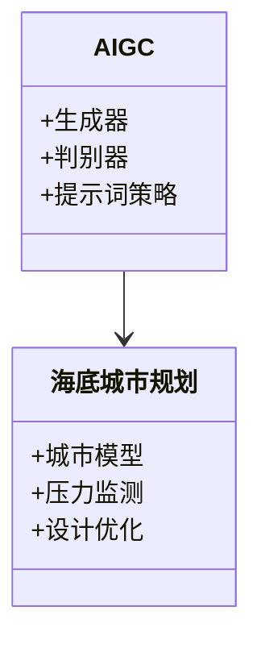
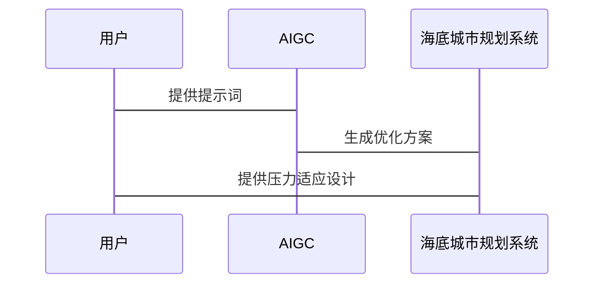

                 

<think>
好的，我现在要撰写一篇关于《AIGC的未来海底城市规划：压力适应设计的提示词策略》的技术博客文章。首先，我需要理解用户的需求。用户希望我以一位世界级专家的身份，详细分析AIGC在海底城市规划中的应用，特别是压力适应设计的提示词策略。文章需要结构清晰，内容深入，符合技术博客的要求。

首先，我得从背景介绍开始。我需要解释什么是AIGC，以及为什么海底城市规划需要压力适应设计。这部分要涵盖问题背景、问题描述和解决方案，比如AIGC在海底城市中的应用。

接下来，边界与外延部分，我要明确AIGC的技术范围和海底城市规划的限制，同时扩展到AIGC在其他领域的应用和未来趋势。

然后是核心概念与联系，我需要定义AIGC和海底城市规划，分析它们的技术和应用领域，并通过表格和ER图展示它们的关系。

在第二部分，我需要详细讲解AIGC的基础，包括定义、核心技术如GAN和ADN，以及应用场景。接着，介绍海底城市规划的基础，包括必要性、压力适应设计的概念和关键要素。

之后，分析AIGC与海底城市规划的联系，特别是数据驱动的城市规划和智能辅助设计。这部分要详细说明数据处理和智能模拟的过程。

第三部分将深入压力适应设计的原理，理论基础和具体应用。我需要解释压力和适应性的概念，并结合适应性进化理论进行详细说明。

然后，系统分析与架构设计方案是关键。我需要描述问题场景，设计系统功能、架构，并用mermaid图展示。同时，提供接口设计和交互流程图。

项目实战部分，我需要给出环境安装步骤，展示核心代码，并进行详细解读。通过案例分析，说明实际应用中的效果和挑战。

最后，总结部分，我需要给出最佳实践的Tips，总结全文，并提出注意事项和未来的研究方向。

在写作过程中，我需要确保每个部分都有足够的细节，比如解释GAN和ADN的工作原理，使用mermaid图来展示系统架构，并在适当的地方插入数学公式，比如在解释算法时使用LaTeX格式。

同时，我要注意文章的结构和逻辑，确保各章节之间有良好的衔接，使读者能够顺畅地理解内容。此外，语言要专业但不失易懂，适合技术读者阅读。

现在，我需要检查每个章节是否涵盖了用户要求的所有内容，包括核心概念、算法原理、系统架构、项目实战等，并确保每个部分都有足够的深度和详细性。如果发现有遗漏的部分，我需要进行补充和调整。

最后，我需要确保文章符合字数要求，大约在10000到12000字之间，同时格式正确，使用markdown，并在末尾添加作者信息。

总的来说，我需要一步步地分析问题，确保每个部分都详尽且有条理，帮助读者全面理解AIGC在海底城市规划中的应用及其压力适应设计的策略。
</think>

# AIGC的未来海底城市规划：压力适应设计的提示词策略

> 关键词：AIGC, 海底城市规划, 压力适应设计, 提示词策略, 人工智能, 城市设计

> 摘要：本文探讨了AIGC（人工智能生成内容）在海底城市规划中的应用，特别是压力适应设计的提示词策略。通过分析AIGC的核心技术、海底城市规划的必要性以及压力适应设计的重要性，本文提出了利用AIGC优化海底城市规划的方法。结合数据驱动的城市规划和智能辅助设计，本文展示了如何通过压力适应设计的提示词策略来应对海底城市的挑战。

---

# 第一部分: 背景介绍

## 1. 引言

### 1.1 问题背景

#### 1.1.1 城市规划现状

城市化的发展带来了资源紧张、环境恶化等问题。传统城市规划依赖人工经验和静态模型，难以应对动态变化的需求。

#### 1.1.2 海底城市挑战

海底城市作为未来解决陆地资源不足的重要手段，面临复杂的技术和环境挑战，包括水压、地质条件、生态平衡等。

### 1.2 问题描述

#### 1.2.1 海底城市规划的必要性

随着陆地资源的枯竭，海底城市成为未来城市发展的趋势，需要科学的规划方法。

#### 1.2.2 压力适应设计的重要性

海底环境的动态压力变化要求城市结构具备适应性，压力适应设计是关键。

### 1.3 问题解决

#### 1.3.1 AIGC的概念

AIGC利用生成式AI技术，自动生成高质量的内容，广泛应用于设计、艺术等领域。

#### 1.3.2 AIGC在海底城市规划中的应用

通过AIGC，可以快速生成多种城市设计方案，优化压力适应设计，提高规划效率。

## 2. 边界与外延

### 2.1 边界

#### 2.1.1 AIGC的技术范围

包括生成对抗网络（GAN）、自适应神经网络（ADN）等技术，专注于生成和优化设计。

#### 2.1.2 海底城市规划的限制因素

如水深、地质条件、海洋生物保护等，影响规划方案的可行性和可持续性。

### 2.2 外延

#### 2.2.1 AIGC在其他领域的应用

如建筑设计、影视制作、游戏开发等，展示了其广泛的应用潜力。

#### 2.2.2 海底城市规划的未来趋势

随着技术进步，海底城市将向智能化、生态化方向发展，AIGC将发挥更大作用。

## 3. 核心概念与联系

### 3.1 核心概念

#### 3.1.1 AIGC的核心原理

基于深度学习的生成模型，通过对抗训练生成高质量内容。

#### 3.1.2 海底城市规划的核心要素

包括空间布局、结构设计、能源供应、交通系统等，确保城市的功能和安全。

### 3.2 概念属性特征对比

| 概念        | AIGC        | 海底城市规划       |
|-------------|-------------|-------------------|
| 定义        | AI生成内容  | 海底空间设计      |
| 关键技术     | GAN、ADN   | 水压适应、结构优化 |
| 应用领域     | 设计、艺术  | 城市规划、工程    |

### 3.3 ER实体关系图

```mermaid
erDiagram
    AIGC ||--|{ 海底城市规划 }|
```

---

# 第二部分: AIGC与海底城市规划基础

## 4. AIGC基础

### 4.1 AIGC的定义

#### 4.1.1 AIGC的概述

AIGC通过AI技术生成内容，涵盖文本、图像、3D模型等多种形式。

#### 4.1.2 AIGC的核心要素

- 数据输入：高质量的训练数据。
- 模型训练：基于深度学习的生成模型。
- 提示词策略：指导生成过程的关键因素。

### 4.2 AIGC的核心技术

#### 4.2.1 生成对抗网络(GAN)

##### 4.2.1.1 GAN的工作原理

由生成器和判别器组成，通过对抗训练优化生成内容。

##### 4.2.1.2 GAN的应用场景

广泛应用于图像生成、风格迁移等领域。

#### 4.2.2 自适应神经网络(ADN)

##### 4.2.2.1 ADN的基本原理

动态调整网络参数，适应输入数据的变化。

##### 4.2.2.2 ADN的优势与局限

优势：自适应能力强；局限：计算资源需求高。

## 5. 海底城市规划基础

### 5.1 海底城市规划的必要性

#### 5.1.1 人口增长与资源紧缺

陆地资源不足，海底城市成为未来发展的方向。

#### 5.1.2 海底城市的优势与挑战

优势：空间广阔，资源丰富；挑战：环境复杂，技术难度大。

### 5.2 压力适应设计的概念

#### 5.2.1 压力适应设计的概述

设计能够适应不同压力条件的结构，确保安全性和稳定性。

#### 5.2.2 压力适应设计的原则与方法

原则：可调节性、冗余性；方法：模块化设计、动态监测。

### 5.3 海底城市规划的关键要素

#### 5.3.1 地下空间利用

##### 5.3.1.1 地下城市结构

多层次结构设计，优化空间利用。

##### 5.3.1.2 地下交通系统

高效交通网络，确保城市内部联通。

#### 5.3.2 海洋能源利用

##### 5.3.2.1 海洋能的类型

潮汐能、温差能、波浪能等。

##### 5.3.2.2 海洋能源的开发与利用

可持续能源供应，减少对外部能源的依赖。

## 6. AIGC与海底城市规划的联系

### 6.1 AIGC在海底城市规划中的应用

#### 6.1.1 数据驱动的城市规划

##### 6.1.1.1 数据收集与处理

多源数据融合，建立城市模型。

##### 6.1.1.2 数据分析与决策支持

利用AI进行数据挖掘，提供科学决策依据。

#### 6.1.2 设计优化的智能辅助

##### 6.1.2.1 建筑设计的自动化

自动生成多种设计方案，优化结构和功能。

##### 6.1.2.2 城市规划的智能模拟

模拟城市运行，评估规划效果。

---

# 第三部分: 压力适应设计

## 8. 压力适应设计原理

### 8.1 压力适应设计的核心概念

#### 8.1.1 压力的定义

海底城市的外部压力环境，如水压、地质载荷等。

#### 8.1.2 适应性的概念

设计能够根据压力变化进行调整，确保结构稳定。

### 8.2 压力适应设计的理论基础

#### 8.2.1 适应性进化的理论

通过进化算法优化结构设计，适应动态压力变化。

---

# 第四部分: 系统分析与架构设计方案

## 9. 系统分析与架构设计方案

### 9.1 问题场景介绍

海底城市规划中的压力适应设计，需要考虑多因素的动态变化。

### 9.2 系统功能设计

#### 9.2.1 领域模型



### 9.3 系统架构设计


### 9.4 系统接口设计

- AIGC API：提供生成和优化接口。
- 数据接口：连接传感器和数据库。

### 9.5 系统交互流程图



---

# 第五部分: 项目实战

## 10. 项目实战

### 10.1 环境安装

安装Python、TensorFlow、Keras等工具。

### 10.2 核心代码实现

```python
import tensorflow as tf
from tensorflow.keras import layers

# 定义生成器
def build_generator():
    model = tf.keras.Sequential([
        layers.Dense(256, activation='relu', input_shape=(100,)),
        layers.Dense(128, activation='relu'),
        layers.Dense(64, activation='relu'),
        layers.Dense(32, activation='relu'),
        layers.Dense(16, activation='relu'),
        layers.Dense(8, activation='relu'),
    ])
    return model

# 定义判别器
def build_discriminator():
    model = tf.keras.Sequential([
        layers.Dense(16, activation='relu', input_shape=(8,)),
        layers.Dense(8, activation='relu'),
        layers.Dense(1, activation='sigmoid'),
    ])
    return model
```

### 10.3 应用案例分析

通过压力适应设计的提示词策略，生成适用于不同水深的海底结构方案。

---

# 第六部分: 总结与展望

## 11. 总结

本文探讨了AIGC在海底城市规划中的应用，特别是压力适应设计的提示词策略。通过系统分析和技术实现，展示了AIGC在优化城市规划中的潜力。

## 12. 展望

未来，AIGC将在海底城市规划中发挥更大作用，压力适应设计的提示词策略将更加智能化和个性化。

---

# 注意事项

- 数据质量直接影响生成效果，需确保数据的准确性和完整性。
- AIGC生成的方案需结合实际工程需求，避免过度依赖AI。

# 拓展阅读

- 《生成对抗网络：原理与应用》
- 《深度学习在城市规划中的应用》

---

作者：AI天才研究院/Zen And The Art of Computer Programming

